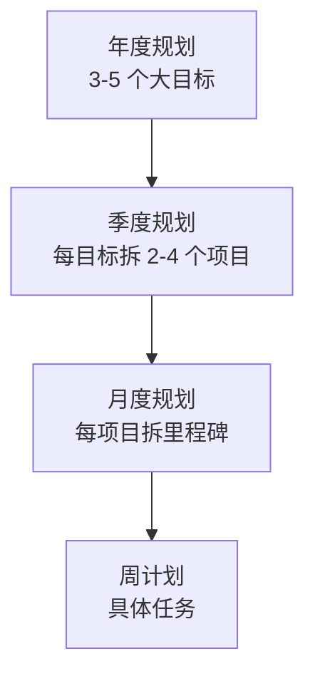
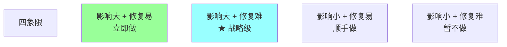
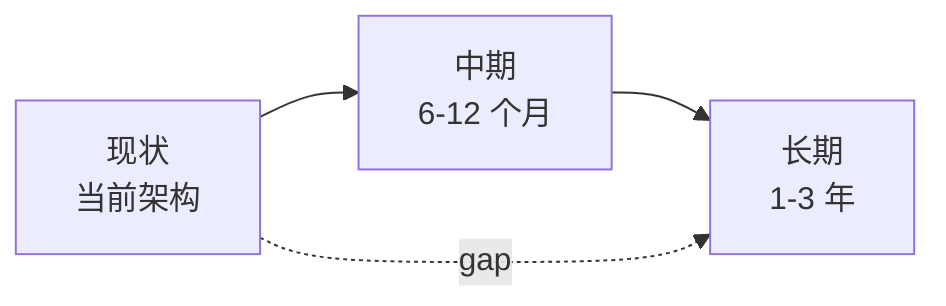
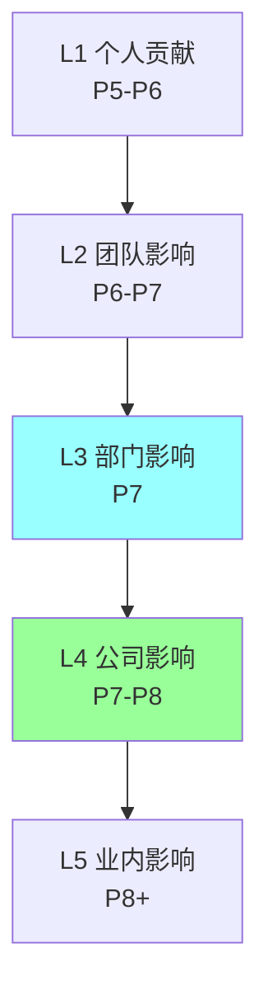
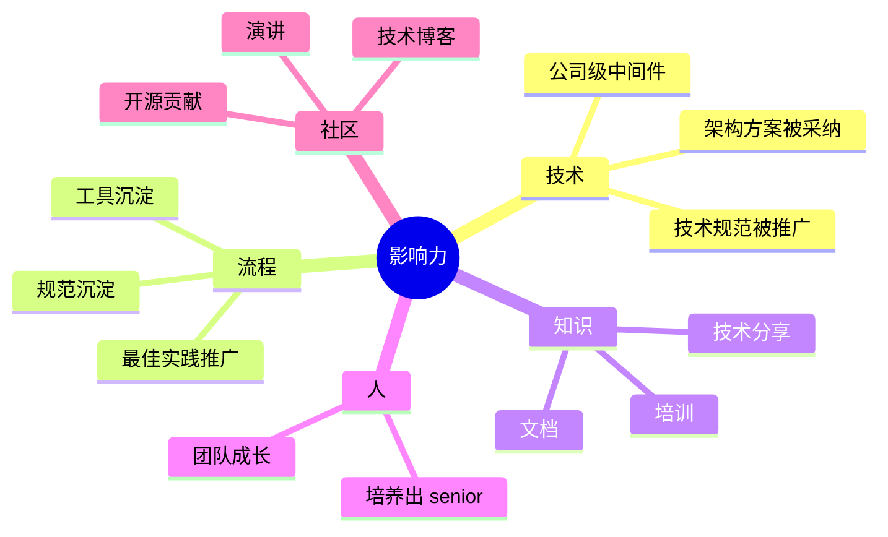

# 技术战略与规划

> 8 年 → TL/P7 必备的战略能力：技术规划 / 技术债评估 / 大型选型决策 / 架构演进路线图 / 影响力建设 / 向上管理
>
> 把"技术战略"从抽象概念落到日常实战

---

## 一、技术战略是什么？

### 1.1 定义

> **技术战略 = 在资源有限的前提下，决定团队/部门/公司"做什么 + 不做什么 + 什么时候做" 的技术决策框架。**

**关键词**：
- **资源有限**（人 / 时间 / 钱）
- **取舍**（做 A 不做 B）
- **时间维度**（短期 / 中期 / 长期）
- **决策框架**（不是单点决定）

### 1.2 战略 vs 战术

| | 战略（Strategy） | 战术（Tactics） |
| --- | --- | --- |
| 时间 | 6 个月 - 3 年 | 1 周 - 3 个月 |
| 视角 | 业务 + 技术 | 技术 |
| 输出 | 路线图 / 蓝图 | 具体方案 |
| 改动 | 慎重 | 灵活 |
| 错的代价 | 巨大 | 中 |

**例**：
- 战略：未来 1 年迁 K8s + 拆微服务
- 战术：本月用 Helm 部署订单服务

### 1.3 8 年没战略的危害

```
□ 永远忙救火（紧急压倒重要）
□ 选型频繁后悔（短视决策）
□ 技术债越积越多
□ 团队没方向感
□ 升 P7/P8 答辩讲不出"长期影响"
```

---

## 二、技术规划怎么做

### 2.1 规划的层次



### 2.2 年度规划怎么做

**输入**（必须先收集）：
- **业务战略**：公司 / 部门今年重点
- **业务痛点**：当前哪些卡脖子
- **技术债**：当前最严重的 3-5 个
- **行业趋势**：新技术 / 新范式
- **团队能力**：有什么人能做什么

**输出**：3-5 个大方向 + 每个方向的关键项目。

**结构模板**：
```markdown
# 2026 年度技术规划

## 一、业务背景
- 公司战略：XX
- 部门目标：XX
- 业务关键节点：XX

## 二、当前现状
- 主要痛点（5 条）
- 技术债（按优先级）
- 团队能力盘点

## 三、年度技术目标（3-5 个）

### 目标 1: 订单系统 DDD 重构 + 服务拆分
- 业务价值: 团队协作冲突 -50% / 部署独立
- 投入: 5 人 × 6 个月
- 关键里程碑: Q1 设计 / Q2 拆出 3 个服务 / Q3 全量上线 / Q4 治理
- 风险: 跨服务事务一致性

### 目标 2: 性能优化（P99 800ms → 200ms）
- 业务价值: 转化率 +3% / GMV +500w
- 投入: 3 人 × 3 个月
- 里程碑: ...

### 目标 3: 接入可观测（OTel）
...

## 四、不做什么（重要）
- 不做 Mesh 改造（服务规模未到）
- 不做大数据平台（业务量级没到）
- 不做 AI 重构（不是当前业务核心）

## 五、风险与依赖
- 关键人风险
- 跨团队依赖
- 资源缺口

## 六、月度跟踪机制
- 每月 review 进度
- 季度调整（必要时）
```

### 2.3 关键技巧：明确"不做什么"

许多 TL 只列要做的，**但战略的精髓是"不做什么"**。

```
✅ 好的战略:
"今年聚焦 ABC 三件事，DEF 不做（理由：业务量级未到 / 优先级低 / 资源不够）"

❌ 差的战略:
"今年要做 ABCDEFGHIJ ..."
```

资源永远稀缺，**做减法**比做加法更难。

### 2.4 季度规划

年度拆季度：
- 每季度选 2-3 个核心项目（不要超过 5 个）
- 给每个项目明确的 OKR / KPI
- 月度 review 进度

**模板**：
```
Q1 关键项目:
1. 订单 DDD 重构 PoC（设计 + 1 个服务拆分）
   Owner: 张三
   验收: 设计评审通过 + 1 个服务上线

2. P99 优化阶段 1（DB 慢查询治理）
   Owner: 李四
   验收: P99 从 800ms → 500ms

3. 监控接入（Prometheus + Grafana）
   Owner: 王五
   验收: 核心服务监控就位
```

### 2.5 OKR 实战

**O（Objective）**：定性目标，激励性。
**KR（Key Result）**：定量结果，可衡量。

```
O: 提升订单系统性能和可用性
KR1: P99 延迟从 800ms 降到 200ms
KR2: 可用性从 99.9% 提升到 99.95%
KR3: 故障 MTTR 从 30 分钟降到 10 分钟
```

**TL 必懂**：
- KR 必须可量化
- KR 不是任务列表
- KR 80% 完成是健康（如果 100% 完成是 KR 太保守）

---

## 三、技术债评估与治理

### 3.1 什么是技术债

> **技术债 = 为了短期速度做的妥协，长期付利息**。

```
合理技术债（短期借）:
  - 业务紧急上线先简单实现
  - 第一版用 if-else 后续重构

不合理技术债（高利息）:
  - 没人维护的祖传代码
  - 复制粘贴几十处
  - 没测试的关键模块
  - 烂架构积累多年
```

### 3.2 技术债评估矩阵



### 3.3 技术债识别

```
信号:
  □ 改一个字段要改 5 个地方
  □ 上线前心慌（不知道改坏什么）
  □ 新人 1 个月还不敢改核心模块
  □ 同样的 bug 重复出现
  □ 故障频繁 + 排查难
  □ 性能慢但说不清原因
  □ 测试覆盖率低 + 不敢加测试
  □ 文档过期或没有
```

### 3.4 量化技术债成本

**财务化**：
```
技术债成本 =
  开发效率损失（人天）
  + 故障次数 × 每次成本
  + 招聘困难（新人不愿加入）
  + 业务损失（功能上线慢）

例:
  订单服务每月 5 起故障 × 3w/次 = 15w
  开发效率比同等模块慢 30% × 2 人 × 30k 月薪 = 18w/月
  合计 33w/月 = 400w/年

→ 投入 60 人天重构（30w）3 个月回本
```

### 3.5 偿还技术债的策略

```
1. 边做边还（推荐）
   每个 sprint 留 20% 还债
   做新功能时顺带优化

2. 专项还债
   集中 1-2 个月专项重构
   适合大型技术债

3. 重写（极端情况）
   完全重做新版本
   高风险，少用
```

**Martin Fowler 原话**：**重写要再三谨慎**。

### 3.6 技术债治理的政治

老板视角：
- "为什么要花时间还债？做新功能不是更好？"

TL 必须能讲清：
- 量化代价（用钱说话）
- 业务影响（功能上线慢 / 故障多）
- 不还的后果（团队瘫痪 / 关键人离职）
- 还了的回报（效率 / 稳定 / 招聘吸引力）

---

## 四、大型选型决策

### 4.1 8 年 TL 必经的大型决策

```
- 数据库选型（MySQL / PG / TiDB / NewSQL）
- 微服务拆分（拆几个 / 拆哪些 / 边界）
- 框架选型（gRPC / Dubbo / Kitex）
- Mesh 上不上（Istio / 自研）
- 云厂商选型（阿里云 / 腾讯云 / AWS / 多云）
- 大数据栈（Spark / Flink / 自研）
- AI 平台（自研 / 调 API / 开源）
```

每个决策**影响 1-3 年 + 数百万投入**。

### 4.2 决策框架（5 维评估）

| 维度 | 关注点 |
| --- | --- |
| **业务匹配** | 功能 / 性能 / 容量 / SLA |
| **团队能力** | 现有技能 / 学习曲线 / 招聘 |
| **生态成熟** | 社区 / 文档 / 开源 / 商业支持 |
| **运维成本** | 部署 / 监控 / 排查 / 升级 |
| **长期演化** | 扩展 / Vendor Lock-in / 迁移 |

### 4.3 决策矩阵示例

**例：数据库选型（MySQL vs TiDB）**

```
权重    维度          MySQL  TiDB
30%    业务匹配       8      9
20%    团队能力       9      5
15%    生态成熟       10     7
20%    运维成本       8      6
15%    长期演化       6      9

总分              ≈8.0   ≈7.0
```

**结论**：当前 MySQL 更合适，但如果数据量 > 10 亿要再评估 TiDB。

### 4.4 ADR（Architecture Decision Record）

每个大型决策必须留 ADR：

```markdown
# ADR-001: 选择 MySQL 而非 TiDB

## 状态
已决定 (2026-05-08)

## 背景
我们需要为订单服务选择数据库。预期 1 年内数据量 1-3 亿。

## 决策
选 MySQL 8.0，3 年后数据量到 10 亿+ 时再评估 TiDB。

## 考虑过的选项

### MySQL ✓
优: 团队熟、生态完善、3 年内够用
缺: 10 亿+ 数据需要分库分表

### TiDB
优: 原生分布式
缺: 团队不熟、运维成本高、当前数据量级杀鸡用牛刀

### PostgreSQL
优: 功能强
缺: 团队不熟、Go 生态不如 MySQL

## 后果
- 短期：开发快，3 年内不必改
- 长期：数据量到 10 亿+ 需要分库分表（提前规划）

## 评审
张三、李四、王五

## 时间
2026-05-08
```

### 4.5 决策反模式

```
❌ 拍脑袋（不评估）
❌ 跟风（"大厂都用 X"）
❌ 简历驱动（个人想学新东西）
❌ 完美追求（找不到银弹）
❌ 拖延（一直不决定）
❌ 不留 ADR（半年后没人记得为什么）
```

### 4.6 可逆 vs 不可逆决策

**Bezos 原则**：
- **可逆决策**（two-way door）：快做，错了改
  - 例：试用新组件 / 改配置
- **不可逆决策**（one-way door）：慢做，充分评估
  - 例：选主数据库 / 拆 BC 边界 / 公开 API

8 年 TL 必备：**区分可逆 / 不可逆，分开处理**。

---

## 五、架构演进路线图

### 5.1 规划路线图的方法



**关键步骤**：
1. **画当前架构图**（清晰）
2. **画目标架构图**（理想）
3. **找 gap**（差距）
4. **定阶段**（中间状态）
5. **算每阶段的 ROI**

### 5.2 演进路径示例

**例：单体 → 微服务**

```
当前: 单体应用
  ↓ 6 个月
中期 1: Modular Monolith（模块边界清晰）
  ↓ 6 个月
中期 2: 拆出边缘服务（通知 / 搜索）
  ↓ 6 个月
中期 3: 拆出次核心（商品 / 营销）
  ↓ 6 个月
长期: 完整微服务（订单 / 支付 + 中间件 + 治理）

每阶段:
  - 业务价值（解决了什么痛点）
  - 投入（人 + 月）
  - 验收（关键指标）
```

**关键**：**绝不大爆炸式重构**，分阶段验证。

### 5.3 路线图的常见错误

```
❌ 一步到位（X 月内全做完）
❌ 没有里程碑（不知何时检查）
❌ 不留缓冲（外部依赖延期就崩）
❌ 没考虑业务（业务高峰期推大重构）
❌ 不复盘（年初定的年底也不看）
```

### 5.4 沟通路线图

**对老板**：
- 业务价值 + 投入产出
- 阶段成果
- 风险

**对团队**：
- 每阶段做什么
- 谁负责
- 怎么验收

**对跨团队**：
- 影响什么接口
- 何时需要他们配合
- 风险升级机制

---

## 六、影响力建设

### 6.1 8 年→P7/P8 的核心评估

晋升 P7/P8 的核心：**影响力**。

不是只看你做了什么，而是：
- **影响范围**（个人 / 团队 / 部门 / 公司 / 业内）
- **持续性**（一次性还是长期）
- **复用性**（被多少项目使用）

### 6.2 影响力的层级



### 6.3 影响力的来源



### 6.4 怎么放大影响力

**对内**：
1. **写好的设计文档**（被多团队引用）
2. **主动做技术分享**（部门 / 公司级）
3. **提案治理改造**（推全公司）
4. **培养能独当一面的 senior**
5. **跨团队解决问题**（不局限自己模块）
6. **沉淀工具 / 模板 / 规范**（让后人复用）

**对外**：
1. **技术博客**（公司公众号 / 个人 / 知乎）
2. **大会演讲**（QCon / GIAC / GOPS / Gopher China）
3. **开源贡献**（GitHub / 公司开源）
4. **社区活跃**（知乎 / 掘金 / Twitter）

### 6.5 影响力的量化

晋升答辩时讲影响力：
```
✅ 量化:
  "推广 DDD 规范到 5 个团队 30+ 人，节省每团队 onboarding 1 个月"
  "开发的中间件 X 被 8 个服务复用，节省 200 人天/年"

❌ 不量化:
  "我做了很多技术分享"
  "推动了一些规范"
```

---

## 七、向上管理

### 7.1 不是拍马屁，是双赢

8 年 TL 想升 P7/P8，向上管理是**必修课**。

**核心**：让上级好理解你 + 你好理解上级。

### 7.2 让上级了解你的工作

**主动汇报**：
- 周报 / 月报（重点 + 风险 + 需要支持）
- 1-on-1（和老板）
- 重大事件实时同步

**汇报技巧**：
- **结论先行**（不要绕弯）
- **量化**（"节省 N% 时间"而不是"快很多"）
- **给方案不只给问题**

### 7.3 理解上级的视角

```
□ 他向上要交代什么？（他的老板要什么）
□ 他被什么 KPI 压？
□ 他的关注点是什么？
□ 他在意什么风险？
```

**8 年 TL 的成熟标志**：能站在老板角度想事情。

### 7.4 争取资源

要资源（人 / 预算 / 优先级）的技巧：
1. **业务价值前置**（先讲价值再要资源）
2. **量化 ROI**（不是凭感觉）
3. **给 plan B**（如果给不了全部，部分能做什么）
4. **不一蹴而就**（分阶段争取）

```
❌ "我要 5 个人"
✅ "为达成 X 业务目标，预计需要 5 人 × 6 个月。
    如果给 3 人，能做 70%（先做核心 ABC，DE 留给下半年）。
    投入 ROI: 投入 250w，预期收益 1000w。"
```

### 7.5 向上反模式

```
❌ 不汇报（老板不知道你做啥）
❌ 报喜不报忧（出事爆雷）
❌ 只甩问题不给方案
❌ 越级（绕过老板找他老板）
❌ 拒绝合理批评（玻璃心）
❌ 不主动学老板视角
```

---

## 八、年度规划完整模板

```markdown
# 2026 年度技术规划 [团队/部门名]

## 一、业务对齐
- 公司战略：[今年公司聚焦什么]
- 部门 OKR：[部门年度目标]
- 业务关键节点：[大促 / 上市 / 重大版本]

## 二、技术现状
### 2.1 架构现状
[当前架构图]

### 2.2 关键痛点
1. [痛点 1] - 影响 [业务指标] - 当前损失 [量化]
2. [痛点 2]
3. ...

### 2.3 技术债清单（按优先级）
| 编号 | 描述 | 影响 | 修复成本 | 优先级 |
|------|------|------|----------|--------|

### 2.4 团队能力盘点
- 现有人数 / 能力分布
- 缺口

## 三、年度技术目标（3-5 个）

### 目标 1: [名称]
- **业务价值**: [量化]
- **投入**: [人 × 月]
- **关键里程碑**:
  - Q1: ...
  - Q2: ...
  - Q3: ...
  - Q4: ...
- **风险**: ...
- **依赖**: ...

### 目标 2: ...
### 目标 3: ...

## 四、不做什么（重要）
1. [不做 X]，理由：[业务量级未到 / 优先级低 / ...]
2. ...

## 五、资源需求
- 现有人数：N
- 缺口：M
- 预算：[服务器 / 第三方 / ...]

## 六、风险与应对
| 风险 | 概率 | 影响 | 应对 |
|------|------|------|------|

## 七、月度跟踪
- 每月 review 进度
- 季度调整（如需要）
- 半年中考评

## 附录
- 关键 ADR 链接
- 架构图链接
- 相关文档
```

---

## 九、晋升答辩 / 面试常考

### Q1: 你的团队 / 模块的技术规划是什么？

**框架**：
- 业务背景
- 当前痛点
- 3-5 个目标
- 不做什么（关键加分项）
- 风险与应对

**避坑**：不要只列项目，要讲战略思考。

### Q2: 你怎么决定优先级？

**框架**：
- ROI 矩阵（影响 × 投入）
- 业务紧迫性
- 资源约束
- 战略契合
- 不可逆决策慢做

### Q3: 你做过最大的技术决策？

**框架**：
- 决策背景（为什么要做）
- 考虑过哪些选项
- 评估维度
- 最终选择 + 理由
- 后果（正面 + 负面）
- 复盘

### Q4: 你的影响力是什么？

**框架**：
- 影响范围（个人 → 团队 → 部门 → 公司）
- 量化（人天 / 故障 / 业务指标）
- 持续性
- 复用性

### Q5: 你怎么管理技术债？

**框架**：
- 识别清单（量化）
- 评估矩阵（影响 × 修复难度）
- 还债策略（边做边还 / 专项 / 重写）
- 和老板争取资源

### Q6: 你怎么和老板争取资源？

**框架**：
- 业务价值前置
- 量化 ROI
- 分阶段
- 给 plan B

### Q7: 你怎么和老板有分歧？

**框架**：
- 理解老板视角
- 用数据 / 业务价值表达
- 不行就接受决定（执行到位）
- 复盘改进沟通

### Q8: 一个新项目你怎么规划？

**框架**：
- 需求理解 + 业务价值
- 技术选型 + ADR
- 拆解 + 估算 + 风险
- 团队分工
- 监控 + 灰度 + 回滚
- 复盘机制

### Q9: 你看过哪些技术战略案例？

**框架**（暴露技术广度）：
- 大厂演进（阿里 LDC / 字节微服务 / Netflix Open Connect）
- 行业趋势（云原生 / Mesh / Serverless / AI）
- 反面案例（强行重构失败）

### Q10: 5 年后行业会怎么变？你怎么准备？

**框架**（最考前瞻性）：
- 技术趋势判断（AI / 边缘 / Wasm）
- 业务趋势（合规 / 出海 / 降本增效）
- 团队能力建设
- 个人成长方向

---

## 十、常见反模式

### 反模式 1：救火式管理

```
TL 一天到晚救火 → 没时间规划 → 永远落后
```

**修复**：每周保留 1-2 天规划时间，不被打扰。

### 反模式 2：技术导向不看业务

```
TL 推大型重构但说不清业务价值 → 老板不批 → 团队挫败
```

**修复**：每个技术决策必须有业务理由。

### 反模式 3：一年一规划，年中不看

```
年初定的规划，年底才回头看 → 已经偏离很久 → 没意义
```

**修复**：月度 review，季度调整。

### 反模式 4：完美主义

```
要等到方案完美才开始 → 永远不开始 → 错过窗口
```

**修复**：80% 准备好就启动，迭代优化。

### 反模式 5：只有计划没有 plan B

```
"如果按计划做..." → 出意外就崩
```

**修复**：每个关键节点想 worst case 应对。

### 反模式 6：不写 ADR

```
重大决策做完不留痕迹 → 半年后没人记得为什么 → 重复讨论
```

**修复**：每个不可逆决策必有 ADR。

### 反模式 7：技术债视而不见

```
"先上线再说" → 债越滚越大 → 最后大重构 → 业务停摆
```

**修复**：每 sprint 留 20% 还债。

### 反模式 8：跟风新技术

```
"业内都在做 X，我们也要做" → 没评估业务匹配 → 折腾团队
```

**修复**：用 ROI + 5 维评估决策。

---

## 十一、推荐书籍 / 资料

```
战略思维:
  □ 《好战略坏战略》(Good Strategy Bad Strategy) - Richard Rumelt
  □ 《竞争战略》- Michael Porter
  □ 《孙子兵法》

工程战略:
  □ 《架构整洁之道》- Robert Martin
  □ 《领域驱动设计》- Eric Evans
  □ 《技术领导力实战笔记》- 极客时间
  □ 《SRE: Google 运维解密》

行业 / 技术趋势:
  □ ThoughtWorks 技术雷达（每半年）
  □ Gartner 技术成熟度曲线
  □ CNCF 云原生地图
  □ State of DevOps Report

实战:
  □ 阿里 / 美团 / 字节 / 腾讯 技术博客年度合集
  □ QCon / GIAC / GOPS 大会演讲
  □ 公司内部 / 跨公司 TL 圈
```

---

## 十二、面试 / 答辩加分点

- **战略 = 决定不做什么**（做减法比做加法难）
- 8 年→P7 关键：**从战术执行到战略思考**
- **每个重大决策留 ADR**（决策可追溯）
- **可逆决策快做、不可逆决策慢做**（Bezos 原则）
- 技术债必须**量化**（用钱说话）
- **架构演进绝不大爆炸**，分阶段验证
- **影响力是 P7/P8 硬通货**（量化 + 持续 + 复用）
- 向上管理 = **让老板好理解你 + 你好理解老板**
- **争取资源用业务价值**（不是凭感觉）
- **年度规划必有"不做什么"** 段落
- **月度 review + 季度调整**，不是年初定完就不管
- 5 维选型框架：**业务匹配 / 团队能力 / 生态 / 运维 / 长期演化**
- **OKR 80% 完成是健康**（100% 完成说明定得太保守）

---

## 十三、与其他模块的关系

```
本模块（leadership）—— 软能力
   ↓ 应用到
14-projects（项目复盘）—— 真实项目讲解
   ↓ 基于
13-engineering（工程化）—— 落地能力
   ↓ 基于
01-go-language ~ 12-ai —— 技术深度
```

**8 年→P7/P8 的能力金字塔**：
- 底层：技术深度（必须够）
- 中层：工程化 / 项目能力
- 顶层：**Leadership / 战略 / 业务**（决定上限）

**多数 8 年技术人卡在中层 → 顶层这一跳**。
