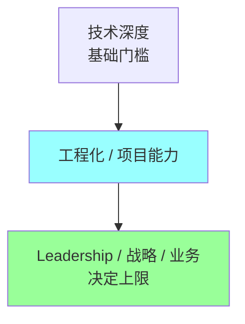

# Leadership · 资深软能力

> 8 年 → P7/TL/技术专家 跃迁的核心能力图谱：人 + 业务 + 战略
>
> 这是技术人最容易忽视、却最影响晋升的三个维度

## 目录

| # | 文件 | 涵盖 |
| --- | --- | --- |
| 01 | [Tech Lead 能力建设](01-tech-lead-skills.md) | TL 角色 / 招聘 / 1-on-1 / 项目管理 / 跨团队协作 / 技术评审 / 团队赋能 / 影响力 / 反模式 |
| 02 | [业务与产品思维](02-business-product-thinking.md) | 业务指标 / ROI / 用户视角 / 产品对齐 / 商业逻辑 / 数据驱动 |
| 03 | [技术战略与规划](03-tech-strategy-planning.md) | 技术规划 / 技术债评估 / 大型选型 / 架构演进路线图 / 影响力建设 / 向上管理 |

## 三篇关系

```
01 TL 能力（人 + 团队）
    ↓ 必须懂
02 业务产品思维（事 + 价值）
    ↓ 转化为
03 技术战略规划（路径 + 落地）
```

## 跨章高频题（晋升答辩 / 大厂 P7 面试）

### TL 类
- 你做 TL 最大的成长是什么？（→ 01）
- 你怎么招聘？带过最大团队多少人？（→ 01）
- 团队成员闹矛盾你怎么处理？（→ 01）
- 你怎么平衡技术和管理？（→ 01）

### 业务类
- 你们核心业务指标是什么？（→ 02）
- 你做的项目带来了什么业务价值？（→ 02）
- 怎么和产品争取技术债项目？（→ 02）
- 你怎么判断一个需求要不要做？（→ 02）

### 战略类
- 你的团队 / 模块技术规划是什么？（→ 03）
- 你做过最大的技术决策？（→ 03）
- 你怎么管理技术债？（→ 03）
- 5 年后行业怎么变？你怎么准备？（→ 03）

### 影响力类
- 你最自豪的影响力是什么？（→ 01 / 03）
- 你怎么和老板争取资源？（→ 03）

## 8 年 → P7/P8 能力金字塔



**多数 8 年技术人卡在中层 → 顶层这一跳**。

## 核心认知

- **TL 不是技术最强的人**，是让团队最强的人
- **业务理解决定职业上限**，不是技术深度
- **战略 = 决定不做什么**（做减法比做加法难）
- **影响力 = 晋升 P7/P8 硬通货**（不是只看你做了什么）
- **可逆决策快做、不可逆决策慢做**（Bezos 原则）
- **向上管理不是拍马屁**，是双赢

## 设计原则

- **混合导向**：晋升 / 面试 + 日常实战 + 大厂对比
- **图文并茂**，关键概念用 Mermaid
- **每篇独立可读**
- 每章 8-10 道高频题 + 加分点

## 与其他模块的关系

- 09-ddd / 08-architecture：技术深度（必须够）
- 13-engineering：工程化 / 项目能力（中层）
- **15-leadership（本模块）**：软能力（决定上限）
- 14-projects：综合应用（项目复盘讲故事）

## 推荐学习顺序

```
基础阶段（8 年以下）:
  01-go-language ~ 12-ai 技术深度
  13-engineering 工程化
  14-projects 项目复盘
  09-ddd / 08-architecture 架构

进阶阶段（8 年+ 准 TL）:
  15-leadership/01 TL 能力
  15-leadership/02 业务思维
  15-leadership/03 技术战略
  + 实战中持续打磨
```
