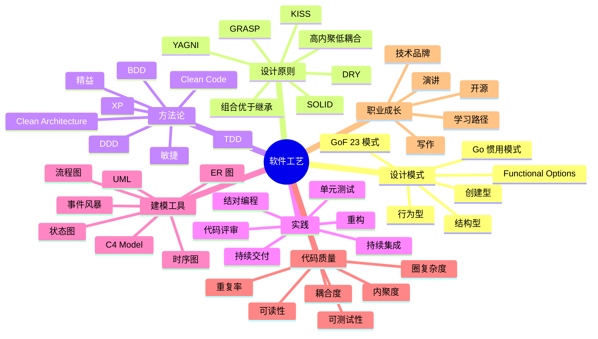
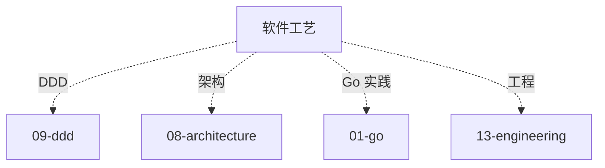

# 软件工艺知识地图

> 软件工艺 = **代码之道**。设计模式 / SOLID / 方法论 / 实践 / 建模，是资深工程师的内功。
>
> 这份地图是 16-software-craftsmanship 目录的总览：知识树 / 题型分类 / 学习路径 / 答题方式

---

## 一、整体知识树



---

## 二、后端视角的工艺

| 工艺能力 | 后端价值 |
| --- | --- |
| 设计模式 | 应对变化 / 解耦 |
| SOLID | 设计质量基石 |
| TDD | 高质量 + 重构自由 |
| DDD | 复杂业务建模 |
| Clean Code | 可读性 + 可维护 |
| 重构 | 持续改进 |
| 代码评审 | 质量守门 |
| C4 建模 | 架构沟通 |
| 事件风暴 | 业务建模 |

---

## 三、能力分层

```text
L1 个人代码
  写得出、跑得通

L2 个人工艺
  遵循规范、用设计模式、写测试

L3 团队工艺
  Review、TDD 落地、架构演进

L4 架构工艺
  领域建模、Clean Architecture、模式组合

L5 工艺布道
  开源、演讲、影响他人
```

---

## 四、题型分类

### 4.1 基础题（P5）

```
□ 设计模式 3 大类
□ SOLID 是什么
□ DRY / KISS / YAGNI
□ UML 常用图
```

对应：[01](01-design-patterns.md) / [02](02-design-principles.md) / [05](05-modeling-tools.md)

### 4.2 中级题（P6）

```
□ Go 常用设计模式（Functional Options / Builder）
□ 单一职责 + 开闭 实战
□ TDD 流程
□ 重构手法（Martin Fowler 23 种）
□ 代码坏味道
```

对应：[01](01-design-patterns.md) / [02](02-design-principles.md) / [03](03-methodologies.md) / [04](04-practices.md)

### 4.3 资深题（P7+）

```
□ Clean Architecture 落地
□ Hexagonal / Onion / Clean 区别
□ DDD 战术落地
□ 事件风暴方法
□ C4 Model 架构文档
□ Go 最佳实践
□ 大型重构
```

对应：[03](03-methodologies.md) / [04](04-practices.md) / [05](05-modeling-tools.md)

---

## 五、目录文件全览

| # | 文件 | 重点 |
| --- | --- | --- |
| 01 | [设计模式](01-design-patterns.md) | GoF 23 / Go 惯用 |
| 02 | [设计原则](02-design-principles.md) | SOLID / DRY / KISS / YAGNI / GRASP |
| 03 | [方法论](03-methodologies.md) | TDD / BDD / DDD / Clean Architecture |
| 04 | [实践](04-practices.md) | 重构 / Review / TDD / CI/CD |
| 05 | [建模工具](05-modeling-tools.md) | UML / C4 / 事件风暴 |

---

## 六、Go 惯用模式速查

```
Functional Options: 配置
Constructor: NewXxx
Builder: 复杂对象
Iterator: 遍历
Pipeline: channel 串联
Fan-in / Fan-out: 并发
Error Wrap: 错误链
Context: 超时 / 取消
Interface 小而美
组合优于继承
```

---

## 七、答题模板

### 7.1 设计模式题（"讲讲你用过的模式"）

```
3 步:
1. 场景: 遇到 X 问题
2. 模式: 选择 Y 模式（为什么）
3. 代码: 简要实现 + 效果

举例:
  - HTTP 服务器配置 → Functional Options
  - 多策略校验 → Strategy
  - 事件处理 → Observer
  - 第三方 API 封装 → Adapter
```

### 7.2 原则题（"SOLID 怎么用"）

```
5 个原则分别举例:
S: 一个类只做一件事（订单 vs 支付拆开）
O: 扩展开放，修改关闭（插件化）
L: 子类能替换父类（接口契约）
I: 接口小而专（Reader / Writer）
D: 依赖抽象（interface 注入）
```

### 7.3 重构题（"你怎么做大型重构"）

```
5 步:
1. 动机（业务痛 / 技术债）
2. 策略（分阶段 / 不影响业务）
3. 测试（覆盖 + 回归）
4. 灰度（新老并存 / 开关切换）
5. 复盘（成果 + 教训）
```

### 7.4 架构题（"Clean Architecture 落地"）

```
4 层:
1. Entities（领域）
2. Use Cases（应用）
3. Adapters（适配）
4. Frameworks（基础设施）

依赖方向: 外层依赖内层
Go 实现:
  /domain /application /infrastructure /interface
```

---

## 八、代码坏味道清单

```
代码层:
□ 过长函数（> 50 行）
□ 过大类（> 500 行）
□ 过多参数（> 5 个）
□ 重复代码
□ Magic Number
□ 嵌套过深（> 3 层）

设计层:
□ 霰弹式修改
□ 发散式变化
□ 依恋情结
□ 数据泥团
□ 基本类型偏执
□ 上帝对象
□ 贫血模型
```

---

## 九、重构手法速查（Martin Fowler）

```
基础:
- 提取函数 Extract Function
- 内联函数 Inline Function
- 改名 Rename
- 搬移函数 Move Function

数据:
- 封装变量 Encapsulate Variable
- 替换魔法数 Replace Magic Number
- 以查询取代临时变量

条件:
- 分解条件 Decompose Conditional
- 合并条件 Consolidate
- 卫语句 Guard Clauses
- 多态取代条件

类:
- 提取类 Extract Class
- 内联类 Inline Class
- 隐藏委托 Hide Delegate

继承 vs 组合:
- 委托取代子类
- 委托取代父类
```

---

## 十、面试表达

```text
软件工艺 5 层：
- L1 代码（能写）
- L2 工艺（规范 + 模式 + 测试）
- L3 团队（Review + TDD）
- L4 架构（Clean / 事件风暴）
- L5 布道（影响他人）

优秀工程师 = 技术 + 工艺 + 业务。
代码不只是跑，还要美（可读 + 可测 + 可演化）。
```

---

## 十一、常见误区

### 误区 1：设计模式越多越好

错。**按需使用**。过度设计是坏味道。

### 误区 2：TDD 一定写测试在前

部分错。**先写测试的骨架**，细节可以灵活。关键是保证测试覆盖。

### 误区 3：Clean Architecture 适用所有项目

错。**小项目用简单分层**即可。Clean 是复杂项目武器。

### 误区 4：重构 = 重写

错。**重构是小步快跑**不改变外部行为。重写是推倒重来。

### 误区 5：继承比组合强

错。**Go 没有继承**，组合才是主流。经典 OO 语言也推崇组合。

---

## 十二、与其他模块的关系



---

## 十三、面试加分点

- **SOLID 每条都举实例**
- **Functional Options** Go 惯用
- **组合优于继承** 举例
- **Clean Architecture** 层次 + 依赖方向
- **事件风暴**（DDD 方法论）
- **C4 Model** 架构图 4 层
- **Martin Fowler 重构** 23 种手法
- **代码坏味道清单**
- **TDD 三角循环**（Red / Green / Refactor）
- **BDD Given-When-Then**
- **Clean Code** 函数小 + 命名好 + 注释少
- **重构 vs 重写** 区别
- **开源 + 分享** 展示工艺品牌

---

## 十四、推荐阅读路径

```
入门:
  □ 《代码整洁之道》
  □ 《重构》Martin Fowler
  □ 16-software-craftsmanship/01-02

进阶:
  □ 《设计模式》GoF
  □ 《Clean Architecture》
  □ 《领域驱动设计》
  □ 16-software-craftsmanship/03-04

资深:
  □ 《Patterns of Enterprise Application Architecture》
  □ 《Refactoring to Patterns》
  □ 《Implementing Domain-Driven Design》
  □ 16-software-craftsmanship/05

实战:
  □ 主导一次大型重构
  □ 落地一次 DDD
  □ 开源一个项目
  □ 做技术分享
```

---

## 十五、与 99-meta 的关联

```
跨主题: 99-meta/01-cross-topic-index.md
DDD:    09-ddd/
架构:   08-architecture/
```
