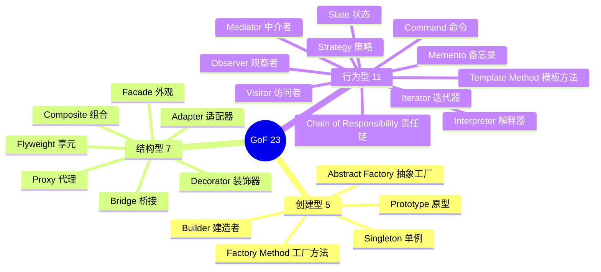

# 设计模式（Go 实战版）

> GoF 23 模式 + POSA 架构模式 / Go 实现 / 记忆口诀 / 真实项目案例（K8s / etcd / Kratos / gRPC / Kitex / standard library）
>
> 8 年工程师必修：能背出 23 种 + 知道 Go 标准库 / 主流框架在哪用了它们

## 总览



**口诀（背下来）**：
- **创建型 5**："**单工抽建原**"（**单**例 / 工厂方法 / 抽象工厂 / **建**造者 / 原型）
- **结构型 7**："**适桥组装外亨代**"（适配器 / 桥接 / 组合 / 装饰 / 外观 / 享元 / 代理）
- **行为型 11**："**责命迭中备观状策模访解**"（责任链 / 命令 / 迭代 / 中介 / 备忘 / 观察 / 状态 / 策略 / 模板 / 访问 / 解释）

> 注：原书 GoF 是 23 种（不是 24，常见误传）。

---

## Go 与设计模式的特殊性

Go 没有传统 OO（无继承 / 无 class / 无重载），所以一些模式：
- **简化**（Singleton / Factory 直接函数）
- **变形**（多用组合 + 接口实现，不用继承）
- **可省**（Visitor / Command 在 Go 里很少用）
- **常见**（Decorator / Adapter / Strategy 在 Go 里高频）

**Go 偏爱**：组合 > 继承，**接口隐式实现**让 Adapter / Strategy / Decorator 极简。

---

# 一、创建型模式（5）

## 1.1 Singleton 单例

**定义**：保证一个类只有一个实例，提供全局访问点。

**口诀**：**全局唯一一份，懒加载只创一次**。

**Go 实战**（Go 里最简单 + 最容易写错的模式）：

```go
// ❌ 反例：双重检查（Go 1.19 前 atomic 语义不明易错）
var instance *Service
var mu sync.Mutex

func Get() *Service {
    if instance == nil {
        mu.Lock()
        if instance == nil {
            instance = newService()
        }
        mu.Unlock()
    }
    return instance
}

// ✅ 标准 Go 写法：sync.Once
var (
    once     sync.Once
    instance *Service
)

func Get() *Service {
    once.Do(func() {
        instance = newService()
    })
    return instance
}

// ✅ 包级变量（init 时初始化，无需 once）
var Default = &Service{}

// ✅ atomic.Value 热更新单例
var inst atomic.Pointer[Service]
func Init() { inst.Store(newService()) }
func Get() *Service { return inst.Load() }
```

**Go 标准库 / 框架案例**：
- `http.DefaultClient` / `http.DefaultServeMux` — 包级单例
- `time.Local` — 本地时区单例
- `runtime/pprof` 各种 profile 单例
- `database/sql.DB` — 通常应用维护单例（但 sql.DB 内部是连接池）
- Kratos / Kitex 全局 logger / tracer

**陷阱**：
- 不要手写 DCL（用 sync.Once）
- 单例难测试（建议用接口 + DI 替代纯单例）
- 全局可变状态是反模式（除非真的全局共享）

---

## 1.2 Factory Method 工厂方法

**定义**：定义创建对象的接口，让子类决定实例化哪个类。

**口诀**：**接口定型，工厂造车**。

**Go 实战**（Go 里就是返回接口的函数）：

```go
// 接口
type Storage interface {
    Get(key string) ([]byte, error)
    Set(key string, val []byte) error
}

// 多个实现
type RedisStorage struct{ /* ... */ }
type MemcacheStorage struct{ /* ... */ }
type LocalStorage struct{ /* ... */ }

// Factory Method（一个工厂函数）
func NewStorage(typ string, cfg Config) (Storage, error) {
    switch typ {
    case "redis":
        return &RedisStorage{addr: cfg.Addr}, nil
    case "memcache":
        return &MemcacheStorage{addr: cfg.Addr}, nil
    case "local":
        return &LocalStorage{}, nil
    default:
        return nil, fmt.Errorf("unknown storage: %s", typ)
    }
}

// 注册式工厂（更优雅）
type Constructor func(cfg Config) (Storage, error)

var registry = map[string]Constructor{}

func Register(name string, c Constructor) {
    registry[name] = c
}

func New(name string, cfg Config) (Storage, error) {
    c, ok := registry[name]
    if !ok {
        return nil, fmt.Errorf("unknown: %s", name)
    }
    return c(cfg)
}

// 使用方注册（init 自动注册）
func init() {
    Register("redis", func(cfg Config) (Storage, error) {
        return &RedisStorage{addr: cfg.Addr}, nil
    })
}
```

**Go 标准库案例**：
- `database/sql.Open(driver, dsn)` — 按 driver 名查注册表返回 DB
- `image.Decode` — 按格式注册 decoder
- `crypto/cipher` — `NewCBCEncrypter` 等系列工厂函数
- `net.Listen("tcp", addr)` — 按协议返回 Listener

**真实项目案例**：
- Kratos `transport.Server` 工厂
- Kitex `client.NewClient` 各种 Option 模式 + 工厂
- gRPC Resolver Builder 注册模式

---

## 1.3 Abstract Factory 抽象工厂

**定义**：提供创建一系列相关对象的接口，无需指定具体类。

**口诀**：**一族产品，整套提供**（"工厂的工厂"）。

**与 Factory Method 区别**：
- Factory Method：**一个工厂方法造一种产品**
- Abstract Factory：**一个工厂提供一族产品**

**Go 实战**：

```go
// 一族数据库相关产品
type DBFactory interface {
    NewConnection() Connection
    NewQueryBuilder() QueryBuilder
    NewMigrator() Migrator
}

// MySQL 一族
type MySQLFactory struct{}
func (m *MySQLFactory) NewConnection() Connection      { return &MySQLConn{} }
func (m *MySQLFactory) NewQueryBuilder() QueryBuilder  { return &MySQLBuilder{} }
func (m *MySQLFactory) NewMigrator() Migrator          { return &MySQLMigrator{} }

// PostgreSQL 一族
type PGFactory struct{}
func (p *PGFactory) NewConnection() Connection     { return &PGConn{} }
func (p *PGFactory) NewQueryBuilder() QueryBuilder { return &PGBuilder{} }
func (p *PGFactory) NewMigrator() Migrator         { return &PGMigrator{} }

// 业务代码
func App(f DBFactory) {
    conn := f.NewConnection()
    qb := f.NewQueryBuilder()
    // ...
}

App(&MySQLFactory{})  // 切换 DB 只换工厂
```

**Go 实战其实少见**（Go 用接口组合 + 注入更直接），常见于：
- 跨平台 UI 库（Linux / Windows / Mac 一族控件）
- 多云 SDK（AWS / GCP / Aliyun 一族服务）

**真实案例**：
- AWS SDK Go：`session.Session` 是大多数服务的工厂入口
- K8s `clientset.Interface`：返回 Pods/Services/Deployments 各种 client（一族 API）

---

## 1.4 Builder 建造者

**定义**：分步构建复杂对象，相同流程造不同表示。

**口诀**：**步骤拆分，链式装配**。

**Go 实战 1：经典链式 Builder**

```go
type Request struct {
    URL     string
    Method  string
    Headers map[string]string
    Body    []byte
    Timeout time.Duration
}

type RequestBuilder struct {
    req Request
}

func NewRequest() *RequestBuilder {
    return &RequestBuilder{req: Request{Headers: map[string]string{}, Method: "GET"}}
}

func (b *RequestBuilder) URL(u string) *RequestBuilder {
    b.req.URL = u
    return b
}

func (b *RequestBuilder) Method(m string) *RequestBuilder {
    b.req.Method = m
    return b
}

func (b *RequestBuilder) Header(k, v string) *RequestBuilder {
    b.req.Headers[k] = v
    return b
}

func (b *RequestBuilder) Body(data []byte) *RequestBuilder {
    b.req.Body = data
    return b
}

func (b *RequestBuilder) Timeout(d time.Duration) *RequestBuilder {
    b.req.Timeout = d
    return b
}

func (b *RequestBuilder) Build() Request {
    return b.req
}

// 使用
req := NewRequest().
    URL("https://api.example.com").
    Method("POST").
    Header("Content-Type", "application/json").
    Body([]byte(`{"k":"v"}`)).
    Timeout(5 * time.Second).
    Build()
```

**Go 实战 2：Option Pattern**（Go 圈最流行的 Builder 变体）

```go
type Server struct {
    addr     string
    timeout  time.Duration
    maxConns int
    logger   Logger
}

type Option func(*Server)

func WithAddr(a string) Option       { return func(s *Server) { s.addr = a } }
func WithTimeout(t time.Duration) Option { return func(s *Server) { s.timeout = t } }
func WithMaxConns(n int) Option      { return func(s *Server) { s.maxConns = n } }
func WithLogger(l Logger) Option     { return func(s *Server) { s.logger = l } }

func NewServer(opts ...Option) *Server {
    s := &Server{
        // 默认值
        addr: ":8080",
        timeout: 30 * time.Second,
        maxConns: 100,
        logger: defaultLogger,
    }
    for _, opt := range opts {
        opt(s)
    }
    return s
}

// 使用
srv := NewServer(
    WithAddr(":9000"),
    WithTimeout(time.Minute),
    WithLogger(myLogger),
)
```

**Go 标准库 / 项目案例**：
- `strings.Builder` / `bytes.Buffer` — 字符串/字节缓冲构建
- `net/http.Request` 构建链
- gRPC `grpc.NewServer(opts...)` — Option Pattern 范例
- Kitex / Kratos / go-zero — 全套 Option 模式
- AWS SDK 各种 `Session.Options`
- ddd_order_example：`OrderDO` 用聚合根方法逐步设置（也算 Builder 思想）

**Builder vs Option Pattern**：
- Builder：链式 + 步骤显式
- Option：函数式 + 默认值友好 + Go 标准做法

**Go 推荐 Option Pattern**（除非真的需要分阶段构建）。

---

## 1.5 Prototype 原型

**定义**：通过克隆现有对象创建新对象。

**口诀**：**复制粘贴，避免重建**。

**Go 实战**：

```go
type Cloneable interface {
    Clone() Cloneable
}

type Document struct {
    Title    string
    Content  string
    Tags     []string
}

// 浅拷贝
func (d *Document) Clone() *Document {
    cp := *d
    return &cp
}

// 深拷贝（slice / map 需要拷贝）
func (d *Document) DeepClone() *Document {
    cp := *d
    cp.Tags = append([]string(nil), d.Tags...)  // slice 深拷
    return &cp
}

// 使用
template := &Document{Title: "默认", Tags: []string{"a", "b"}}
doc1 := template.DeepClone()
doc1.Title = "doc1"
doc2 := template.DeepClone()
doc2.Title = "doc2"
```

**Go 实战陷阱**：
- 浅拷贝：直接 `cp := *src`（结构体值拷贝）
- 深拷贝：slice / map / channel / 指针字段需要手动深拷
- 通用深拷贝：`encoding/gob` / `encoding/json` 序列化反序列化（慢）

**真实案例**：
- K8s `runtime.Object` 接口要求实现 `DeepCopy()`
- protobuf 生成的消息有 `proto.Clone(m)`
- `golang.org/x/exp/maps.Clone`

---

# 二、结构型模式（7）

## 2.1 Adapter 适配器

**定义**：把一个类的接口转换为客户端期望的另一个接口。

**口诀**：**插头转换器**。

**Go 实战**：

```go
// 第三方库的接口（不能改）
type LegacyLogger struct{}
func (l *LegacyLogger) WriteLog(level int, msg string) { /* ... */ }

// 我们系统的接口
type Logger interface {
    Info(msg string)
    Error(msg string)
}

// 适配器
type LegacyLoggerAdapter struct {
    legacy *LegacyLogger
}

func (a *LegacyLoggerAdapter) Info(msg string)  { a.legacy.WriteLog(1, msg) }
func (a *LegacyLoggerAdapter) Error(msg string) { a.legacy.WriteLog(3, msg) }

// 业务代码用 Logger 接口，不感知 Legacy
func business(log Logger) {
    log.Info("hello")
}

business(&LegacyLoggerAdapter{legacy: &LegacyLogger{}})
```

**Go 标准库案例**：
- `io.Reader` / `io.Writer` 是适配器之王（任何东西包成 Reader/Writer）
- `bytes.NewReader([]byte)` — 把 []byte 适配成 io.Reader
- `bufio.NewReader(io.Reader)` — 加缓冲
- `strings.NewReader(string)` — string 转 Reader
- `database/sql/driver.Connector` — 驱动适配

**真实项目案例**：
- DDD 项目的**防腐层（ACL）** 本质就是 Adapter
- Kratos transport 各种协议适配（HTTP / gRPC）
- ddd_order_example `ProductServiceAdapter` — 把第三方商品 API 适配成内部接口

```go
// ddd_order_example
type ProductServiceAdapter struct {
    client *ThirdPartyProductAPI  // 外部 SDK
}

// 实现内部领域接口
func (a *ProductServiceAdapter) ValidateProduct(ctx, req) (*Product, error) {
    resp, _ := a.client.GetProductStatus(ctx, req.ProductID)
    return &Product{ID: resp.ProductID, ...}, nil  // 翻译为内部模型
}
```

---

## 2.2 Bridge 桥接

**定义**：将抽象与实现分离，使两者独立变化。

**口诀**：**抽象一根线，实现各自玩**。

**Go 实战**：

```go
// 抽象：消息发送
type Sender interface {
    Send(msg string) error
}

// 实现：不同发送方式
type SMSImpl struct{}
func (s *SMSImpl) Send(msg string) error { /* SMS */ return nil }

type EmailImpl struct{}
func (e *EmailImpl) Send(msg string) error { /* Email */ return nil }

type PushImpl struct{}
func (p *PushImpl) Send(msg string) error { /* Push */ return nil }

// 抽象层使用 Sender
type Notifier struct {
    sender Sender
}

func (n *Notifier) NotifyAlert(msg string)   { n.sender.Send("[Alert] " + msg) }
func (n *Notifier) NotifyInfo(msg string)    { n.sender.Send("[Info] "  + msg) }

// 业务
n := &Notifier{sender: &SMSImpl{}}
n.NotifyAlert("server down")

// 切换实现
n2 := &Notifier{sender: &EmailImpl{}}
```

**与 Adapter 区别**：
- Adapter：**使旧接口适配新接口**（兼容）
- Bridge：**新设计时把抽象和实现分离**（解耦）

**真实案例**：
- 数据库连接池（连接 vs 不同 driver）
- Kratos `log.Logger` 接口 + 不同 backend（zap / std / klog）
- gorm 的 dialect 系统

---

## 2.3 Composite 组合

**定义**：把对象组合成树状结构，让客户端统一对待单个和组合对象。

**口诀**：**树形递归，整体部分一视同仁**。

**Go 实战**：

```go
// 统一接口
type Component interface {
    Name() string
    Size() int64
    Print(prefix string)
}

// 叶子：文件
type File struct {
    name string
    size int64
}

func (f *File) Name() string { return f.name }
func (f *File) Size() int64  { return f.size }
func (f *File) Print(prefix string) {
    fmt.Printf("%s- %s (%d)\n", prefix, f.name, f.size)
}

// 组合：目录
type Dir struct {
    name     string
    children []Component
}

func (d *Dir) Name() string { return d.name }
func (d *Dir) Size() int64 {
    var total int64
    for _, c := range d.children {
        total += c.Size()
    }
    return total
}

func (d *Dir) Print(prefix string) {
    fmt.Printf("%s+ %s/\n", prefix, d.name)
    for _, c := range d.children {
        c.Print(prefix + "  ")
    }
}

func (d *Dir) Add(c Component) {
    d.children = append(d.children, c)
}

// 使用
root := &Dir{name: "root"}
root.Add(&File{name: "a.txt", size: 100})
sub := &Dir{name: "sub"}
sub.Add(&File{name: "b.txt", size: 200})
root.Add(sub)

root.Print("")
fmt.Println("Total:", root.Size())
```

**真实案例**：
- 文件系统（fs.FS / os.DirEntry）
- HTML/XML DOM 树
- Kubernetes Pod（容器组合）→ Deployment（Pod 组合）→ Cluster
- AST 抽象语法树（go/ast 包）
- Cobra `cobra.Command` 树（subcommand 嵌套）

---

## 2.4 Decorator 装饰器

**定义**：动态给对象添加功能，不改变原接口。

**口诀**：**俄罗斯套娃，层层加 buff**。

**Go 实战**（Go 里高频，**中间件本质就是 Decorator**）：

```go
// 基础接口
type Handler interface {
    Handle(ctx context.Context, req Request) Response
}

// 业务实现
type BusinessHandler struct{}
func (b *BusinessHandler) Handle(ctx context.Context, req Request) Response {
    return Response{Body: "hello"}
}

// 装饰器：日志
type LoggingDecorator struct {
    next Handler
}

func (l *LoggingDecorator) Handle(ctx context.Context, req Request) Response {
    start := time.Now()
    resp := l.next.Handle(ctx, req)
    log.Printf("req=%v duration=%v", req, time.Since(start))
    return resp
}

// 装饰器：重试
type RetryDecorator struct {
    next Handler
    n    int
}

func (r *RetryDecorator) Handle(ctx context.Context, req Request) Response {
    for i := 0; i < r.n; i++ {
        resp := r.next.Handle(ctx, req)
        if resp.OK { return resp }
    }
    return Response{}
}

// 装饰器：限流
type RateLimitDecorator struct {
    next    Handler
    limiter *rate.Limiter
}

func (r *RateLimitDecorator) Handle(ctx context.Context, req Request) Response {
    if !r.limiter.Allow() {
        return Response{Err: ErrRateLimited}
    }
    return r.next.Handle(ctx, req)
}

// 组装
h := &LoggingDecorator{
    next: &RetryDecorator{
        next: &RateLimitDecorator{
            next:    &BusinessHandler{},
            limiter: rate.NewLimiter(100, 10),
        },
        n: 3,
    },
}
```

**Go 标准库 / 项目案例**：
- `net/http` Middleware（HandlerFunc 套 HandlerFunc）
- `io.Reader` 链式包装：`gzip.NewReader(bufio.NewReader(file))`
- gRPC Interceptor — 一层层 wrap
- Kitex middleware — `endpoint.Middleware` 链
- Kratos middleware（recovery / metric / tracing / logging）

```go
// gin 中间件 = Decorator
r := gin.New()
r.Use(gin.Recovery())   // 装饰
r.Use(gin.Logger())     // 装饰
r.Use(authMiddleware)   // 装饰
```

---

## 2.5 Facade 外观

**定义**：为复杂子系统提供统一的简化接口。

**口诀**：**一站式服务，门面背后全是大佬**。

**Go 实战**：

```go
// 复杂子系统
type CPU struct{}
func (c *CPU) Boot()    { /* 复杂 */ }
func (c *CPU) Execute() { /* 复杂 */ }

type Memory struct{}
func (m *Memory) Load(addr int, data []byte) {}

type Disk struct{}
func (d *Disk) Read(sector int) []byte { return nil }

// Facade
type Computer struct {
    cpu  *CPU
    mem  *Memory
    disk *Disk
}

func (c *Computer) Start() {
    c.cpu.Boot()
    bootData := c.disk.Read(0)
    c.mem.Load(0, bootData)
    c.cpu.Execute()
}

// 客户端只用 Computer.Start()
pc := &Computer{cpu: &CPU{}, mem: &Memory{}, disk: &Disk{}}
pc.Start()
```

**真实案例**：
- DDD 应用层 Service：`OrderService.PayOrder()` 隐藏支付/订单/事件多个聚合的协作
- ddd_order_example `OrderService.PayOrder()` 是经典 Facade
- gorm `db.AutoMigrate()` 隐藏 schema 创建/修改的细节
- K8s `kubectl apply` 隐藏 etcd / API Server / Controller 多步交互

---

## 2.6 Flyweight 享元

**定义**：通过共享减少大量相似对象的内存。

**口诀**：**抠门复用，相同的不重复存**。

**Go 实战**：

```go
// 字体（相同的字体共享一份）
type Font struct {
    Name string
    Size int
}

var fontPool = map[string]*Font{}
var mu sync.Mutex

func GetFont(name string, size int) *Font {
    key := fmt.Sprintf("%s-%d", name, size)
    mu.Lock()
    defer mu.Unlock()
    if f, ok := fontPool[key]; ok {
        return f
    }
    f := &Font{Name: name, Size: size}
    fontPool[key] = f
    return f
}

// 100 万个字符，共享有限的 Font 对象
type Char struct {
    rune rune
    font *Font  // 共享
}
```

**Go 标准库案例**：
- `string` 字面量天然共享（编译期池化）
- `sync.Pool` — 对象池（不完全是 Flyweight，但思路类似）
- `regexp.MustCompile` — 编译过的 regex 复用

**真实案例**：
- Java 的 `Integer.valueOf()` -128~127 缓存（Go 没有）
- Go 的 `strings.Intern`（实验性）
- 数据库连接池
- 字符渲染（字体 / 字形共享）

**Sync.Pool 案例**：
```go
var bufPool = sync.Pool{
    New: func() interface{} { return new(bytes.Buffer) },
}

func handle() {
    buf := bufPool.Get().(*bytes.Buffer)
    defer func() { buf.Reset(); bufPool.Put(buf) }()
    // ... 用 buf
}
```

---

## 2.7 Proxy 代理

**定义**：为对象提供代理以控制访问。

**口诀**：**中间人插一脚**。

**4 种代理**：
- **远程代理**：本地代理远程对象（RPC client stub）
- **虚拟代理**：延迟创建昂贵对象
- **保护代理**：访问控制
- **智能引用**：增加额外动作（计数 / 缓存）

**Go 实战**：

```go
// 接口
type Image interface {
    Display()
}

// 真实对象（加载昂贵）
type RealImage struct {
    filename string
}

func NewRealImage(f string) *RealImage {
    fmt.Println("loading", f)
    // 假装加载很慢
    return &RealImage{filename: f}
}

func (r *RealImage) Display() {
    fmt.Println("displaying", r.filename)
}

// 虚拟代理（懒加载）
type ImageProxy struct {
    filename string
    real     *RealImage
}

func (p *ImageProxy) Display() {
    if p.real == nil {
        p.real = NewRealImage(p.filename)
    }
    p.real.Display()
}

// 使用
img := &ImageProxy{filename: "huge.jpg"}
// 此时未加载
img.Display()  // 此时才加载
img.Display()  // 复用
```

**真实案例**：
- gRPC client stub — 本地代理远程服务（远程代理）
- Kitex client — 客户端代理
- DB 连接懒加载
- ORM 懒加载（gorm Preload 反义词）
- HTTP 反向代理（Nginx / Caddy / Traefik）
- Service Mesh Sidecar（Envoy 是终极 Proxy）

**Decorator vs Proxy**：
- Decorator：增强功能（多个可叠加）
- Proxy：控制访问（通常单层）

---

# 三、行为型模式（11）

## 3.1 Chain of Responsibility 责任链

**定义**：让多个对象都有机会处理请求，沿链传递。

**口诀**：**接力传球，每人有机会**。

**Go 实战**：

```go
type Handler interface {
    SetNext(h Handler) Handler
    Handle(req Request) Response
}

type BaseHandler struct {
    next Handler
}

func (b *BaseHandler) SetNext(h Handler) Handler { b.next = h; return h }

// 鉴权
type AuthHandler struct{ BaseHandler }
func (a *AuthHandler) Handle(req Request) Response {
    if !req.HasToken() { return Response{Err: "no auth"} }
    if a.next != nil { return a.next.Handle(req) }
    return Response{}
}

// 限流
type RateLimitHandler struct{ BaseHandler }
func (r *RateLimitHandler) Handle(req Request) Response {
    if !allow() { return Response{Err: "rate limit"} }
    if r.next != nil { return r.next.Handle(req) }
    return Response{}
}

// 业务
type BizHandler struct{ BaseHandler }
func (b *BizHandler) Handle(req Request) Response {
    return Response{Body: "ok"}
}

// 链
auth := &AuthHandler{}
rate := &RateLimitHandler{}
biz := &BizHandler{}
auth.SetNext(rate).SetNext(biz)

resp := auth.Handle(req)
```

**真实案例**：
- HTTP 中间件（Decorator + Chain 组合）
- Kratos / Kitex 的 middleware chain
- gRPC interceptor chain
- 审批流（请假 → 经理 → 总监 → CEO）
- 日志级别过滤链

**Decorator 与 Chain 的本质相似**，但意图不同：
- Decorator：**每层都执行**，增强功能
- Chain：**找到合适的 handler 处理**，可能中途中断

---

## 3.2 Command 命令

**定义**：把请求封装成对象，支持队列 / 撤销 / 日志。

**口诀**：**操作打包成对象，能存能撤能重放**。

**Go 实战**：

```go
type Command interface {
    Execute() error
    Undo() error
}

// 具体命令
type CreateOrderCmd struct {
    OrderID string
    Items   []Item
}

func (c *CreateOrderCmd) Execute() error {
    return db.Save(&Order{ID: c.OrderID, Items: c.Items})
}

func (c *CreateOrderCmd) Undo() error {
    return db.Delete(c.OrderID)
}

// 调用者（队列 / 历史）
type CommandBus struct {
    history []Command
}

func (b *CommandBus) Execute(c Command) error {
    if err := c.Execute(); err != nil { return err }
    b.history = append(b.history, c)
    return nil
}

func (b *CommandBus) UndoLast() error {
    if len(b.history) == 0 { return errors.New("empty") }
    last := b.history[len(b.history)-1]
    b.history = b.history[:len(b.history)-1]
    return last.Undo()
}
```

**真实案例**：
- CQRS 中的 Command（DDD 模式）
- 数据库事务日志（redo / undo log）
- 编辑器的撤销栈（vim / vscode）
- 消息队列任务（Kafka 消息本质是 Command）
- K8s API 的 PATCH operation
- Saga 模式中的步骤

**与 Strategy 区别**：
- Command：**封装请求**，面向操作
- Strategy：**封装算法**，面向选择

---

## 3.3 Iterator 迭代器

**定义**：提供顺序访问聚合元素的方法，不暴露内部结构。

**口诀**：**有序遍历，不管底层**。

**Go 实战**：

```go
// Go 内置 range 已经是迭代器，自定义场景:

type Iterator[T any] interface {
    HasNext() bool
    Next() T
}

type SliceIterator[T any] struct {
    data []T
    idx  int
}

func (s *SliceIterator[T]) HasNext() bool { return s.idx < len(s.data) }
func (s *SliceIterator[T]) Next() T {
    v := s.data[s.idx]
    s.idx++
    return v
}

// 大数据流式迭代
type DBIterator struct {
    rows *sql.Rows
}

func (d *DBIterator) HasNext() bool { return d.rows.Next() }
func (d *DBIterator) Next() User {
    var u User
    d.rows.Scan(&u.ID, &u.Name)
    return u
}
```

**Go 1.23 引入 range over func**：
```go
// 标准库走向函数迭代器
func Range(start, end int) iter.Seq[int] {
    return func(yield func(int) bool) {
        for i := start; i < end; i++ {
            if !yield(i) { return }
        }
    }
}

for i := range Range(0, 10) {
    fmt.Println(i)
}
```

**Go 标准库案例**：
- `bufio.Scanner` — 行迭代
- `database/sql.Rows` — 流式扫
- `os.File.Readdir` — 目录迭代
- `iter.Seq` / `iter.Seq2`（Go 1.23+）

---

## 3.4 Mediator 中介者

**定义**：用一个中介对象封装一系列对象的交互，让它们松耦合。

**口诀**：**多对多变多对一，中间人协调**。

**Go 实战**：

```go
// 中介
type ChatRoom struct {
    users map[string]*User
}

func (c *ChatRoom) Register(u *User) {
    c.users[u.Name] = u
    u.room = c
}

func (c *ChatRoom) Send(from, to, msg string) {
    if u, ok := c.users[to]; ok {
        u.Receive(from, msg)
    }
}

// 同事
type User struct {
    Name string
    room *ChatRoom
}

func (u *User) Send(to, msg string) { u.room.Send(u.Name, to, msg) }
func (u *User) Receive(from, msg string) {
    fmt.Printf("%s -> %s: %s\n", from, u.Name, msg)
}

// 用户之间不直接通信，全部经过 ChatRoom
```

**真实案例**：
- 消息队列（Kafka / RocketMQ）— 生产者不认识消费者，全经 broker
- 注册中心（Nacos / etcd / Consul）— 服务间不直接对话
- K8s Controller 模式 — etcd 是中介
- 飞机管制塔（航班不直接对话，全经塔台）

**与 Observer 区别**：
- Mediator：**多对多**，集中协调
- Observer：**一对多**，发布订阅

---

## 3.5 Memento 备忘录

**定义**：捕获并外部化对象的内部状态，便于以后恢复。

**口诀**：**保存现场，可以回档**。

**Go 实战**：

```go
type Memento struct {
    state string
}

type Editor struct {
    content string
}

func (e *Editor) Save() *Memento {
    return &Memento{state: e.content}
}

func (e *Editor) Restore(m *Memento) {
    e.content = m.state
}

func (e *Editor) Type(s string) {
    e.content += s
}

// 用法
ed := &Editor{}
ed.Type("Hello ")
saved := ed.Save()
ed.Type("World")
fmt.Println(ed.content) // "Hello World"
ed.Restore(saved)
fmt.Println(ed.content) // "Hello "
```

**真实案例**：
- 编辑器 undo / redo
- DB 事务回滚（undo log）
- 游戏存档读档
- Kubernetes 的 `kubectl rollout undo`
- Git commit / reset

---

## 3.6 Observer 观察者

**定义**：定义对象间一对多的依赖，被观察者变化时通知所有观察者。

**口诀**：**广播订阅，状态变全员收**。

**Go 实战**：

```go
type Observer interface {
    OnEvent(event Event)
}

type Subject struct {
    observers []Observer
    mu        sync.RWMutex
}

func (s *Subject) Subscribe(o Observer) {
    s.mu.Lock()
    s.observers = append(s.observers, o)
    s.mu.Unlock()
}

func (s *Subject) Publish(e Event) {
    s.mu.RLock()
    obs := append([]Observer(nil), s.observers...)
    s.mu.RUnlock()
    for _, o := range obs {
        o.OnEvent(e)  // 同步通知（可异步）
    }
}

// 具体观察者
type EmailNotifier struct{}
func (e *EmailNotifier) OnEvent(ev Event) { /* 发邮件 */ }

type SlackNotifier struct{}
func (s *SlackNotifier) OnEvent(ev Event) { /* 发 Slack */ }

// 用法
subj := &Subject{}
subj.Subscribe(&EmailNotifier{})
subj.Subscribe(&SlackNotifier{})
subj.Publish(Event{Type: "OrderCreated"})
```

**Go 实战常见**：用 channel 实现：

```go
type Bus struct {
    subs []chan Event
}

func (b *Bus) Subscribe() <-chan Event {
    ch := make(chan Event, 10)
    b.subs = append(b.subs, ch)
    return ch
}

func (b *Bus) Publish(e Event) {
    for _, s := range b.subs {
        select {
        case s <- e:
        default:  // 慢订阅者丢弃
        }
    }
}
```

**真实案例**：
- DDD 领域事件 / 事件总线（ddd_order_example `shared/event/bus.go`）
- Kafka / NATS 发布订阅
- WebSocket 推送
- Watch 机制（K8s informer / etcd watch）
- 配置变更通知（Nacos / Apollo）

---

## 3.7 State 状态

**定义**：对象在不同状态下行为不同，用状态对象封装。

**口诀**：**状态机封装，行为随状态变**。

**Go 实战**：

```go
// 订单状态机
type State interface {
    Pay(o *Order) error
    Cancel(o *Order) error
}

type CreatedState struct{}
func (c *CreatedState) Pay(o *Order) error {
    o.state = &PaidState{}
    return nil
}
func (c *CreatedState) Cancel(o *Order) error {
    o.state = &CancelledState{}
    return nil
}

type PaidState struct{}
func (p *PaidState) Pay(o *Order) error    { return errors.New("已支付") }
func (p *PaidState) Cancel(o *Order) error {
    o.state = &CancelledState{}
    return nil  // 已支付仍可取消（退款）
}

type CancelledState struct{}
func (c *CancelledState) Pay(o *Order) error    { return errors.New("已取消") }
func (c *CancelledState) Cancel(o *Order) error { return errors.New("已取消") }

type Order struct {
    state State
}

func NewOrder() *Order { return &Order{state: &CreatedState{}} }
func (o *Order) Pay() error    { return o.state.Pay(o) }
func (o *Order) Cancel() error { return o.state.Cancel(o) }
```

**Go 简化版**（状态用枚举 + switch）：
```go
type Status int
const (
    Created Status = iota
    Paid
    Cancelled
)

func (o *Order) Pay() error {
    switch o.Status {
    case Created:
        o.Status = Paid
    case Paid:
        return errors.New("已支付")
    case Cancelled:
        return errors.New("已取消")
    }
    return nil
}
```

**真实案例**：
- 订单 / 支付 / 工单 状态机
- ddd_order_example `OrderDO.MarkAsPaid` / `Cancel` 等方法（充血聚合根 = State 模式）
- TCP 连接状态机
- workflow 引擎（temporal / cadence）

---

## 3.8 Strategy 策略

**定义**：定义一族算法，运行时切换。

**口诀**：**算法可换，运行时挑**。

**Go 实战**（Go 高频）：

```go
type SortStrategy interface {
    Sort([]int) []int
}

type QuickSort struct{}
func (q *QuickSort) Sort(arr []int) []int { /* 快排 */ return arr }

type MergeSort struct{}
func (m *MergeSort) Sort(arr []int) []int { /* 归并 */ return arr }

type Sorter struct {
    strategy SortStrategy
}

func (s *Sorter) Do(arr []int) []int { return s.strategy.Sort(arr) }

// 切换
s := &Sorter{strategy: &QuickSort{}}
s.Do([]int{3, 1, 2})
s.strategy = &MergeSort{}
s.Do([]int{3, 1, 2})
```

**Go 函数式 Strategy**（更简洁）：

```go
type Validator func(string) error

func MinLen(n int) Validator {
    return func(s string) error {
        if len(s) < n { return errors.New("too short") }
        return nil
    }
}

func MaxLen(n int) Validator {
    return func(s string) error {
        if len(s) > n { return errors.New("too long") }
        return nil
    }
}

// 组合
validators := []Validator{MinLen(3), MaxLen(20)}
for _, v := range validators {
    if err := v(input); err != nil { return err }
}
```

**Go 标准库案例**：
- `sort.Slice(s, less func)` — less 函数就是 Strategy
- `http.Handler` — 不同处理策略
- `crypto/cipher.Block` — 不同加密算法
- gRPC LoadBalancer — 不同 LB 策略
- DB Repository 实现切换（MySQL / Mock）

---

## 3.9 Template Method 模板方法

**定义**：在父类定义算法骨架，让子类实现部分步骤。

**口诀**：**骨架定好，细节子类填**。

**Go 实战**（Go 没继承，用组合 + 接口）：

```go
// 核心：把可变部分抽成接口，固定流程在外层

type DataProcessor interface {
    Read() []byte
    Process([]byte) []byte
    Write([]byte) error
}

// 模板：固定流程
func Run(p DataProcessor) error {
    data := p.Read()
    processed := p.Process(data)
    return p.Write(processed)
}

// 不同实现替换可变步骤
type FileProcessor struct{ path string }
func (f *FileProcessor) Read() []byte { /* 读文件 */ return nil }
func (f *FileProcessor) Process(b []byte) []byte { /* 处理 */ return b }
func (f *FileProcessor) Write(b []byte) error { /* 写文件 */ return nil }

type S3Processor struct{ bucket string }
func (s *S3Processor) Read() []byte { /* 读 S3 */ return nil }
func (s *S3Processor) Process(b []byte) []byte { /* 处理 */ return b }
func (s *S3Processor) Write(b []byte) error { /* 写 S3 */ return nil }

Run(&FileProcessor{path: "/tmp"})
Run(&S3Processor{bucket: "mybucket"})
```

**真实案例**：
- gRPC 服务实现（generated 代码定模板，业务实现具体方法）
- testing.T 测试框架（用 Setup / Teardown 子方法）
- K8s Controller 模式（Reconcile 模板）

**与 Strategy 区别**：
- Template Method：**固定算法骨架**，替换部分步骤
- Strategy：**整体替换算法**

---

## 3.10 Visitor 访问者

**定义**：把作用于对象结构的操作分离出来。

**口诀**：**对象不变，操作来访**。

**Go 实战**（Go 用得少，因为 Go 没双重分派；常用 type switch 替代）：

```go
// AST 节点
type Node interface {
    Accept(v Visitor)
}

type IntNode struct{ value int }
func (i *IntNode) Accept(v Visitor) { v.VisitInt(i) }

type StringNode struct{ value string }
func (s *StringNode) Accept(v Visitor) { v.VisitString(s) }

// 访问者接口
type Visitor interface {
    VisitInt(n *IntNode)
    VisitString(n *StringNode)
}

// 具体访问者：打印
type Printer struct{}
func (p *Printer) VisitInt(n *IntNode)       { fmt.Println("int:", n.value) }
func (p *Printer) VisitString(n *StringNode) { fmt.Println("str:", n.value) }

// 具体访问者：求和
type Summer struct{ total int }
func (s *Summer) VisitInt(n *IntNode)       { s.total += n.value }
func (s *Summer) VisitString(n *StringNode) { /* skip */ }

// 用法
nodes := []Node{&IntNode{1}, &StringNode{"a"}, &IntNode{2}}
p := &Printer{}
for _, n := range nodes { n.Accept(p) }

s := &Summer{}
for _, n := range nodes { n.Accept(s) }
fmt.Println(s.total)  // 3
```

**Go 风格**（type switch 直接用）：

```go
type Node interface{ /* marker */ }

func Print(n Node) {
    switch v := n.(type) {
    case *IntNode:    fmt.Println(v.value)
    case *StringNode: fmt.Println(v.value)
    }
}
```

**真实案例**：
- go/ast 包 `ast.Walk(v Visitor, node Node)` — 标准 Visitor
- protobuf 代码生成器走 AST
- 编译器 / 静态分析工具
- IDE 重构工具

---

## 3.11 Interpreter 解释器

**定义**：定义语言文法，用解释器解析执行。

**口诀**：**自定义语言，自己写解释**。

**Go 实战**：

```go
type Expression interface {
    Interpret(ctx map[string]int) int
}

type Number struct{ value int }
func (n *Number) Interpret(ctx map[string]int) int { return n.value }

type Variable struct{ name string }
func (v *Variable) Interpret(ctx map[string]int) int { return ctx[v.name] }

type Add struct{ left, right Expression }
func (a *Add) Interpret(ctx map[string]int) int {
    return a.left.Interpret(ctx) + a.right.Interpret(ctx)
}

type Mul struct{ left, right Expression }
func (m *Mul) Interpret(ctx map[string]int) int {
    return m.left.Interpret(ctx) * m.right.Interpret(ctx)
}

// (x + 5) * 2
expr := &Mul{
    left:  &Add{left: &Variable{"x"}, right: &Number{5}},
    right: &Number{2},
}

ctx := map[string]int{"x": 3}
fmt.Println(expr.Interpret(ctx))  // 16
```

**真实案例**（很少手写，但你**用过**）：
- 正则引擎（regexp 包）
- SQL 解析器（vitess / TiDB）
- 模板引擎（text/template / html/template）
- 表达式引擎（govaluate / cel-go）
- shell 脚本解释
- K8s CEL 验证表达式

**Go 实战中**少用，因为通常**直接用现成解析器库**。

---

# 四、POSA 架构模式（重点 5 个）

POSA = "Pattern-Oriented Software Architecture"，5 卷书，主要模式：

## 4.1 Layered 分层

**口诀**：**自上而下，每层只调下一层**。

经典 4 层：
- 表示层（UI / API）
- 应用层（用例编排）
- 领域层（业务规则）
- 基础设施层（DB / 外部）

**Go 案例**：DDD 项目（详见 [09-ddd/](../09-ddd/)），ddd_order_example。

## 4.2 Pipe-Filter 管道-过滤器

**口诀**：**Unix 管道，数据流经多过滤器**。

```bash
cat log | grep ERROR | wc -l
```

**Go 案例**：
- ETL 数据流水线
- io.Reader 链：`gzip.NewReader(bufio.NewReader(file))`
- HTTP middleware 链

## 4.3 Broker 中介者

**口诀**：**生产者消费者通过 broker 解耦**。

**Go 案例**：
- Kafka / RocketMQ
- gRPC 服务总线
- 注册中心

## 4.4 MVC

**口诀**：**Model 数据 / View 显示 / Controller 控制**。

**Go 案例**：
- Gin / Echo + Templates
- Beego MVC 框架
- 后端 RESTful：Handler (Controller) + Service (Logic) + Repository (Model)

## 4.5 Reactor / Proactor

**口诀**：**事件驱动，IO 多路复用**。

**Go 案例**：
- Redis / Nginx — Reactor
- Netty — Multi-Reactor
- Go runtime 的 netpoll（封装 epoll）

详见 [02-os/05-io-multiplexing.md](../02-os/05-io-multiplexing.md)。

---

# 五、记忆口诀大全

## 5.1 GoF 23 速记

```
创建型 5: 单工抽建原
  Singleton 单 / Factory Method 工 / Abstract Factory 抽 / Builder 建 / Prototype 原

结构型 7: 适桥组装外亨代
  Adapter 适 / Bridge 桥 / Composite 组 / Decorator 装 / Facade 外 / Flyweight 亨 / Proxy 代

行为型 11: 责命迭中备观状策模访解
  Chain of Responsibility 责 / Command 命 / Iterator 迭 / Mediator 中 / Memento 备 / Observer 观 /
  State 状 / Strategy 策 / Template Method 模 / Visitor 访 / Interpreter 解
```

## 5.2 模式 vs Go 适用度

```
Go 高频用:
  ⭐⭐⭐⭐⭐ Singleton（sync.Once）
  ⭐⭐⭐⭐⭐ Factory Method（工厂函数）
  ⭐⭐⭐⭐⭐ Builder（Option Pattern）
  ⭐⭐⭐⭐⭐ Adapter（io.Reader / 防腐层）
  ⭐⭐⭐⭐⭐ Decorator（中间件）
  ⭐⭐⭐⭐⭐ Strategy（函数 + 接口）
  ⭐⭐⭐⭐⭐ Observer（channel + 事件总线）
  ⭐⭐⭐⭐⭐ State（状态机 + switch）

Go 中频用:
  ⭐⭐⭐⭐ Facade（应用服务）
  ⭐⭐⭐⭐ Proxy（gRPC stub）
  ⭐⭐⭐⭐ Chain of Responsibility（中间件链）
  ⭐⭐⭐⭐ Composite（树形结构）
  ⭐⭐⭐ Iterator（range / iter.Seq）
  ⭐⭐⭐ Template Method（接口 + 流程函数）

Go 低频用:
  ⭐⭐ Abstract Factory（接口组合替代）
  ⭐⭐ Prototype（DeepCopy 场景）
  ⭐⭐ Bridge（抽象 + 实现解耦，Go 用接口直接）
  ⭐⭐ Mediator（消息总线场景）
  ⭐⭐ Flyweight（sync.Pool）
  ⭐⭐ Command（CQRS / Saga）
  ⭐⭐ Memento（DB undo log）
  ⭐ Visitor（type switch 替代）
  ⭐ Interpreter（用现成库）
```

## 5.3 易混淆的对比

| 对比 | 区别 |
| --- | --- |
| Factory Method vs Abstract Factory | 一个产品 vs 一族产品 |
| Adapter vs Bridge | 兼容旧接口 vs 新设计解耦 |
| Adapter vs Decorator | 改接口 vs 增强接口 |
| Decorator vs Proxy | 增强 vs 控制访问 |
| Decorator vs Chain | 都执行 vs 找到合适的 |
| Strategy vs Template Method | 整体替换 vs 步骤替换 |
| Strategy vs State | 主动选择 vs 状态触发 |
| Strategy vs Command | 算法 vs 操作 |
| Observer vs Mediator | 一对多 vs 多对多集中 |
| Mediator vs Facade | 协调多对象交互 vs 简化复杂系统接口 |

---

# 六、Go 主流项目使用模式速查

## 6.1 Kubernetes

| 模式 | 应用 |
| --- | --- |
| **Composite** | Pod → Deployment → Service 树 |
| **Observer** | Informer / Watch 机制 |
| **Builder** | `client-go` ListerWatcher |
| **Command** | API operation（GET/POST/PATCH） |
| **Strategy** | Scheduler 调度算法可插拔 |
| **Adapter** | CRI / CNI / CSI 插件接口 |
| **Mediator** | API Server + etcd |

## 6.2 etcd

| 模式 | 应用 |
| --- | --- |
| **State** | Raft 节点状态机 |
| **Observer** | Watch API |
| **Command** | Raft log entry |
| **Memento** | snapshot |
| **Singleton** | Leader 单一性 |

## 6.3 Kratos / Kitex

| 模式 | 应用 |
| --- | --- |
| **Builder / Option** | NewServer(opts...) / NewClient(opts...) |
| **Decorator** | Middleware / Interceptor |
| **Chain** | Middleware chain |
| **Strategy** | LoadBalancer / Resolver |
| **Adapter** | Transport (HTTP/gRPC) |
| **Factory** | Registry.NewService |
| **Observer** | 配置变更 watch |

## 6.4 gRPC-Go

| 模式 | 应用 |
| --- | --- |
| **Proxy** | client stub 代理远程服务 |
| **Decorator** | UnaryInterceptor 链 |
| **Strategy** | Codec / Compressor / LoadBalancer |
| **Builder** | grpc.NewServer / Dial 选项 |
| **Factory** | resolver.Builder |
| **Observer** | health check / connectivity state |

## 6.5 Go 标准库

| 模式 | 应用 |
| --- | --- |
| Adapter | io.Reader / Writer 体系 |
| Decorator | bufio / gzip / json 包装 io.Reader |
| Strategy | sort.Slice less func |
| Singleton | http.DefaultClient / time.Local |
| Iterator | bufio.Scanner / sql.Rows / iter.Seq |
| Observer | runtime/trace / signal.Notify |
| Builder | strings.Builder / net/http.Request |
| Factory | sql.Open / image.Decode |
| Command | testing.M / TestMain |
| Composite | go/ast 节点 |

---

# 七、面试 / 实战要点

## 7.1 高频面试题

**Q1: Go 里最常用的 5 个设计模式？**

答：
- Decorator（HTTP 中间件）
- Strategy（接口 + 函数式）
- Adapter（io.Reader / 防腐层）
- Builder/Option（gRPC.NewServer）
- Singleton（sync.Once）

**Q2: 中间件 / Interceptor 是什么模式？**

答：**Decorator + Chain of Responsibility 组合**：
- 每层都执行（Decorator 性质）
- 串成链（Chain 性质）

**Q3: gRPC client stub 是什么模式？**

答：**Proxy（远程代理）**：
- stub 在本地代理远程服务
- 隐藏序列化 / 网络调用细节

**Q4: 防腐层（ACL）是什么模式？**

答：**Adapter**：
- 把外部模型适配为内部领域模型
- 隔离外部变化

**Q5: 为什么 Go 里 Visitor 不流行？**

答：
- Go 没有 method overloading，没有"双重分派"自然机制
- type switch 直接达到目的
- 接口设计 + 函数式更 idiomatic

**Q6: Option Pattern 和 Builder 区别？**

答：
- Builder：链式 method，适合分阶段构建
- Option Pattern：函数选项，**Go 圈主流**，默认值友好 + 可扩展不破坏 API

**Q7: sync.Pool 是什么模式？**

答：**Flyweight + Object Pool**：
- 共享重用对象（Flyweight）
- 减少分配（Pool）

## 7.2 反模式（常见错误）

```
❌ 滥用 Singleton（变全局可变状态）
❌ Factory Method 嵌套到 5 层抽象
❌ Decorator 链太长（10 层中间件）
❌ Builder 强制分阶段（实际可一次构造）
❌ 用 Visitor 而不用 type switch（Go 不 idiomatic）
❌ 状态机用 if-else 代替 State 模式（业务复杂时）
❌ 强行用 GoF（Go 不需要时硬套）
```

## 7.3 何时不用模式

```
- 简单需求（YAGNI）
- 团队不熟悉
- Go 有更 idiomatic 的方式（如 type switch / Option Pattern）
- 模式让代码更难读时
```

**Robert Martin 原话**：**模式是发现的，不是发明的**。当你发现自己反复写同样的代码结构，那是模式应用的时机；不要为模式而模式。

---

## 八、推荐阅读

```
经典:
  □ 《设计模式：可复用面向对象软件的基础》(GoF)
  □ 《Head First 设计模式》(可读性强)
  □ 《设计模式之禅》(中文友好)

POSA 系列:
  □ POSA 1: A System of Patterns
  □ POSA 2: Concurrent and Networked Objects
  □ POSA 4: Distributed Computing

Go 专项:
  □ 《Go 语言设计模式》(Vladimir Vivien)
  □ 各大 Go 项目源码 (Kratos / Kitex / etcd / K8s)

实战:
  □ refactoring.guru/design-patterns（图文易懂）
  □ Go 标准库源码（最佳教材）
```

---

## 九、面试加分点

- 能脱口而出 **GoF 23 + 口诀**
- 能说清 **Go 高频 8 个 + 真实项目位置**
- 能区分 **易混淆的 10 对**（Factory vs Abstract Factory / Adapter vs Bridge 等）
- 知道 **Go 不流行的模式**（Visitor / Interpreter）和原因
- **Option Pattern** 是 Go 圈主流（代替 Builder）
- 中间件 = **Decorator + Chain** 组合
- **DDD 应用服务 = Facade**
- **防腐层 ACL = Adapter**
- gRPC stub = **Proxy**
- 状态机首选 **State 模式**（业务复杂时）
- 不为模式而模式（**YAGNI**）
