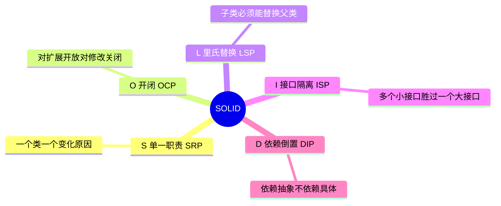
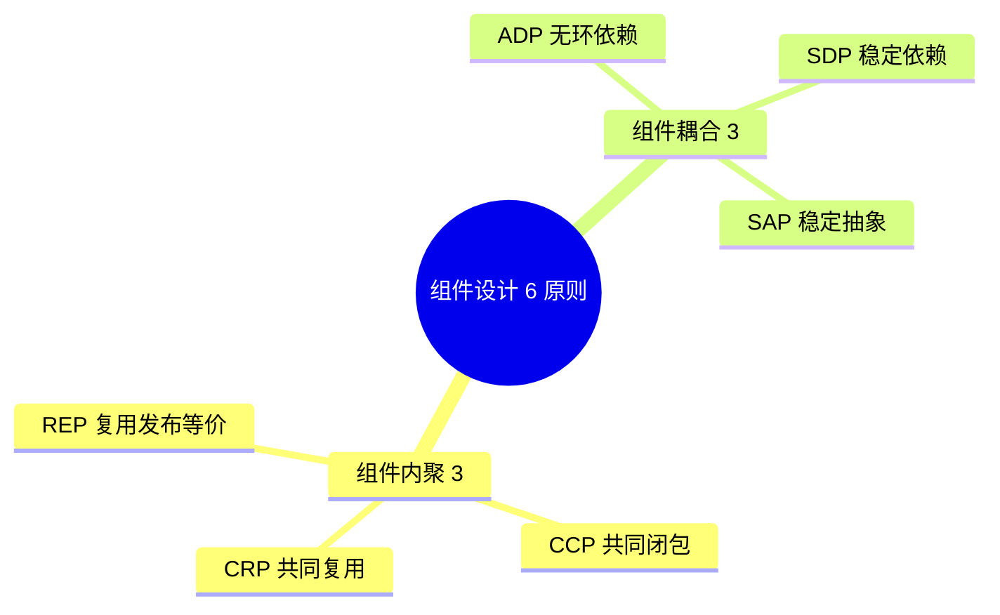
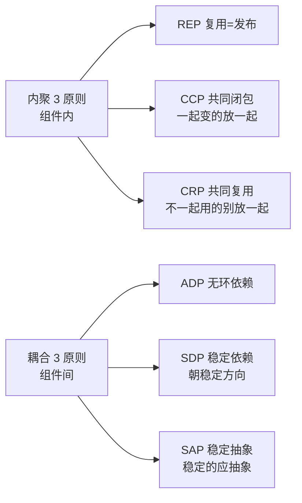

# 设计原则（Go 实战版）

> SOLID 五原则 + 组件设计原则（包内聚 / 包耦合 6 条）+ Go 实战 / 反例 / 检查清单
>
> Robert C. Martin（Bob 大叔）的核心方法论，资深工程师必懂

---

## 一、SOLID 五原则



**口诀**：**单 / 开 / 里 / 接 / 依**（SOLID）。

---

## 1.1 SRP - 单一职责原则

**定义**：**一个模块只应该有一个变化的原因**。

> 注意：不是"只做一件事"，而是"**只对一类利益相关者负责**"。

**反例**：

```go
// ❌ Employee 同时为 HR、财务、运维负责
type Employee struct {
    Name string
}

func (e *Employee) CalculatePay() float64 { /* 财务关心 */ }
func (e *Employee) ReportHours() {/* HR 关心 */}
func (e *Employee) Save() error { /* 运维关心 */ }

// 财务改税率 → 改 Employee
// HR 改报表格式 → 改 Employee
// DBA 改存储 → 改 Employee
// 三方互相影响 → 合并冲突 + bug
```

**正例**：

```go
type Employee struct {
    Name string
}

// 各自独立
type PayCalculator struct{}
func (p *PayCalculator) Calculate(e *Employee) float64 { /* 财务 */ }

type HourReporter struct{}
func (h *HourReporter) Report(e *Employee) {/* HR */}

type EmployeeRepository struct{}
func (r *EmployeeRepository) Save(e *Employee) error { /* DBA */ }
```

**Go 检查**：
- 一个 type 内方法数 > 10 → 嫌疑
- 修改频率高的字段聚集在一起
- import 跨多个层（DB / HTTP / 邮件）→ 嫌疑

**真实案例**：
- DDD 划分聚合根 + 应用服务 + 仓储 = 自然的 SRP
- ddd_order_example：`OrderDO` 只管订单状态，`OrderRepository` 只管持久化，`OrderHandler` 只管 HTTP

---

## 1.2 OCP - 开闭原则

**定义**：**对扩展开放，对修改关闭**。

新增功能通过**新增代码**实现，而不是**修改已有代码**。

**反例**：

```go
// ❌ 加新折扣类型要改 Calculate
type Order struct{ Type string; Total float64 }

func Calculate(o *Order) float64 {
    switch o.Type {
    case "normal":
        return o.Total
    case "vip":
        return o.Total * 0.9
    case "newuser":  // 加一种就改这里
        return o.Total * 0.8
    }
    return o.Total
}
```

**正例**（用 Strategy 模式）：

```go
type DiscountStrategy interface {
    Apply(total float64) float64
}

type NoDiscount struct{}
func (n *NoDiscount) Apply(t float64) float64 { return t }

type VIPDiscount struct{}
func (v *VIPDiscount) Apply(t float64) float64 { return t * 0.9 }

type NewUserDiscount struct{}
func (n *NewUserDiscount) Apply(t float64) float64 { return t * 0.8 }

type Order struct {
    Total    float64
    Discount DiscountStrategy
}

func (o *Order) Final() float64 { return o.Discount.Apply(o.Total) }

// 加新策略不改 Order
type BlackFridayDiscount struct{}
func (b *BlackFridayDiscount) Apply(t float64) float64 { return t * 0.5 }
```

**Go 实现 OCP 的关键**：
- 接口（让扩展点抽象出来）
- 函数式（函数也是一种"接口"）
- Option Pattern（功能扩展不破坏 API）

**真实案例**：
- gRPC Interceptor — 加功能写新 interceptor 而非改框架
- Kratos middleware — 加中间件不改 server 代码
- 数据库 driver 注册（database/sql.Register）

---

## 1.3 LSP - 里氏替换原则

**定义**：**子类必须能替换父类**而不破坏程序正确性。

实现接口的类型必须**遵守接口契约**（包括隐含的契约）。

**反例**：

```go
type Reader interface {
    Read(p []byte) (n int, err error)  // 契约：n>0 或 err!=nil
}

// ❌ 违反契约的实现
type BadReader struct{}
func (b *BadReader) Read(p []byte) (int, error) {
    return 0, nil  // 违反 io.Reader 契约（n=0 必须 err!=nil）
    // 调用方陷入死循环
}
```

**Go 实战**：要懂**接口契约**：

```go
// io.Reader 契约
// - Read 读 0 < n <= len(p) 字节
// - 遇到 EOF 时可能 (0, io.EOF) 或 (n>0, nil)，下次调用返回 (0, io.EOF)
// - 不要返回 (0, nil)（除非 len(p) == 0）

// 实现方必须遵守 → 文档 + 测试

// http.Handler 契约
// - 必须在返回前完成响应
// - 返回前不能继续写 ResponseWriter
```

**LSP 违反信号**：
- 子类型加了非空判断（"父类没传 nil 但我得防"）
- 子类型抛新异常（不在父类承诺范围）
- 子类型改变前置/后置条件
- 子类型有无意义的方法（继承不应有的功能）

**Go 中的 LSP**：
- 接口实现者必须**真正满足接口语义**（不只是签名）
- `error.Error()` 实现必须返回非空字符串
- `context.Context.Done()` 必须返回 channel（不能 nil）

---

## 1.4 ISP - 接口隔离原则

**定义**：**多个小接口胜过一个大接口**。客户端不应被迫依赖它不需要的方法。

**反例**：

```go
// ❌ 大接口
type Worker interface {
    Work()
    Eat()
    Sleep()
    Code()
    Manage()
    Sell()
}

// 销售实现就被迫实现 Code() / Manage()
type Salesman struct{}
func (s *Salesman) Sell() {}
func (s *Salesman) Code() { panic("not implemented") }  // 违反 LSP
```

**正例**（拆分小接口）：

```go
type Worker interface{ Work() }
type Eater interface{ Eat() }
type Sleeper interface{ Sleep() }
type Coder interface{ Code() }
type Manager interface{ Manage() }
type Seller interface{ Sell() }

// 程序员
type Programmer struct{}
func (p *Programmer) Work()  {}
func (p *Programmer) Code()  {}

// 销售
type Salesman struct{}
func (s *Salesman) Work() {}
func (s *Salesman) Sell() {}

// 业务代码按需要的最小接口写
func DoWork(w Worker) { w.Work() }  // 不需要 Eat / Code

// 组合接口
type FullStackEngineer interface {
    Coder
    Worker
}
```

**Go 风格**：
- **接口越小越好**（io.Reader / io.Writer / io.Closer 都是单方法）
- 接口在**使用方定义**（不在实现方）
- 优先 1-3 个方法的接口

**Go 标准库 ISP 范例**：
```go
// io 包大量小接口
type Reader interface { Read(p []byte) (n int, err error) }
type Writer interface { Write(p []byte) (n int, err error) }
type Closer interface { Close() error }
type Seeker interface { Seek(offset int64, whence int) (int64, error) }

// 组合
type ReadWriter interface { Reader; Writer }
type ReadCloser interface { Reader; Closer }
type ReadWriteCloser interface { Reader; Writer; Closer }
```

**反模式**：
- 一个接口 20 个方法
- "万能 Service 接口"
- 接口里有 Mock-only 方法

---

## 1.5 DIP - 依赖倒置原则

**定义**：
1. 高层模块不应依赖低层模块，**两者都应依赖抽象**
2. 抽象不依赖细节，**细节依赖抽象**

**反例**：

```go
// ❌ 业务直接依赖 MySQL
package service
import "your_project/mysql"

type OrderService struct {
    db *mysql.Client  // 高层依赖具体实现
}

// 换 PostgreSQL → 改 service
```

**正例**：

```go
// 领域层定义接口（抽象）
package order

type Repository interface {
    Save(o *Order) error
    FindByID(id string) (*Order, error)
}

type Service struct {
    repo Repository  // 依赖抽象
}

// 基础设施层实现接口
package infra

type MySQLRepo struct { db *sql.DB }
func (m *MySQLRepo) Save(o *order.Order) error { /* ... */ }
func (m *MySQLRepo) FindByID(id string) (*order.Order, error) { /* ... */ }

// 注入
package main

func main() {
    repo := &infra.MySQLRepo{}
    svc := order.NewService(repo)
}
```

**关键**：依赖方向**从外向内**指向领域（DDD 洋葱架构核心）。

**Go 实战 DIP 关键**：
- 接口在**使用方**包定义
- 实现在**独立**包
- main / DI 容器组装

**Wire DI 工具**：编译期生成依赖图：
```go
//go:build wireinject
func InitializeServer() (*Server, error) {
    wire.Build(
        NewMySQLRepo,           // 返回 Repository 接口
        NewOrderService,        // 接受 Repository，返回 OrderService
        NewServer,              // 接受 OrderService
    )
    return nil, nil
}
```

**真实案例**：
- DDD 项目：domain 层定义 Repository 接口，infrastructure 层实现
- ddd_order_example：`domain/order_repo.go` 定义接口，`infrastructure/repository/order_repo.go` 实现

---

## 1.6 SOLID 检查清单

```
□ SRP: 每个 type 只对一类利益相关者负责
□ OCP: 加新功能不改老代码（接口扩展点）
□ LSP: 实现接口必须真正满足语义（含隐含契约）
□ ISP: 接口尽量小，1-3 个方法最佳
□ DIP: 业务依赖接口而非具体实现，接口在使用方
```

---

# 二、组件设计原则

Bob 大叔《Clean Architecture》提出的 **6 条组件设计原则**，分两组：



**Go 中"组件" ≈ Go module / package**。

---

## 2.1 REP - 复用发布等价原则

**定义**：**复用的粒度 = 发布的粒度**。

软件复用的最小单位 = 软件发布的最小单位。

**白话**：你给别人复用的东西，必须**作为一个整体被发布**（带版本、文档、变更日志）。

**Go 实战**：
- 一个 Go module 一个 go.mod
- 用 `v1.2.3` 语义化版本
- 有 tag、有 release notes
- 不要让别人依赖你的"内部代码"

**反例**：让别人 `import "github.com/me/project/internal/utils"` → 别人无法稳定依赖（你随时改）。

**正例**：把 utils 单独发成 module 或放 `pkg/`，遵守语义化版本。

---

## 2.2 CCP - 共同闭包原则

**定义**：**会同时变化的类放在一个组件里**。

**SRP 在组件层的应用**：让"一个变化原因"局限在**一个组件内**。

**Go 实战**：
- 一个 BC（限界上下文）的 entity / repo / service 放在同一个包
- 改 BC 内部不影响其他 BC

**反例**：
```
service/order/
service/payment/
repository/order/   ← 订单相关分散在多包
repository/payment/
```

**正例**（DDD 风格）：
```
domain/
  ├── order_core/      ← 订单相关全在一起
  │   ├── entity.go
  │   ├── repository.go
  │   └── service.go
  └── payment_core/    ← 支付相关全在一起
```

改订单逻辑只需改 order_core 一个包。

---

## 2.3 CRP - 共同复用原则

**定义**：**不会一起复用的类不要放在一起**。

ISP 在组件层的应用。如果用户依赖了组件 A，但只用其中一个类，剩下的是浪费 + 强制连带升级。

**Go 实战**：
- 不要把无关功能塞一个 module
- 不要做"万能 utils 包"
- 公共代码细粒度拆分

**反例**：
```
pkg/utils/  ← 包含 字符串、时间、加密、压缩、HTTP 客户端...
```

任何人用其中一个就强依赖整个 utils → 改一个其他人都得跟着升。

**正例**：拆细：
```
pkg/strutil/
pkg/timeutil/
pkg/crypto/
pkg/compress/
pkg/httpclient/
```

---

## 2.4 ADP - 无环依赖原则

**定义**：**组件依赖图中不允许有环**。

**口诀**：**A → B → A 是禁忌**。

**反例**（循环依赖）：
```
package order  imports  payment
package payment  imports  order  ← Go 编译报错
```

Go 直接编译失败，**强制 ADP**。

**修复**：
1. **下推**：把共同依赖抽到第三个包
   ```
   order ─┐
          ├→ shared/types
   payment─┘
   ```
2. **接口反转**：让其中一方定义接口
   ```go
   // order 包定义 PaymentService 接口
   // payment 包实现，运行时注入
   ```
3. **事件解耦**：通过事件总线通信，不直接 import

**Go 真实例子**：
- 跨 BC 引用：用接口（DIP） + 事件总线（Observer）
- ddd_order_example：`OrderService` 调 `PaymentService` 通过应用层编排

---

## 2.5 SDP - 稳定依赖原则

**定义**：**依赖应朝着稳定的方向**。

不稳定的组件应该依赖稳定的组件，反之**等于把炸弹绑在自己身上**。

**稳定度**：
- 入度多（被很多组件依赖）→ 稳定（改了影响大，所以不能随便改）
- 出度多（依赖很多组件）→ 不稳定

**度量**：`I = Ce / (Ca + Ce)`
- `Ca`：传入耦合（被多少组件依赖）
- `Ce`：传出耦合（依赖多少组件）
- I = 0：极稳定（核心库）
- I = 1：极不稳定（业务模块）

**Go 实战**：
- 业务包（不稳定）依赖工具包（稳定）✓
- 工具包依赖业务包 ✗
- domain 层（稳定）不应依赖 infrastructure（不稳定）→ DIP 解决

---

## 2.6 SAP - 稳定抽象原则

**定义**：**稳定的组件应该是抽象的**。

最稳定的组件最难修改。如果它是具体的，那么修改成本高 → 灾难。所以稳定的应该是抽象。

度量：`A = Na / Nc`
- `Nc`：组件中具体类数量
- `Na`：抽象类（接口）数量
- A = 0：完全具体
- A = 1：完全抽象

**理想**：A + I = 1（在"主序列"上）。
- 极稳定 → 极抽象（接口包）
- 极不稳定 → 极具体（业务实现）

**Go 实战**：
- 接口包（如 `domain/repository.go`）：高稳定 + 高抽象
- 实现包（如 `infrastructure/mysql_repo.go`）：低稳定 + 高具体

**结合 DIP**：业务依赖抽象包，避免依赖具体实现，遵守 SAP。

---

## 2.7 组件设计 6 原则总结



**口诀**：**复一发 / 共同闭 / 共同用 / 无环依 / 稳定依 / 稳定抽**。

---

# 三、其他重要原则

## 3.1 DRY - Don't Repeat Yourself

**定义**：**不要重复自己**。

**Go 实战**：
- 提取公共函数 / 接口
- generics 减少类型重复
- code generation（protobuf / sqlc）

**反 DRY 注意**：
- 太早抽象 → 抽象错（"Three strikes and refactor"）
- 强行 DRY 跨业务 → 耦合
- 复制 3 次以上才考虑抽

## 3.2 KISS - Keep It Simple, Stupid

**定义**：**保持简单**。

**Go 哲学**：
- 简单代码 > 聪明代码
- 显式 > 隐式
- 避免过度抽象

## 3.3 YAGNI - You Aren't Gonna Need It

**定义**：**你不会用到的功能现在别做**。

**反例**：为可能的扩展加 5 层抽象。

**正例**：
- 等需求出现再做
- 简单先实现，需要时重构

## 3.4 LoD - Law of Demeter（迪米特法则）

**定义**：**只和朋友说话**。

不要 `a.b.c.d.do()` 链式调用，避免依赖远端对象。

**反例**：
```go
order.Customer.Address.City.Name  // 链太深
```

**正例**：
```go
order.GetCustomerCityName()  // 封装在 Order 内
```

## 3.5 Fail Fast

**定义**：**尽早失败**。

错误一发生立即报错，不要让坏状态扩散。

**Go 实战**：
- 入口校验
- panic 在 init / main 启动检查
- 防御性编程在边界

---

# 四、Go 习惯（Idiomatic Go）

Go 有自己的风格化原则，往往和 OO 经典原则**互补但有差异**：

## 4.1 Accept interfaces, return structs

**接受接口、返回结构体**：
```go
// ✅ 接受接口（最大灵活性）
func Process(r io.Reader) error

// ✅ 返回具体类型（让调用方决定如何抽象）
func NewClient() *Client
```

## 4.2 接口在使用方定义

```go
// ❌ 实现方定义
package mysql
type UserRepo interface { ... }
type userRepo struct{}

// ✅ 使用方定义
package service
type UserRepo interface { ... }  // 这里用什么定义什么

package mysql
type Repo struct{}  // 不主动 implement
// （Go 接口隐式实现）
```

## 4.3 组合优于继承

Go 没继承，**只有组合**：
```go
type Server struct {
    *http.Server  // 嵌入，获得方法
    Logger Logger
    DB     Database
}
```

## 4.4 错误处理：显式 + 包装

```go
if err != nil {
    return fmt.Errorf("query user: %w", err)  // 用 %w 包装
}
```

## 4.5 不要用 panic 做控制流

panic 仅用于：
- 启动期不可恢复错误（如配置错）
- 真正不应该发生的情况（如内部 bug）

业务错误用 `error` 返回。

---

# 五、SOLID + Go 检查清单

## 5.1 代码 review 必查

```
□ 一个 type 方法多于 10 个？→ 考虑拆分（SRP）
□ 加新功能要改老代码？→ 提取接口扩展点（OCP）
□ 接口实现只用了部分方法？→ 拆接口（ISP）
□ 业务代码 import 了具体实现？→ 用接口（DIP）
□ 接口在实现方？→ 移到使用方（Go 风格 + DIP）
□ utils / common 万能袋？→ 拆细包（CRP）
□ 跨包循环依赖？→ Go 直接报错（ADP）
□ 接口超过 5 个方法？→ 拆小（ISP）
□ 全局可变状态？→ 改 DI / Option Pattern
□ panic 做业务流程？→ 改 error
```

## 5.2 包结构反模式

```
❌ 万能 utils
❌ 接口和实现混一个包
❌ 跨包暴露内部细节（不用 internal/）
❌ 跨 BC 直接 import 实体
❌ 业务包依赖具体 DB 类型
```

---

# 六、面试 / 答辩高频题

## Q1: SOLID 是什么？

**S** Single Responsibility / **O** Open Closed / **L** Liskov Substitution / **I** Interface Segregation / **D** Dependency Inversion。

口诀：**单 / 开 / 里 / 接 / 依**。

## Q2: 组件设计 6 原则？

内聚 3：REP / CCP / CRP；耦合 3：ADP / SDP / SAP。

口诀：**复一发 / 共同闭 / 共同用 / 无环依 / 稳定依 / 稳定抽**。

## Q3: Go 怎么实现 DIP？

- 接口在使用方定义
- 实现在独立包
- main / Wire DI 注入

## Q4: 为什么 io.Reader 接口设计这么好？

ISP 范例：
- 单方法（最小）
- 通用（任何字节流都能实现）
- 可组合（io.ReadWriter / io.ReadCloser）

## Q5: SOLID 在 DDD 中怎么体现？

- SRP：聚合根只管自己的状态
- OCP：用领域服务扩展业务逻辑
- LSP：Repository 接口契约
- ISP：领域服务接口小而精
- DIP：domain 定义接口，infrastructure 实现

## Q6: SOLID 矛盾时怎么取舍？

- 不要为原则而原则
- 当前业务复杂度匹配的设计才是好设计
- YAGNI > 过度设计

## Q7: 怎么避免循环依赖？

- 抽到第三方包
- 接口反转
- 事件解耦

## Q8: 接口应该多大？

Go 风格：**1-3 个方法最佳**。
io.Reader 1 个方法就是范例。

## Q9: Go 为什么不需要那么多设计模式？

- 接口隐式实现 → Adapter / Strategy 简化
- 函数一等公民 → Strategy / Command 用函数
- 组合 > 继承 → 复杂模式不需要
- channel / goroutine → 并发模式 idiomatic

## Q10: 模式和原则的关系？

- 原则 = WHY（为什么）
- 模式 = HOW（怎么做）
- 不懂原则乱用模式 → 过度工程
- 懂原则不用模式 → 也能写好代码

---

# 七、推荐阅读

```
经典:
  □ 《Clean Architecture》Robert C. Martin
  □ 《Clean Code》Robert C. Martin
  □ 《Agile Software Development》Robert C. Martin
  □ 《代码整洁之道》中文版

Go 专项:
  □ 《Go 语言圣经》(The Go Programming Language)
  □ Effective Go
  □ Go Code Review Comments
  □ Uber Go Style Guide

文章:
  □ Dave Cheney 博客
  □ Russ Cox 博客
  □ Bob 大叔的 SOLID 博客
```

---

# 八、面试加分点

- 能说全 **SOLID + 6 组件原则**
- 能区分 **SRP 不是"只做一件事"**（是"一个变化原因"）
- 能讲清 **DIP 在 DDD/洋葱架构里的应用**
- 能识别 **代码味道**（坏味道）
- 知道 **Go 习惯（Idiomatic）和 OO 原则的关系**
- 懂 **YAGNI / KISS** 反过度设计
- 接口 **小而精**（1-3 方法）
- **接口在使用方定义** 是 Go DIP 的关键
- ADP（无环依赖）Go **直接编译报错**
- "**模式是发现的不是发明的**"，原则 > 模式
