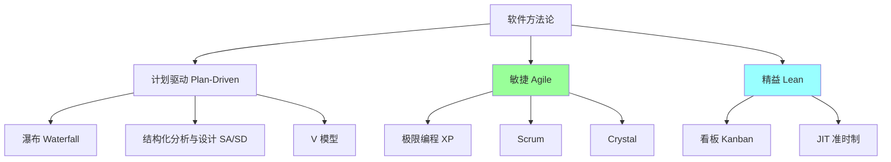
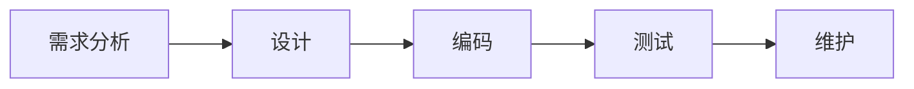
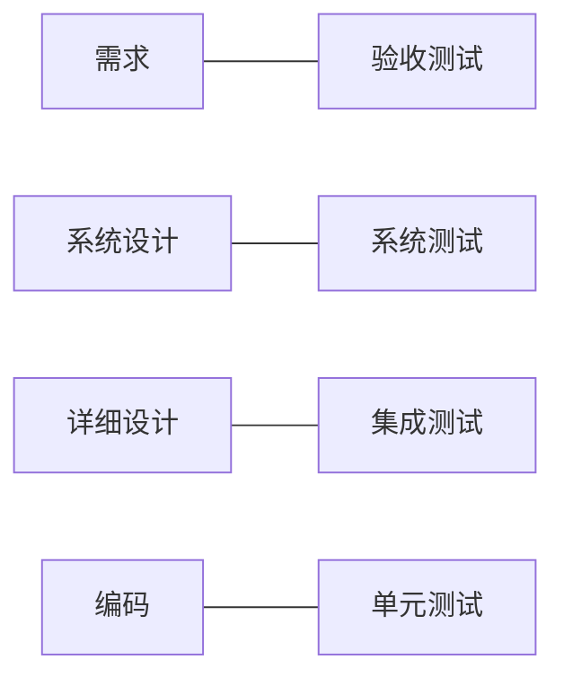
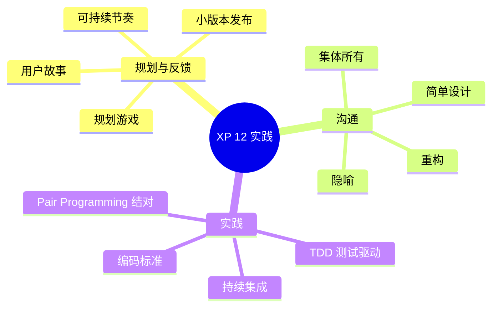
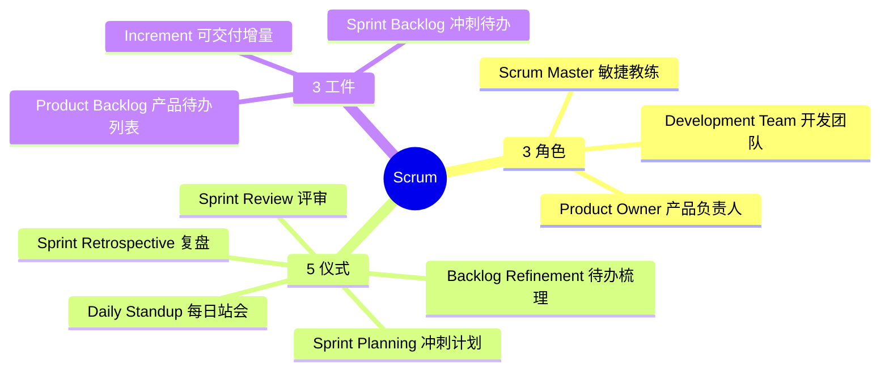
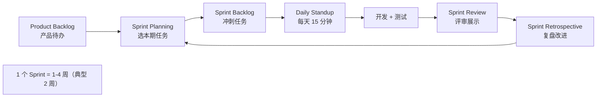
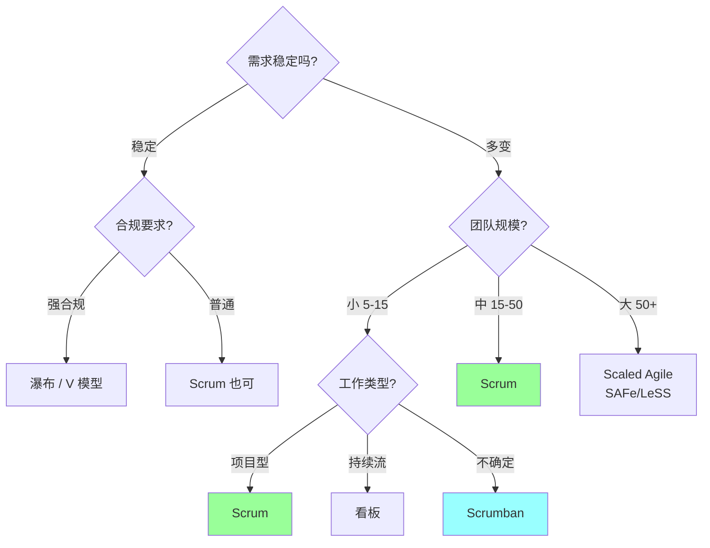
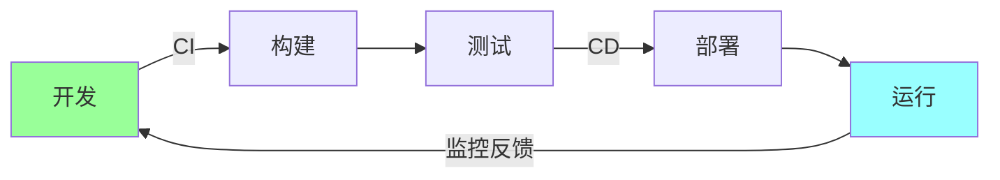

# 软件开发方法论

> XP / Scrum / 精益 / 看板 / 瀑布 / 结构化分析与设计 — 对比 + 何时用 + Go/互联网行业实战
>
> 资深工程师必懂：知道何时用什么方法，能 push back 不合理的流程

---

## 一、整体地图



**演进**：
- 1970s：瀑布 / 结构化（确定性需求）
- 1990s-2000s：XP / Scrum 兴起（应对变化）
- 2010s+：精益 / 看板（持续流动）/ DevOps（极致敏捷 + 自动化）

---

## 二、瀑布模型（Waterfall）

### 2.1 流程



**特点**：
- 严格阶段划分
- 上一阶段完成才进下一阶段
- 文档驱动
- 适合**需求明确**的传统行业（航空 / 国防 / 政府）

### 2.2 优缺点

**优**：
- 流程清晰
- 文档完整
- 易于估时 / 验收
- 适合需求稳定的场景

**缺**：
- 需求变化代价大
- 客户晚期才看到成品
- 风险后置（测试发现的 bug 修改成本高）
- 大项目失败率高

### 2.3 何时用

**适合**：
- 需求明确不变（如政府合规系统）
- 大型基础设施（核电站控制软件）
- 法规严格行业（医疗设备）

**不适合**：
- 互联网产品（需求频繁变）
- 探索性产品（不知道要啥）

---

## 三、V 模型

瀑布的扩展，强调**测试与开发对应**：



**适合**：质量要求极高（医疗 / 航空），每个阶段都有对应测试。

---

## 四、XP - 极限编程

Kent Beck 1996 年提出。

### 4.1 核心实践 12 条



### 4.2 关键实践详解

**1. TDD（Test-Driven Development）**：先写测试再写实现，红 → 绿 → 重构。

**2. Pair Programming（结对编程）**：两人一台电脑，一个驾驶（写）一个领航（review）。

**3. 持续集成（CI）**：每天多次合并 + 自动化测试，第一次提出。

**4. 集体代码所有权**：任何人可以改任何代码。

**5. 简单设计**：YAGNI，不为未来设计。

**6. 重构**：持续改进设计，不积累技术债。

**7. 小版本发布**：1-2 周一个可用版本。

**8. 用户故事**：用户视角描述需求 "As a X, I want Y, so that Z"。

**9. 隐喻**：用类比让团队对系统有共同理解。

**10. 可持续节奏**：每周不超 40 小时（反对 996）。

### 4.3 优缺点

**优**：
- 应对变化能力强
- 代码质量高（TDD + 重构）
- 快速反馈
- 团队凝聚力强

**缺**：
- Pair Programming 学习成本高
- 文档少（人员流动风险）
- 集体所有权需要高素养团队
- 不适合大规模团队（>15 人）

### 4.4 何时用

**适合**：
- 小团队（5-15 人）
- 需求快速变化
- 高度信任的团队

**不适合**：
- 大型团队（沟通成本爆炸）
- 团队水平参差不齐
- 严格合规行业

### 4.5 现状

XP 在 2000s 火过，**现在多融入到 Scrum 里**作为工程实践，纯 XP 团队少见。但**TDD / CI / 重构 / 结对**这些**已成业内标配**。

---

## 五、Scrum

### 5.1 角色 + 仪式 + 工件



### 5.2 流程



### 5.3 关键概念

**Sprint**：固定时长的迭代（1-4 周，主流 2 周）。

**Story Point**：用相对值（斐波那契：1/2/3/5/8/13）估算，不是人天。

**Velocity**：团队每 Sprint 完成的 Story Point 总和（用于预估未来）。

**Definition of Done (DoD)**：明确"完成"的标准（代码 + 测试 + 文档 + 上线）。

**Burndown Chart**：燃尽图，追踪进度。

### 5.4 角色职责

**Product Owner（PO）**：
- 写用户故事
- 排优先级
- Backlog 唯一负责人
- 一人决策（避免委员会）

**Scrum Master**：
- 推动流程
- 移除障碍
- 不是项目经理
- 服务团队（Servant Leader）

**开发团队**：
- 自组织
- 跨职能（前后端测试都在一个团队）
- 集体决定如何做

### 5.5 优缺点

**优**：
- 框架明确，易上手
- 节奏感强（Sprint 周期感）
- 频繁反馈 + 调整
- 业内事实标准

**缺**：
- 仪式多（容易形式主义）
- 估时难（Story Point 抽象）
- PO 难找（产品 + 业务都强）
- 不适合大型紧耦合系统

### 5.6 现状

**国内大厂**：基本都用 Scrum 或 Scrum 变体。

**典型变体**：
- 字节：双周迭代 + OKR
- 阿里：迭代 + 共创会
- 美团：双周迭代 + 复盘

**反模式**：
- "Scrum But"（用 Scrum 但只挑形式不要本质）
- 站会变汇报会（向上汇报）
- PO 不决策（开会扯皮）
- 没有真正的可交付增量

---

## 六、精益（Lean）软件开发

源自丰田生产方式，应用到软件。

### 6.1 七原则

```
1. 消除浪费 (Eliminate Waste)
2. 加强学习 (Amplify Learning)
3. 推迟决策 (Decide as Late as Possible)
4. 尽快交付 (Deliver as Fast as Possible)
5. 团队授权 (Empower the Team)
6. 内建质量 (Build Integrity In)
7. 整体优化 (See the Whole)
```

### 6.2 七种浪费

软件开发对应丰田的"七种浪费"：

| 浪费 | 说明 |
| --- | --- |
| 部分完成的工作 | 半成品堆积，没价值 |
| 额外功能 | 用户不需要的功能 |
| 重新学习 | 知识没沉淀，反复学 |
| 任务切换 | 多任务并行降低效率 |
| 等待 | 等审批 / 等环境 / 等依赖 |
| 移交 | 跨团队传递信息丢失 |
| 缺陷 | bug 修复成本 |

### 6.3 价值流图（Value Stream Mapping）

把"需求到上线"的全过程画出来，找瓶颈：
```
需求评审(1天) → 排期(等3天) → 开发(5天) → 测试(等1天测2天) → 灰度(等1天) → 上线(0.5天)
合计 13.5 天，其中等待 5 天 = 37% 浪费
```

精益思想：**最小化等待 + 最小化半成品**。

### 6.4 现状

**精益思想已融入主流**：
- DevOps 强调"持续流动"（精益）
- MVP（最小可行产品）来自精益创业
- 限制 WIP（在制品）来自看板（精益）

---

## 七、看板（Kanban）

精益的实践，**关注流动**。

### 7.1 看板墙

```
┌──────┬──────────┬──────────┬─────┐
│ 待办 │ 进行中(3)│ 待评审(2)│ 完成│
├──────┼──────────┼──────────┼─────┤
│ 任务1│ 任务4    │ 任务6    │任务8│
│ 任务2│ 任务5    │ 任务7    │任务9│
│ 任务3│          │          │     │
└──────┴──────────┴──────────┴─────┘
                  ↑ WIP 限制 = 3
```

**核心**：
- **可视化**：所有任务可见
- **限制 WIP**（在制品）：避免任务堆积
- **测量流动**：从开始到结束的时间

### 7.2 与 Scrum 区别

| | Scrum | 看板 |
| --- | --- | --- |
| 周期 | 固定 Sprint（1-4 周） | 持续流动，无固定周期 |
| 角色 | PO / SM / Team | 没强制角色 |
| 仪式 | 5 个标准仪式 | 灵活 |
| 适合 | 项目型工作 | 运维 / 支持型工作（持续到来） |
| 限制 | Sprint Backlog | WIP 数量 |

### 7.3 何时用

**适合**：
- 运维团队（工单不断来）
- 客服 / 支持
- 不可预测的工作流

**不适合**：
- 大项目（需要里程碑感）

### 7.4 工具

- Trello / Jira / 飞书项目 / Notion / Linear
- Github Project

---

## 八、Scrum 与看板结合：Scrumban

实战很多团队用 **Scrumban**：
- 保留 Sprint（节奏感）
- 加 WIP 限制（防止任务堆积）
- 每日站会 + 看板墙

**最务实的方法**。

---

## 九、结构化分析与设计（SA/SD）

70-80 年代的方法，现在很少纯用，但**思想仍有价值**。

### 9.1 结构化分析（SA）

**目标**：分析需求，输出 DFD（数据流图）。

**步骤**：
1. 画当前系统的 DFD
2. 画目标系统的 DFD
3. 数据字典
4. 加工说明（每个处理过程的细节）

**DFD 元素**：
```
- 圆角矩形：处理过程
- 箭头：数据流
- 矩形：外部实体
- 双线：数据存储
```

### 9.2 结构化设计（SD）

**目标**：设计模块结构，输出**结构图**。

**核心**：
- **模块独立性**（Coupling 低 + Cohesion 高）
- **结构图**展示模块调用关系

### 9.3 现状

**已被 OO + UML 取代**，但：
- DFD 仍用于业务流程分析
- 模块化思想是基础
- 结构化思维（自顶向下分解）仍重要

详见 [05-modeling-tools.md](05-modeling-tools.md)。

---

## 十、对比表

```
┌──────────┬────────┬───────┬─────────┬────────┐
│          │ 瀑布   │ XP    │ Scrum   │ 看板   │
├──────────┼────────┼───────┼─────────┼────────┤
│ 需求     │ 稳定   │ 可变  │ 可变    │ 持续来 │
│ 周期     │ 长期   │ 1 周  │ 2 周    │ 无周期 │
│ 文档     │ 重     │ 轻    │ 中      │ 轻     │
│ 客户参与 │ 阶段性 │ 强    │ 强      │ 中     │
│ 适合规模 │ 大     │ 小    │ 中      │ 中     │
│ 典型场景 │ 政府   │ 创业  │ 互联网  │ 运维   │
└──────────┴────────┴───────┴─────────┴────────┘
```

---

## 十一、决策树：怎么选



---

## 十二、互联网行业实战

### 12.1 典型实践

**字节 / 阿里 / 美团 / 腾讯** 主流：
- **Scrum 2 周迭代** 基础
- **OKR** 年/季度目标
- **CI/CD** 持续集成部署
- **TDD / 单元测试** 工程实践
- **Code Review** 强制
- **每周站会 / 双周复盘**

### 12.2 不那么"敏捷"的实战

**真实情况**：
- 很多公司"披着敏捷的外衣"实际还是计划驱动
- 仪式形式化（站会变汇报）
- 无 Sprint 概念，纯需求驱动
- 文档过度（敏捷宣言反对的）

### 12.3 推动改进

**8 年 / TL 视角**：
- 不能一味理论化（学院派）
- 不能一味妥协（无原则）
- 找问题点 → 提改进 → 小步落地

**例**：
- 站会变汇报 → 改"昨天 / 今天 / 阻塞"三段式
- 没有复盘 → 双周强制 30 分钟
- 估时不准 → 引入 Story Point + Velocity

---

## 十三、DevOps

不是方法论，是**文化 + 实践**。极致敏捷的延伸：



**核心**：
- 开发与运维一体化（You build it, you run it）
- 自动化（CI/CD / IaC）
- 快速反馈（监控 / Postmortem）
- 持续改进

**Go 工具链**：
- CI：GitHub Actions / GitLab CI
- 部署：K8s / ArgoCD / Helm
- 监控：Prometheus / Grafana / Loki / Jaeger
- IaC：Terraform / Pulumi

---

## 十四、面试 / 实战高频题

### Q1: 你团队用什么方法论？

**答**（不要只说"我们用 Scrum"）：
- 描述实际：2 周迭代 + 双周复盘 + 站会 + ...
- 哪些好（节奏感 / 持续交付）
- 哪些坑（站会变汇报 / 估时不准）
- 怎么改进的

### Q2: TDD 你做过吗？

**答**：
- 用过 / 没用过都可以
- 用过：讲一次完整流程（红 → 绿 → 重构）+ 学到什么
- 没用过：知道原理，能讲为什么 / 何时用

### Q3: 怎么看 PR 太大？

**答**：拆 PR / 用 feature branch / 灰度发布。

详见 13-engineering/01-code-review.md。

### Q4: 估时不准怎么办？

**答**：
- 用相对值（Story Point）而非绝对人天
- 团队共识估时（Planning Poker）
- 收集 Velocity 历史数据
- 留 buffer（典型 1.5x）
- 风险登记 + 监控

### Q5: 怎么向产品 push back 不合理需求？

**答**：用 ROI 表达 + 替代方案 + 升级。

详见 15-leadership/02-business-product-thinking.md。

### Q6: 站会怎么开才有效？

**答**：
- 严格 15 分钟
- 三段式：昨天 / 今天 / 阻塞
- 详细讨论会后单独开
- 站着开（防止久坐 + 减少废话）
- 阻塞当场协调

### Q7: 你们怎么做复盘？

**答**：
- 频率：每个 Sprint 末尾
- 结构：哪些好 / 哪些坑 / 改进项（带 Owner）
- 跟进：下个 Sprint 看改进项落地

### Q8: Scrum vs 看板怎么选？

- 项目型 / 有里程碑 → Scrum
- 持续流 / 运维型 → 看板
- 不确定 → Scrumban

### Q9: 敏捷不文档？

**答**：错误理解。敏捷宣言原文是"**工作的软件 高于 详尽的文档**"，不是不要文档。

实际：
- 必要文档（API / 架构 / ADR）
- 不写过度的文档
- 文档跟代码同步演化

### Q10: 你们的 DevOps 怎么做？

**答**：
- CI：每次 push 跑测试 + lint
- CD：自动部署到 staging / 手动到 prod
- 灰度：1% → 10% → 100%
- 监控：Prometheus + Grafana
- 应急：Runbook + on-call

---

## 十五、推荐阅读

```
经典:
  □ 《人月神话》Frederick Brooks
  □ 《敏捷软件开发：原则、模式与实践》Robert Martin
  □ 《Scrum 精髓》Kenneth Rubin
  □ 《精益创业》Eric Ries
  □ 《看板方法》David J. Anderson

XP:
  □ 《极限编程解析》Kent Beck

DevOps:
  □ 《凤凰项目》(The Phoenix Project)
  □ 《DevOps 实践指南》(The DevOps Handbook)
  □ 《Site Reliability Engineering》(Google SRE)

实战:
  □ ThoughtWorks 技术雷达
  □ 各大厂技术博客
```

---

## 十六、面试加分点

- 知道**瀑布 / Scrum / XP / 看板 / 精益** 各自适合什么
- 能说出 **Scrum 3 角色 5 仪式 3 工件**
- 知道 **TDD / CI / 结对 来自 XP**
- 知道 **WIP 限制 来自看板**
- 知道 **MVP 来自精益创业**
- 区分**"敏捷宣言"和"敏捷实践"**（敏捷不是仪式）
- 能识别 **Scrum But（伪敏捷）**
- 推动改进时 **用数据 + 小步**
- DevOps 是**文化 + 实践**不是方法论
- 不教条主义，**适合的才是最好的**
