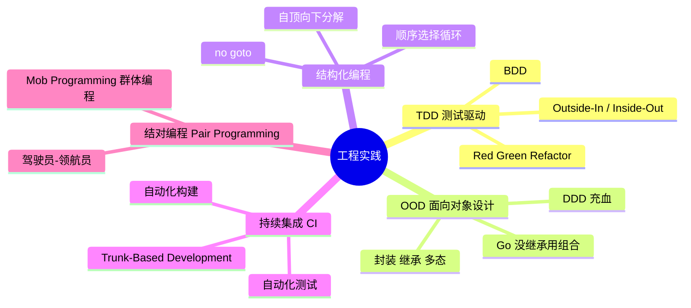
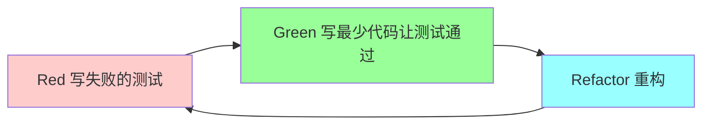
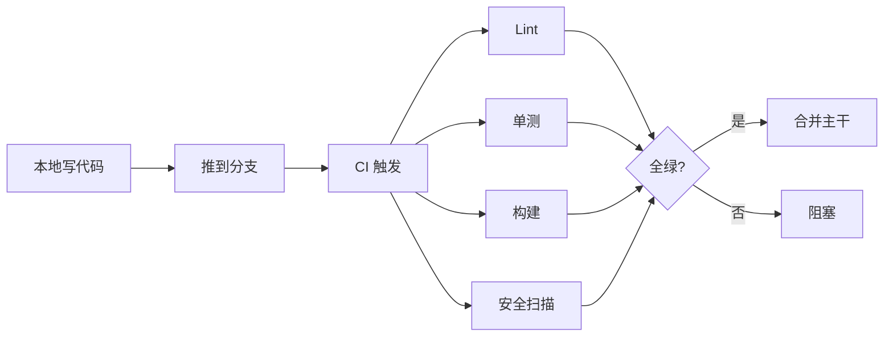

# 工程实践

> TDD / OOD / 结构化编程 / 持续集成 / 结对编程 — 5 大核心实践 + Go 实战
>
> 资深工程师必须掌握的"动手"能力，区别于"知道"和"会做"

---

## 一、概览



---

# 二、TDD - 测试驱动开发

## 2.1 Red-Green-Refactor 循环



**核心**：先写测试 → 再写实现 → 最后重构。

**节奏**：每次循环 **1-5 分钟**（不是几小时）。

## 2.2 实战示例（Go FizzBuzz）

**Step 1: Red**
```go
func TestFizzBuzz_1(t *testing.T) {
    if got := FizzBuzz(1); got != "1" {
        t.Errorf("got %s want 1", got)
    }
}
```
跑测试 → **编译失败**（FizzBuzz 不存在）。

**Step 2: Green**（写最少代码）
```go
func FizzBuzz(n int) string {
    return "1"  // 直接 return，先让测试通过
}
```
跑测试 → **绿**。

**Step 3: Red**（加新测试）
```go
func TestFizzBuzz_3(t *testing.T) {
    if got := FizzBuzz(3); got != "Fizz" {
        t.Errorf("got %s want Fizz", got)
    }
}
```
跑测试 → 红。

**Step 4: Green**
```go
func FizzBuzz(n int) string {
    if n%3 == 0 { return "Fizz" }
    return strconv.Itoa(n)
}
```

**Step 5: 继续**（5, 15）→ ...

**Step 6: Refactor**（测试都绿，安全重构）
```go
func FizzBuzz(n int) string {
    switch {
    case n%15 == 0: return "FizzBuzz"
    case n%3 == 0:  return "Fizz"
    case n%5 == 0:  return "Buzz"
    default:        return strconv.Itoa(n)
    }
}
```

## 2.3 三大原则（Kent Beck / Bob 大叔）

1. **不允许写产品代码**，除非是为了让一个失败的测试通过
2. **不允许写超过失败必要的测试代码**（编译失败也算失败）
3. **不允许写超过测试通过必要的产品代码**

## 2.4 TDD 的两种风格

### 2.4.1 Outside-In（伦敦学派 / Mockist）

从外向内：
- 先测最外层接口
- Mock 内部依赖
- 自然形成接口设计

**特点**：
- 强调隔离（Mock）
- 适合复杂业务（DDD 应用层）
- 代价：Mock 多容易脆

### 2.4.2 Inside-Out（古典学派 / Classicist）

从内向外：
- 先测最底层组件
- 用真实对象组合
- 自下而上构建

**特点**：
- 强调真实组合（Fake）
- 适合算法 / 工具库
- 代价：高层重构成本高

**实战常混合用**：核心算法 Inside-Out，业务流程 Outside-In。

## 2.5 BDD - 行为驱动开发

TDD 的演进，强调**业务行为**：

```gherkin
Feature: 订单创建
  Scenario: 普通用户创建订单
    Given 用户已登录
    And 商品 "iPhone" 库存充足
    When 用户提交订单 1 件 "iPhone"
    Then 订单创建成功
    And 库存减少 1
```

**Go 工具**：`ginkgo` / `goconvey`（DSL 测试）

```go
import . "github.com/onsi/ginkgo/v2"
import . "github.com/onsi/gomega"

var _ = Describe("Order", func() {
    Context("when stock is enough", func() {
        It("should create successfully", func() {
            order, err := CreateOrder("iPhone", 1)
            Expect(err).To(BeNil())
            Expect(order.Status).To(Equal("created"))
        })
    })
})
```

## 2.6 TDD 优劣

**优**：
- **强迫好的设计**（不好测的代码 = 设计有问题）
- 测试覆盖天然完整
- 重构有信心
- 减少 over-engineering

**缺**：
- 学习曲线陡（≥ 2 周才上手）
- 短期慢（长期快）
- 不适合探索性开发（不知道做什么）

## 2.7 何时用 / 不用

**适合**：
- 核心算法 / 业务逻辑
- 库 / 框架开发
- 关键路径

**不适合**：
- UI / 前端
- 探索性原型（Spike）
- 一次性脚本

## 2.8 真实案例

- ddd_order_example：核心业务规则（如 OrderDO.Validate）适合 TDD
- 标准库：encoding / json 等大量用类似 TDD 流程
- Kratos / Kitex：核心组件有详细测试

详见 [13-engineering/03-testing-strategy.md](../13-engineering/03-testing-strategy.md)。

---

# 三、OOD - 面向对象设计

## 3.1 OO 三大特性

```
封装 Encapsulation: 隐藏实现细节
继承 Inheritance: 复用 + 多态
多态 Polymorphism: 同接口不同行为
```

## 3.2 Go 与传统 OO 的差异

| | Java/C++ | Go |
| --- | --- | --- |
| 类 | class | struct |
| 继承 | extends | **没有继承**（有嵌入） |
| 接口 | interface（显式实现） | interface（**隐式实现**） |
| 多态 | 接口 + 继承 | 接口 |
| 构造函数 | constructor | 工厂函数 |
| 方法重载 | 支持 | 不支持 |
| 泛型 | 支持 | Go 1.18+ 支持 |
| 异常 | try-catch | error / panic |

## 3.3 Go 的"OO"风格

**1. 用组合替代继承**：

```go
// ❌ Java 思维
// class Manager extends Employee { }

// ✅ Go 嵌入（不是继承）
type Employee struct {
    Name string
}
func (e *Employee) Work() {}

type Manager struct {
    Employee  // 嵌入
    Reports []*Employee
}
// Manager 自动获得 Work() 方法
```

**2. 接口隐式实现**：

```go
type Writer interface {
    Write([]byte) (int, error)
}

// 任何有 Write 方法的类型都实现了 Writer
type FileWriter struct{}
func (f *FileWriter) Write(b []byte) (int, error) { return 0, nil }

// 不需要 implements 关键字
var w Writer = &FileWriter{}
```

**3. 接口在使用方定义**：

```go
package consumer  // 使用方
type DataSource interface {
    Read() []byte
}

func Process(d DataSource) {}

// ─────────────
package db  // 实现方
type MySQL struct{}
func (m *MySQL) Read() []byte { return nil }
// 不需要主动 implements consumer.DataSource
```

## 3.4 充血 vs 贫血

**贫血模型**（数据袋）：
```go
type Order struct {
    ID, Status string
}
// 业务规则在 Service
type OrderService struct{}
func (s *OrderService) Cancel(o *Order) {
    if o.Status != "Created" { return }
    o.Status = "Cancelled"
}
```

**充血模型**（DDD）：
```go
type Order struct {
    ID, Status string
}
func (o *Order) Cancel() error {
    if !o.canBeCancelled() {
        return errors.New("不允许取消")
    }
    o.Status = "Cancelled"
    return nil
}
```

**Go 推荐充血**（详见 09-ddd / 14-projects）。

## 3.5 OOD 原则

- **SOLID**（详见 02-design-principles）
- **Tell, Don't Ask**：让对象自己做事，不要询问状态后做事
- **DRY / KISS / YAGNI**

## 3.6 Go 中的反模式

```
❌ 用 struct 嵌入实现"继承"链 5 层（深嵌套）
❌ 接口定义在实现方（违反 Go 风格）
❌ 接口超大（违反 ISP）
❌ getter/setter（Go 风格直接公开字段）
❌ 命名 IXxx（Java 习惯，Go 用 Xxxer 如 Reader）
```

---

# 四、结构化编程

## 4.1 历史

Edsger Dijkstra **1968 年《Go To 语句有害论》**奠基。

**核心思想**：
- **顺序 / 选择 / 循环** 三种基本结构（足够表达任何算法）
- **禁止 goto**（除非极少数场景）
- **自顶向下分解**

## 4.2 三大基本结构

```
顺序: A; B; C
选择: if-else / switch
循环: for / while
```

任何复杂逻辑都可由这三者构造（Bohm-Jacopini 定理）。

## 4.3 Go 与结构化

**Go 是典型结构化语言**（OO + 结构化混合）：
- 有 goto（但**几乎不用**）
- 没有 try-catch（用 error / defer / panic）
- defer 是结构化 cleanup

**Go 中 goto 的有限场景**：
```go
// 跳出多层循环（也可用 break label 替代）
for i := 0; i < 10; i++ {
    for j := 0; j < 10; j++ {
        if i*j > 50 { goto done }
    }
}
done:
fmt.Println("found")

// 错误处理统一退出
func process() error {
    if err := step1(); err != nil { goto fail }
    if err := step2(); err != nil { goto fail }
    return nil
fail:
    log.Error("processing failed")
    return err
}
```

**Go 风格**：用 `defer` + early return 替代 goto。

## 4.4 自顶向下分解

```
1. 写最高层伪代码
   handleOrder():
     validate
     calculate price
     save
     send notification

2. 每一步细化
   validate():
     check user
     check items
     check stock
     ...

3. 直到每个函数 1 屏可读完
```

## 4.5 函数原则

- 函数短（< 50 行）
- 单一职责
- 参数少（< 5 个，多用 struct）
- 显式返回值
- 错误立即处理

## 4.6 与 OO 的关系

**OO 不否定结构化**，而是在结构化基础上加了**封装 / 多态**。

**Go 风格**：结构化 + OO + 函数式 三结合。

---

# 五、持续集成（CI）

## 5.1 定义

**持续集成 = 频繁地（每天多次）把代码合并到主干，每次合并自动运行测试**。

XP 提出，现已成业界标配。

## 5.2 关键实践



## 5.3 CI 必备能力

```
□ 自动化测试（单测 / 集成 / E2E 关键路径）
□ 自动化构建（go build / docker build）
□ 自动化部署（CD 阶段）
□ 代码质量检查（golangci-lint / staticcheck）
□ 安全扫描（gosec / trivy）
□ 覆盖率检查
□ 性能基线（benchmark 对比）
```

## 5.4 Go CI 实战示例（GitHub Actions）

```yaml
name: CI
on: [push, pull_request]
jobs:
  test:
    runs-on: ubuntu-latest
    steps:
      - uses: actions/checkout@v4
      - uses: actions/setup-go@v5
        with: { go-version: '1.23' }
      - name: Lint
        uses: golangci/golangci-lint-action@v4
      - name: Test
        run: go test ./... -race -cover -coverprofile=coverage.out
      - name: Build
        run: go build ./...
      - name: Security
        run: |
          go install github.com/securego/gosec/v2/cmd/gosec@latest
          gosec ./...
```

## 5.5 Trunk-Based Development（主干开发）

CI 的极致：**所有人都在 main 上工作**（短分支 < 1 天合）。

**vs GitFlow**：
- GitFlow：长期分支（develop / feature / release）
- Trunk-Based：短分支（< 1 天）+ feature flag 开关功能

**Trunk-Based 优势**：
- 减少合并地狱
- 持续集成
- 真正的持续交付

**Trunk-Based 要求**：
- 强测试覆盖
- Feature Flag 系统
- 优秀的 Code Review
- 灰度发布

业内代表：Google / Facebook / 字节内部。

## 5.6 CI/CD 反模式

```
❌ CI 跑一晚上（应 < 10 分钟）
❌ CI 经常红（团队对 CI 麻木）
❌ 跳过 CI 直接合（破坏 main）
❌ 没有自动回滚
❌ 只有单测不做集成
❌ Coverage 80% 但断言空（追覆盖率）
```

---

# 六、结对编程（Pair Programming）

## 6.1 模式

**驾驶员-领航员**：
- **Driver**（驾驶员）：操作键盘，写代码
- **Navigator**（领航员）：思考方向 / 设计 / 找问题

每 30 分钟换角色。

## 6.2 优劣

**优**：
- **实时 Code Review**
- 知识共享（消除单点）
- 减少分心
- 设计质量高

**缺**：
- 短期看工时翻倍（但 bug 减少 / 设计好抵消）
- 心累（强度大）
- 性格不合的搭配会冲突

## 6.3 何时用

**适合**：
- 复杂模块
- 关键算法
- 新人 onboarding
- 跨域协作

**不适合**：
- 简单 / 重复任务
- 探索性研究
- 全员长期（会消耗团队）

## 6.4 实战建议

- **不全职结对**（每周几小时）
- **新人 + 老人**（带教）
- **跨业务结对**（破信息孤岛）
- **关键决策结对**（避免单人盲点）

## 6.5 Mob Programming（群体编程）

3+ 人围一台电脑：
- 一人 Driver
- 其他 Navigator
- 频繁轮换

**适合**：极复杂问题 / 团队对齐 / 教学。

**代价**：太昂贵，少用。

## 6.6 远程结对

**工具**：
- VS Code Live Share
- JetBrains Code With Me
- tmux / tmate（终端）
- Tuple（专用）

新冠后远程协作成熟，结对更灵活。

---

# 七、其他重要实践

## 7.1 Code Review

详见 [13-engineering/01-code-review.md](../13-engineering/01-code-review.md)。

**关键**：
- 每个 PR 都 review
- 反馈分级（Must / Should / Could / Nit）
- 不超过 24 小时
- 工具自动化（lint / 测试）+ 人工看设计

## 7.2 重构

> "**Refactor mercilessly**"（XP 原则）

**何时重构**：
- 写新代码前清理
- 修 bug 时顺手
- Code Review 发现
- 定期专项

**Go 重构常见**：
- 提取函数
- 提取接口
- 简化嵌套
- 删死代码
- 改命名

## 7.3 持续部署（CD）

CI 的下一步：**自动化部署到生产**。

```
Trunk → CI（测试 + 构建） → CD（自动部署到 staging） → 灰度（自动到 prod 1%） → 全量
```

**关键**：
- 自动化测试覆盖
- 灰度发布
- 自动回滚
- Feature Flag

## 7.4 文档驱动开发（Documentation-Driven）

先写文档（用户视角）→ 再写代码。

**适合**：
- 公开 API 设计
- SDK / 库开发
- 架构决策（ADR）

## 7.5 测试金字塔

```
       /\
      /E2E\        少量
     /─────\
    / 集成  \      中等
   /─────────\
  /   单测    \    大量
 /─────────────\
```

详见 [13-engineering/03-testing-strategy.md](../13-engineering/03-testing-strategy.md)。

---

# 八、Go 工程实战 Checklist

## 8.1 项目启动

```
□ go mod init
□ Makefile（build / test / lint / fmt）
□ .golangci.yml（lint 配置）
□ .gitignore
□ CI 配置（.github/workflows）
□ 项目结构（cmd / internal / pkg）
□ README + 文档
□ 测试覆盖率门槛
```

## 8.2 日常开发

```
□ 写代码前写测试（TDD）
□ 函数 < 50 行
□ 接口在使用方
□ defer 处理资源
□ 错误立即处理（不忽略）
□ Code Review 必走
□ Lint 必过
□ 单测 > 70%
```

## 8.3 上线前

```
□ CI 全绿
□ 集成测试通过
□ 性能基线（benchmark）
□ 灰度方案
□ 监控告警就位
□ 回滚预案
□ 文档更新
```

---

# 九、面试 / 实战高频题

## Q1: TDD 你做过吗？怎么做的？

**答**（结构化 STAR）：
- Situation：在 X 项目做核心计费模块
- Task：金额计算严格不能错
- Action：用 TDD 写每个税率规则（Red → Green → Refactor）
- Result：上线 0 bug，后续重构有信心

## Q2: Pair Programming 你做过吗？

**答**：
- 公司常态化做的话：讲收益（设计好 / 知识共享）
- 没做过：知道概念 + 知道何时该用

## Q3: Go 里的"OO"和 Java/C++ 区别？

**答**：
- 没有继承（用嵌入 / 组合）
- 接口隐式实现
- 接口在使用方定义
- 没有方法重载
- 错误用 error 不用异常

## Q4: 怎么做 CI？

**答**：
- 工具：GitHub Actions / GitLab CI
- 内容：lint / test / build / 安全扫描
- 时间：< 10 分钟
- 强制：合并必通过

## Q5: 你怎么避免代码复杂度高？

**答**：
- 函数短（< 50 行）
- 单一职责
- 持续重构
- Code Review
- 圈复杂度工具检查

## Q6: 没有时间做 TDD 怎么办？

**答**（push back）：
- 反问：哪些 bug 靠 TDD 能拦？测试时间 vs bug 修复时间？
- 短期"省"测试时间 = 长期还债
- 关键路径必做 TDD，非核心可放宽

## Q7: 测试覆盖率多少合理？

**答**：
- 核心业务 80%+
- 非核心 60%+
- 不追 100%（边际收益递减）
- 关注**断言质量**而非纯数字

## Q8: Go 怎么模块化？

**答**：
- internal/ 强制封装
- 接口在使用方
- 包按业务能力（不按技术分层）
- 每包 < 几千行

## Q9: 重构有什么策略？

**答**：
- 小步重构（每次只动一处）
- 测试先行
- 持续 commit（可回滚）
- IDE 工具（GoLand 重构）

## Q10: 持续集成 vs 持续部署？

**答**：
- CI：代码合并到主干 + 自动测试
- CD（Continuous Delivery）：随时可部署
- CD（Continuous Deployment）：自动部署到 prod
- 三者层层递进

---

# 十、推荐阅读

```
TDD:
  □ 《测试驱动开发》Kent Beck
  □ 《修改代码的艺术》Michael Feathers
  □ 《Go 程序设计语言》测试章

OOD:
  □ 《设计模式》GoF
  □ 《敏捷软件开发》Robert Martin
  □ 《领域驱动设计》Eric Evans

CI/CD:
  □ 《持续交付》Jez Humble
  □ 《DevOps 实践指南》

实践:
  □ 《修改代码的艺术》（遗留代码）
  □ 《重构》Martin Fowler
  □ 《代码整洁之道》Robert Martin
```

---

# 十一、面试 / 答辩加分点

- 知道 **TDD = Red-Green-Refactor**，节奏 1-5 分钟
- 区分 **Outside-In（Mockist）vs Inside-Out（Classicist）**
- Go 的"OO" = **组合 + 接口隐式实现**，不是继承
- **充血模型**优于贫血（DDD）
- **结构化基础（顺序/选择/循环）**仍重要
- CI 的核心 = **频繁合 + 自动测**
- **Trunk-Based + Feature Flag** 是高频迭代标配
- Pair Programming **不全职做**，关键模块用
- **重构 + 测试 + Code Review** 是质量铁三角
- **持续部署比持续交付更进一步**
- 工程实践要**用数据 push back**（不是道德绑架）
