# 建模工具

> UML（用例 / 类 / 时序 / 状态 / 活动）/ DFD / 结构图 / Petri 网 / 流程图 / 决策表 — 资深工程师必备的可视化沟通工具
>
> 8 年视角：知道何时用什么图，能用 Mermaid / PlantUML 快速画

---

## 一、为什么要会画图

```
□ 设计评审：图比 1000 字代码清晰
□ 跨团队沟通：业务听不懂代码
□ 文档：架构图 + 时序图 是 README 必备
□ 故障复盘：时序图还原事故链路
□ 晋升答辩：架构图体现思考深度
□ 面试：白板画图 = 体现设计能力
```

**Bob 大叔强调**：UML 不是必须用全套，但**必须会用 6-8 种主要图**。

---

## 二、整体地图

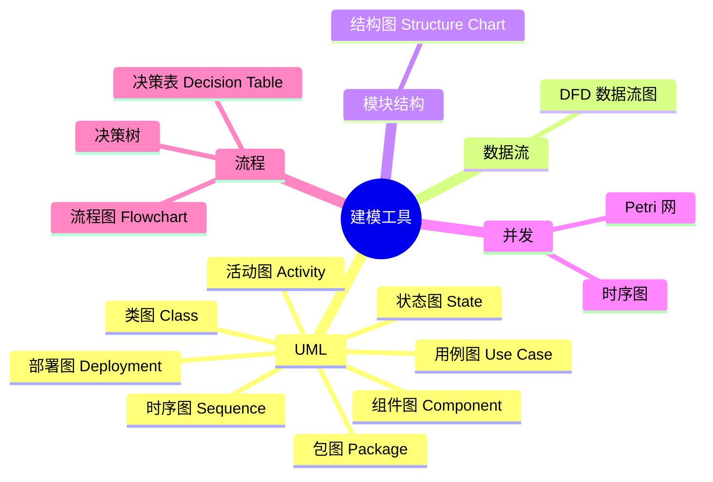

---

# 三、UML（重点）

## 3.1 类图（Class Diagram）

**用途**：表示类 / 接口及其关系。

**5 种关系**（重要）：

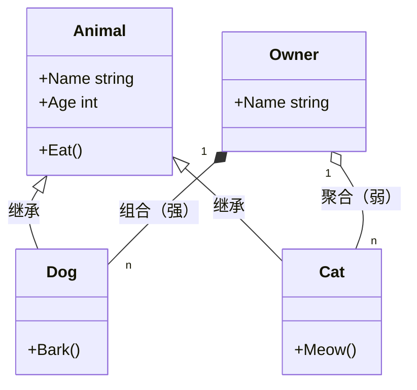

**关系类型**：

| 关系 | 符号 | 含义 | Go 对应 |
| --- | --- | --- | --- |
| **继承** Inheritance | `<|--` 实线空心三角 | is-a | Go 嵌入（组合） |
| **实现** Realization | `<|..` 虚线空心三角 | 实现接口 | 隐式 implement |
| **组合** Composition | `*--` 实线实心菱形 | 强 has-a（生命周期一致） | 嵌入 + 必创建 |
| **聚合** Aggregation | `o--` 实线空心菱形 | 弱 has-a（生命周期独立） | 字段 + 注入 |
| **关联** Association | `--` 实线 | 知道彼此 | 持有引用 |
| **依赖** Dependency | `..>` 虚线 | 临时使用 | 参数 / 返回 |

**Go 实战**：
```go
// 组合（生命周期绑定）
type Order struct {
    Items []OrderItem  // OrderItem 完全归属 Order
}

// 聚合（生命周期独立）
type Order struct {
    CustomerID string  // 仅引用，Customer 独立存在
}

// 实现接口（隐式）
type Storage interface { Save() error }
type FileStorage struct{}
func (f *FileStorage) Save() error { return nil }
```

**Mermaid 类图示例**：

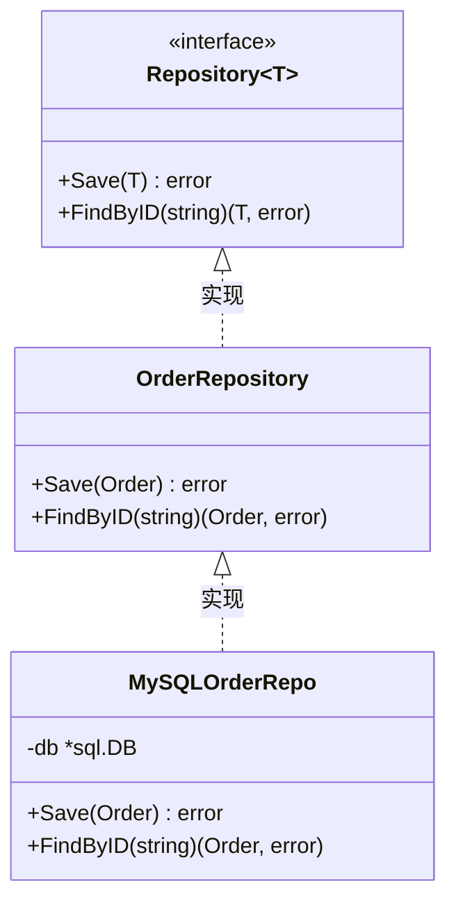

**何时用**：
- 设计阶段：表达领域模型
- 文档：解释项目核心结构
- 评审：方案评审必备

---

## 3.2 时序图（Sequence Diagram）

**用途**：表示对象间消息传递的时间顺序。

**最常用 UML 图**（互联网行业第一）。

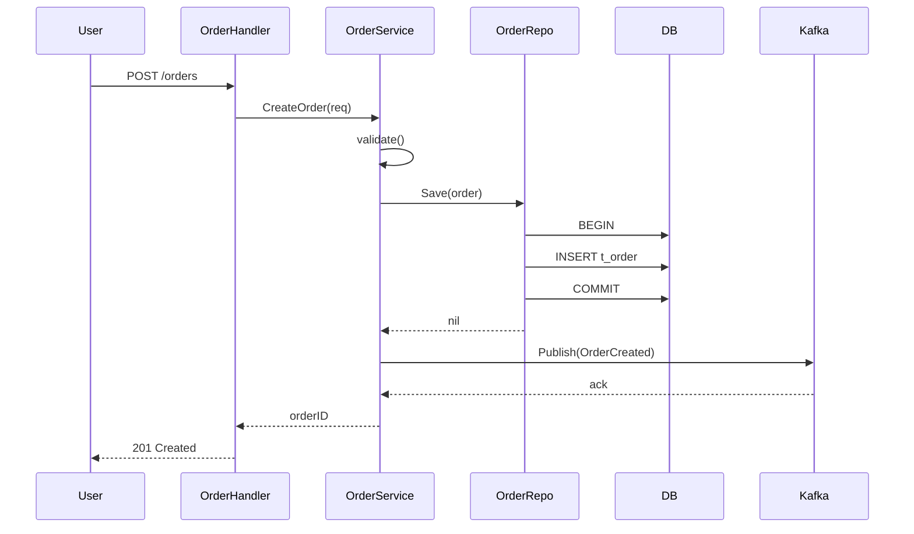

**元素**：
- 参与者（actor / 对象）
- 生命线（垂直虚线）
- 同步消息（实线箭头 →）
- 异步消息（实线箭头 ⇢）
- 返回（虚线箭头 ⇠）
- 自调用（自指箭头）
- 激活框（条状）
- alt / opt / loop / par 框

**进阶**：
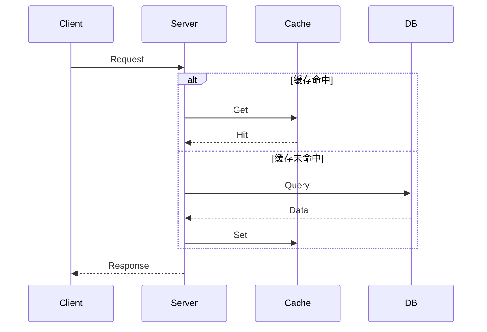

**何时用**：
- 接口流程设计
- 故障复盘（还原调用链）
- 时序追踪问题（链路追踪 + 时序图）
- 跨团队沟通

**Go 工具链**：
- 链路追踪（Jaeger / SkyWalking）天然生成时序视图
- pprof + trace 可视化

---

## 3.3 状态图（State Diagram）

**用途**：对象的状态转换。

**最适合状态机**（订单 / 工单 / 工作流）。

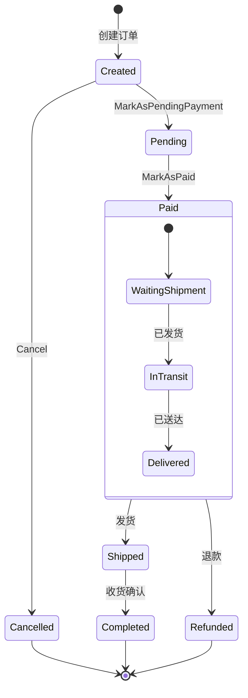

**元素**：
- 初始状态（实心圆）
- 终止状态（圆+实心圆）
- 状态（圆角矩形）
- 转换（箭头 + 触发条件）
- 嵌套状态（state 块内）

**Go 实战 ddd_order_example**：
```go
func (o *OrderDO) MarkAsPaid() error {
    if o.Status != OrderStatusPending {
        return errors.New("只有待支付的订单可以标记为已支付")
    }
    o.Status = OrderStatusPaid
    return nil
}
```

代码 + 状态图 = 完整业务表达。

**何时用**：
- 订单 / 支付 / 工单 / 流程引擎
- 协议设计（TCP 状态机 / Raft 状态机）
- UI 状态管理

---

## 3.4 用例图（Use Case Diagram）

**用途**：表示用户与系统的交互（业务功能视图）。

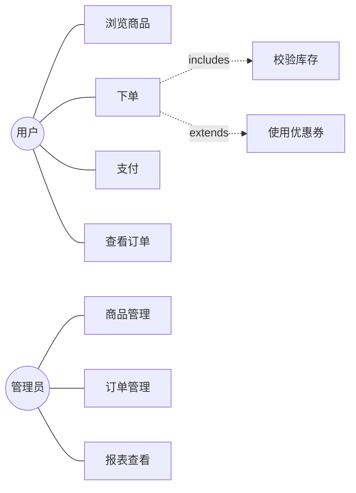

**元素**：
- 参与者（小人 actor）
- 用例（椭圆，业务功能）
- 关系：
  - **包含** include（必须）
  - **扩展** extend（可选）
  - **泛化** generalization

**何时用**：
- 需求分析阶段
- 和产品 / 业务沟通
- 文档说明系统能力

**注意**：业内**用得越来越少**，更多用 user story（敏捷）替代。

---

## 3.5 活动图（Activity Diagram）

**用途**：业务流程或算法流程（类似流程图但更强）。

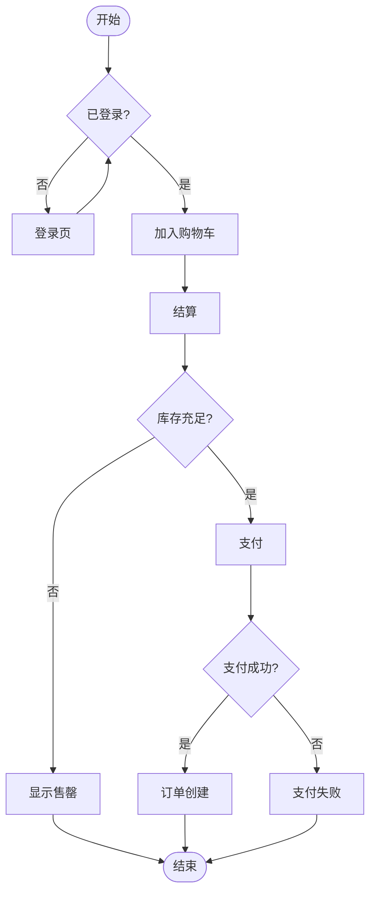

**元素**：
- 起止节点
- 活动（圆角矩形）
- 决策（菱形）
- 并行（横线 fork / join）
- Swimlane（泳道，分组）

**何时用**：
- 业务流程梳理
- 算法步骤
- 工作流设计

---

## 3.6 组件图（Component Diagram）

**用途**：系统的高层组件 + 接口。

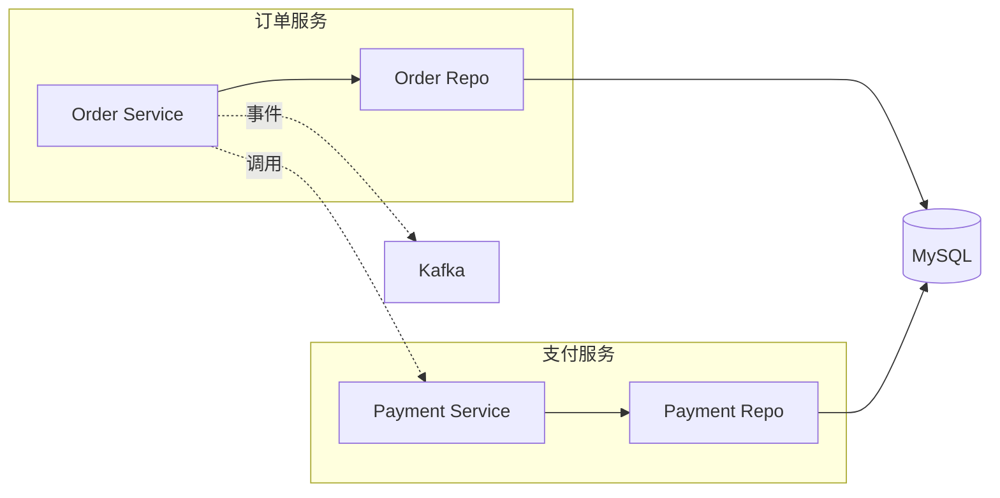

**何时用**：
- 系统架构图
- 微服务拓扑
- 模块依赖图

---

## 3.7 部署图（Deployment Diagram）

**用途**：物理部署 + 节点。

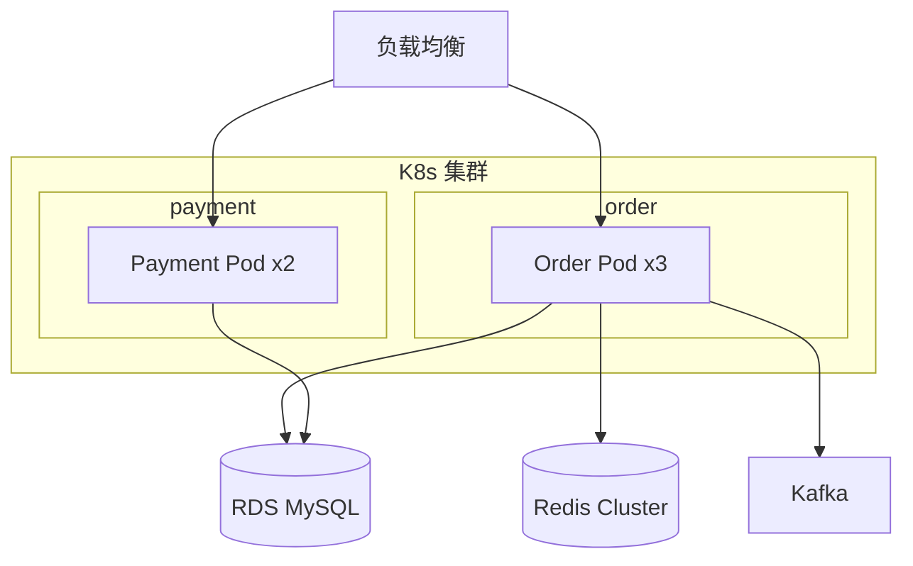

**何时用**：
- 容量规划
- 运维文档
- 故障复盘（影响范围）

---

## 3.8 UML 6 大常用速查

```
╔═══════════════╦══════════════════╗
║ 图            ║ 何时用            ║
╠═══════════════╬══════════════════╣
║ 类图          ║ 领域模型 / 接口   ║
║ 时序图 ★      ║ 接口流程 / 故障  ║
║ 状态图 ★      ║ 状态机           ║
║ 用例图        ║ 业务能力         ║
║ 活动图        ║ 业务流程         ║
║ 组件图        ║ 微服务拓扑       ║
║ 部署图        ║ 物理部署         ║
╚═══════════════╩══════════════════╝
```

**互联网最常用**：**时序图 + 状态图 + 类图 + 部署图**。

---

# 四、DFD - 数据流图

**结构化分析时代的产物**，现在仍在业务流程分析中用。

**4 元素**：
```
○ 处理过程   ↗
□ 外部实体  → 加工 → 数据存储
═ 数据存储   ↘
→ 数据流
```

**示例**：订单系统 DFD（Level 1）

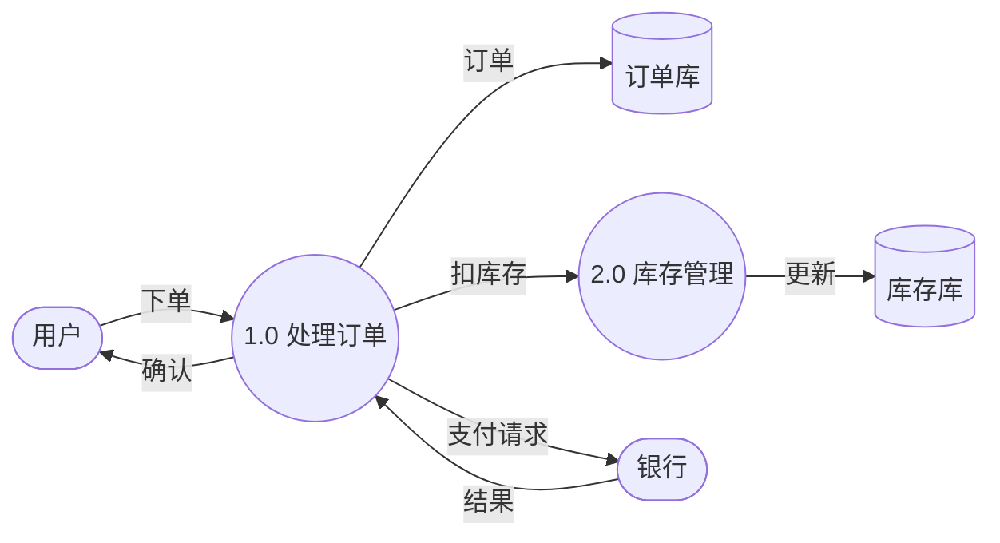

**层次化**：
- Context（Level 0）：系统作为黑盒 + 外部实体
- Level 1：主要处理过程
- Level 2+：每个 1.0 / 2.0 展开

**与 UML 活动图区别**：
- DFD 强调**数据**（什么数据流到哪）
- 活动图强调**控制流**（什么活动接什么活动）

**何时用**：
- 业务流程梳理
- 数据流追溯（敏感数据 / GDPR 合规）
- ETL 设计

---

# 五、结构图（Structure Chart）

**结构化设计**的核心图，表示模块调用 + 数据传递。

```
┌─────────────┐
│  Main       │
└──┬──────┬───┘
   │      │
┌──▼──┐ ┌─▼──┐
│Read │ │Write│
└─────┘ └────┘
```

**与 UML 类图区别**：
- 结构图：**面向过程**（函数模块）
- 类图：**面向对象**（类 + 关系）

**Go 中的应用**：
- 大型函数库的依赖关系
- 包内调用图
- `go-callvis` 工具自动生成

**何时用**：
- 遗留 C/Cobol 项目
- 函数式分解
- 模块依赖分析

---

# 六、Petri 网

**用途**：建模并发系统（多个并发流程的同步 / 资源争用）。

**4 元素**：
- **库所**（圆）：状态 / 条件 / 资源
- **变迁**（矩形）：事件 / 操作
- **令牌**（黑点）：表示状态
- **弧**（箭头）：连接库所和变迁

**示例**：生产者-消费者

```
     ┌─token─┐         ┌────┐         ┌──token──┐
     │  生产 │ ─────►   │ T1 │  ────►  │  缓冲区 │
     │  就绪 │         │生产│         │         │
     └───────┘         └────┘         └────┬────┘
                                           │
                                           ▼
                                       ┌────┐         ┌─────────┐
                                       │ T2 │  ────►  │ 消费就绪 │
                                       │消费│         └─────────┘
                                       └────┘
```

**变迁触发规则**：
- 变迁前置库所都有 token → 可触发
- 触发后：前置库所 token 减 1，后置库所 token 加 1

**用途**：
- 并发系统建模（如生产消费 / 多线程）
- 协议设计
- 工作流引擎
- 学术研究偏多

**互联网行业用得少**，**了解即可**。

**Go 实战**：
- channel + select 的语义可用 Petri 网描述
- 但实际写代码不需要 Petri 网

---

# 七、流程图（Flowchart）

**最常用 + 最简单**。

**元素**：
```
○ / ([])  开始 / 结束
□         处理
◇         判断
□         输入输出
↗         流程
```

**示例**：登录流程
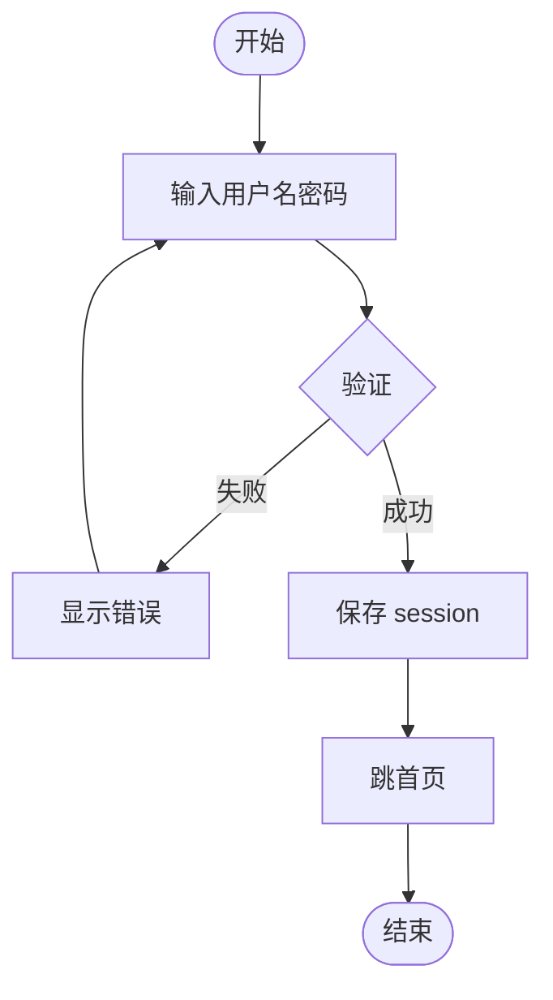

**何时用**：
- 简单流程
- 算法步骤
- 文档插图

**vs UML 活动图**：
- 流程图更通用
- 活动图更规范（有泳道 / 并行 / 对象流）

---

# 八、决策表（Decision Table）

**用途**：表示复杂条件组合 + 对应动作。

**示例**：保险费率

```
条件\规则:           R1     R2     R3     R4
─────────────────────────────────────────
年龄 < 25            Y      Y      N      N
是否有事故记录        Y      N      Y      N
─────────────────────────────────────────
动作:
基础费率              ✓      ✓      ✓      ✓
加 50%               ✓                     
加 30%                              ✓      
加 20%                       ✓             
```

**优势**：
- 比 if-else 嵌套清晰
- 易发现遗漏（条件组合穷举）
- 测试用例直接对应

**Go 实战**：
```go
// 决策表对应的 Go 实现
type RateRule struct {
    Young, HasAccident bool
    Multiplier         float64
}

var rules = []RateRule{
    {Young: true,  HasAccident: true,  Multiplier: 1.5},
    {Young: true,  HasAccident: false, Multiplier: 1.2},
    {Young: false, HasAccident: true,  Multiplier: 1.3},
    {Young: false, HasAccident: false, Multiplier: 1.0},
}

func CalcRate(base float64, young, accident bool) float64 {
    for _, r := range rules {
        if r.Young == young && r.HasAccident == accident {
            return base * r.Multiplier
        }
    }
    return base
}
```

**何时用**：
- 业务规则复杂（保险 / 风控 / 折扣）
- 条件组合多
- 测试用例驱动设计

---

# 九、决策树（Decision Tree）

类似决策表但**层级化**：

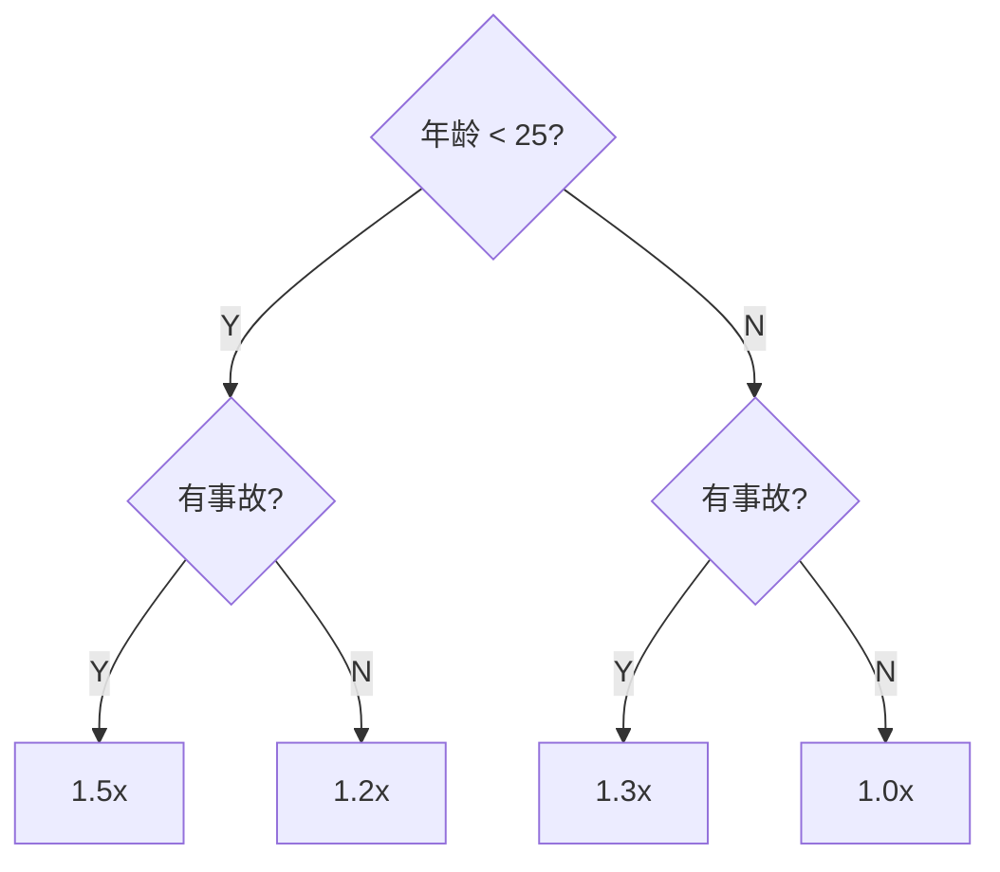

**与决策表区别**：
- 决策表：扁平所有条件
- 决策树：分层条件

**适合**：条件有自然层级。

---

# 十、其他相关图

## 10.1 ER 图（Entity-Relationship）

数据库设计标配：

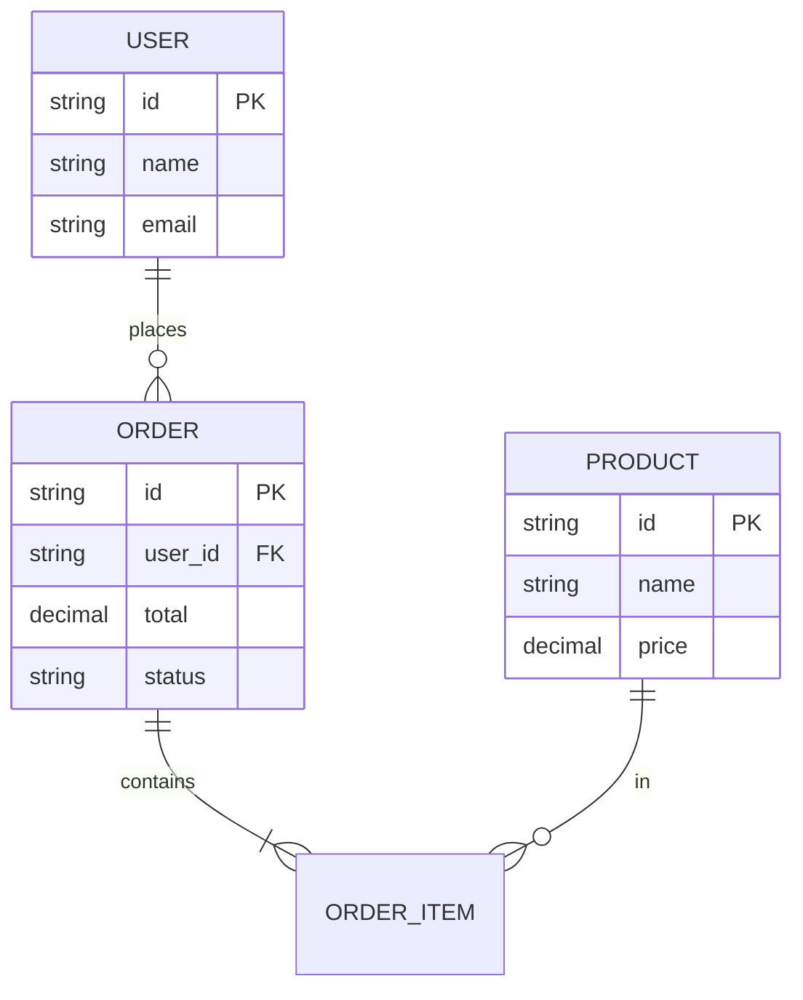

## 10.2 C4 模型（现代架构图）

```
Level 1: Context（系统与外部）
Level 2: Container（容器：服务/DB/Cache）
Level 3: Component（组件）
Level 4: Code（类）
```

**比 UML 更现代化**，互联网常用。

## 10.3 思维导图（Mindmap）

知识结构 / 头脑风暴：

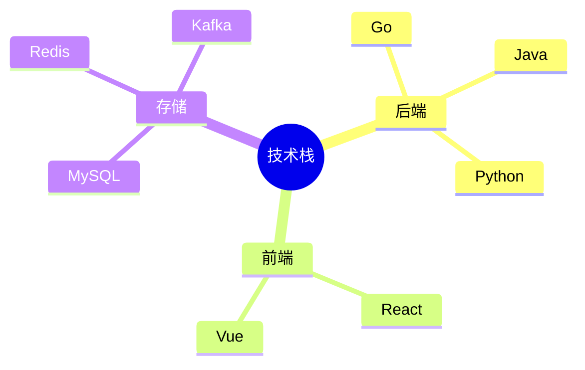

## 10.4 甘特图（Gantt）

项目计划：

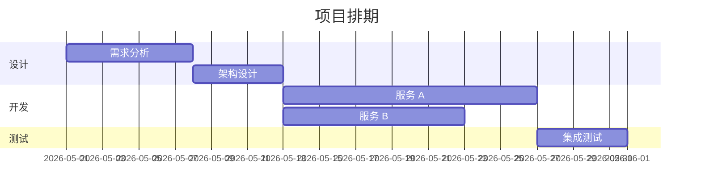

---

# 十一、工具链

## 11.1 文本生成图（推荐）

```
Mermaid       ★★★★★（GitHub / GitLab 原生支持）
PlantUML      ★★★★（功能全，但需要 Java）
Graphviz/dot  ★★★★（C 写的，快）
draw.io       ★★★★（拖拽，可导出）
```

## 11.2 代码生成图

```
go-callvis    Go 函数调用图
godepgraph    Go 包依赖图
goda          Go module 分析
PlantUML 类图  ↔ 代码（双向）
```

## 11.3 在线工具

```
- mermaid.live
- plantuml.online
- excalidraw.com（手绘风格，会议白板）
- diagrams.net（draw.io 在线版）
- TLDraw
```

## 11.4 IDE 集成

- VSCode：Mermaid Preview / PlantUML
- GoLand：UML 类图自动生成
- Obsidian：内置 Mermaid

## 11.5 推荐做法

```
日常文档      Mermaid（直接 GitHub 渲染）
正式架构图    draw.io / Excalidraw
快速白板      Excalidraw
代码生成      go-callvis / godepgraph
```

---

# 十二、何时画什么图速查

```
情境                    推荐图
─────────────────────────────────
设计接口                时序图
设计领域模型            类图
设计状态机              状态图
设计业务流程            活动图 / 流程图
分析数据流              DFD
微服务拓扑              组件图
物理部署                部署图
DB 设计                 ER 图
项目计划                甘特图
头脑风暴                思维导图
复杂规则                决策表
故障排查                时序图（链路追踪）
代码依赖                类图 / 依赖图
架构总览                C4
```

---

# 十三、画图原则

## 13.1 好图的标准

```
□ 一图说一件事（不要塞太多）
□ 抽象层次一致（不要详略不一）
□ 关键流程突出（次要的虚化）
□ 标注清晰（图例 / 注释）
□ 一目了然（< 30 秒看懂）
```

## 13.2 反模式

```
❌ 一张图 100 个元素
❌ 没有图例 / 标题
❌ 颜色乱（无规律）
❌ 抽象层次混（高层 + 实现细节同图）
❌ 不更新（图过时但还挂在文档里）
```

## 13.3 工程师必备 5 张图

8 年工程师离开时，**这 5 张图 必须留下**：

```
1. 系统架构图（C4 Container 级别）
2. 核心链路时序图（最重要的 1-3 条业务）
3. 关键状态机图（订单 / 工单等）
4. 数据库 ER 图
5. 部署图（K8s / 服务器）
```

---

# 十四、面试 / 实战高频题

## Q1: 你怎么写技术文档？

**答**：
- README：项目用途 + 快速开始
- 架构图（C4 / Container）
- 核心链路时序图
- 关键 API 文档
- 部署文档

## Q2: 设计一个新功能，你怎么开始？

**答**：
- 用例图 / user story（业务）
- 时序图（接口流程）
- 类图 / 领域模型
- 状态图（如有状态）
- 评审 → 编码

## Q3: 故障复盘怎么写？

**答**：
- 时序图还原故障链路
- 关键时间节点
- 根因分析（5 Whys）
- 修复方案
- 长期改进

## Q4: 你最常用什么图？

**答**：
- 时序图（API 设计 / 故障）
- 状态图（业务状态机）
- 架构图（C4）
- 类图（领域建模）

## Q5: UML 还有用吗？

**答**：
- 全套 UML 已少用
- 但**时序图 / 状态图 / 类图 / 部署图** 是日常工具
- 核心是**沟通而非形式**
- 用 Mermaid 文本化更适合现代开发

## Q6: 决策表 vs if-else？

**答**：
- 简单条件 if-else
- 复杂条件组合用决策表（避免遗漏 / 易测试）
- 业务规则引擎（如风控 / 营销）常用

## Q7: 你画图用什么工具？

**答**：
- 日常：Mermaid（GitHub 直接渲染）
- 正式：draw.io / Excalidraw
- 代码生成：go-callvis

## Q8: 部署图必须画吗？

**答**：
- 单机 / 简单部署不必
- 微服务 / K8s / 多机房**必须画**
- 故障复盘 / 容量规划必备

---

# 十五、推荐阅读

```
经典:
  □ 《UML 精粹》Martin Fowler
  □ 《UML 用户指南》Grady Booch
  □ 《敏捷软件开发：原则、模式与实践》Robert Martin

现代:
  □ 《C4 model》Simon Brown - https://c4model.com
  □ 《Software Architecture: The Hard Parts》

工具:
  □ Mermaid 官方文档
  □ PlantUML 官方文档
  □ Excalidraw 官方文档
```

---

# 十六、面试 / 答辩加分点

- 知道 **UML 6 大常用图**（类 / 时序 / 状态 / 用例 / 活动 / 组件）
- 互联网最常用 **时序 + 状态 + 类 + 部署**
- 用 **C4 模型** 替代纯 UML 架构图（更现代）
- **Mermaid** 是日常文档首选（GitHub 原生）
- **决策表** 处理复杂规则比 if-else 清晰
- **DFD** 结构化遗产，仍用于业务流程
- **Petri 网** 学术为主，工业少
- 画图原则：**一图一件事 + 层次一致 + 30 秒看懂**
- 8 年工程师必备 **5 张核心图**（架构 / 时序 / 状态 / ER / 部署）
- 图的目的是**沟通**而非展示工具熟练度
