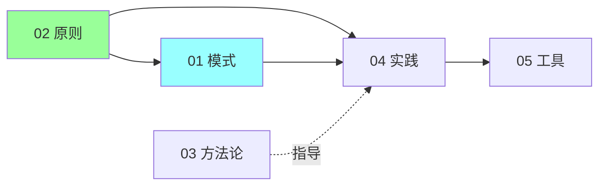

# 软件匠艺（Software Craftsmanship）

> 资深工程师必修：设计模式 / 设计原则 / 方法论 / 工程实践 / 建模工具
>
> 来源：Bob 大叔《Clean Architecture》《Agile Software Development》、GoF 设计模式书、POSA 系列
>
> Go 实战导向：每个概念都有 Go 代码 / 标准库 / 主流项目（K8s / etcd / Kratos / gRPC / Kitex）真实案例

## 目录

| # | 文件 | 涵盖 |
| --- | --- | --- |
| 01 | [设计模式](01-design-patterns.md) | GoF 23 模式（创建/结构/行为）+ POSA 架构模式 + Go 实战 + 记忆口诀 + Go 主流项目案例 |
| 02 | [设计原则](02-design-principles.md) | SOLID 五原则 + 组件设计 6 原则 + DRY/KISS/YAGNI/LoD/Fail Fast |
| 03 | [方法论](03-methodologies.md) | 瀑布 / V 模型 / XP / Scrum / 精益 / 看板 / DevOps 对比 + 决策树 |
| 04 | [工程实践](04-practices.md) | TDD / OOD / 结构化 / CI/CD / 结对编程 + Go 实战 |
| 05 | [建模工具](05-modeling-tools.md) | UML 6 大图 / DFD / 结构图 / Petri / 决策表 / C4 模型 / 工具链 |

## 学习路径



**推荐顺序**：
1. 先看 **02 设计原则**（SOLID + 6 原则 = 思维基础）
2. 再看 **01 设计模式**（原则的具体应用）
3. 接着 **04 工程实践**（TDD / CI 等动手能力）
4. 然后 **05 建模工具**（沟通表达）
5. 最后 **03 方法论**（团队协作框架）

## 跨章高频题

### 设计模式
- Go 高频用的 5 个模式？（→ 01）
- Decorator vs Proxy vs Adapter 区别？（→ 01）
- Option Pattern 是什么？（→ 01）
- 中间件 / Interceptor 是什么模式？（→ 01）

### 设计原则
- SOLID 是什么？口诀？（→ 02）
- DIP 在 DDD 怎么体现？（→ 02 + 09-ddd）
- 接口应该多大？（→ 02）
- ISP 在 Go 标准库范例？（→ 02）

### 方法论
- 你团队用什么方法论？（→ 03）
- Scrum vs 看板怎么选？（→ 03）
- TDD / CI 来自哪个方法？（→ 03 + 04）

### 工程实践
- TDD 三步骤？（→ 04）
- Pair Programming 优劣？（→ 04）
- Trunk-Based Development？（→ 04）

### 建模工具
- 工程师必备 5 张图？（→ 05）
- C4 模型？（→ 05）
- 决策表 vs if-else？（→ 05）

## 与其他模块的关系

```
01 设计模式  ←→  09-ddd（聚合根 = State + 充血模型）
02 设计原则  ←→  09-ddd（DIP 落地）/ 13-engineering（命名规范）
03 方法论    ←→  15-leadership（TL / 项目管理）
04 工程实践  ←→  13-engineering（CR / 测试 / 可观测）
05 建模工具  ←→  全模块（架构图 / 时序图都用）
```

## 记忆口诀

```
GoF 23 模式:
  创建 5: 单工抽建原
  结构 7: 适桥组装外亨代
  行为 11: 责命迭中备观状策模访解

SOLID:
  单 / 开 / 里 / 接 / 依

组件 6 原则:
  内聚 3: 复一发 / 共同闭 / 共同用
  耦合 3: 无环依 / 稳定依 / 稳定抽

UML 6 大图:
  类 / 时序 / 状态 / 用例 / 活动 / 组件
```

## 设计原则

- **图文并茂**，关键概念用 Mermaid
- **每篇独立可读**
- **Go 实战导向**，每个模式 / 原则配 Go 代码
- **真实项目案例**：标准库 + K8s / etcd / Kratos / gRPC / Kitex
- **记忆口诀** 帮助快速回忆
- **面试题驱动** + 加分点

## 资深工程师必备清单

```
设计模式:
  □ 能背 GoF 23 + 口诀
  □ 知道 Go 高频 8 个 + 真实项目位置
  □ 能区分易混淆的 10 对

设计原则:
  □ 能讲 SOLID 含义 + Go 实战
  □ 能讲组件 6 原则
  □ 知道 DRY / KISS / YAGNI

方法论:
  □ Scrum 3-5-3 能讲
  □ TDD / CI / 结对来自 XP
  □ 看板 vs Scrum 区别

实践:
  □ TDD 红绿重构循环
  □ CI/CD 完整链路
  □ Code Review 最佳实践

工具:
  □ 用 Mermaid 画时序 / 状态 / 类图
  □ 知道 C4 模型
  □ 决策表处理复杂规则
```
