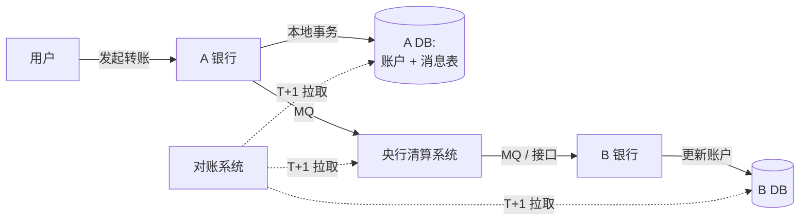

# 分布式事务（小米信息部团队）- 精读笔记

> 来源：[分布式事务，这一篇就够了](https://xiaomi-info.github.io/2020/01/02/distributed-transaction/)
> 作者：李文华，小米信息技术部海外商城组
> 原文发布：2020-01-02
> 阅读时间：2026-05-10
> 主题分类：分布式 / 事务

---

## 一、文章核心提炼

### 文章结构（5 大块）

```
1. 基础理论        → ACID / CAP / BASE / 强一致 / 弱一致 / 最终一致 / 柔性事务 / 幂等
2. 应用场景        → 跨行转账 / 下单扣库存 / 同步超时（支付回调）
3. 5 种解决方案    → 2PC(XA) / TCC / 本地消息表 / 可靠消息最终一致性 / 最大努力通知
4. 实战            → 蚂蚁 DTS / 阿里 RocketMQ / 小米海外商城实战
5. 总结            → "能不用就尽量不用"
```

### 5 种方案对比

| 方案 | 一致性 | 性能 | 业务侵入 | 框架要求 | 典型应用 |
| --- | --- | --- | --- | --- | --- |
| **2PC/XA** | 强 | 低（同步阻塞）| 低 | DB 支持 XA | 蚂蚁 DTS、跨库事务 |
| **TCC** | 强 | 中 | **高**（3 接口 Try/Confirm/Cancel）| Seata / Hmily | 资金类（不推荐推广，难落地）|
| **本地消息表** | 最终 | 高 | 中（业务表+消息表+脚本+MQ）| 通用 | 跨行转账、订单状态推送 |
| **可靠消息最终一致性** | 最终 | 高 | 低（事务消息）| **仅 RocketMQ** | 注册发邮件、发券 |
| **最大努力通知** | 最终（可丢）| 高 | 极低 | 通用 | 支付回调、跨系统数据同步 |

### 5 个方案各自核心机制（一行）

| 方案 | 核心机制 |
| --- | --- |
| **2PC** | prepare 阶段所有参与者投票 → commit 阶段统一提交 / 回滚 |
| **TCC** | Try 预留资源 → Confirm 真正提交 / Cancel 释放预留 |
| **本地消息表** | 业务表 + 消息表（**同事务**）→ 后台脚本扫表 → MQ → 消费方 |
| **可靠消息（RocketMQ）** | half message → 本地事务 → commit/rollback → broker 主动回查 |
| **最大努力通知** | 异步重试 N 次，**接受最终失败**（业务不影响主流程）|

### 4 个关键结论

1. **2PC 4 大问题**：同步阻塞 / 单点故障 / 数据不一致 / 不确定性
2. **TCC 不推荐推广**：业务接口要拆 3 个，研发成本极高
3. **可靠消息最终一致性 = RocketMQ 事务消息**（市面只有这家原生支持）
4. **最大努力通知 ≠ 不可靠**：用于"被动方失败不影响主动方"的场景（支付回调最经典）

---

## 二、自考清单（7 题）

> 先自己答，再看下面的标准答案。

1. 强一致 / 弱一致 / 最终一致 有什么区别？各举一个实际场景。
2. CAP 三选二选哪两个？BASE 是 CAP 的补充还是替代？
3. 用一个具体故障序列说清 2PC 的"数据不一致"是怎么发生的。
4. TCC 看似强一致 + 性能 OK，为什么业界普遍不推荐推广？
5. 本地消息表 vs RocketMQ 事务消息，本质区别是什么？怎么选？
6. 最大努力通知的前置假设是什么？重试 N 次都失败怎么办？
7. 设计一个跨行转账系统，用哪种分布式事务方案？为什么不用 TCC / 不用 2PC？

---

## 三、标准答案（四段式）

---

### Q1：强一致 / 弱一致 / 最终一致 区别

**一句话**：**强一致 = 写后立刻读到新值；弱一致 = 不保证什么时候读到；最终一致 = 一段时间后保证读到。**

**分层展开**：

| 类型 | 定义 | 实现机制 | 用户感知 |
| --- | --- | --- | --- |
| 强一致 | 任何节点任何时刻读到的都是最新写 | Paxos / Raft / 同步复制 / 锁 | 用户写 X → 立刻读到 X |
| 弱一致 | 写后多久能读到不保证，可能永远读不到 | 异步复制无重试 | 写 X → 读可能是 Y / 旧值 / 任何状态 |
| 最终一致 | 经过有限时间，所有节点会收敛到一致 | 异步复制 + 重试 + 对账 | 写 X → 几 ms 到几 s 后读到 X |

**实际场景举例**：

```
强一致:
  转账场景。A 给 B 转 100 元，A 余额减 100 后，B 立刻能查到 +100。
  否则用户会以为钱丢了。
  → MySQL 单库事务、etcd / ZK 配置中心

最终一致:
  发朋友圈。你发了一条，好友 5 秒后才看到。这不影响业务，可接受。
  → MySQL 主从复制（Seconds_Behind_Master）、CDN 缓存

弱一致:
  视频播放推荐。你点赞了视频 X，下次推荐可能没考虑这次点赞。
  → DNS 缓存、广告投放（容忍部分丢失）
```

**边界 / 代价**：

```
强一致 → 性能差（网络往返 + 锁等待）
最终一致 → 用户可能看到"不一致窗口"（几秒 - 几分钟）
弱一致 → 业务必须容忍数据丢失，少用
```

**资深加分**：业内大部分业务用"**核心强一致 + 边缘最终一致**"组合。比如电商：库存扣减强一致（防超卖），订单通知最终一致（用 MQ）。

**仓库参考**：[../../06-distributed/01-theory.md](../../06-distributed/01-theory.md)

---

### Q2：CAP / BASE

**一句话**：**P 不可放弃（网络分区必然发生），所以实际只能 CP 或 AP 二选一。BASE 是 AP 系统的工程化指导，是补充不是替代。**

**分层展开**：

```
CAP 真相:
  C: 一致性
  A: 可用性
  P: 分区容错

  常见错误答法："选 AP 或 CP 或 CA"
  ✗ "CA" 不存在 —— 网络分区是分布式系统的客观现实，不能"放弃"
  ✓ 实际：P 必选 → CP vs AP 二选一

CP 系统:
  分区时为保一致性，停止部分服务
  例: ZooKeeper / etcd / HBase / Redis Cluster (在多数派要求下)

AP 系统:
  分区时为保可用性，接受短暂不一致
  例: Cassandra / DynamoDB / Eureka / DNS

BASE 是什么:
  B: Basically Available  基本可用（核心保留，边缘降级）
  S: Soft State           软状态（中间状态可接受）
  E: Eventual Consistency 最终一致

BASE vs ACID:
  ACID 是数据库强一致事务的属性
  BASE 是分布式 AP 系统的工程化思路
  → 不是替代，是 AP 场景下"如何做才靠谱"的指导
```

**边界 / 代价**：

```
CAP 是简化模型:
  - 实际系统不是非黑即白
  - PACELC 是更精确的模型: 没分区 (E) 时也要在 Latency 和 Consistency 间选
  - 一个系统可以"分区时 CP，无分区时低延迟优先"

BASE 不是放弃一致:
  - 而是用"最终一致 + 业务幂等 + 对账"达到工程上的可用
```

**实战**：

```
"我们订单系统是 CP 选择（防超卖必须强一致），
 但通知子系统是 AP（用户晚 3 秒收到推送可接受）。
 BASE 思想用在通知上：MQ 异步 + 业务幂等 + 失败重试 + 对账"
```

**资深加分**：能讲 **PACELC**（CAP 的扩展，No-Partition 时 Else Latency vs Consistency）。

**仓库参考**：[../../06-distributed/01-theory.md](../../06-distributed/01-theory.md)

---

### Q3：2PC 数据不一致的故障序列

**一句话**：**Coordinator 在第二阶段 commit 信号发出过程中宕机，部分参与者收到 commit、部分没收到 → 不一致。**

**完整故障序列**：

```
背景: 跨库转账 A → B
  Coordinator (TM)
  Participant 1: A 银行 DB
  Participant 2: B 银行 DB

时间线:

T0  Coordinator → P1: "Prepare?"
T1  P1 → Coordinator: "Yes" (A 余额已锁，写好 redo)
T2  Coordinator → P2: "Prepare?"
T3  P2 → Coordinator: "Yes" (B 余额已锁，写好 redo)

T4  Coordinator 决定 Commit
    Coordinator → P1: "Commit"
    P1 收到，提交事务，A 扣款成功

T5  Coordinator 准备发给 P2 但崩溃了！
    P2 没收到 commit 信号，仍在等待

T6  P1 已经 commit (A -100)
    P2 在 prepare 状态等待 (B 锁着，不能读不能写)

T7  Coordinator 重启 / 选新 Coordinator
    它不知道 T4 时的决策是 commit 还是 rollback
    P2 一直阻塞...

最终结果: A 扣了 100，B 没加 100，钱凭空消失
```

**边界 / 代价**：

```
为什么不能简单"回滚 P1"？
  P1 已经 commit，事务已经持久化
  无法逆向恢复（除非业务层补偿）

为什么 3PC 也救不了完全？
  3PC 加了 PreCommit 阶段降低概率，但极端场景仍不一致
  本质问题: 没有共识算法（Paxos/Raft）

真正的解：
  - 业务层最终一致（TCC / Saga）
  - 或共识协议（Spanner 用 Paxos 解决）
```

**资深加分**：能联想到"Paxos / Raft 才是真正解决 2PC 不一致问题的根本"。

**仓库参考**：[../../06-distributed/03-transaction.md 第三节](../../06-distributed/03-transaction.md)

---

### Q4：TCC 工程难点（业界为什么不推广）

**一句话**：**TCC 不只是"3 接口侵入"，还有空回滚 / 悬挂 / 幂等 / 网络异常补偿 4 大坑，业务方推不动。**

**5 大工程难点**：

```
1. 接口拆 3 个 → 研发成本 3x
   原本 1 个 deductBalance() 接口
   现在拆: tryDeduct() / confirmDeduct() / cancelDeduct()
   每个接口要单独测试 / 单独 review

2. 空回滚（Empty Rollback）
   场景: Try 还没执行（网络抖动），Cancel 先到了
   坑: 直接执行 Cancel 会释放"从未预留过"的资源 → 数据错乱
   解: 业务记录"事务已 Try" 标记，Cancel 时检查
   实现: 加事务记录表

3. 悬挂（Suspension）
   场景: Cancel 已执行，迟到的 Try 又到了
   坑: Try 重新预留资源，但 Confirm 永不会到 → 资源永远占着
   解: Cancel 时记录"事务已结束"，Try 检查后拒绝

4. 幂等
   Try / Confirm / Cancel 都可能重发
   每个都要业务实现幂等
   实现: 业务 ID + 状态机

5. 补偿失败如何处理
   Cancel 失败怎么办？
   重试 → 还失败？
   人工介入？告警体系 / Runbook 不可少

→ 加起来工程量 = 普通接口的 5-10 倍
→ 业务方/PM 一听就摇头："不做这个需求了"
```

**边界 / 代价**：

```
Seata TCC 的实际落地难点:
  - 需要 TC (Transaction Coordinator) 集群运维
  - 全公司业务接口大改，推动阻力大
  - 出问题排查链路长（TC + 多个 RM 日志）
  - 性能损失 30-50%

真实业内做法:
  能用最终一致就不用 TCC:
  - 90% 场景 → 本地消息表 / 事务消息 / Saga
  - 资金类 → 实时对账兜底
  - 极少 5% 场景 → TCC（且通常是新项目从一开始就引入）
```

**资深加分**：能说出 TCC 三大坑（空回滚 / 悬挂 / 幂等）的具体场景和解法。

**仓库参考**：[../../06-distributed/03-transaction.md 第五节 + 坑 2](../../06-distributed/03-transaction.md)

---

### Q5：本地消息表 vs RocketMQ 事务消息

**一句话**：**两者本质区别是"事务的控制点在哪"——本地消息表把控制点放 DB（事务表），事务消息把控制点放 MQ Broker（half message + 回查）。**

**对比详解**：

```
本地消息表（业务侧主导）:

  业务表 + 消息表 同事务写入
  ↓
  后台 Worker 扫消息表
  ↓
  发送到 MQ
  ↓
  消费方处理 + ACK
  ↓
  Worker 标记消息已发

控制点: DB 事务（ACID）保证业务和消息原子
失败兜底: Worker 扫表重试

事务消息（MQ 侧主导，仅 RocketMQ）:

  Producer → MQ 发 half message（半消息，对消费者不可见）
  ↓
  Producer 执行本地事务
  ↓
  本地事务成功 → MQ 发 commit / 失败 → MQ 发 rollback
  ↓
  MQ 提交 → 消费者可见

  超时未收到 commit/rollback?
  → MQ broker 主动回查 Producer 接口
  → 业务实现 checkLocalTransaction() 接口

控制点: MQ Broker（half message 状态机）
失败兜底: Broker 主动回查
```

**关键差异表**：

| 维度 | 本地消息表 | RocketMQ 事务消息 |
| --- | --- | --- |
| 控制点 | DB | MQ Broker |
| 实现复杂度 | 低（DB+定时任务） | 中（实现回查接口） |
| 性能 | 中（多一次 DB 写）| 高（无额外 DB 操作）|
| 框架依赖 | 通用（任何 MQ）| 仅 RocketMQ |
| 调试 | 简单（看 DB 表）| 复杂（要看 Broker 日志）|
| 消息时效性 | 取决于扫表频率 | 实时 |
| 业务侵入 | 中（要建消息表）| 低 |

**边界 / 代价**：

```
怎么选:
  有 RocketMQ + 业务能实现回查接口 → 事务消息（首选）
  没有 RocketMQ（用 Kafka）→ 本地消息表（通用方案）
  极简业务、不想引入 MQ → 本地消息表 + 定时器自己消费

CDC 模式（更现代）:
  binlog → Canal/Debezium → MQ
  完全无侵入，但运维 binlog 系统复杂
  → 大厂常用方案
```

**资深加分**：能引申到 CDC 模式（binlog 订阅）这种"业务零侵入"方案。

**仓库参考**：
- [../../06-distributed/03-transaction.md 第七 / 八节](../../06-distributed/03-transaction.md)
- [../../05-message-queue/09-transaction-message-outbox.md](../../05-message-queue/09-transaction-message-outbox.md)

---

### Q6：最大努力通知的边界

**一句话**：**最大努力通知的前提是"被动方失败不影响主动方业务"，最终失败必须有对账兜底。**

**4 大前置假设**（少一个都不能用）：

```
1. 被动方失败不影响主动方业务
   ✓ 正确场景: 支付回调通知订单状态
     → 即使订单服务挂了几小时，支付方账已到，资金没问题
     → 后续对账修复
   ✗ 错误场景: 转账时通知 B 银行加钱
     → B 没收到通知 = 钱凭空消失，必须强一致

2. 业务侧能容忍最终失败
   ✓ 正确: 优惠券发放（极端情况下补发即可）
   ✗ 错误: 资金类、库存类（不能"算了"）

3. 有对账机制兜底
   定时对账：T+1 / 实时
   不对账 = 最大努力 = "最大努力丢失"

4. 被动方接口幂等
   重试 N 次必然有重复，业务必须幂等
```

**重试 N 次失败后怎么办**：

```
方案 1: 死信队列 (DLQ) + 人工
  把失败的消息进 DLQ
  人工查看 / 修复 / 重发
  适合: 量小但需要兜底

方案 2: 对账系统
  定时拿主动方数据和被动方数据对比
  发现不一致 → 修复
  这是真正的兜底

方案 3: 业务降级
  可以接受"少数失败"的业务（比如统计数据）
  直接报警 + 接受
```

**边界 / 代价**：

```
不能用最大努力通知的场景:
  ❌ 资金类（必须强一致 / 实时对账）
  ❌ 库存类（防超卖必须实时）
  ❌ 用户敏感操作（密码修改通知）
  ❌ 法律合规要求（证据链不能断）

正确实战做法:
  最大努力通知 + 对账兜底 = 大多数业务的最优解

  例: 支付系统
    L1: 同步通知（最大努力，N 次重试）
    L2: 实时对账（5 分钟对一次）
    L3: T+1 全量对账（每天凌晨）
    L4: 人工兜底队列
```

**资深加分**：能说出"最大努力通知 + 对账"是金融业务的标准做法。

**仓库参考**：
- [../../06-distributed/03-transaction.md 第九 / 十节](../../06-distributed/03-transaction.md)
- [../../03-mysql/17-consistency-reconciliation.md](../../03-mysql/17-consistency-reconciliation.md)

---

### Q7：跨行转账系统设计（综合题）

**一句话答案**：**用"本地消息表 + MQ + 业务幂等 + 实时对账 + T+1 全量对账"，不用 TCC（业务侵入大、银行间不可控），不用 2PC（跨行 DB 不可能用 XA）。**

**完整方案**：

#### Step 1：理解约束

```
跨行转账特点:
  - 跨组织（A 银行 / B 银行 / 央行清算）
  - 涉及资金（必须最终一致 + 不能丢）
  - 实时性要求高（用户等结果）
  - 业务复杂（手续费 / 限额 / 反洗钱 / 风控）
  - 监管严（每笔有审计要求）

→ 不可能 2PC（跨组织谁当 Coordinator？）
→ 不能 TCC（B 银行不会改接口配合 Try/Confirm）
→ 必须最终一致 + 强对账兜底
```

#### Step 2：方案选型

```
核心方案: 本地消息表 + 央行清算系统 + 实时对账

为什么不用 RocketMQ 事务消息？
  - 跨组织系统，不能依赖单一 MQ
  - 央行清算才是"事实真相"
```

#### Step 3：架构



#### Step 4：详细流程

```
1. 用户发起转账（A → B，1万元）

2. A 银行本地事务（强一致）:
   BEGIN TX
     - 校验余额 / 限额 / 风控
     - 扣款 A: balance -= 10000
     - 写流水: 转账中（PROCESSING）
     - 写消息表: target=B, amount=10000, status=PENDING
   COMMIT

3. 后台 Worker 扫消息表:
   - 取 status=PENDING 的消息
   - 调央行清算系统接口（同步 / MQ）
   - 成功 → 标记 SENT
   - 失败 → 重试（指数退避，最多 N 次）

4. 央行清算系统:
   - 校验合规
   - 路由到 B 银行
   - 通过专线 / 国家结算系统传递

5. B 银行接收:
   - 幂等检查（业务 ID 唯一）
   - BEGIN TX
     - 加款 B: balance += 10000
     - 写流水
   - COMMIT
   - 回调 A 银行: 收款成功

6. A 银行收到回调:
   - 更新流水: PROCESSING → SUCCESS
   - 通知用户

7. 异常路径:
   - B 银行失败 → 通知 A 银行回滚（compensate）
   - A 银行: 加款回 user A，流水标 FAILED
```

#### Step 5：兜底体系

```
L1 业务幂等:
  - 业务订单号 + 唯一索引（防重复扣款）
  - 状态机严格（PROCESSING 只能 → SUCCESS / FAILED）
  - 所有 UPDATE 带 WHERE status=expected

L2 实时对账:
  - 5 分钟对账：A 流水 vs 央行流水 vs B 流水
  - 不一致 → 立即告警 + 进修复队列

L3 T+1 全量对账:
  - 每日凌晨对账三方流水
  - 自动修复 90%
  - 10% 人工

L4 监管 / 审计:
  - 所有流水永久留存
  - 关键操作记审计日志
  - 外部审计接口
```

**为什么不选其他方案**：

```
❌ 2PC：
  跨组织谁当 Coordinator？央行不可能为某家银行当 TM

❌ TCC：
  B 银行不会为你改接口（搞不动跨组织）

❌ Saga：
  补偿模式可行但缺乏强一致保证
  + 央行清算本身就有标准协议（不需要 Saga）

❌ 事务消息（RocketMQ）：
  跨组织不能依赖某家 MQ

✓ 本地消息表 + MQ + 实时对账：
  通用、可控、有兜底

✓ 真实银行系统：
  其实是这套思路 + 行业标准协议（如 SWIFT、人行二代支付系统）
```

**资深加分**：

```
1. 强调"对账才是真相"
   分布式事务做得再好，最后还是靠对账兜底
   银行系统的关键是 T+1 全量 + 实时对账

2. 提"金融三件套"
   幂等 + 状态机 + 对账 = 金融业务铁三角

3. 不教条
   不一定每个场景都需要分布式事务
   能业务幂等解决就别上重锤

4. 量化数据
   央行二代支付系统支持 8000 笔/秒
   实时小额转账（IBPS）通常 5 秒内到账
   T+1 对账修复率 99.9%+
```

**仓库参考**：
- [../../06-distributed/03-transaction.md](../../06-distributed/03-transaction.md) 全章
- [../../03-mysql/17-consistency-reconciliation.md](../../03-mysql/17-consistency-reconciliation.md) 对账系统设计
- [../../03-mysql/11-order-system-design.md](../../03-mysql/11-order-system-design.md) 订单系统
- [../../14-projects/07-ecommerce-story.md](../../14-projects/07-ecommerce-story.md) 故事 3 一致性对账实战

---

## 四、我的反思 / 补充

> 文章本身偏入门，仓库已经更深。读完后我补充以下点：

### 1. 文章弱点

- 没讲 **3PC**（虽然工程几乎不用，但面试常问）
- 没讲 **Saga 模式**（长流程业务必备）
- **TCC 三大坑**（空回滚 / 悬挂 / 幂等）讲得不深
- 缺 **CDC（binlog 订阅）** 这种现代方案
- "总结"太弱，没给"何时用什么"的决策树

### 2. 关键提炼（背下来）

- **2PC 4 问**：阻塞 / 单点 / 不一致 / 不确定
- **TCC 5 难**：3 接口 + 空回滚 + 悬挂 + 幂等 + 补偿失败
- **本地消息表 vs 事务消息** 控制点：DB vs MQ
- **最大努力通知** 前提：被动方失败不影响主动方
- **金融三件套**：幂等 + 状态机 + 对账

### 3. 跨章节联系

这篇文章是"分布式事务方案目录"，要真正掌握需要联动看：

- [../../06-distributed/03-transaction.md](../../06-distributed/03-transaction.md) 全套深度
- [../../03-mysql/09-distributed-transaction.md](../../03-mysql/09-distributed-transaction.md) MySQL 视角
- [../../03-mysql/17-consistency-reconciliation.md](../../03-mysql/17-consistency-reconciliation.md) 对账兜底
- [../../05-message-queue/09-transaction-message-outbox.md](../../05-message-queue/09-transaction-message-outbox.md) MQ 视角
- [../../06-distributed/11-newsql-tcc-frameworks.md](../../06-distributed/11-newsql-tcc-frameworks.md) 框架对比

---

## 五、关联仓库章节

| 章节 | 路径 | 重点 |
| --- | --- | --- |
| 分布式事务总章 | [06-distributed/03-transaction.md](../../06-distributed/03-transaction.md) | 641 行完整方案 |
| MySQL 分布式事务 | [03-mysql/09-distributed-transaction.md](../../03-mysql/09-distributed-transaction.md) | DB 视角 |
| 一致性对账 | [03-mysql/17-consistency-reconciliation.md](../../03-mysql/17-consistency-reconciliation.md) | 对账兜底 |
| 事务消息 / Outbox | [05-message-queue/09-transaction-message-outbox.md](../../05-message-queue/09-transaction-message-outbox.md) | MQ 视角 |
| TCC 框架对比 | [06-distributed/11-newsql-tcc-frameworks.md](../../06-distributed/11-newsql-tcc-frameworks.md) | Seata / Hmily / DTM |
| 综合实战 | [10-system-design/16-high-concurrency-scenarios.md](../../10-system-design/16-high-concurrency-scenarios.md) | 场景串联 |

---

**笔记完成时间**：2026-05-10
