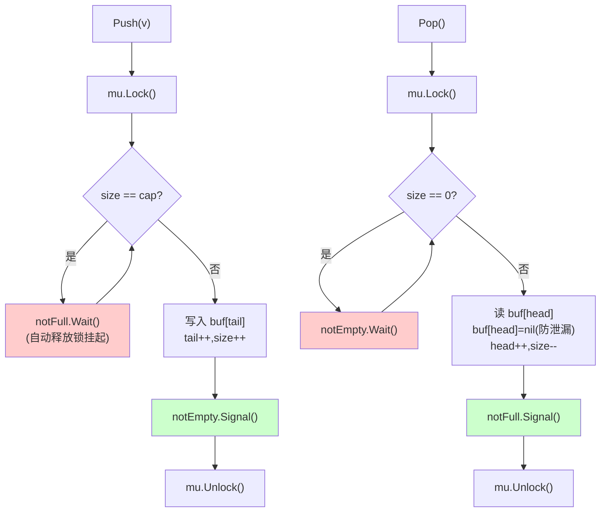

# 不用 channel 实现阻塞队列

> **题目**:用 Go 实现一个**线程安全、有界、阻塞**的队列,**不能用 channel**。
> 要求:`Push` 满则阻塞,`Pop` 空则阻塞,多 goroutine 并发安全。

这是手写题里**最高频**的一道,几乎所有大厂都问过。考点密集:
**互斥锁 + 条件变量 + 防虚假唤醒 + 环形缓冲 + 唤醒策略**。

---

## 一、考点拆解(面试官在看什么)

| 考点 | 不及格 | 合格 | 优秀 |
| --- | --- | --- | --- |
| 互斥保护 | 没加锁 | 加了 Mutex | 区分读写锁 / 锁粒度 |
| 阻塞机制 | 用 channel 偷懒 | 用 Cond | 解释 Cond vs busy-loop |
| 唤醒条件 | 一个 Cond 都用 | **两个 Cond**(notFull / notEmpty)| 解释为什么不能共用 |
| 防虚假唤醒 | `if` 判断 | **`for` 循环** | 能讲清虚假唤醒来源 |
| 数据结构 | `append` + `slice[1:]` | **环形缓冲** | 解释 GC / 内存复用 |
| Signal vs Broadcast | 全用 Broadcast | Signal 单唤醒 | 讲清楚什么时候必须 Broadcast |
| 进阶 | - | - | 超时 / Close / 泛型 |

---

## 二、思路推导(白板节奏)

### 2.1 为什么是 Mutex + Cond,不是别的

| 方案 | 行不行 |
| --- | --- |
| `time.Sleep` 轮询 | ❌ CPU 烧、延迟高、不优雅 |
| `for { lock; check; unlock }` 自旋 | ❌ 同上 |
| **`sync.Cond.Wait()`** | ✅ 阻塞时**释放锁 + 挂起**,唤醒后**重新拿锁** |
| `channel` | ❌ 题目禁用 |

`Cond` 本质 = **条件不满足时挂起,等别人改了状态来唤醒**——这正是阻塞队列要的语义。

### 2.2 为什么要两个 Cond

队列有两个**互不相干**的等待条件:

```text
notFull:  Push 阻塞 ← 等 Pop 来通知
notEmpty: Pop 阻塞 ← 等 Push 来通知
```

如果**只用一个 Cond**(全员 Wait 同一个),Pop 完调 `Broadcast()` 会**把等待的 Pop 也叫醒**(因为 Pop 也在 Wait 这个 Cond),它们抢到锁发现还是空,又得 Wait——**惊群 + 浪费 CPU**。

两个 Cond 把"等位置"和"等数据"分开,**唤醒精准**。

### 2.3 为什么必须用 `for` 不能用 `if`

```go
for q.size == 0 {       // ✅ 正确
    q.notEmpty.Wait()
}

if q.size == 0 {        // ❌ 错误
    q.notEmpty.Wait()
}
```

被 Wait 唤醒后,**并不保证条件已满足**,原因有三:

1. **虚假唤醒**(spurious wakeup):POSIX 标准允许,Go runtime 也可能
2. **唤醒后被抢先**:A 唤醒了 B,但 C 先拿到锁取走数据,B 醒来还是空
3. **Broadcast 唤醒一群**:只有一个能真正消费,其他还得继续等

口诀:**Wait 必 for,Signal 在锁内**。

### 2.4 为什么用环形缓冲不用 slice append

```go
// 方案 A:slice append + [1:] —— 不推荐
q.queue = append(q.queue, item)        // 入队
v := q.queue[0]; q.queue = q.queue[1:] // 出队

// 方案 B:环形缓冲(定长数组 + head/tail)—— 推荐
q.buf[q.tail] = item; q.tail = (q.tail+1) % cap
v := q.buf[q.head]; q.head = (q.head+1) % cap
```

| | 方案 A | 方案 B |
| --- | --- | --- |
| 出队 O(?) | `slice[1:]` 看似 O(1),底层数组首部空间**不能回收** | O(1) |
| 内存 | 长期跑 cap 会膨胀,需要 `append` 复制 | **定长,零分配** |
| GC | 旧元素引用挂在底层数组,**内存泄漏风险** | 出队时显式置 nil |
| 缓存友好 | 一般 | 顺序写,缓存命中好 |

资深答题必须用方案 B,并主动讲"slice 切片有内存泄漏问题"。

---

## 三、关键决策一图



---

## 四、完整实现

```go
package bq

import "sync"

// BlockingQueue 线程安全、有界、阻塞队列(无 channel 实现)
type BlockingQueue struct {
    buf      []interface{}
    head     int // 出队位置
    tail     int // 入队位置
    size     int
    capacity int

    mu       sync.Mutex
    notFull  *sync.Cond
    notEmpty *sync.Cond
}

func New(capacity int) *BlockingQueue {
    if capacity <= 0 {
        panic("capacity must > 0")
    }
    q := &BlockingQueue{
        buf:      make([]interface{}, capacity),
        capacity: capacity,
    }
    // Cond 必须绑定同一把锁
    q.notFull = sync.NewCond(&q.mu)
    q.notEmpty = sync.NewCond(&q.mu)
    return q
}

// Push 入队,队列满时阻塞
func (q *BlockingQueue) Push(v interface{}) {
    q.mu.Lock()
    defer q.mu.Unlock()

    // 必须 for,不能 if(防虚假唤醒 + 唤醒后被抢先)
    for q.size == q.capacity {
        q.notFull.Wait()
    }

    q.buf[q.tail] = v
    q.tail = (q.tail + 1) % q.capacity
    q.size++

    // 插入后队列必非空 → 唤醒一个等数据的消费者
    q.notEmpty.Signal()
}

// Pop 出队,队列空时阻塞
func (q *BlockingQueue) Pop() interface{} {
    q.mu.Lock()
    defer q.mu.Unlock()

    for q.size == 0 {
        q.notEmpty.Wait()
    }

    v := q.buf[q.head]
    q.buf[q.head] = nil // 帮 GC,防止旧元素被环形数组长期引用
    q.head = (q.head + 1) % q.capacity
    q.size--

    // 取出后队列必非满 → 唤醒一个等位置的生产者
    q.notFull.Signal()
    return v
}

func (q *BlockingQueue) Len() int {
    q.mu.Lock()
    defer q.mu.Unlock()
    return q.size
}

func (q *BlockingQueue) Cap() int { return q.capacity }
```

**讲解时主动点出的细节**:

| 行 | 资深点 |
| --- | --- |
| `q.notFull = sync.NewCond(&q.mu)` | 两个 Cond **共用同一把锁**,这是 Cond 的设计要求 |
| `defer q.mu.Unlock()` | 即使 panic 也释放,保证不死锁 |
| `for q.size == ...` | 必须 for,前面讲过 |
| `q.buf[q.head] = nil` | 否则**已 Pop 的元素仍被底层数组持有引用**,GC 不掉,大对象会泄漏 |
| `q.notEmpty.Signal()` | Signal 而非 Broadcast,只唤醒一个,降低惊群 |
| `Signal` 在 `Unlock` **之前**(defer 模式下天然如此)| Go 的 Cond 允许 Signal 在锁外,但**强烈建议在锁内**:保证唤醒和状态变更的可见性顺序 |

---

## 五、测试 / 主动跑一遍

```go
package main

import (
    "fmt"
    "sync"
    "time"
)

func main() {
    q := New(3)
    var wg sync.WaitGroup

    // 1 个生产者 push 10 个,容量只有 3 → 会反复阻塞
    wg.Add(1)
    go func() {
        defer wg.Done()
        for i := 1; i <= 10; i++ {
            q.Push(i)
            fmt.Printf("[P] push %d, len=%d\n", i, q.Len())
        }
    }()

    // 慢消费者,200ms 取一个 → 把生产者堵在 Push 上
    wg.Add(1)
    go func() {
        defer wg.Done()
        for i := 1; i <= 10; i++ {
            time.Sleep(200 * time.Millisecond)
            v := q.Pop()
            fmt.Printf("[C] pop %v\n", v)
        }
    }()

    wg.Wait()
}
```

跑出来的现象:生产者前 3 个秒级写完,之后**每 200ms 一次**(被消费者节流),完美阻塞。

---

## 六、进阶变体(资深加分点)

面试官 80% 会追问"如果再加个 X 怎么改"。提前想好以下 4 个变体。

### 6.1 支持超时 PushTimeout / PopTimeout

```go
// 难点:Cond 没有 WaitTimeout,得自己拼
func (q *BlockingQueue) PushTimeout(v interface{}, d time.Duration) bool {
    q.mu.Lock()
    defer q.mu.Unlock()

    deadline := time.Now().Add(d)
    for q.size == q.capacity {
        remain := time.Until(deadline)
        if remain <= 0 {
            return false
        }
        // trick:启一个定时 goroutine 在到期时 Broadcast,自己 Wait
        timer := time.AfterFunc(remain, func() {
            q.mu.Lock()
            q.notFull.Broadcast()
            q.mu.Unlock()
        })
        q.notFull.Wait()
        timer.Stop()
    }
    q.buf[q.tail] = v
    q.tail = (q.tail + 1) % q.capacity
    q.size++
    q.notEmpty.Signal()
    return true
}
```

资深点:**Cond 没有内建超时**,要么用 timer + Broadcast,要么直接换 channel 通知。**主动说出这个限制**,面试官会加分。

### 6.2 支持 Close(关闭后所有阻塞者立刻返回)

```go
type BlockingQueue struct {
    // ... 同前
    closed bool
}

func (q *BlockingQueue) Close() {
    q.mu.Lock()
    defer q.mu.Unlock()
    q.closed = true
    // 必须 Broadcast 唤醒所有等待者(否则永远卡住)
    q.notFull.Broadcast()
    q.notEmpty.Broadcast()
}

func (q *BlockingQueue) Push(v interface{}) error {
    q.mu.Lock()
    defer q.mu.Unlock()
    for q.size == q.capacity && !q.closed {
        q.notFull.Wait()
    }
    if q.closed {
        return ErrClosed
    }
    // ... 入队
    return nil
}

func (q *BlockingQueue) Pop() (interface{}, bool) {
    q.mu.Lock()
    defer q.mu.Unlock()
    for q.size == 0 && !q.closed {
        q.notEmpty.Wait()
    }
    if q.size == 0 {
        return nil, false // 队空且已关闭,返回 ok=false
    }
    // ... 出队
}
```

资深点:
- **Close 必须 Broadcast**,Signal 只能叫醒一个,其他永远卡死
- **Close 后允许 Drain**(队里还有数据时 Pop 仍返回数据,空了才返回 closed)——和 Go channel 语义一致

### 6.3 泛型版本(Go 1.18+)

```go
type BlockingQueue[T any] struct {
    buf      []T
    head, tail, size, capacity int
    mu       sync.Mutex
    notFull, notEmpty *sync.Cond
}

func New[T any](capacity int) *BlockingQueue[T] {
    q := &BlockingQueue[T]{
        buf: make([]T, capacity),
        capacity: capacity,
    }
    q.notFull = sync.NewCond(&q.mu)
    q.notEmpty = sync.NewCond(&q.mu)
    return q
}
```

资深点:Go 1.18 之后**应该用泛型**,`interface{}` 会有装箱 + 类型断言开销。

### 6.4 多 Pop 批量出队(DrainTo)

```go
// 一次性取走最多 n 个,队空不阻塞
func (q *BlockingQueue) DrainTo(n int) []interface{} {
    q.mu.Lock()
    defer q.mu.Unlock()

    cnt := min(n, q.size)
    out := make([]interface{}, 0, cnt)
    for i := 0; i < cnt; i++ {
        out = append(out, q.buf[q.head])
        q.buf[q.head] = nil
        q.head = (q.head + 1) % q.capacity
    }
    q.size -= cnt
    // 多个槽位空出来,Broadcast 唤醒一批生产者
    q.notFull.Broadcast()
    return out
}
```

资深点:**腾出 N 个位置必须 Broadcast 而非 Signal**,否则只唤醒一个,剩 N-1 个生产者还在等。

---

## 七、典型坑(高频追问)

| 坑 | 现象 | 修复 |
| --- | --- | --- |
| `if` 代替 `for` | 偶发取到空值 / 死锁 | 改 for |
| Signal 跑到锁外 | 偶发丢通知 | 放回锁内(defer 保证)|
| 共用一个 Cond | 惊群,CPU 飙高 | 拆 notFull / notEmpty |
| Close 用 Signal | 唤醒不完全,残留 goroutine 永远阻塞 | Broadcast |
| 出队不 `buf[head]=nil` | 大对象内存泄漏 | 显式置 nil |
| 容量 0 | 死锁(Push/Pop 永远 wait)| 构造时校验 |
| Cond 用了不同的锁 | panic / 数据竞争 | 两个 Cond 必须**同一把锁** |
| slice 方案的底层数组膨胀 | 长跑后内存膨胀 | 改环形缓冲 |

---

## 八、面试现场表达模板

> "我会用 **Mutex 保护内部状态**,用**两个 Cond 分别表示 notFull / notEmpty**——只用一个会惊群。
> 数据结构用**环形缓冲**而不是 slice append,避免底层数组膨胀和内存泄漏。
> 关键点是 **Wait 必须放在 for 循环里**,因为可能虚假唤醒、也可能被别的 goroutine 抢先消费。
> 入队后唤醒 notEmpty,出队后唤醒 notFull,用 Signal 不用 Broadcast,降低惊群。
> 如果要支持 Close,需要加 closed 标记并在 Close 时 Broadcast 两个 Cond——
> Signal 只能叫醒一个,其他会永远卡死。
> 超时变体的话,Go 的 Cond 没有 WaitTimeout,只能用 timer + Broadcast 模拟,
> 这里其实是 Go 标准库的一个小遗憾。"

---

## 九、一句话总结

> **Mutex 保护状态,两个 Cond 分管满空,for 防虚假唤醒,环形缓冲防泄漏,Close 必 Broadcast**。
>
> 阻塞队列是手写题的"母题"——讲清楚它,基本能套到协程池、限流器、生产者消费者所有变体上。
