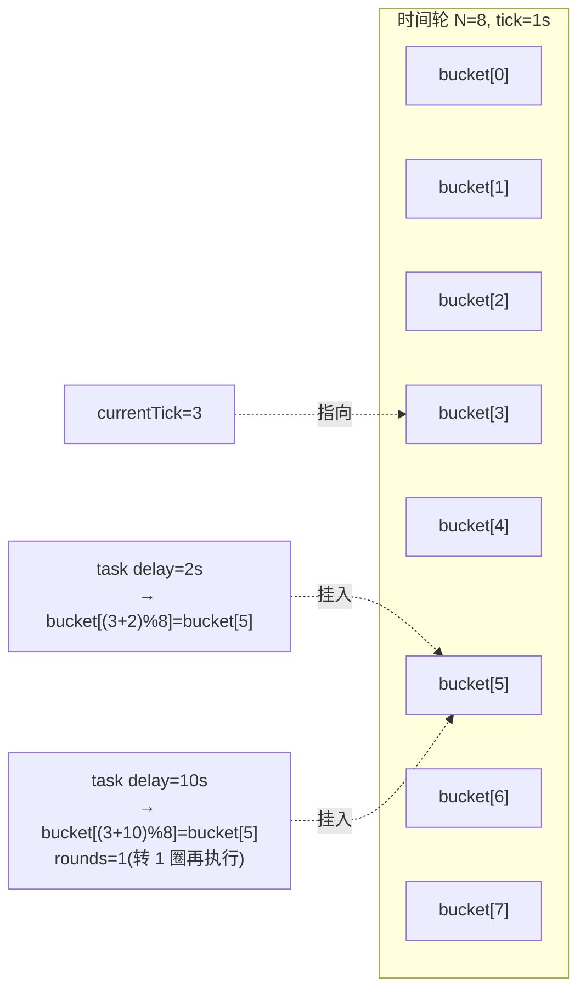

# 时间轮(Timing Wheel)

> **题目**:实现一个高效的定时任务调度器,支持 `AddTask(delay, fn)`,千万级任务时性能依然 O(1)。
>
> 考查:**时间轮原理 + 单级 vs 多级 + tick 推进 + 对比小顶堆 / `time.Timer`**。

时间轮是 Kafka、Netty、Linux 内核、Dubbo 都在用的核心调度结构。**百万级定时任务**场景下,**`time.NewTimer` 会爆**,必须自己造时间轮。

---

## 一、考点拆解

| 考点 | 不及格 | 合格 | 优秀 |
| --- | --- | --- | --- |
| 知道时间轮是啥 | 不知道 | 单级时间轮原理 | **多级时间轮 + 降级机制** |
| 数据结构 | 优先队列 | 数组 + 链表(bucket) | 圈数(rounds)| 多级层叠 |
| O(1) 来源 | 不知道 | tick 推进只动一个 bucket | hash 直接定位 bucket |
| 大延迟任务 | "用大轮装"(浪费) | **多级时间轮** | Kafka 用 DelayQueue 驱动 |
| 对比 | 不知道 `time.Timer` | 知道堆实现 | **Go runtime 4 叉堆 + 每 P 一个 timer 桶** |

---

## 二、为什么不用 `time.Timer` 或小顶堆

### 2.1 三种调度结构对比

| 结构 | AddTask | 触发 | 适用 |
| --- | --- | --- | --- |
| **小顶堆**(优先队列) | **O(log N)** | O(log N) | 任务数 < 10w |
| `time.Timer`(Go runtime) | O(log N)(4 叉堆) | 触发线程唤醒 | 大多数业务 |
| **单级时间轮** | **O(1)** | O(M) M=轮长 | 中等延迟,任务集中分布 |
| **多级时间轮** | **O(1)** | O(1) 摊销 | **百万级 + 大延迟** |

### 2.2 时间轮 O(1) 的关键

```text
轮长 N=60,tick=1s,代表 60 秒的窗口
  bucket[0..59] 每格放一个链表

AddTask(delay=10s):
  位置 = (currentTick + 10) % 60
  → bucket[10].append(task)         O(1)

tick(每秒推进):
  currentTick++
  执行 bucket[currentTick % 60] 的所有任务
  → 永远只动一个 bucket             O(M),M 是该 bucket 任务数
```

加任务和"找出该执行的任务"都是 **O(1) hash 定位**,不需要排序。这是时间轮的本质优势。

---

## 三、单级时间轮:基本结构



每个 bucket 是个链表/双向链表。任务结构带 `rounds` 字段:**delay 超过一圈时,记录还要转几圈**。

---

## 四、单级时间轮完整实现

```go
package wheel

import (
    "container/list"
    "sync"
    "time"
)

type Task struct {
    rounds int           // 还要转几圈
    fn     func()
    bucket *list.List    // 反指 bucket(便于 Stop)
    elem   *list.Element // 反指自己在链表里的位置
}

type SingleWheel struct {
    tickDur     time.Duration
    bucketCount int
    buckets     []*list.List
    pos         int // 当前指针位置

    mu     sync.Mutex
    stopCh chan struct{}
    ticker *time.Ticker
}

func NewSingleWheel(tick time.Duration, n int) *SingleWheel {
    w := &SingleWheel{
        tickDur:     tick,
        bucketCount: n,
        buckets:     make([]*list.List, n),
        stopCh:      make(chan struct{}),
    }
    for i := range w.buckets {
        w.buckets[i] = list.New()
    }
    return w
}

// AddTask 添加任务,delay 必须 > 0
func (w *SingleWheel) AddTask(delay time.Duration, fn func()) *Task {
    if delay <= 0 {
        go fn()
        return nil
    }
    ticks := int(delay / w.tickDur)
    if ticks <= 0 {
        ticks = 1
    }

    w.mu.Lock()
    defer w.mu.Unlock()

    idx := (w.pos + ticks) % w.bucketCount
    rounds := ticks / w.bucketCount

    t := &Task{rounds: rounds, fn: fn, bucket: w.buckets[idx]}
    t.elem = w.buckets[idx].PushBack(t)
    return t
}

// Stop 取消任务
func (w *SingleWheel) StopTask(t *Task) {
    w.mu.Lock()
    defer w.mu.Unlock()
    if t.elem != nil && t.bucket != nil {
        t.bucket.Remove(t.elem)
        t.elem = nil
    }
}

func (w *SingleWheel) Start() {
    w.ticker = time.NewTicker(w.tickDur)
    go func() {
        for {
            select {
            case <-w.ticker.C:
                w.tick()
            case <-w.stopCh:
                w.ticker.Stop()
                return
            }
        }
    }()
}

func (w *SingleWheel) Stop() {
    close(w.stopCh)
}

// tick 推进一格,触发当前 bucket 中 rounds==0 的任务
func (w *SingleWheel) tick() {
    w.mu.Lock()
    w.pos = (w.pos + 1) % w.bucketCount
    bucket := w.buckets[w.pos]

    // 收集到期任务(在锁内提取,锁外执行)
    var due []*Task
    for e := bucket.Front(); e != nil; {
        next := e.Next()
        t := e.Value.(*Task)
        if t.rounds <= 0 {
            bucket.Remove(e)
            due = append(due, t)
        } else {
            t.rounds--
        }
        e = next
    }
    w.mu.Unlock()

    // 锁外执行,避免长任务阻塞 tick
    for _, t := range due {
        go t.fn()
    }
}
```

**讲解时主动点出的细节**:

| 设计 | 资深点 |
| --- | --- |
| `rounds` 字段 | 关键!超过一圈的任务用圈数表示,**避免轮太大占内存** |
| `bucket` 用双向链表 | 任意位置 O(1) 删除(支持 StopTask) |
| 任务回填 `elem` / `bucket` 指针 | Stop 时不用遍历查找 |
| **执行任务放锁外** | 否则一个慢任务卡住 tick,整个时间轮停摆 |
| `go t.fn()` | 任务并发执行,**但要小心 panic**(实战需要 recover) |
| `time.Ticker` 驱动 | 简单粗暴,精度受 tick 限制 |

---

## 五、单级的痛点 → 多级时间轮

### 5.1 痛点

```text
tick=1ms,要支持 1 小时延迟:
  单级需要 3,600,000 个 bucket → 内存暴涨

tick=1s,要支持 1ms 精度:
  做不到
```

矛盾:**精度高(tick 小)** 和 **范围大(轮长)** 不可兼得。

### 5.2 多级时间轮(Hierarchical Timing Wheel)

参考 Linux / Kafka:像**时钟的时针/分针/秒针**层叠。

```text
Level 0(秒): tick=1s,  bucket=60  → 范围 60s
Level 1(分): tick=60s, bucket=60  → 范围 1h
Level 2(时): tick=1h,  bucket=24  → 范围 24h
...

AddTask(delay=125s):
  超过 Level 0 范围 60s → 放 Level 1 的 bucket[(125-currentL0)/60 % 60]

Level 1 tick(每分钟):
  把该 bucket 里的任务全部"降级"重新插入 Level 0(用新 delay 计算位置)
```

**降级**(降到下层轮)是多级时间轮的精髓:**任务在高层等粗略时间,临近触发时降到低层精确等**。

### 5.3 多级实现的核心代码

```go
type HierarchicalWheel struct {
    levels []*SingleWheel
}

func (h *HierarchicalWheel) AddTask(delay time.Duration, fn func()) {
    // 找到能容纳 delay 的最低层
    for i, w := range h.levels {
        if delay <= w.maxDelay() {
            if i == 0 {
                w.AddTask(delay, fn)
            } else {
                // 在高层放一个"降级任务":触发时再插回低层
                w.AddTask(delay, func() {
                    h.AddTask(delay-w.elapsed(), fn) // 用剩余 delay 重新插
                })
            }
            return
        }
    }
}
```

实战实现见 Kafka 的 `TimingWheel.scala`,核心思路就是上面的"降级"模式。

---

## 六、Kafka / Netty 怎么用时间轮

### 6.1 Kafka(Scala 实现)

- **多级 + DelayQueue 驱动** tick(不是固定 `time.Ticker`)
- DelayQueue 装的是 bucket,**bucket 到期才推进**,空 bucket 直接跳过
- 用途:消费者会话超时、`Producer` ack 超时、事务超时

> 关键优化:**不空转**。固定 ticker 每 1ms 都要醒,DelayQueue 只在有任务到期时才唤醒。

### 6.2 Netty(Java HashedWheelTimer)

- **单级**(轮长默认 512)
- 用**圈数 rounds** 处理超出范围的任务
- 适合 Netty 这种**任务延迟普遍较短**的场景(连接超时、心跳)

### 6.3 Linux 内核

- 5 级时间轮,经典 LRU + 降级
- 用于内核定时器(`hrtimer` 是另一套)

---

## 七、和 `time.Timer` 的对比

Go runtime 内部用的是**每 P 一个 4 叉堆**(1.14+)。

| 维度 | runtime timer | 时间轮 |
| --- | --- | --- |
| 数据结构 | 4 叉堆 | 数组 + 链表 |
| AddTask | O(log N) | **O(1)** |
| 触发精度 | 纳秒 | tick 级 |
| 任务规模 | 几十万 OK | **百万级也 OK** |
| 取消 | 标记删除 + 懒清理 | **O(1)** 直接 list.Remove |
| 适合 | **大多数业务** | **海量短延迟**(IM 心跳 / 网关超时) |

**资深表达**:"业务里不要急着自己造时间轮——**几十万定时任务以内 `time.AfterFunc` 完全够用**。只有 **IM 心跳 / 网关连接超时 / 海量延迟队列** 才值得上时间轮。"

---

## 八、典型坑

| 坑 | 现象 | 修复 |
| --- | --- | --- |
| tick 里同步执行任务 | 一个慢任务卡停 tick | **`go fn()`** 异步 |
| 任务里 panic | tick goroutine 挂掉 | `defer recover` |
| 单级轮太大 | 内存爆 | 用 `rounds` 或多级轮 |
| 单级轮没 rounds | 超出范围的任务丢失 | 必须实现 rounds 或多级降级 |
| `time.Ticker` 漂移 | 长跑后偏差 | 用 `time.Now()` 校准 / 改 DelayQueue 驱动 |
| Stop 用扫描 | O(N) 找任务 | 任务结构反指 bucket 和 elem,O(1) 删 |
| 并发 AddTask 不加锁 | 数据竞争 | bucket 操作必须 Mutex |
| 任务 ref 链表 | 已执行的任务 GC 不掉 | tick 时显式 `e.Value = nil` 或不复用节点 |

---

## 九、简化版测试

```go
func main() {
    w := NewSingleWheel(100*time.Millisecond, 60) // tick=100ms,轮长 60(=6s)
    w.Start()
    defer w.Stop()

    start := time.Now()
    for i := 1; i <= 5; i++ {
        i := i
        w.AddTask(time.Duration(i)*time.Second, func() {
            fmt.Printf("task %d fired at %v\n", i, time.Since(start))
        })
    }

    time.Sleep(6 * time.Second)
}
// task 1 fired at ~1s
// task 2 fired at ~2s
// ...
```

---

## 十、现场表达模板

> "时间轮是为**百万级定时任务**设计的,核心是把任务挂到固定数组的 bucket 里,**AddTask 和触发都是 O(1)**。
>
> **单级时间轮**:数组当圆环,tick 推进指针,每次只处理一个 bucket。
> 超过轮长的任务用 **rounds 字段记圈数**,每过一圈减一,归零时执行。
>
> 单级的痛点是**精度和范围矛盾**——tick 小则范围小,tick 大则不精确。
> **多级时间轮**解决:像时针分针秒针层叠,任务在高层粗略等,临近触发时**降级**到低层精确等。
> Kafka / Linux 内核 / Netty 都是这套思路。
>
> 实战要点:
> - **任务执行必须异步**(go fn()),否则慢任务卡停整个 tick
> - **rounds 是单级时间轮的灵魂**,不然就是大数组,内存爆
> - 大多数业务**用 `time.AfterFunc` 就够**,几十万以内 Go runtime 的 4 叉堆 timer 完全顶得住
> - 真正要上时间轮:**IM 心跳、网关连接超时、海量延迟队列**"

---

## 十一、一句话总结

> **时间轮 = 数组当圆环 + tick 推进 + bucket 链表**;
>
> - **O(1) AddTask** 来自 hash 定位,O(1) 触发来自只动一个 bucket
> - **rounds 字段**让单级时间轮能装超过一圈的任务,不浪费内存
> - **多级时间轮**(Kafka / Linux)用"降级"机制兼顾精度和范围
> - 任务执行**必须异步 + recover**,否则一个慢任务卡停整个轮
> - 不要无脑造,**几十万任务内 `time.AfterFunc` 完全够**,百万级 + 海量超时才上时间轮
