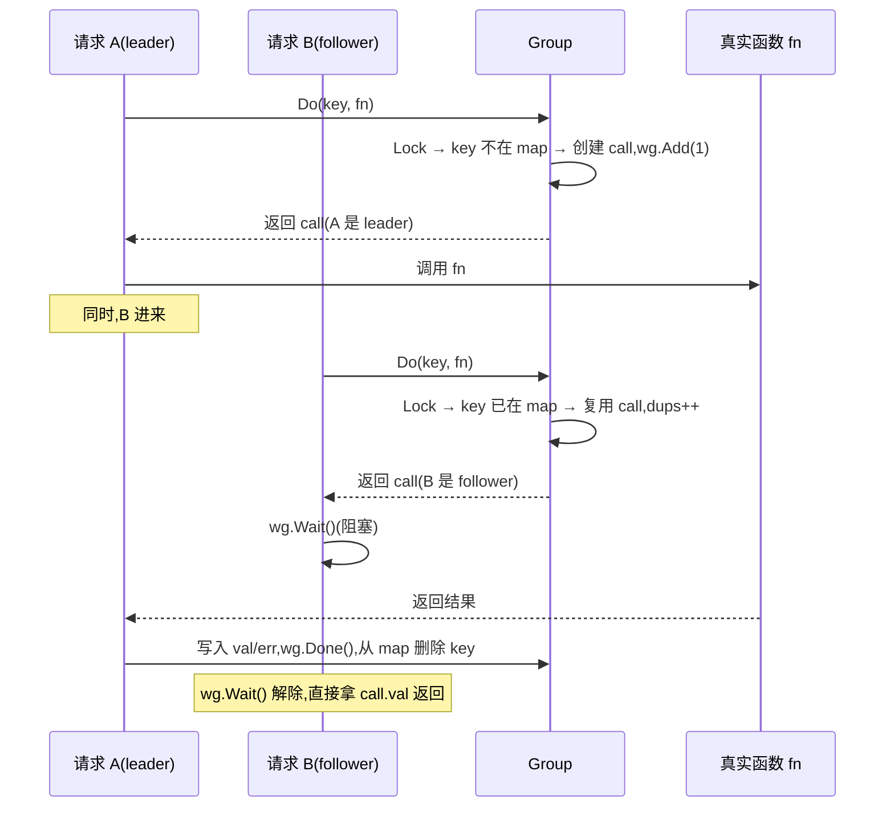

# 单飞(SingleFlight)

> **题目**:实现一个 `singleflight.Do(key, fn)`:**同一时刻同一 key 只执行一次 fn**,其他并发调用复用结果。用于防缓存击穿。
>
> 这是 `golang.org/x/sync/singleflight` 的核心功能,**groupcache 之父 Brad Fitzpatrick 设计**,**几乎每个高并发 Go 服务都在用**。
>
> 考查:**map + WaitGroup + Mutex 协作 + 缓存击穿场景 + Forget/DoChan 变体**。

---

## 一、考点拆解

| 考点 | 不及格 | 合格 | 优秀 |
| --- | --- | --- | --- |
| 应用场景 | 不知道 | 防缓存击穿 | 知道 groupcache / TiKV / 国内大厂用法 |
| 核心结构 | 不知道 | `map[key]*call` + Mutex | **call 内 WaitGroup 阻塞 follower** |
| 关键不变式 | 没考虑 | 第二个进来的复用第一个 | 第一个返回后**结果广播给所有等待者** |
| panic 处理 | 一个 panic 全炸 | recover + 错误广播 | runtime.Goexit 区分 |
| 失效场景 | 不知道 | 第一个返回错误后,新请求才会重做 | **Forget** 主动失效 |
| 进阶 | 只会 Do | 知道 DoChan | 知道**长尾问题**和缓解 |

---

## 二、应用场景:防缓存击穿

### 2.1 什么是缓存击穿

```text
热 key 缓存过期 → 1000 个请求同时打到 DB → DB 被打挂
```

普通方案:
- 加分布式锁 → 太重
- 互斥锁 → 单机有效,跨实例无效
- **singleflight → 单机内合并请求,简单有效**

### 2.2 用 singleflight 的标准写法

```go
var sg singleflight.Group

func GetUser(id int64) (*User, error) {
    key := fmt.Sprintf("user:%d", id)

    // 1. 先查缓存
    if u, ok := cache.Get(key); ok {
        return u.(*User), nil
    }

    // 2. 缓存 miss → singleflight 合并
    v, err, _ := sg.Do(key, func() (interface{}, error) {
        u, err := db.GetUser(id)
        if err != nil {
            return nil, err
        }
        cache.Set(key, u, 5*time.Minute)
        return u, nil
    })
    if err != nil {
        return nil, err
    }
    return v.(*User), nil
}
```

100 个并发同时 miss → **只有 1 个真正打 DB**,其他 99 个等着拿同一份结果。

---

## 三、核心思路

### 3.1 数据结构

```text
Group
  └─ map[key]*call    ← 正在执行的请求
        └─ call
              ├─ wg     WaitGroup(后来者等它 Done)
              ├─ val    结果(给后来者复用)
              ├─ err    错误
              └─ dups   有多少个 follower 复用了
```

### 3.2 流程



关键点:**leader 跑完 fn 后,要做三件事**:
1. 把结果写进 `call.val/err`
2. `wg.Done()` 唤醒所有 follower
3. **从 map 里删除 key**,让下一波请求重新创建 call(否则永远复用旧结果)

---

## 四、完整实现

```go
package singleflight

import (
    "sync"
)

type call struct {
    wg   sync.WaitGroup
    val  interface{}
    err  error
    dups int // 多少个 follower 复用(统计用)
}

type Group struct {
    mu sync.Mutex
    m  map[string]*call
}

// Do 同 key 并发只执行一次 fn,其他 follower 等待结果
//   shared: 是否有人复用过(>0 即 true)
func (g *Group) Do(key string, fn func() (interface{}, error)) (v interface{}, err error, shared bool) {
    g.mu.Lock()
    if g.m == nil {
        g.m = make(map[string]*call)
    }
    if c, ok := g.m[key]; ok {
        // follower:有人在跑,等着
        c.dups++
        g.mu.Unlock()
        c.wg.Wait()
        return c.val, c.err, true
    }
    // leader:第一个进来
    c := &call{}
    c.wg.Add(1)
    g.m[key] = c
    g.mu.Unlock()

    g.doCall(c, key, fn)
    return c.val, c.err, c.dups > 0
}

func (g *Group) doCall(c *call, key string, fn func() (interface{}, error)) {
    defer func() {
        // 即使 panic 也要保证 wg.Done + 从 map 删除
        g.mu.Lock()
        delete(g.m, key)
        g.mu.Unlock()
        c.wg.Done()
    }()

    // panic 也作为错误传给 follower(否则 follower 永远 wait)
    defer func() {
        if r := recover(); r != nil {
            c.err = fmt.Errorf("singleflight panic: %v", r)
        }
    }()

    c.val, c.err = fn()
}
```

**讲解时主动点出的细节**:

| 设计 | 资深点 |
| --- | --- |
| `wg.Add(1)` 在锁内 | 必须在 follower 可能开始 Wait 之前 Add |
| `wg.Wait()` 在锁外 | 等待时**不能持锁**,否则后续 leader 都进不来 |
| `delete(g.m, key)` 在 defer | **关键!**leader 完成后必须从 map 删 key,否则永远复用旧结果 |
| panic 也要 `wg.Done()` | 否则所有 follower 永远阻塞 → **goroutine 泄漏** |
| panic 转换成 err 传播 | 让所有 follower 都失败,语义一致 |
| 锁粒度小 | 锁只保护 map 操作,真实 fn 在锁外执行 |

---

## 五、测试

```go
func main() {
    var sg Group
    var wg sync.WaitGroup
    var actualCalls atomic.Int32

    fn := func() (interface{}, error) {
        actualCalls.Add(1)
        time.Sleep(500 * time.Millisecond) // 模拟慢 DB
        return "data", nil
    }

    // 100 个并发同一 key
    for i := 0; i < 100; i++ {
        wg.Add(1)
        go func() {
            defer wg.Done()
            v, _, shared := sg.Do("hot-key", fn)
            fmt.Printf("got=%v shared=%v\n", v, shared)
        }()
    }
    wg.Wait()
    fmt.Printf("actual fn calls: %d\n", actualCalls.Load()) // → 1
}
```

100 个并发,只有 1 次真正调用 fn,其他 99 次 `shared=true`。

---

## 六、进阶变体

### 6.1 DoChan:返回 channel 不阻塞

阻塞版 `Do` 适合**同步链路**;`DoChan` 适合**异步链路**或**带超时**。

```go
type Result struct {
    Val    interface{}
    Err    error
    Shared bool
}

func (g *Group) DoChan(key string, fn func() (interface{}, error)) <-chan Result {
    ch := make(chan Result, 1)

    g.mu.Lock()
    if g.m == nil {
        g.m = make(map[string]*call)
    }
    if c, ok := g.m[key]; ok {
        c.dups++
        c.chans = append(c.chans, ch)
        g.mu.Unlock()
        return ch
    }
    c := &call{chans: []chan Result{ch}}
    c.wg.Add(1)
    g.m[key] = c
    g.mu.Unlock()

    go g.doCallChan(c, key, fn)
    return ch
}

func (g *Group) doCallChan(c *call, key string, fn func() (interface{}, error)) {
    defer func() {
        g.mu.Lock()
        delete(g.m, key)
        for _, ch := range c.chans {
            ch <- Result{Val: c.val, Err: c.err, Shared: c.dups > 0}
        }
        g.mu.Unlock()
        c.wg.Done()
    }()
    c.val, c.err = fn()
}
```

**典型用法:带超时**

```go
ch := sg.DoChan("key", expensiveFn)
select {
case r := <-ch:
    return r.Val, r.Err
case <-time.After(1 * time.Second):
    return nil, errors.New("timeout")
    // ⚠️ 注意:超时只是 caller 不等了,fn 还在跑,后续 follower 仍受益
}
```

### 6.2 Forget:主动失效

场景:leader 拿到错误结果(如 DB 临时故障),不想让 follower 也拿错的。

```go
func (g *Group) Forget(key string) {
    g.mu.Lock()
    delete(g.m, key)
    g.mu.Unlock()
}
```

**用法**:在 fn 里出错时主动 Forget,让下一波请求重新打 DB,而不是复用错误。

```go
v, err, _ := sg.Do(key, func() (interface{}, error) {
    u, err := db.GetUser(id)
    if err != nil {
        sg.Forget(key) // 错误结果不让后人复用
        return nil, err
    }
    return u, nil
})
```

**注意**:`Forget` 只影响**后续**新进来的请求,**当前**已经在 wg.Wait 的 follower 该拿错的还是拿错的(它们已经"上车"了)。

### 6.3 panic 隔离(标准库的做法)

`x/sync/singleflight` 1.14+ 对 panic 处理更严格:

```go
// 重新抛 panic 给 leader,follower 收到 PanicError
type panicError struct {
    value interface{}
    stack []byte
}

func (p *panicError) Error() string {
    return fmt.Sprintf("%v\n\n%s", p.value, p.stack)
}

// fn 里 panic → 调用方都收到 panicError
// runtime.Goexit() → 调用方都收到 runtime.Goexit
```

资深表达:**panic 和 Goexit 要区分对待**,因为 `runtime.Goexit` 只结束当前 goroutine,**不会 unwind 到调用方**,直接 recover 会"吞掉" Goexit 语义。

---

## 七、长尾问题(资深加分)

singleflight 看起来完美,但有个**长尾隐患**:

```text
leader 调用 fn 慢(比如 5 秒)
→ 这 5 秒内所有 follower 都被它"拖累"
→ 即使 follower 自己想用更快的途径(本地缓存 fallback)也不行
```

缓解方案:

| 方案 | 思路 |
| --- | --- |
| **超时 + DoChan** | follower 自己用 select 超时,leader 继续跑,下一波看运气 |
| **限制 follower 数量** | dups 超过阈值的 follower 自己降级(查从库 / 返回过期数据) |
| **主动 Forget** | 检测到 fn 卡死,Forget 让后续不再排队 |

实战 groupcache 就引入了"hot key"机制,**热点请求会跨节点广播**,避免单点卡死。

---

## 八、典型坑

| 坑 | 现象 | 修复 |
| --- | --- | --- |
| 没 `delete(g.m, key)` | 永远返回第一次的结果(包括错误) | leader defer 必删 |
| panic 后没 `wg.Done()` | follower 永久阻塞,goroutine 泄漏 | defer 顺序:先 delete + wg.Done,后 recover |
| `wg.Wait()` 持锁 | 死锁(leader 进不来 wg.Done)| Wait 必须在锁外 |
| 错误结果被广播 | 一次 DB 抖动,99 个请求全失败 | 错误时 Forget,让重试 |
| `DoChan` 没 buffer | 写 ch 阻塞 leader | `make(chan Result, 1)` |
| `Do` 的 fn 阻塞太久 | 长尾,follower 全卡 | DoChan + 超时 + 降级 |
| 跨实例不生效 | 跨 pod 的请求仍打满 DB | **singleflight 是单机的**,跨实例要分布式锁 + 缓存 |
| key 冲突 | 不同业务同 key 互相覆盖 | 每业务用独立 `Group` |

---

## 九、单机 vs 分布式 vs 多级

| 层级 | 工具 | 防什么 |
| --- | --- | --- |
| **单机内合并** | `singleflight` | 单机并发击穿 |
| **分布式合并** | Redis 分布式锁(set NX)+ 重试 | 跨实例击穿 |
| **多级缓存** | 本地缓存 + Redis + DB | 各层都加 singleflight |

> 实战:大厂常 `本地 LRU + singleflight + Redis + 分布式锁 + DB`,**五层兜底**。

---

## 十、现场表达模板

> "singleflight 是 Brad 设计的一个并发原语,解决**同一时刻同一 key 重复调用**的问题——典型场景是**缓存击穿**:100 个请求同时缓存 miss,如果都打 DB,DB 就挂了。
>
> 实现核心是 `map[key]*call`,call 里有个 WaitGroup:
> - 第一个进来的是 **leader**,创建 call、wg.Add(1)、跑 fn
> - 后来的是 **follower**,从 map 里找到同 key 的 call,wg.Wait() 阻塞
> - leader 跑完写结果、wg.Done()、**从 map 删除 key**,所有 follower 醒来直接拿同一份结果
>
> 关键的坑有几个:
> 1. `wg.Wait()` 必须在锁外,否则 leader 进不来死锁
> 2. **panic 也要 wg.Done()**,否则 follower 永久阻塞,goroutine 泄漏
> 3. 错误结果会被广播,所以错误时**主动 Forget** 让后续重试
> 4. **长尾**:leader 慢的话拖死所有 follower,要用 DoChan + 超时降级
>
> 注意 singleflight 是**单机的**,跨实例还要分布式锁 + 缓存兜底。"

---

## 十一、一句话总结

> **singleflight = `map[key]*call` + WaitGroup**,leader 跑 fn,follower wg.Wait 复用结果,**leader 完成后必须从 map 删除 key**。
>
> - **panic 必须广播给 follower**(转成 err),否则永久阻塞 + goroutine 泄漏
> - **错误结果会被复用**,要靠 `Forget` 主动失效
> - **长尾问题**:慢 leader 拖死所有 follower,DoChan + 超时 + 降级
> - **只解决单机**击穿,跨实例要分布式锁兜底
