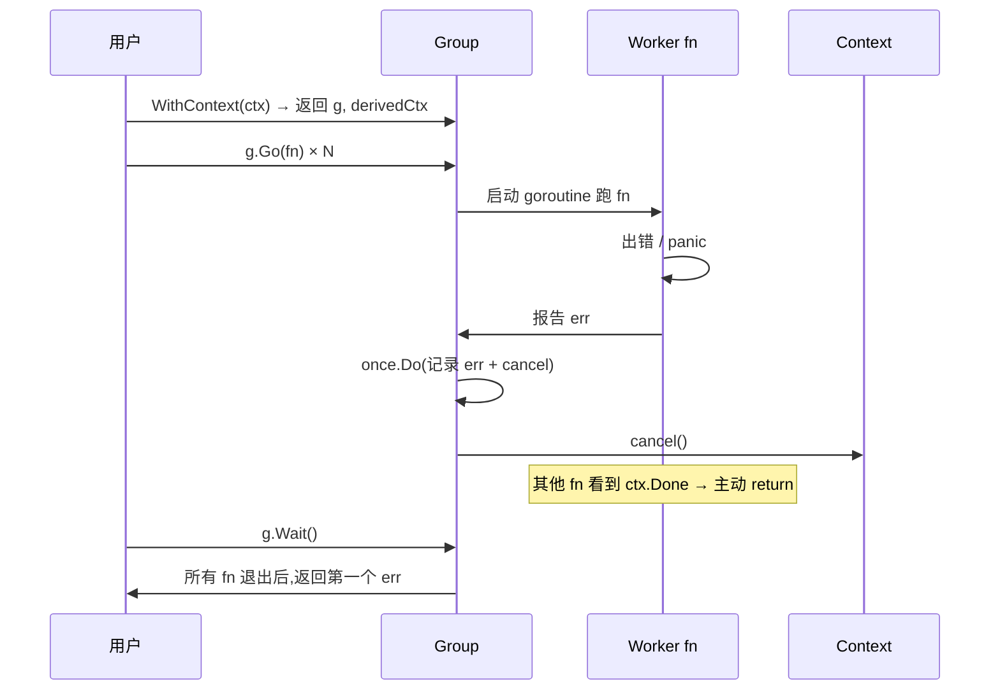

# errgroup(无第三方实现)

> **题目**:不用 `golang.org/x/sync/errgroup`,自己实现一个 `errgroup`:支持 `Go(fn) / Wait()`,**第一个错误**冒上来、**自动取消**剩余任务,可选 `SetLimit(n)` 限并发。
>
> 考查:**WaitGroup + sync.Once + context.CancelFunc + 信号量**协作、**第一错语义**、和 `sync.WaitGroup` 的区别。

`errgroup` 是 Go 并发编程最常用的协调原语,**几乎每个生产项目都在用**。资深面试问"自己写一个"是经典考点。

---

## 一、考点拆解

| 考点 | 不及格 | 合格 | 优秀 |
| --- | --- | --- | --- |
| 和 WaitGroup 区别 | 不知道 | WG 只管等,errgroup 兼顾错误传播 | **第一错冒泡 + 自动取消** |
| 第一错语义 | 谁先 Done 拿谁的 | **sync.Once 保证第一个 err** | 后续 err 被丢弃 |
| 取消传播 | 没考虑 | `WithContext` 返回 ctx + cancel | 第一错时 cancel,其他 fn 看 ctx.Done 主动退 |
| panic 处理 | 一个 panic 全炸 | recover + 转 err | 区分 runtime.Goexit |
| SetLimit | 不知道 | 信号量限并发 | TryGo 失败立刻返回 |
| 内部数据结构 | WG + err | WG + sync.Once + cancel + sema | 知道 1.20 SetLimit、TryGo 加入 |

---

## 二、errgroup 解决什么

### 2.1 `sync.WaitGroup` 的不足

```go
// ❌ WaitGroup 不传播错误
var wg sync.WaitGroup
for _, url := range urls {
    wg.Add(1)
    go func(u string) {
        defer wg.Done()
        if err := fetch(u); err != nil {
            // 怎么把 err 传出来?
        }
    }(url)
}
wg.Wait()
// 错误丢了,而且即使某个 url 挂了,其他还在跑
```

### 2.2 `errgroup` 的标准用法

```go
import "golang.org/x/sync/errgroup"

g, ctx := errgroup.WithContext(context.Background())
for _, url := range urls {
    url := url
    g.Go(func() error {
        return fetchCtx(ctx, url) // ctx 取消时退出
    })
}
if err := g.Wait(); err != nil {
    return err // 拿到第一个失败的错误
}
```

**核心语义**:
- 任何一个 fn 返回 err 或 panic → ctx 被 cancel → 其他 fn 看到 ctx.Done 主动退
- Wait 返回**第一个**非 nil 的 err
- 所有 fn 都跑完 Wait 才返回(不会"丢"剩下的 goroutine)

---

## 三、思路推导

### 3.1 核心组件

| 组件 | 作用 |
| --- | --- |
| `sync.WaitGroup` | 等所有 fn 跑完 |
| `sync.Once` | 保证只记录"第一个 err"+ 只 cancel 一次 |
| `context.CancelFunc` | 第一错触发 → 取消 ctx,通知其他 fn |
| `chan struct{}` 或 `chan token` | SetLimit 的信号量(限并发数) |

### 3.2 控制流程



---

## 四、完整代码

```go
package errgroup

import (
    "context"
    "fmt"
    "sync"
)

type Group struct {
    cancel func(error) // context.CancelCauseFunc(1.20+);1.20- 用 context.CancelFunc

    wg sync.WaitGroup

    sem chan token // SetLimit 用的信号量;nil 表示无限制

    errOnce sync.Once
    err     error
}

type token struct{}

// WithContext 返回一个绑定派生 ctx 的 Group;任何一个 fn 报错,ctx 被取消
func WithContext(ctx context.Context) (*Group, context.Context) {
    ctx, cancel := context.WithCancelCause(ctx)
    return &Group{cancel: cancel}, ctx
}

// Go 启动一个 goroutine 执行 fn
func (g *Group) Go(fn func() error) {
    if g.sem != nil {
        g.sem <- token{} // 占一个名额(满了阻塞)
    }
    g.wg.Add(1)
    go func() {
        defer g.done()

        // panic 转 err,否则一个 panic 炸全程序
        defer func() {
            if r := recover(); r != nil {
                err := fmt.Errorf("errgroup panic: %v", r)
                g.errOnce.Do(func() {
                    g.err = err
                    if g.cancel != nil {
                        g.cancel(err)
                    }
                })
            }
        }()

        if err := fn(); err != nil {
            g.errOnce.Do(func() {
                g.err = err
                if g.cancel != nil {
                    g.cancel(err)
                }
            })
        }
    }()
}

// TryGo 如果有 SetLimit 且当前已满,不阻塞、直接返回 false
func (g *Group) TryGo(fn func() error) bool {
    if g.sem != nil {
        select {
        case g.sem <- token{}:
        default:
            return false
        }
    }
    g.wg.Add(1)
    go func() {
        defer g.done()
        defer func() {
            if r := recover(); r != nil {
                err := fmt.Errorf("errgroup panic: %v", r)
                g.errOnce.Do(func() {
                    g.err = err
                    if g.cancel != nil {
                        g.cancel(err)
                    }
                })
            }
        }()
        if err := fn(); err != nil {
            g.errOnce.Do(func() {
                g.err = err
                if g.cancel != nil {
                    g.cancel(err)
                }
            })
        }
    }()
    return true
}

func (g *Group) done() {
    if g.sem != nil {
        <-g.sem // 释放名额
    }
    g.wg.Done()
}

// Wait 阻塞到所有 Go 启动的 fn 都退出,返回第一个 err
func (g *Group) Wait() error {
    g.wg.Wait()
    if g.cancel != nil {
        g.cancel(g.err) // 即使没出错,Wait 完也要 cancel,释放 ctx
    }
    return g.err
}

// SetLimit 限制最大并发 fn 数;n<=0 表示不限制
func (g *Group) SetLimit(n int) {
    if n <= 0 {
        g.sem = nil
        return
    }
    g.sem = make(chan token, n)
}
```

**讲解时主动点出的细节**:

| 设计 | 资深点 |
| --- | --- |
| `sync.Once` 记录 err | **第一错语义**:只记录最先到的那个,后续 err 被丢弃 |
| Once 内 cancel | 第一错触发**立刻通知**其他 fn,不要傻等 |
| `defer recover` | panic 必须 recover,否则 wg.Done 不执行 → Wait 永远卡 |
| Wait 完后 cancel | **无论有没有出错**,Wait 结束都 cancel,**避免 ctx 泄漏** |
| 信号量在 Go 入口处 | **限并发**:满了阻塞 Go 调用方,而不是 goroutine 内部排队 |
| TryGo 非阻塞 | 用 `select default`,适合"试一试,不行就跳过"场景 |
| `done()` 先释放 sem 再 wg.Done | 顺序无所谓,但**两个都要执行**(包括 panic 路径) |

---

## 五、测试

```go
func main() {
    g, ctx := WithContext(context.Background())
    g.SetLimit(3) // 最多 3 个并发

    for i := 0; i < 10; i++ {
        i := i
        g.Go(func() error {
            select {
            case <-ctx.Done():
                return ctx.Err()
            case <-time.After(100 * time.Millisecond):
            }
            if i == 5 {
                return fmt.Errorf("task %d failed", i)
            }
            fmt.Printf("task %d done\n", i)
            return nil
        })
    }

    if err := g.Wait(); err != nil {
        fmt.Println("got error:", err) // → task 5 failed
    }
}
```

**预期**:5 报错 → ctx cancel → 后面没跑完的任务看 `ctx.Done` 退出 → Wait 拿到 `task 5 failed`。

---

## 六、和 sync.WaitGroup 的区别

| | `sync.WaitGroup` | `errgroup.Group` |
| --- | --- | --- |
| 等待 | ✓ | ✓ |
| 错误传播 | ✗ | **✓**(第一错冒泡)|
| 自动取消 | ✗ | **✓**(WithContext)|
| 限并发 | ✗ | ✓(SetLimit)|
| panic 处理 | ✗(panic 炸全程序)| **✓**(recover 转 err)|
| 适用 | 纯等待 | **并行任务 + 错误处理** |

**资深表达**:"`sync.WaitGroup` 只解决'怎么等',`errgroup` 解决'怎么等 + 错了怎么办 + 怎么限流'。**绝大多数业务用 errgroup,WG 只在没有错误传播需求时用**。"

---

## 七、典型用法 4 例

### 7.1 并发抓多个 URL

```go
g, ctx := errgroup.WithContext(ctx)
results := make([]string, len(urls))
for i, url := range urls {
    i, url := i, url
    g.Go(func() error {
        body, err := fetchCtx(ctx, url)
        if err != nil {
            return err // 任一失败,其他自动取消
        }
        results[i] = body
        return nil
    })
}
if err := g.Wait(); err != nil { return err }
```

### 7.2 限并发爬虫(SetLimit)

```go
g := new(errgroup.Group)
g.SetLimit(20) // 最多 20 并发
for _, url := range millionURLs {
    url := url
    g.Go(func() error { return fetch(url) })
}
g.Wait()
```

### 7.3 服务启动多组件,任一失败全退

```go
g, ctx := errgroup.WithContext(ctx)
g.Go(func() error { return runHTTPServer(ctx) })
g.Go(func() error { return runGRPCServer(ctx) })
g.Go(func() error { return runMetrics(ctx) })
return g.Wait() // 任一服务挂,所有服务一起退
```

### 7.4 试探性并发(TryGo)

```go
g := new(errgroup.Group)
g.SetLimit(10)
for _, task := range tasks {
    if !g.TryGo(func() error { return process(task) }) {
        // 满了 → 降级:同步执行或丢弃
    }
}
g.Wait()
```

---

## 八、典型坑

| 坑 | 现象 | 修复 |
| --- | --- | --- |
| fn 不监听 ctx | 第一错触发后,其他 fn 继续跑 | fn 内部用 `ctx.Done()` 主动退 |
| 闭包 i / url 没复制 | 所有 g.Go 拿到的是最后一个值 | `i := i` 重声明(Go 1.22+ 不需要)|
| panic 后 wg.Done 没执行 | Wait 永久阻塞 | **`defer wg.Done` + `defer recover`**(本实现已处理)|
| Wait 后不 cancel | ctx 泄漏 → 父 ctx 持有引用 | Wait 末尾 cancel(本实现已处理)|
| SetLimit(0) | 永远阻塞在 sem | 校验 n>0,否则不限制 |
| 在 g.Go 内 g.Wait | 自己等自己 → 死锁 | Wait 只能外部调用 |
| 把 errgroup 当 select 用 | 想拿"第一个成功" | errgroup 是**"第一个失败"语义**;要"第一个成功"用 channel + cancel |
| 大量 g.Go + 没 SetLimit | goroutine 爆炸 | 海量任务必上 SetLimit |

---

## 九、标准库 `x/sync/errgroup` 对照

`x/sync/errgroup` 1.20 之后增加了:
- `SetLimit(n)` 限并发
- `TryGo(fn) bool` 非阻塞投递
- `WithContext` 内部用 `context.WithCancelCause`(1.20),原因可以从 ctx 取出

```go
import "golang.org/x/sync/errgroup"

g, ctx := errgroup.WithContext(ctx)
g.SetLimit(10)
g.Go(func() error { /* ... */ })
err := g.Wait()
```

**API 设计一致**,我的实现就是简化版。

> 注意:标准库的实现里 `Go` 看到 sem 满时**会阻塞**(和 SetLimit 配合很自然)。`TryGo` 是非阻塞版。

---

## 十、和"第一个成功"模式对比(资深加分)

errgroup 是 **fail-fast / first-error**。但有时候需要**first-success**:N 个候选源,**任一成功就用,其他取消**。这要用 channel + ctx:

```go
ctx, cancel := context.WithCancel(ctx)
defer cancel()
ch := make(chan result, len(sources))
for _, src := range sources {
    src := src
    go func() {
        v, err := src.Get(ctx)
        select {
        case ch <- result{v, err}:
        case <-ctx.Done():
        }
    }()
}
for range sources {
    r := <-ch
    if r.err == nil {
        cancel() // 通知其他源取消
        return r.v
    }
}
```

**errgroup 不能做 first-success**——它的语义是"全部成功才返回 nil,任一失败立刻返回 err"。

---

## 十一、现场表达模板

> "errgroup 是 `sync.WaitGroup` 的'带错误传播 + 自动取消'增强版。核心组件:**WaitGroup + sync.Once + context.CancelFunc**。
>
> 不变式:
> 1. **sync.Once 保证第一错语义**——只记录最先到的 err,后续 err 被丢弃
> 2. 第一错触发时**立刻 cancel ctx**,其他 fn 看到 `ctx.Done` 主动退
> 3. **panic 必须 recover**,否则 wg.Done 不执行,Wait 永远卡
> 4. **Wait 结束后也要 cancel**,无论有没有错——避免 ctx 泄漏
>
> 进阶 `SetLimit(n)`:**Go 入口处一个 buffered channel 当信号量**,满了阻塞 Go 调用方。`TryGo` 用 select default 非阻塞。
>
> 业务用法:并发抓 URL、服务组件并行启动、限并发爬虫。
>
> **errgroup 是 fail-fast 语义**(任一失败立刻取消其他),要'**任一成功就好**'(first-success)得手写 channel + cancel,errgroup 做不了。"

---

## 十二、一句话总结

> **errgroup = WaitGroup + sync.Once + CancelFunc + 可选信号量**;
>
> - **第一错语义**:sync.Once 保证只记录第一个 err,触发 cancel 通知其他 fn 主动退
> - **panic 必 recover + defer wg.Done**,否则 Wait 永远卡
> - **Wait 结束也要 cancel**,避免 ctx 泄漏
> - `SetLimit(n)` = buffered channel 信号量;`TryGo` = select default 非阻塞
> - **fail-fast 语义**,要 first-success 用 channel + cancel,errgroup 做不了
> - 业务直接用 `x/sync/errgroup`,自己写是为了面试展示对协同原语的理解
