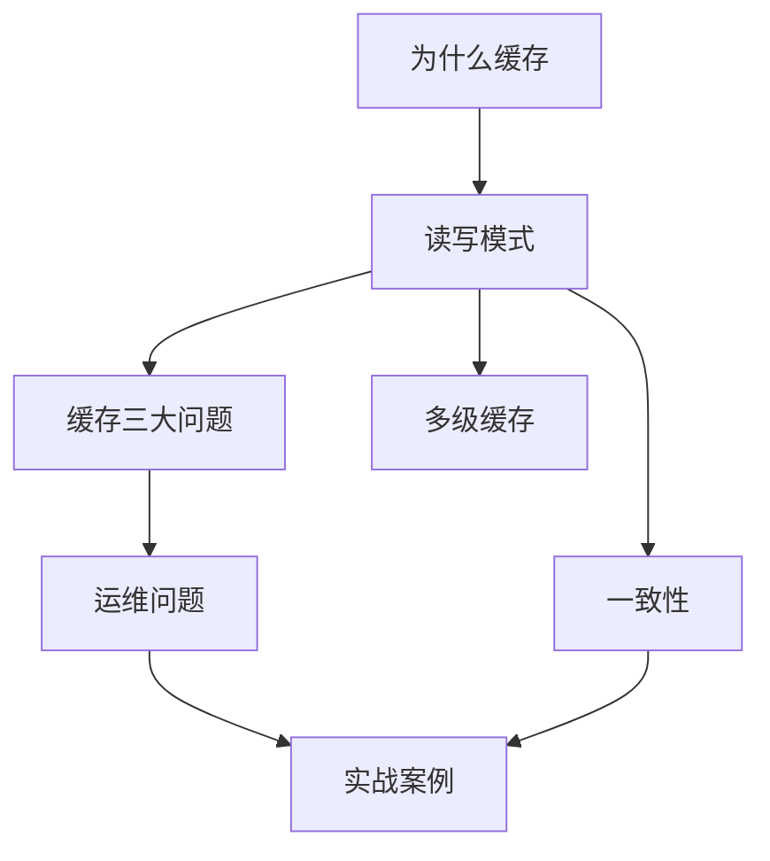
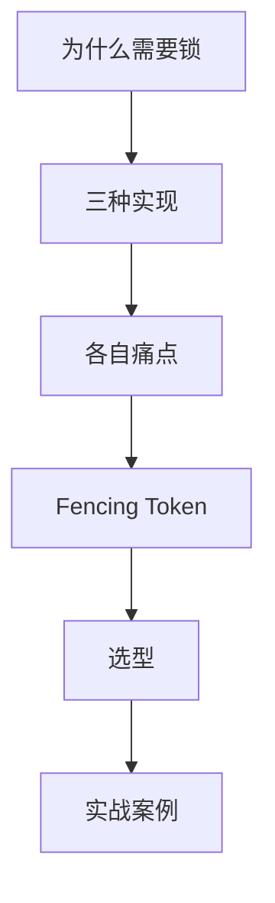
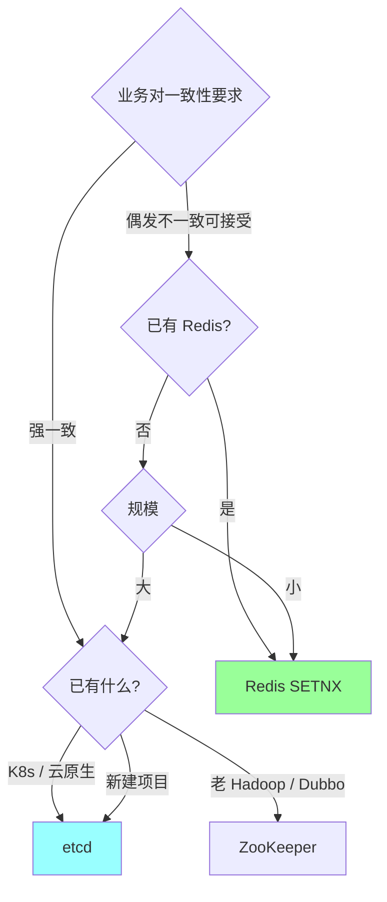
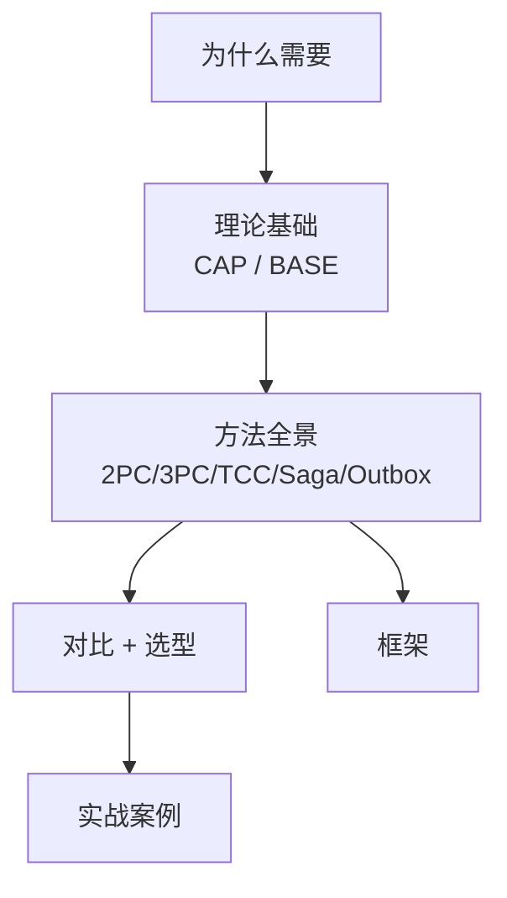
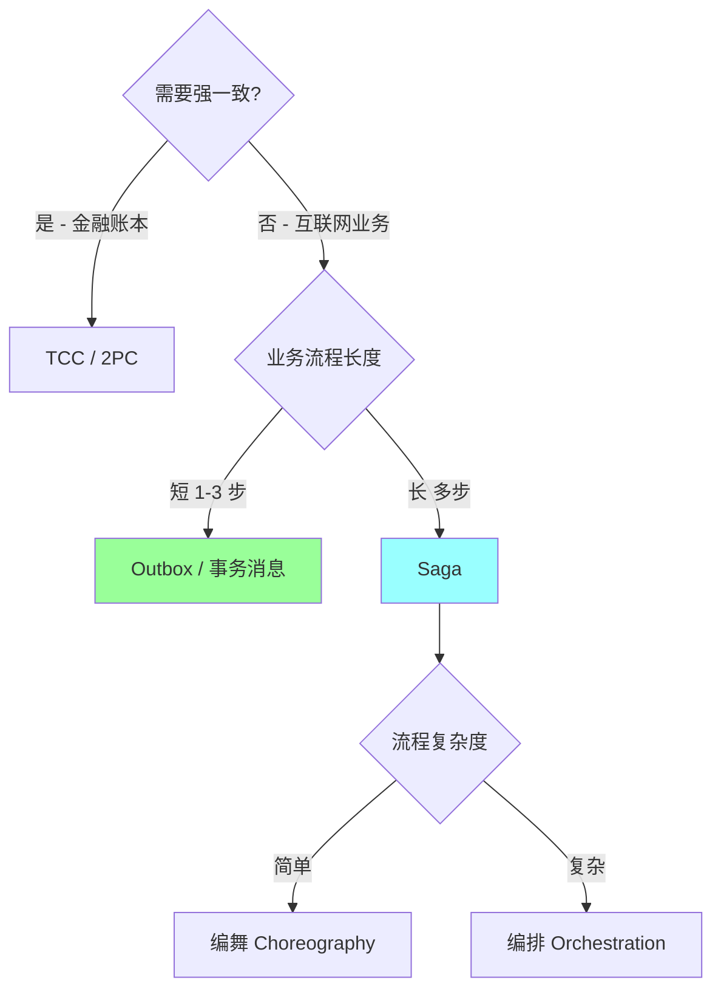
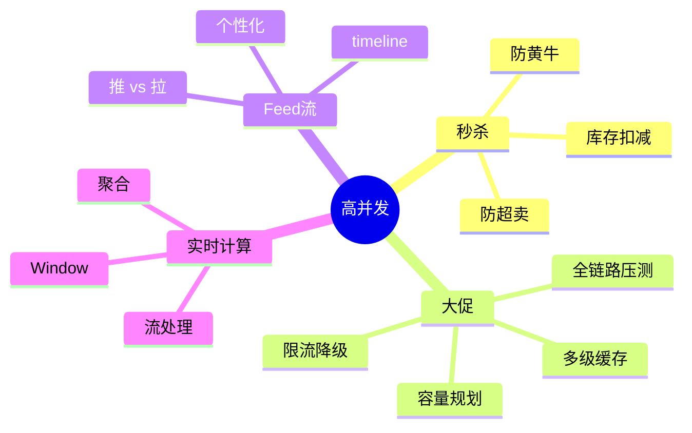
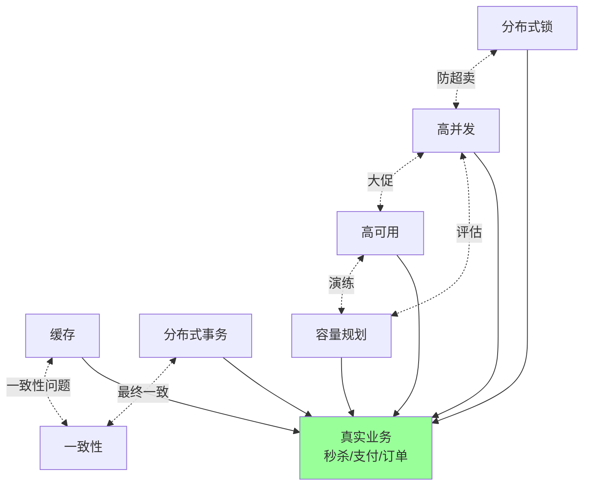

# 资深主题索引地图

> 把分散在 redis / mysql / distributed 等目录的相关主题串起来：**缓存 / 分布式锁 / 分布式事务 / 数据一致性 / 高并发 / 高可用 / 容量** 七大专题
>
> 资深面试场景题往往**跨多个主题**，这份索引帮你建立完整知识链路

---

## 一、缓存专题

### 1.1 知识链路



### 1.2 核心问题速查

| 问题 | 主篇 | 相关 |
| --- | --- | --- |
| **缓存读写模式**（5 种） | [redis/05-cache-patterns#一](../04-redis/05-cache-patterns.md) | 架构/03-high-performance |
| **缓存穿透**（不存在的 key） | [redis/05-cache-patterns#二](../04-redis/05-cache-patterns.md) | 布隆过滤器 / 空值缓存 |
| **缓存击穿**（热点过期） | [redis/05-cache-patterns#二](../04-redis/05-cache-patterns.md) | 互斥锁 / 永不过期 / SWR |
| **缓存雪崩**（同时过期） | [redis/05-cache-patterns#二](../04-redis/05-cache-patterns.md) | 随机 TTL / 多级缓存 / 限流 |
| **缓存一致性**（双写问题） | [redis/10-cache-consistency-design](../04-redis/10-cache-consistency-design.md) | 双删 / binlog 订阅 |
| **多级缓存设计** | [redis/05-cache-patterns#五](../04-redis/05-cache-patterns.md) + 见 11-multi-tier-cache | 本地+Redis+CDN |
| **大 key / 热 key** | [redis/07-pitfalls-tuning#三 #四](../04-redis/07-pitfalls-tuning.md) | 拆分 / 本地缓存 / 多副本 |
| **缓存击穿生产事故** | [redis/09-production-cases](../04-redis/09-production-cases.md) | 6 个真实案例 |
| **CDN 缓存** | [11-cdn/02-cache-strategy](../11-cdn/02-cache-strategy.md) | Cache-Control / SWR |
| **Cookbook 速查** | 见 11-multi-tier-cache | 多级缓存代码 |

### 1.3 三大问题完整解法

**穿透**（查不存在的 key）：
- 布隆过滤器（亿级 100MB，假阳性）
- 缓存空值（短 TTL，防穿透）
- 接口校验前置

**击穿**（热点过期 + 并发查 DB）：
- 互斥锁（SETNX）
- 永不过期 + 后台异步刷新
- SWR（过期返旧 + 异步更新）
- 提前预热

**雪崩**（大量 key 同时过期）：
- TTL 加随机偏移（`max-age + rand(0, 600)`）
- 多级缓存（本地 + Redis + CDN）
- 限流 + 降级
- 不要让所有 key 同时进缓存

### 1.4 一致性方案对比

| 方案 | 一致性强度 | 复杂度 | 适合 |
| --- | --- | --- | --- |
| **先 DB 后删缓存**（标准） | 中 | 低 | 多数业务 |
| **延迟双删** | 中-高 | 中 | 提高一致 |
| **binlog 订阅删缓存** | 高 | 高 | 强一致需求 |
| **强一致读主库** | 强 | - | 关键场景 |

详见 [redis/10-cache-consistency-design](../04-redis/10-cache-consistency-design.md)。

### 1.5 跨章高频题

```
□ 为什么先删 DB 后删缓存而不是先删缓存？
□ 延迟双删 sleep 多久？
□ 缓存击穿的 5 种解法你能说几个？
□ 多级缓存怎么保一致性？
□ 本地缓存（Caffeine / Ristretto）vs Redis 怎么选？
□ 大 key 怎么发现 + 治理？
□ 热 key 怎么扛？
□ 缓存预热怎么做？
□ 缓存命中率多少算健康？
```

---

## 二、分布式锁专题

### 2.1 知识链路



### 2.2 三种实现核心对比

**主篇**：[distributed/04-lock](../06-distributed/04-lock.md)（538 行完整对比）

| | Redis | etcd | ZooKeeper |
| --- | --- | --- | --- |
| **协议** | 单实例 / Redlock | Raft | ZAB（类 Paxos） |
| **CAP** | AP（默认） | CP | CP |
| **性能** | 极高（10 万 QPS） | 高（万级） | 中（千-万级） |
| **可靠性** | Redlock 有理论缺陷 | 强 | 强 |
| **fencing token** | ❌ | ✅（revision） | ✅（zxid） |
| **续约** | 看门狗（Redisson） | Lease 自动 | 心跳（session） |
| **死锁防护** | TTL | Lease | 临时节点 |
| **客户端复杂** | 简单 | 中 | 中 |
| **运维** | 简单 | 中 | 复杂（JVM） |
| **代表用户** | 大多数业务 | K8s / 现代 | 老 Hadoop / Dubbo |

### 2.3 选型决策树



### 2.4 各方案的关键坑

**Redis 锁**：
- ❌ 主从异步复制丢锁（master 挂前未同步）
- ❌ 客户端 GC 暂停（看门狗续约不及时）
- ❌ 时钟漂移影响 TTL
- ❌ Redlock 理论缺陷（Martin Kleppmann 质疑）

**etcd 锁**：
- ✅ Lease 自动续约
- ✅ revision 提供 fencing token
- ❌ 性能不如 Redis
- ❌ 跨地域延迟大

**ZK 锁**：
- ✅ 临时顺序节点天然死锁防护
- ✅ Watch 公平唤醒
- ❌ 长 GC 导致 session 丢失
- ❌ 写性能受 quorum 限制

### 2.5 Fencing Token 是终极保险

锁 + Token 单调递增：
```
T1 获取锁，token=1
T1 GC pause 30s（锁过期）
T2 获取锁，token=2
T2 写数据，token=2 → 存储记最大 = 2
T1 醒来，写数据，token=1 → 存储发现 max(2)>1 拒绝
```

**实战**：业务幂等 + Fencing Token 是双保险，**不要纯依赖锁**。

### 2.6 相关章节速查

| 主题 | 位置 |
| --- | --- |
| Redis 锁实现 | [redis/06-distributed-lock](../04-redis/06-distributed-lock.md) |
| 三方对比 | [distributed/04-lock](../06-distributed/04-lock.md) |
| 协调服务（ZK/etcd） | [distributed/09-coordination-services](../06-distributed/09-coordination-services.md) |
| 锁实战案例 | [distributed/10-distributed-lock-cases](../06-distributed/10-distributed-lock-cases.md) |
| Redlock 安全性 | [99-meta/distributed-20#10](../99-meta/distributed-20.md) |

### 2.7 跨章高频题

```
□ Redis vs etcd vs ZK 怎么选？
□ Redlock 真的安全吗？Martin 怎么质疑？
□ Fencing Token 解决什么？怎么用？
□ 为什么 Redis 锁要 SET NX EX 一条命令？
□ 看门狗续约的原理 + 坑？
□ 业务超时但锁过期怎么办？
□ 多发送方关 channel panic 类似的问题在分布式锁里？
□ 强一致一定用 ZK 吗？
□ K8s 内部用什么锁？（etcd / lease）
□ Redisson 是怎么实现可重入锁的？
```

---

## 三、分布式事务专题

### 3.1 知识链路



### 3.2 方法全景对比

**主篇**：[distributed/03-transaction](../06-distributed/03-transaction.md)（641 行）

| 方法 | 一致性 | 性能 | 业务侵入 | 代表场景 |
| --- | --- | --- | --- | --- |
| **2PC** | 强 | 低 | 低 | XA / 单库内 |
| **3PC** | 中 | 低 | 低 | 学术为主 |
| **TCC** | 强（含 Try 预留） | 中 | **高** | 金融转账 |
| **Saga** | 最终一致 | 高 | 中 | 长事务 |
| **本地消息表 / Outbox** | 最终一致 | 高 | 中 | 业务+消息原子 |
| **事务消息（RocketMQ）** | 最终一致 | 高 | 中 | 业务+MQ 原子 |
| **最大努力通知** | 弱 | 极高 | 低 | 通知类 |
| **对账兜底** | 弥补 | - | 低 | 兜底必备 |
| **Seata** | 多模式 | 中 | 中 | 框架封装 |

### 3.3 选型决策树



### 3.4 关键概念

**2PC（XA）**：DB 内部用，跨服务用太重。

**TCC**：
- Try：预留资源（冻结 100 元）
- Confirm：正式扣款
- Cancel：释放预留
- 业务侵入大，但隔离性好

**Saga**：
- 一系列本地事务 + 补偿
- 编舞：事件驱动
- 编排：中心 Orchestrator
- 关键：每步幂等 + 补偿幂等 + 状态持久化

**Outbox 模式**（业内通用）：
- 业务表 + outbox 表同事务写
- 后台 worker 读 outbox 发 MQ
- 保证业务 ↔ 消息原子

**事务消息**（RocketMQ）：
- half message → 本地事务 → COMMIT/ROLLBACK
- Broker 回查
- 替代 Outbox

### 3.5 框架对比

| 框架 | 厂商 | 模式支持 | 特点 |
| --- | --- | --- | --- |
| **Seata** | 阿里 | AT / TCC / Saga / XA | 国内主流 |
| **Hmily** | 国产 | TCC / Saga | 性能好 |
| **DTM** | 国产 Go | TCC / Saga / 消息 | Go 生态 |
| **temporal** | Cadence 出 | Workflow（Saga） | 国际化场景 |
| **Cadence** | Uber | Workflow | 老牌 |

### 3.6 NewSQL（如 TiDB）的分布式事务

**Percolator 模型**（Google）：
- 基于 BigTable 实现强一致分布式事务
- 2PC + 时间戳（TSO）
- TiDB / CockroachDB / Spanner 都用这个或变种

**详见**：见 12-newsql-percolator（B 篇补强）。

### 3.7 相关章节速查

| 主题 | 位置 |
| --- | --- |
| 完整方案 | [distributed/03-transaction](../06-distributed/03-transaction.md) |
| MySQL 视角 | [mysql/09-distributed-transaction](../03-mysql/09-distributed-transaction.md) |
| Outbox 详解 | [99-meta/ddd-20#17](../99-meta/ddd-20.md) |
| Saga 深入 | [09-ddd/05-cqrs-eventsourcing](../09-ddd/05-cqrs-eventsourcing.md) |
| 一致性对账 | [mysql/17-consistency-reconciliation](../03-mysql/17-consistency-reconciliation.md) |
| TiDB Percolator | 见 12-newsql-percolator |
| TCC 框架对比 | 见 12-newsql-percolator |

### 3.8 跨章高频题

```
□ 2PC vs 3PC？为什么 3PC 不实用？
□ TCC 三阶段是什么？怎么保证幂等 / 防悬挂 / 防空回滚？
□ Saga 怎么补偿？编舞 vs 编排？
□ Outbox 模式解决什么？vs 事务消息？
□ 最大努力通知什么时候用？
□ Seata AT 模式的原理？
□ TiDB 怎么实现分布式事务？Percolator 模型？
□ 跨服务转账你会用什么方案？
□ 对账系统怎么设计？
□ 事务消息和 Outbox 各自适合什么？
```

---

## 四、数据一致性专题

### 4.1 一致性的层次

```
强一致（Linearizable）   - Paxos / Raft / 2PC
顺序一致（Sequential）   - 主从同步复制
最终一致（Eventual）     - 异步复制 / 事件驱动
弱一致                   - Gossip / 异步广播
```

### 4.2 不同场景的一致性需求

| 场景 | 一致性 | 实现 | 主篇 |
| --- | --- | --- | --- |
| 金融账本 | 强 | Paxos / 2PC | distributed/02 |
| 订单状态 | 顺序 | DB 事务 + 主从 | mysql/03 / mysql/05 |
| 缓存 vs DB | 最终 | 双删 / binlog | redis/10 |
| 主从复制 | 最终 | 半同步 | mysql/05 |
| 跨服务 | 最终 | Saga / 事件 | distributed/03 |
| 跨地域 | 最终 | 异步复制 + 单元化 | architecture/02 |
| 报表 / 搜索 | 最终（分钟） | CDC 同步 | ddd/05 |

### 4.3 工具与机制

**强一致**：
- 共识算法（Paxos / Raft / ZAB）
- 分布式事务（2PC / TCC）
- 单点写入

**最终一致**：
- 主从复制（异步 / 半同步）
- 事件驱动（MQ + Outbox）
- CDC（binlog → MQ）
- 对账（实时 / T+1）

**关键技术**：
- Outbox 模式（业务+事件原子）
- Saga（跨服务长事务）
- 幂等（重试安全）
- 对账（兜底）

### 4.4 相关章节速查

| 主题 | 位置 |
| --- | --- |
| 缓存一致性 | [redis/10-cache-consistency-design](../04-redis/10-cache-consistency-design.md) |
| MySQL 主从延迟 | [mysql/05-replication-ha](../03-mysql/05-replication-ha.md) |
| 分布式事务 | [distributed/03-transaction](../06-distributed/03-transaction.md) |
| 共识算法 | [distributed/02-consensus](../06-distributed/02-consensus.md) |
| MVCC | [mysql/03-transaction-lock-mvcc](../03-mysql/03-transaction-lock-mvcc.md) |
| 对账系统 | [mysql/17-consistency-reconciliation](../03-mysql/17-consistency-reconciliation.md) |
| CQRS / ES | [09-ddd/05-cqrs-eventsourcing](../09-ddd/05-cqrs-eventsourcing.md) |

---

## 五、高并发专题

### 5.1 高并发场景四大类



### 5.2 秒杀全栈技术

主篇：[10-system-design/03-seckill-system](../10-system-design/03-seckill-system.md)

完整链路：
```
前端: 静态化 + CDN + 验证码 + 按钮置灰
↓
网关: Nginx + 限流 + 风控
↓
应用: 集群 + 异步排队
↓
缓存: Redis 库存 + Lua 原子扣减
↓
MQ: 异步落库
↓
数据: 分库分表 + 主从
```

详见 [../10-system-design/16-high-concurrency-scenarios.md](../10-system-design/16-high-concurrency-scenarios.md)（C 篇）。

### 5.3 大促准备路径

```
T-90 容量评估
T-60 架构改造
T-30 扩容完成 + 压测
T-14 全链路压测 N 轮
T-7 100+ 预案
T-1 预热 + 冻结
T+0 实时盯
T+7 缩容
```

### 5.4 相关章节速查

| 主题 | 位置 |
| --- | --- |
| 秒杀系统 | [10-system-design/03-seckill-system](../10-system-design/03-seckill-system.md) |
| 高性能 | [08-architecture/03-high-performance](../08-architecture/03-high-performance.md) |
| 容量规划 | [08-architecture/05-capacity-planning](../08-architecture/05-capacity-planning.md) |
| 限流熔断 | [06-distributed/06-rate-limit-circuit](../06-distributed/06-rate-limit-circuit.md) |
| 综合场景 | 见 [../10-system-design/16-high-concurrency-scenarios.md](../10-system-design/16-high-concurrency-scenarios.md) |

---

## 六、高可用专题

### 6.1 等级与方案

| 等级 | RTO | RPO | 方案 | 主篇 |
| --- | --- | --- | --- | --- |
| 99% | 天 | 天 | 单机 + 备份 | - |
| 99.9% | 小时 | 分钟 | 主备容灾 | mysql/05 |
| 99.99% | 分钟 | 秒 | **同城双活** | architecture/02 |
| 99.999% | 秒 | 0 | **异地多活 + 单元化** | architecture/02 |

### 6.2 关键能力

```
冗余 + 隔离 + 保护 + 可观测 + 演练
```

详见 [08-architecture/02-high-availability](../08-architecture/02-high-availability.md)。

### 6.3 相关章节速查

| 主题 | 位置 |
| --- | --- |
| 高可用方法论 | [08-architecture/02-high-availability](../08-architecture/02-high-availability.md) |
| 限流熔断降级 | [06-distributed/06-rate-limit-circuit](../06-distributed/06-rate-limit-circuit.md) |
| 灰度发布 | [13-engineering/01-code-review](../13-engineering/01-code-review.md) |
| 混沌工程 | [08-architecture/02-high-availability](../08-architecture/02-high-availability.md) |
| 服务发现 HA | [07-microservice/02-registry-discovery](../07-microservice/02-registry-discovery.md) |

---

## 七、容量规划专题

### 7.1 评估流程

```
1. 业务峰值预估（DAU × 行为 × 倍数）
2. 单机能力压测
3. 容量需求 = 峰值 × 1.5-2 / 单机
4. 资源四维度（CPU/存储/网络/中间件）
5. 大促准备 T-90 → T+7
```

详见 [08-architecture/05-capacity-planning](../08-architecture/05-capacity-planning.md)。

### 7.2 大型活动 Checklist

```
□ T-90 业务峰值预估
□ T-60 架构改造（如有）
□ T-30 扩容完成
□ T-14 全链路压测 N 轮
□ T-7 预案制定（100+ 条）
□ T-3 最终压测
□ T-1 预热 + 冻结发布
□ T+0 战时指挥 + 实时盯
□ T+1 复盘
□ T+7 缩容
```

---

## 八、综合 vs 分散

### 8.1 综合场景题（必看）

| 题型 | 涉及主题 | 主篇 |
| --- | --- | --- |
| 设计秒杀系统 | 缓存 / 锁 / 限流 / MQ / 分库 | system-design/03 |
| 设计支付系统 | 强一致 / 对账 / 幂等 / 状态机 | system-design/13 |
| 大促容量规划 | 评估 / 压测 / 监控 / 预案 | architecture/05 |
| 故障复盘 | 全栈定位 / 应急 / 改进 | architecture/02 |
| 微服务拆分 | DDD / 边界 / 数据一致性 | ddd/01 + microservice/01 |

### 8.2 散点 vs 综合的学习

```
散点学习（专题深度）:
  → 各专题文章

综合应用（场景能力）:
  → system-design/* + 14-projects/*
  → 99-meta/*-20.md 速记题集
  → 见 [../10-system-design/16-high-concurrency-scenarios.md](../10-system-design/16-high-concurrency-scenarios.md)（C 篇）
```

---

## 九、按面试场景索引

### 9.1 字节系（高频）

```
- Go 调度器 GMP（01-go-language/03）
- Go 并发 channel（01-go-language/02）
- 微服务（07-microservice/*）
- DDD（09-ddd/*）
- 高性能优化（08-architecture/03）
```

### 9.2 阿里系（中台 / 大促）

```
- 双活 / 多活（08-architecture/02）
- 分布式事务（distributed/03）
- 单元化（architecture/02#5）
- 全链路压测（architecture/05）
- 中台架构（ddd/04 / 08）
```

### 9.3 美团 / 拼多多（电商）

```
- 订单系统（mysql/11）
- 秒杀（system-design/03）
- 库存（system-design/15）
- 支付（system-design/13）
- 缓存一致性（redis/10）
```

### 9.4 腾讯系（社交 / 游戏）

```
- IM 系统（system-design/08）
- 弹幕（system-design/04）
- Feed（system-design/06）
- 容灾 / 多活
```

### 9.5 金融 / 银行（强一致）

```
- 强一致（distributed/02）
- 分布式事务（distributed/03）
- TCC / Seata
- 对账（mysql/17）
- 安全 / 合规
```

---

## 十、推荐学习路径

### 10.1 准 P7（8 年）综合补强

```
1. 各专题题集速记（99-meta/*-20.md）→ 1 周
2. 综合场景串联（system-design + projects）→ 1 周
3. 高并发实战（[../10-system-design/16-high-concurrency-scenarios.md](../10-system-design/16-high-concurrency-scenarios.md)）→ 3 天
4. 答辩 / 大厂 JD 拆解 → 1 周
```

### 10.2 准 TL（管理路线）

```
1. Tech Lead 能力（15-leadership/01）
2. 业务产品思维（15-leadership/02）
3. 技术战略（15-leadership/03）
4. 项目复盘（14-projects/*）
```

### 10.3 准架构师（专家路线）

```
1. 架构演进（08-architecture/*）
2. DDD 全套（09-ddd/*）
3. 系统设计（10-system-design/*）
4. 软件匠艺（16-software-craftsmanship/*）
```

---

## 十一、专题间关联图



**资深面试** = 把这些专题**串成完整业务场景**的能力。

---

## 十二、查找速查表

### 12.1 关键问题 → 章节

| 问题 | 章节 |
| --- | --- |
| Redis 缓存穿透怎么解 | redis/05 |
| 缓存一致性怎么保 | redis/10 |
| 大 key 治理 | redis/07 |
| Redis vs etcd vs ZK 锁 | distributed/04 |
| Redlock 安全吗 | distributed/04 / 99-meta/distributed-20#10 |
| 2PC vs TCC vs Saga | distributed/03 |
| 主从延迟怎么处理 | mysql/05 |
| 分库分表怎么做 | mysql/12 |
| 订单系统设计 | mysql/11 |
| 秒杀系统设计 | system-design/03 |
| 高可用 4 个 9 怎么做 | architecture/02 |
| 大促容量规划 | architecture/05 |
| Coding Agent 全栈 | 12-ai/07 |

### 12.2 关键技术 → 章节

| 技术 | 章节 |
| --- | --- |
| Redis 数据结构 | redis/02 |
| MySQL B+ 树 | mysql/02 |
| MVCC | mysql/03 |
| binlog / redo log | mysql/04 |
| Buffer Pool | mysql/13 |
| Raft 共识 | distributed/02 |
| 雪花算法 | distributed/05 |
| 限流算法 | distributed/06 |
| 一致性 Hash | distributed/04 |
| RAG | 12-ai/10 |

---

## 十三、面试加分点

- **跨专题串联**：能从一个面试题（如秒杀）串出 缓存 + 锁 + 限流 + 异步 + 分库 + 监控 全套
- **现实问题**：每个理论方案都能给真实生产案例
- **取舍意识**：每种方案讲清优缺点 + 何时用 / 不用
- **演进路径**：单体 → 集群 → 多活 的连续思考
- **量化思维**：QPS / 延迟 / 命中率 / RTO 等数据驱动
- **失败模式**：每种技术的失败 case 都要清楚（不只讲成功路径）
- **时代感**：跟上当下技术（Claude Code / MCP / TiDB / Service Mesh）

**最高境界**：用 30 分钟把一个综合系统的设计、关键技术、取舍、演进、风险讲清楚。
