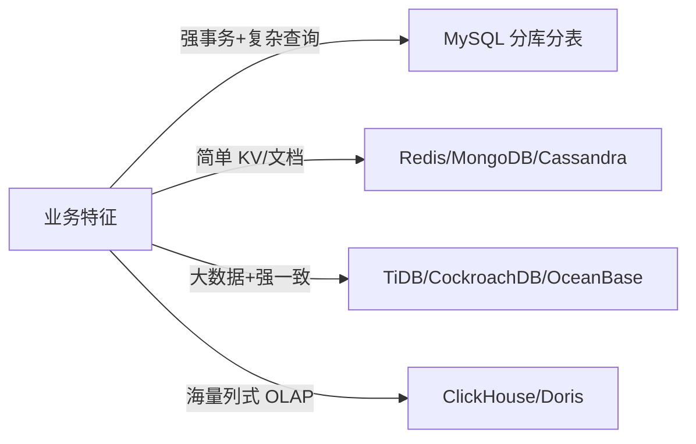

# 架构资深面试题（20 题）

> 演进 / 高可用 / 高性能 / 可扩展 / 容量 / 决策
>
> 格式：题目 / 标准答案 / 易错点 / 追问点 / 背诵版

## 目录

1. [架构演进路径？什么时候该上微服务？](#q1)
2. [康威定律是什么？怎么应用？](#q2)
3. [SLA / SLO / SLI 区别？Error Budget 是什么？](#q3)
4. [4 个 9 怎么做到？要付出什么代价？](#q4)
5. [同城双活 vs 异地多活？单元化是什么？](#q5)
6. [降级 vs 熔断的区别？](#q6)
7. [灰度发布有哪些方案？](#q7)
8. [混沌工程做什么？](#q8)
9. [性能优化的优先级和方法论？](#q9)
10. [缓存三大问题和解法？](#q10)
11. [异步化的好处和代价？](#q11)
12. [False Sharing 是什么？怎么解？](#q12)
13. [可扩展性的三个维度？](#q13)
14. [无状态化怎么做？](#q14)
15. [分库分表 vs NoSQL vs NewSQL？](#q15)
16. [一致性 Hash 解决什么？](#q16)
17. [系统容量怎么评估？](#q17)
18. [全链路压测怎么做？影子表是什么？](#q18)
19. [ADR 是什么？怎么做技术选型？](#q19)
20. [架构师 vs 资深工程师区别？](#q20)

---

<a id="q1"></a>
## 1. 架构演进路径？什么时候该上微服务？

### 标准答案
**演进五阶段**：单体 → 垂直拆分（Modular Monolith）→ SOA → 微服务 → Service Mesh + Serverless。

每阶段对应的规模：
- 单体：< 20 人，DAU < 100 万
- 模块化单体 / 垂直：20-50 人
- 微服务：100+ 人多团队
- Service Mesh：大厂规模化（万级服务）

**该上微服务**：团队 100+ / 业务复杂需独立演化 / 有 DDD 边界 / 有 DevOps 基建。
**不该上**：团队 < 50 / 业务未验证 / 没基建。

### 易错点
- 跨阶段跨步（直接从单体跳微服务 → 必踩坑）
- 学大厂终态（Netflix/字节都走过弯路，照搬必死）
- 忽略组织维度（架构跟不上组织变化）

### 追问点
- Shopify 单体撑超大规模怎么解释？→ Modular Monolith + 严格模块边界
- 大厂演进多久？→ 阿里走了 10+ 年，不是一蹴而就

### 背诵版
**单体 → 模块化 → 微服务 → Mesh**，按规模匹配。微服务**团队 100+ 才考虑**，先做模块化单体过渡。**绝不大爆炸式拆**。

---

<a id="q2"></a>
## 2. 康威定律是什么？怎么应用？

### 标准答案
**Conway's Law**：系统架构反映组织结构。组织怎么沟通，架构就怎么长。

应用：
- 4 人小团队 → 单体（强行拆服务沟通成本爆炸）
- 3 个团队 → 自然 3 个服务
- 想要某种架构 → **先调整组织（逆康威）**

**实战经验**：服务数 ≈ 团队数 × 2-3。

### 易错点
- 强推架构改造但不动组织（注定失败）
- 误以为康威定律是"必然"（其实可以逆向利用）

### 追问点
- 怎么逆康威？→ 大型架构改造前先重组团队，让架构自然演化
- 跨团队协作多的服务该拆吗？→ 不该，要么合并团队要么合并服务

### 背诵版
**架构反映组织**。服务数 ≈ 团队数 × 2-3。**逆康威**：想要某种架构先调团队。

---

<a id="q3"></a>
## 3. SLA / SLO / SLI 区别？Error Budget 是什么？

### 标准答案

| | 含义 | 例子 |
| --- | --- | --- |
| **SLI** | 实测指标 | P99 延迟实测 200ms |
| **SLO** | 内部目标 | 承诺 P99 < 300ms |
| **SLA** | 对外合同 | 不达标退 xx%，更保守 |

**Error Budget = 1 - SLO**：
- 99.9% SLO → 月允许 43 分钟不可用
- 实际 99.95% → 剩余 21 分钟预算
- 预算没用完 → 激进发版
- 预算用完了 → 冻结发版专注稳定

SRE 核心方法论：**用 Error Budget 平衡稳定 vs 创新**。

### 易错点
- SLA = SLO（实际 SLA 更保守）
- 追求绝对零故障（成本无穷大）
- 没有 Error Budget 概念（要么过度激进要么过度保守）

### 追问点
- Error Budget 用完了怎么办？→ 冻结发版 / 复盘改进 / 提升测试覆盖
- 不同业务 SLO 一样吗？→ 核心 99.99%，边缘 99.9% 即可

### 背诵版
**SLI 实测、SLO 目标、SLA 合同**。**Error Budget = 1-SLO**，平衡**稳定 vs 创新**。SRE 核心方法。

---

<a id="q4"></a>
## 4. 4 个 9 怎么做到？要付出什么代价？

### 标准答案
**99.99% = 年不可用 52 分钟**。

做到的关键：
- **冗余**：同城双活 + DB 主从 + 多副本
- **隔离**：服务 / 资源 / 故障域隔离
- **保护**：限流 + 熔断 + 降级 + 重试
- **可观测**：四大黄金信号 + 链路追踪 + 分级告警
- **演练**：混沌工程 + 故障演练 + 灰度发布

代价：
- 资源成本上升 1.5-2 倍（双活）
- 运维复杂度大幅上升
- 团队 SRE 投入

**5 个 9（99.999%）成本指数级**：年 5.26 分钟，需要异地多活 + 自动化 + 7x24 SRE 团队。

### 易错点
- 无脑追 5 个 9（成本爆炸）
- 不区分业务核心 / 边缘（一刀切高 SLO）
- 只买冗余不做演练（真出事还是挂）

### 追问点
- 不同业务 SLO 一样吗？→ 核心 4 个 9，边缘 3 个 9 够了
- 5 个 9 vs 4 个 9 成本差多少？→ 估算 5-10 倍

### 背诵版
4 个 9 = **冗余 + 隔离 + 保护 + 可观测 + 演练**。**5 个 9 成本指数级**，按业务核心程度匹配。

---

<a id="q5"></a>
## 5. 同城双活 vs 异地多活？单元化是什么？

### 标准答案

| | 同城双活 | 异地多活 |
| --- | --- | --- |
| 距离 | < 100 km | 跨城/跨国 |
| 延迟 | < 5ms | 20-100ms |
| 数据 | 同步复制 | 异步复制 |
| RTO | 秒 | 秒 |
| RPO | 0-秒 | 秒-分钟 |
| 难度 | 中 | 高 |

**异地多活的关键：单元化**：
- 按分片键（如 userID）切流量到固定单元
- 每单元持有全量数据（异步同步）
- 用户固定一个单元，**读写不跨单元**
- 单元故障 → 流量调度到其他单元

代表：阿里 LDC 单元化、饿了么、美团。

### 易错点
- 强一致跨地域（CAP 不允许）
- 不做单元化的多活（跨地域写延迟爆炸）
- 多活但没切流演练（真出事不敢切）

### 追问点
- 单元化怎么避免跨单元写？→ 路由层按 userID hash + 跨单元强一致业务回主单元
- 全局唯一性怎么保？→ 雪花算法 + 号段预分配 + 中心 ID 服务

### 背诵版
同城双活 < 100km 同步复制，异地多活跨城异步复制。**单元化是异地多活关键**：用户固定单元，读写不跨。

---

<a id="q6"></a>
## 6. 降级 vs 熔断的区别？

### 标准答案

| | 降级 | 熔断 |
| --- | --- | --- |
| 对象 | 自身功能 | 下游依赖 |
| 触发 | 主动或被动 | 下游异常 |
| 行为 | 返回兜底 / 关功能 | 不调下游 |

**关系**：熔断后通常配合降级（熔断上游 → 降级返回兜底）。

降级三层：
- **读降级**：缓存兜底 / 默认值
- **写降级**：异步化 / 丢弃非核心
- **功能降级**：关闭推荐 / 关闭非核心模块

熔断状态机：Closed → Open → Half-Open → Closed/Open。

### 易错点
- 概念混淆（熔断是不调下游，降级是返回兜底）
- 没有降级预案（出事临场写代码）
- 熔断阈值死板（不分实例 / 不分接口）

### 追问点
- 降级怎么设计预案？→ 每个核心功能写预案 + 一键开关 + 定期演练
- Hystrix vs Sentinel？→ Hystrix 已停更，Sentinel 阿里主流

### 背诵版
**熔断是不调下游，降级是返回兜底**。降级分**读 / 写 / 功能**三层。熔断后常配合降级。

---

<a id="q7"></a>
## 7. 灰度发布有哪些方案？

### 标准答案

| | 金丝雀 | 蓝绿 | 滚动 |
| --- | --- | --- | --- |
| 资源 | 少量额外 | 双份 | 正常 |
| 切换 | 渐进 | 瞬间 | 渐进 |
| 回滚 | 秒 | 秒 | 分钟 |
| 适合 | 风险评估 | 零停机 | 常规（K8s 默认） |

**灰度维度**：
- 按用户（ID 尾号 / 白名单 / 地域）
- 按流量（随机 1%）
- 按时间（夜间灰度）
- 按功能（FeatureFlag / A-B）

**自动回滚**：监控金丝雀指标，超阈值自动回滚（错误率 / 延迟）。

### 易错点
- 灰度太快（1% → 100% 一把梭）
- 没有自动回滚（人工反应慢）
- 只观察 1 分钟（偶发问题没显现）

### 追问点
- 金丝雀比例递增？→ 1% → 5% → 20% → 50% → 100%
- 蓝绿适合什么场景？→ 数据库 schema 兼容 / 零停机要求高

### 背诵版
**金丝雀渐进、蓝绿瞬切、滚动 K8s 默认**。多维度（用户/流量/时间/功能），**自动回滚**是关键。

---

<a id="q8"></a>
## 8. 混沌工程做什么？

### 标准答案
**主动注入故障，验证系统的韧性**。

故障类型：
- 实例故障（杀 pod）
- 网络故障（延迟/丢包/分区）
- 资源故障（CPU/内存满）
- 依赖故障（DB/MQ 挂）
- 时钟漂移 / 证书过期 / DNS 污染

**执行流程**：
1. 定义稳态（正常指标）
2. 提出假设（X 故障下应 Y）
3. 注入故障（小范围起步）
4. 观察对比
5. 验证假设 / 找问题
6. 修复 + 下轮

工具：Chaos Monkey（Netflix）/ ChaosBlade（阿里）/ Chaos Mesh（PingCAP）。

### 易错点
- 一开始就打生产主链路（应该从预发开始）
- 没有止血开关（炸了没法停）
- 个人英雄主义（应该是文化 + 例行）

### 追问点
- 怎么从 0 到 1 推混沌？→ 预发 + 小范围 → 生产边缘 → 生产核心
- 谁来负责？→ SRE / 架构组主导，业务团队配合

### 背诵版
**主动注入故障验证韧性**。从预发小范围 → 生产边缘 → 核心。**必须有止血开关 + 例行文化**。

---

<a id="q9"></a>
## 9. 性能优化的优先级和方法论？

### 标准答案

**优先级**（自上而下）：
1. 算法 / 数据结构（O(n²) → O(n log n)）
2. 减少远程调用（合并 / 批量 / 缓存）
3. 减少 IO（缓存 / 批量 / 异步）
4. 并发化（goroutine / 流水线）
5. 减锁（无锁 / 分段）
6. 内存优化（池化 / 减少分配）
7. 协议优化（压缩 / 序列化）
8. 硬件升级（最后手段）

**方法论**：
- **Profile 在前，优化在后**（不靠直觉）
- **测量**（pprof / Prometheus）
- **找瓶颈**（CPU / IO / 锁等待）
- **优化最热路径**（80/20 原则）
- **回归验证**

### 易错点
- 凭直觉优化（90% 优化错地方）
- 不看 P99 只看平均（用户感知差被忽略）
- 局部最优反而拖累全局

### 追问点
- 怎么找 Go 性能瓶颈？→ pprof CPU/Heap/Mutex/Block
- P50 vs P99 哪个重要？→ P99（真实用户体验）

### 背诵版
**架构决定上限、代码决定下限**。优先级：**算法 → 调用 → IO → 并发 → 锁 → 内存**。**Profile 在前**，不靠直觉。

---

<a id="q10"></a>
## 10. 缓存三大问题和解法？

### 标准答案

| 问题 | 现象 | 解法 |
| --- | --- | --- |
| **穿透** | 不存在的 key 一直查 DB | 布隆过滤器 / 缓存空值（短 TTL） |
| **击穿** | 热点 key 过期，N 个并发查 DB | 互斥锁 / 永不过期 / 提前刷新 |
| **雪崩** | 大量 key 同时过期 | 过期时间随机化 / 多级缓存 / 限流 |

**多级缓存**：本地（μs）→ Redis（ms）→ CDN（边缘）→ DB（源）。

**缓存模式**：
- Cache-Aside（最常用）
- Read/Write-Through
- Write-Behind（高吞吐）
- Refresh-Ahead（防击穿）

### 易错点
- 缓存当数据库（缓存挂数据丢）
- 不做空值缓存（穿透）
- TTL 全部一样（雪崩）

### 追问点
- 缓存一致性怎么保？→ Cache-Aside + 双删 + 延迟双删
- 本地缓存 vs Redis？→ 本地快但多实例不一致，组合用

### 背诵版
**穿透布隆/空值，击穿互斥锁/不过期，雪崩随机 TTL**。缓存是**性能优化第一武器**，但**不是数据库**。

---

<a id="q11"></a>
## 11. 异步化的好处和代价？

### 标准答案

**好处**：
- 响应快（核心路径短）
- 削峰填谷（MQ 缓冲）
- 解耦（生产/消费独立）
- 高吞吐

**代价**：
- 一致性变弱（最终一致）
- 调试困难（链路长）
- 错误处理复杂（重试 / 死信）
- 用户感知（订单创建了但邮件没发出去）

**用在非核心路径**，核心路径仍同步。

典型场景：日志 / 通知 / 营销活动 / 数据分析。

### 易错点
- 所有操作都丢 MQ（用户感知差 + 调试地狱）
- 没有死信队列（错误消息无限重试）
- 没有幂等（重复消费导致数据错）

### 追问点
- MQ 消费失败怎么办？→ 重试 N 次 → 进死信队列 → 人工介入
- 怎么防止消息丢？→ 生产端 ACK + 持久化 + 消费端手动 ACK

### 背诵版
**异步用在非核心路径**。优：响应快/削峰/解耦；缺：最终一致/调试难/错误复杂。**幂等 + 重试 + 死信** 三必备。

---

<a id="q12"></a>
## 12. False Sharing 是什么？怎么解？

### 标准答案
**伪共享**：两个 atomic 变量在同一 cache line（64 字节），多 CPU 修改 → 反复同步 → 性能慢 10x。

```go
// ❌ 反例
type Counter struct {
    a atomic.Int64  // 8 字节
    b atomic.Int64  // 紧跟着 a，同一 cache line
}
// goroutine A 改 a，goroutine B 改 b
// → cache line 在两 CPU 之间反复 invalidate

// ✅ 修复
type Counter struct {
    a atomic.Int64
    _ [56]byte      // padding 到独立 cache line
    b atomic.Int64
}
```

通用计数器、分段锁、无锁队列经常踩这个坑。

### 易错点
- 不知道 cache line 概念（64 字节）
- 数组式分段锁忘记 padding
- 误以为 atomic 就能解决一切（False Sharing 仍存在）

### 追问点
- 怎么测出 False Sharing？→ perf c2c / Linux 性能事件
- 数组场景怎么办？→ 每个槽位独占一个 cache line

### 背诵版
False Sharing = 同 cache line（64B）的并发写**反复 invalidate**。**Padding 到独立 cache line** 解决。

---

<a id="q13"></a>
## 13. 可扩展性的三个维度？

### 标准答案
**Scale Cube（三轴）**：

| 轴 | 手段 | 解决 |
| --- | --- | --- |
| **X 轴** | 多副本 / 集群 | 单机性能不够 |
| **Y 轴** | 按功能拆服务 | 团队 / 复杂度 |
| **Z 轴** | 按数据分片 | 数据量爆炸 |

通常**先 X 后 Y 后 Z**，实战经常组合用。

例：字节抖音 = 微服务（Y）+ 多实例（X）+ 多活分片（Z）。

### 易错点
- 只用 X 轴（DB 不分库分表 → 数据量瓶颈）
- 跳过 X 直接 Y（小流量先拆服务 = 过度设计）
- Z 轴过度（小流量分 32 库 → 跨库 join 难）

### 追问点
- DB 优先纵向还是横向？→ 纵向到瓶颈再分片，提前 50% 容量准备
- 应用层为什么优先横向？→ 互联网业务自然增长 + 容错好

### 背诵版
**X 克隆 / Y 拆服务 / Z 分数据**。先 X 再 Y 再 Z，实战组合用。**DB 先纵向再 Z，应用先横向**。

---

<a id="q14"></a>
## 14. 无状态化怎么做？

### 标准答案
**无状态 = 应用进程内不持有任何业务状态**。

改造手段：
- **Session 外置** → Redis / JWT
- **文件存对象存储** → OSS / S3
- **配置走配置中心** → Nacos / Apollo
- **缓存外置** → Redis（多实例一致）
- **状态分离** → DB

收益：任意实例处理任意请求 / 扩缩容简单 / 容错好 / 滚动更新无感。

### 易错点
- Session 内存里（多实例不一致）
- 上传文件本地磁盘（容器重启丢）
- 配置写死代码（改要发版）

### 追问点
- JWT vs Redis Session 哪个好？→ JWT 完全无状态但难撤销，Redis 易撤销但要存储
- 长连接服务怎么无状态？→ 连接绑定单实例，但用户态可飘（如 IM 走代理层维护连接）

### 背诵版
**进程内不持有业务状态**：Session/文件/配置/缓存全外置。**水平扩展的前提**。

---

<a id="q15"></a>
## 15. 分库分表 vs NoSQL vs NewSQL？

### 标准答案



**分库分表**：自由度高但复杂（路由 / 跨库 join / 分布式 ID / 扩容难）。

**NoSQL**：简单 KV/文档，强大水平扩展，但事务弱。

**NewSQL**：原生分布式 + ACID + 兼容 MySQL。代价是资源消耗高。

### 易错点
- 小数据上 NewSQL（杀鸡用牛刀）
- 海量数据强行分库分表（不如直接 TiDB）
- 用 MongoDB 当关系型 DB（事务支持弱）

### 追问点
- 什么时候上 NewSQL？→ 数据量 10 亿+ + 强一致 + 不想自维分库分表
- 分库分表的扩容难点？→ 双写 + 数据迁移 + 切流，至少 1-3 月

### 背诵版
**关系型 + 复杂查询 → 分库分表**；**KV / 文档 → NoSQL**；**大数据 + 强一致 → NewSQL（TiDB）**；**OLAP → ClickHouse**。

---

<a id="q16"></a>
## 16. 一致性 Hash 解决什么？

### 标准答案
**普通 Hash 加节点 → 全部 rehash → 缓存雪崩**。

一致性 Hash：节点和 key 都映射到 0-2³² 环上，key 顺时针找最近节点。
- 加节点只影响**相邻 1/N 数据**
- 加**虚拟节点**解决数据倾斜
- 加权一致性 Hash（节点能力不同）

应用：Redis Cluster slot / Memcached / CDN 调度 / 分库分表中间件。

### 易错点
- 不加虚拟节点（数据倾斜严重）
- 误以为是"完美一致"（其实仍有 1/N 影响）
- 数据量小时不必要（直接静态分片更简单）

### 追问点
- 虚拟节点多少合适？→ 每物理节点 100-200 虚拟节点
- Redis Cluster 用一致性 Hash 吗？→ 不是，用 16384 slots，每 slot 映射节点

### 背诵版
**节点和 key 都上 hash 环，顺时针找节点**。加节点只影响 1/N 数据。**虚拟节点解决倾斜**。普通 hash 加节点 = 全 rehash 雪崩。

---

<a id="q17"></a>
## 17. 系统容量怎么评估？

### 标准答案

```
容量需求 = 业务峰值 × 安全系数 / 单机能力
```

- **业务峰值**：历史峰值 × (1+增长率) × 活动放大系数
- **单机能力**：压测得出（不要用理论值）
- **安全系数**：1.5-2

四大资源都要评估：**计算（CPU/内存）/ 存储（容量/IOPS）/ 网络（带宽/连接）/ 中间件（DB连接/MQ分区）**。

不同业务峰值/日均比：电商 3-5x（平时）50x（大促）/ 直播 顶流 100x / 支付 工资日 10x。

### 易错点
- 凭经验估（没数据驱动）
- 单机理论值（实际差 5-10 倍）
- 只看 CPU 不看 IO/网络/连接

### 追问点
- 大促怎么准备？→ T-90 评估 / T-30 扩容 / T-7 全链路压测 / T-1 预热 / T+0 实时盯 / T+7 缩容
- 容量水位怎么设？→ 50%（安全）/ 70%（关注）/ 85%（警戒）/ 95%（紧急）

### 背诵版
**容量 = 峰值 × 1.5-2 / 单机能力**。**单机必须压测**。四大资源（CPU/存储/网络/中间件）都要算。

---

<a id="q18"></a>
## 18. 全链路压测怎么做？影子表是什么？

### 标准答案
单接口压测无法发现跨服务瓶颈，**全链路压测**才能暴露真实容量。

阿里方案（业界标杆）：
- **影子标识**：压测流量带特殊 header
- **影子路由**：DB / MQ / 缓存**分流**到影子表/影子 topic
- **真实链路**：除数据隔离外完全一致
- **熔断保护**：异常立即停

**影子表 = 业务表 + 后缀（如 t_order_shadow）**：
- 同 schema
- 同事务路由（按影子标识）
- 压测后清理

### 易错点
- 测试环境压测（数据规模/网络都和生产差太多）
- 没有影子标透传（压测流量污染生产数据）
- 没有熔断（异常压垮生产）

### 追问点
- 中小公司怎么做？→ 预发环境全量压测 / 生产镜像流量 / 核心链路影子表
- 影子流量怎么标识？→ HTTP header 透传，业务代码 ctx 取出判断走影子路径

### 背诵版
全链路压测 = **影子标 + 影子路由 + 真实链路 + 熔断保护**。**影子表**和业务表同 schema 隔离数据。**生产压测最真实**。

---

<a id="q19"></a>
## 19. ADR 是什么？怎么做技术选型？

### 标准答案
**ADR（Architecture Decision Record）= 用文档记录每个重要架构决策的背景、选项、取舍、决定**。

模板：
```
状态: 已决定
背景: 为什么做这个决策
决策: 选了什么
考虑过的选项: A/B/C 各自优缺
后果: 短期 / 中期 / 长期影响
评审人 + 时间
```

技术选型五维度：
- **业务匹配度**（功能/性能/容量）
- **团队能力**（技能/学习曲线/招聘）
- **生态成熟度**（社区/文档/工具）
- **运维成本**（部署/监控/排查）
- **长期演化**（扩展/锁定/迁移）

**Bezos 原则**：可逆决策快做，不可逆决策慢做。

### 易错点
- 决策完不留痕迹（半年后没人知道为什么这么设计）
- 没有"考虑过的其他选项"（缺乏对比）
- 简单决策也写 ADR（仪式过重）

### 追问点
- 哪些决策需要 ADR？→ 不可逆 / 跨团队 / 长期影响的（DB/RPC/拆 BC 边界）
- ADR 存哪？→ 代码仓库 docs/adr/

### 背诵版
ADR = **决策记录文档**。模板：背景 / 选项 / 取舍 / 决定。**可逆快做、不可逆慢做（Bezos）**。

---

<a id="q20"></a>
## 20. 架构师 vs 资深工程师区别？

### 标准答案

| | 工程师 | 资深 | 架构师 |
| --- | --- | --- | --- |
| 关注 | 模块 | 服务 | 系统 / 业务 |
| 输出 | 代码 | 设计文档 | ADR / RFC / 架构图 |
| 决策范围 | 实现选择 | 模块设计 | 跨团队 / 跨服务 |

架构师的核心能力：
- **技术深度 + 广度**（至少 1-2 个领域专家 + 多领域涉猎）
- **业务理解**（DDD / 领域知识）
- **决策方法**（ADR / 取舍 / 数据驱动）
- **团队赋能**（不是自己写所有代码）
- **跨团队协作**（接口契约 / 边界治理）

架构师**不做**：
- 自己写所有核心代码
- 只画 PPT 不落地
- 决策不解释
- 追新技术
- 把架构画完美但跑不起来

### 易错点
- 架构师 = 写最难代码（错，是赋能）
- 架构师 = 画 PPT（错，要落地）
- 资深 = 架构师（错，差在决策影响范围）

### 追问点
- 怎么晋升架构师？→ 输出 ADR / 主导跨服务设计 / 影响他人 / 持续学习
- 架构师必备书？→ 《架构整洁之道》《数据密集型应用系统设计》《领域驱动设计》

### 背诵版
工程师写代码，资深设计系统，**架构师定边界 + 决策 + 影响他人**。输出 **ADR / RFC / 架构图**，不是代码。

---

## 复习建议

**面试前 1 天**：通读"背诵版"，30 分钟。

**面试前 1 周**：每天 3-5 题深度看，重点"标准答案 + 追问点"。

**实战检验**：
- 能不能讲清楚 SLA / SLO / SLI 与 Error Budget 的关系？
- 能不能解释一个事务为什么只改一个聚合？
- 能不能设计一个完整的大促容量方案？
- 能不能识别"分布式单体"反模式？
