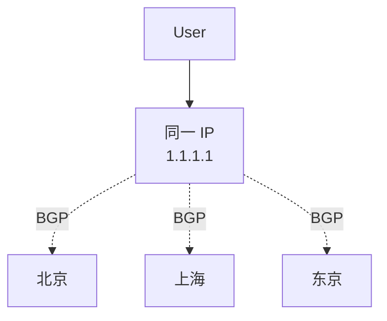

# CDN 资深面试题（20 题）

> 架构 / 缓存 / 调度 / 协议 / 安全 / 边缘 / 场景 / 运维
>
> 格式：题目 / 标准答案 / 易错点 / 追问点 / 背诵版

## 目录

1. [[#1. CDN 解决什么问题？三层架构？]]
2. [[#2. CDN 命中率怎么算？怎么优化？]]
3. [[#3. 强缓存 vs 协商缓存？ETag vs Last-Modified？]]
4. [[#4. 缓存键怎么设计？为什么默认含 query 危险？]]
5. [[#5. Stale-While-Revalidate 解决什么？]]
6. [[#6. GSLB 调度的判断维度？LDNS 不准怎么办？]]
7. [[#7. HTTP DNS 解决什么？]]
8. [[#8. Anycast 是什么？]]
9. [[#9. 回源风暴怎么防？]]
10. [[#10. HTTP/2 vs HTTP/1.1 核心区别？]]
11. [[#11. HTTP/3 解决什么？QUIC 三大优势？]]
12. [[#12. TLS 1.3 vs 1.2？0-RTT 风险？]]
13. [[#13. DDoS 攻击类型和防护？]]
14. [[#14. 防盗链方案有哪些？签名 URL 怎么实现？]]
15. [[#15. HSTS 是什么？]]
16. [[#16. 边缘计算解决什么？V8 Isolate 优势？]]
17. [[#17. HLS / DASH / WebRTC 怎么选？]]
18. [[#18. API 能上 CDN 吗？动态加速原理？]]
19. [[#19. 大文件 + P2P 加速怎么做？]]
20. [[#20. 命中率骤降怎么排查？]]

---

## 1. CDN 解决什么问题？三层架构？

### 标准答案
**CDN = 把内容缓存到离用户最近的边缘节点，用就近访问替代回源**。

解决：
- 跨地域延迟（RTT 几百 → 几十 ms）
- 源站带宽爆
- 跨网慢（电信→联通）
- DDoS 攻击（边缘清洗）
- 跨境慢/丢

**三层架构**：
- **边缘节点 L1**：直接服务用户（上千节点）
- **父层 L2**：边缘 miss 后的二级缓存，**收敛回源**（几十个）
- **源站**：原始内容

**父层作用**：N 个边缘 miss 收敛成 1 次回源，做"**源站盾**"。

### 易错点
- 误以为 CDN 万能（动态/写请求/强一致都不适合）
- 没父层直连源站（回源风暴打爆源站）

### 追问点
- 哪些不适合上 CDN？→ 动态/个性化/写请求/强一致
- 父层命中率多少？→ 60-80%，再 miss 才到源站

### 背诵版
CDN = **就近访问 + 缓存**。三层：边缘 L1 / 父层 L2 / 源站。**父层是源站盾**，N 个 miss 收敛 1 次回源。

---

## 2. CDN 命中率怎么算？怎么优化？

### 标准答案

```
边缘命中率 = HIT / (HIT + MISS + EXPIRED)
回源率 = 回源数 / 总请求 ≈ 1 - 整体命中率

健康值:
  边缘 > 90%
  整体（含父层）> 95%
  回源率 < 10%
```

**优化手段**：
1. **缓存键归一化**（去 uid / utm / 随机参数）
2. **延长 TTL**（图片 30 天，HTML 5 分钟）
3. **开启 SWR**（防过期瞬间全 miss）
4. **预热热点**（活动前推送到边缘）
5. **请求合并**（同 URL 并发回源合并 1 次）

### 易错点
- 命中率统计粒度太粗（看不出问题资源）
- 不区分缓存键导致命中率为 0（uid/_t 进 key）
- TTL 太短（资源变化少不必要）

### 追问点
- 命中率为什么每提升 10% 回源带宽降一半左右？→ 流量分布幂律
- HTML 命中率为什么低？→ 变化频繁 + 个性化

### 背诵版
**命中率 = HIT / (HIT+MISS+EXPIRED)**。优化：**缓存键归一化 + 延长 TTL + SWR + 预热 + 请求合并**。

---

## 3. 强缓存 vs 协商缓存？ETag vs Last-Modified？

### 标准答案

| | 强缓存 | 协商缓存 |
| --- | --- | --- |
| 指令 | Cache-Control / Expires | ETag / Last-Modified |
| 流程 | 不发请求，本地返回 | 发请求问源站 |
| 状态码 | 200 from cache | 304 / 200 |

**ETag vs Last-Modified**：

| | Last-Modified | ETag |
| --- | --- | --- |
| 精度 | 秒 | 内容哈希 |
| 时钟问题 | 有（CDN 时间不同步） | 无 |
| 1 秒内多次改 | 判不出 | 能区分 |
| 推荐 | 弱 | **强** |

**max-age vs s-maxage**：
- max-age 给浏览器看
- s-maxage 给 CDN 看（覆盖 max-age）
- **CDN 可以缓存比浏览器更久**（CDN 能统一刷新）

### 易错点
- ETag 用时间戳生成（每次都变 → 失效）
- 只用 Last-Modified（CDN 时钟不同步问题）
- max-age 和 s-maxage 设一样（浪费 CDN 优势）

### 追问点
- 强弱 ETag 区别？→ W/"abc" 弱（允许压缩差异）；"abc" 强（字节完全相同）
- 304 节省什么？→ 只回 header 不回 body，节省带宽

### 背诵版
**强缓存不发请求（max-age）**，**协商缓存发请求验证（ETag）**。**ETag 优于 Last-Modified**：精度 + 无时钟问题。

---

## 4. 缓存键怎么设计？为什么默认含 query 危险？

### 标准答案

默认缓存键：`host + path + query_string`。

**危险**：
```
/api/list?page=1&uid=123&_t=1700000000
↓
key 含 uid 和 _t → 每个用户每次都不同 → 命中率 0
```

**优化**：
- 过滤无关参数（uid / utm_* / _t / 随机数）
- 慎用 Vary（改用归一化）
- 设备归一化（mobile/desktop 两个 key）
- 静态资源带版本（a.v2.jpg）

```
ignore_query: [uid, utm_source, utm_medium, _t, __rnd]
```

### 易错点
- 全部 query 进 key（命中率 0）
- 用 `Vary: User-Agent`（千种 UA 各一份缓存）
- 用 `Vary: Cookie`（每用户一份，灾难）

### 追问点
- Vary 适合什么？→ Accept-Encoding（gzip/br 分开缓存）
- 个性化数据怎么办？→ 不缓存 / 边缘函数动态拼接

### 背诵版
**缓存键默认含 query 危险**：营销参数 / uid / 随机数全过滤。**Vary 慎用**，用归一化（mobile/desktop）替代。

---

## 5. Stale-While-Revalidate 解决什么？

### 标准答案

```
Cache-Control: max-age=60, stale-while-revalidate=300
```

- 60 秒内新鲜直接返回
- 60-360 秒：**返回旧的给用户（快）+ 后台异步更新**
- 360 秒后：等新内容

**解决问题**：
- 缓存过期瞬间所有请求回源 → 源站打爆
- 用户等待时间

**用户永远不等**，回源压力错峰。大厂视频/新闻网站标配。

### 易错点
- 不开 SWR（过期瞬间雪崩）
- SWR 时间太短（保护不到位）
- 关键业务数据用 SWR（用户看到旧数据）

### 追问点
- 与请求合并的区别？→ 请求合并是同时间多请求合 1 次回源；SWR 是过期后立即返旧 + 后台拉新
- 实时性高的接口能用吗？→ 不能，SWR 容忍秒级旧数据

### 背诵版
**SWR = 过期返旧 + 后台拉新**。用户不等 + 回源错峰。**命中率稳定的关键**，大厂标配。

---

## 6. GSLB 调度的判断维度？LDNS 不准怎么办？

### 标准答案

GSLB 维度：
- **GeoIP**（地理位置）
- **运营商**（电信/联通/移动）
- **节点容量**（实时心跳）
- **节点健康**（探测 + 业务上报）
- **链路质量**（拨测）

**LDNS 不准问题**：
```
上海用户用 8.8.8.8（Google DNS）
GSLB 看到 LDNS = 美国
返回美国节点 → 极慢
```

**解决**：
- **EDNS Client Subnet (ECS)**：DNS 查询带用户子网
- **HTTP DNS**：直接看用户出口 IP
- 推用户用本地运营商 DNS

### 易错点
- 完全相信 LDNS（精度差）
- 不支持 ECS（被 8.8.8.8 折磨）
- 跨网调度错（电信用户给联通节点）

### 追问点
- ECS 哪些 LDNS 支持？→ Google DNS / 阿里 DNS / 主流 CDN，老旧 LDNS 不支持
- DNS TTL 怎么设？→ 60-300s 平衡灵活性和压力

### 背诵版
GSLB = **GeoIP + 运营商 + 容量 + 健康 + 链路**。LDNS 不准用 **ECS 或 HTTP DNS** 解决。

---

## 7. HTTP DNS 解决什么？

### 标准答案

**LocalDNS 痛点**：
- 运营商劫持（插广告/篡改）
- 跨网调度差（LDNS 误判）
- ECS 不普及
- TTL 不准（客户端缓存超期）
- DNS 污染

**HTTP DNS**：
```
GET https://203.107.1.1/d?host=cdn.example.com
返回: {"ips": ["1.2.3.4"], "ttl": 60}
```

特点：
- 看**用户真实出口 IP**（不是 LDNS）
- 走 HTTP/HTTPS 不被劫持
- 客户端控制缓存
- 多级降级（HTTPDNS → LocalDNS → 本地缓存）

**移动 App 主流方案**：阿里、字节、腾讯、美团 App 内部都自建。

### 易错点
- 只用 HTTP DNS 不留 LocalDNS 兜底（HTTP DNS 挂全挂）
- 没有客户端缓存（弱网/断网无法用）
- TTL 设太长（IP 变了客户端还用旧的）

### 追问点
- HTTP DNS 怎么部署？→ Anycast IP + 全球节点
- 失败怎么降级？→ HTTPDNS → LocalDNS → 本地缓存

### 背诵版
HTTP DNS = **HTTP 接口直接查 IP**，看用户真实 IP，不被劫持。**移动 App 标配**，多级降级（HTTPDNS / LocalDNS / 缓存）。

---

## 8. Anycast 是什么？

### 标准答案

**多个节点广播同一个 IP，BGP 路由把用户导向最近节点**。



**优势**：
- 调度精度高（按物理路由）
- 故障切换快（秒级 BGP 收敛）
- DDoS 自带分散（攻击流量分散全球）

代表：**Cloudflare**（全球 300+ 节点共享 IP）、Google、Facebook。

**国内厂商少用**：BGP 复杂 + 跨运营商签约成本高。

### 易错点
- 误以为国内 CDN 用 Anycast（多数用 DNS 调度）
- 误以为 Anycast 比 DNS 强一定好（成本和技术门槛高）

### 追问点
- Anycast vs DNS 调度？→ Anycast 按物理路由，更精确；DNS 按 LDNS 推断，需要 ECS
- Cloudflare 怎么做的？→ 全球 BGP + 多运营商签约

### 背诵版
Anycast = **多节点广播同一 IP，BGP 路由就近**。优势：精度 + 切换快 + 自带 DDoS 分散。**Cloudflare 杀手锏**。

---

## 9. 回源风暴怎么防？

### 标准答案

**回源风暴**：热点资源同时过期 → N 个边缘并发回源 → 源站打爆。

**多管齐下**：
1. **父层收敛**：N 个边缘 miss 合 1 次回源
2. **请求合并 Request Coalescing**：同 URL 并发请求合 1 次
3. **SWR**：过期返旧 + 异步更新
4. **TTL 加随机偏移**：`max-age + rand(0,600)` 防同时过期
5. **主动预热**：活动前推送到边缘
6. **源站防御**：限流 + Redis 本地缓存 + 降级兜底

```
活动开始前 30 分钟 → 全网预热
开始时全 HIT → 0 回源
```

### 易错点
- 单一手段（只开 SWR 不做请求合并 → 仍可能被打爆）
- TTL 整齐过期（必雪崩）
- 没有源站防御（CDN 失效全打源站）

### 追问点
- 双 11 怎么准备？→ T-90 评估 / T-30 扩容 / T-7 全链路压测 / T-1 预热 / T+0 实时盯
- 请求合并怎么实现？→ 边缘节点同 URL 锁，并发请求等 1 次回源结果共享

### 背诵版
**父层收敛 + 请求合并 + SWR + TTL 随机 + 主动预热 + 源站防御**。回源风暴是 **CDN 第一杀手**，必须多层叠加。

---

## 10. HTTP/2 vs HTTP/1.1 核心区别？

### 标准答案

| | HTTP/1.1 | HTTP/2 |
| --- | --- | --- |
| 协议 | 文本 | 二进制 |
| 连接 | 每域名 6 个 | 1 个 |
| 复用 | 无（pipeline 失败） | **多路复用** |
| 头部 | 重复发 | **HPACK 压缩** |
| 推送 | ❌ | Server Push（已废弃） |
| 安全 | 可选 | 强制 HTTPS |

**多路复用**：单 TCP 连接多 Stream 并发，帧交错传输。

**收益**：连接数 6 → 1，并发请求 6 → 100+，首屏时间快 30-50%。

**HTTP/2 域名分片是反模式**（HTTP/1.1 时代用来突破 6 连接限制，HTTP/2 反而破坏多路复用）。

### 易错点
- HTTP/2 时代还在做域名分片（反模式）
- 误以为 HTTP/2 完全无队头阻塞（应用层无，但 TCP 层仍有）
- 忘了 HTTP/2 必须 HTTPS

### 追问点
- 多路复用怎么实现？→ 二进制分帧 + Stream ID + 帧交错
- HPACK 压缩比？→ 90%+（第一次后头部基本走索引）

### 背诵版
HTTP/2 = **二进制 + 多路复用 + HPACK + HTTPS**。单连接 100+ 并发请求。**域名分片是反模式**。

---

## 11. HTTP/3 解决什么？QUIC 三大优势？

### 标准答案

**HTTP/2 痛点**：
- TCP 队头阻塞（一包丢失阻所有 Stream）
- TCP+TLS 多次握手（3-RTT）
- 移动切网重连

**HTTP/3 = QUIC + UDP**，三大优势：

1. **无队头阻塞**：每个 Stream 独立可靠，单包丢失只阻塞自己
2. **0-RTT / 1-RTT 握手**：内置 TLS 1.3，复连 0-RTT
3. **连接迁移**：用 ConnectionID 标识连接，IP 变了连接不断（WiFi → 4G 无缝）

**部署**：Cloudflare 全量 / Google YouTube 全量 / 国内主流 CDN 大部分支持。

**代价**：
- UDP 在防火墙被限速 / 丢弃
- 用户态实现 → CPU 开销高
- 必须保留 HTTP/2 回退

### 易错点
- 误以为 HTTP/3 解决一切（防火墙 / CPU 问题）
- 不留 HTTP/2 回退（UDP 不通时全挂）
- 0-RTT 用于非幂等（重放攻击）

### 追问点
- 为什么基于 UDP？→ TCP 内核协议升级慢，UDP 用户态可灵活实现
- ConnectionID 怎么维持？→ 不依赖 IP/Port，用独立 ID 标识

### 背诵版
HTTP/3 = QUIC over UDP，**无队头阻塞 + 0-RTT + 连接迁移**。**移动 + 弱网杀手**。必须 **HTTP/2 回退**。

---

## 12. TLS 1.3 vs 1.2？0-RTT 风险？

### 标准答案

| | TLS 1.2 | TLS 1.3 |
| --- | --- | --- |
| 完整握手 | 2-RTT | **1-RTT** |
| 重连 | Session Resumption 1-RTT | **0-RTT** |
| 加密套件 | 复杂 + 弱算法 | 精简 + 强制前向安全 |
| 性能 | 慢 | **快 50%+** |

**0-RTT 风险**：可被**重放攻击**：
- 攻击者抓了 0-RTT 数据 → 重放
- 服务端无法区分原始请求和重放

**修复**：
- 0-RTT **只允许幂等操作**（GET / 查询）
- 非幂等（POST 订单 / 转账）走 1-RTT
- nonce / 时间戳防重放（业务层）

CDN 默认 0-RTT 只对幂等启用。

### 易错点
- 0-RTT 用于支付（重放灾难）
- 还在用 TLS 1.2（性能损失 + 安全弱）
- 证书链冗余（握手包大）

### 追问点
- TLS 1.3 加密套件？→ AES-GCM / ChaCha20-Poly1305 强制前向安全
- ECDSA vs RSA？→ ECDSA 密钥短计算快，推荐

### 背诵版
**TLS 1.3 完整握手 1-RTT，重连 0-RTT，比 1.2 快 50%+**。**0-RTT 重放风险，只允许幂等**。

---

## 13. DDoS 攻击类型和防护？

### 标准答案

**网络层 L3/L4**：
| 类型 | 防护 |
| --- | --- |
| SYN Flood | SYN Cookie / SYN Proxy |
| UDP Flood | 流量清洗 |
| 反射放大（DNS/NTP/Memcached） | 关 UDP / 清洗中心 |

**应用层 L7（CC 攻击）**：
- 特点：合法 HTTP，量大，集中打慢接口
- 防护：
  - JS Challenge（爬虫不会执行 JS）
  - 速率限制（IP/UA/Cookie）
  - CAPTCHA（reCAPTCHA / hCaptcha）
  - 行为指纹
  - 威胁情报

**经典事件**：2018 年 GitHub 1.35Tbps Memcached 反射攻击（放大 50000 倍）。

### 易错点
- 只防网络层不防应用层（CC 直接绕过）
- 没分级防护（基础免费档扛不住 50G+ 攻击）
- WAF 默认开但不调（误杀业务）

### 追问点
- CC 攻击怎么识别？→ 行为模式（同 IP 大 QPS / 集中打 DB 接口）
- 大厂 DDoS 方案？→ Cloudflare Anycast / 阿里 DDoS 高防 / AWS Shield

### 背诵版
**网络层 L3/L4**：SYN Cookie / 流量清洗 / 关 UDP。**应用层 CC**：JS Challenge + 限速 + CAPTCHA + 威胁情报。**多层防御**。

---

## 14. 防盗链方案有哪些？签名 URL 怎么实现？

### 标准答案

**方案对比**：

| | Referer 防盗链 | 签名 URL | Token 鉴权 | IP 白名单 |
| --- | --- | --- | --- | --- |
| 强度 | 弱（可伪造） | **强** | 强 | 中 |
| 适合 | 简单场景 | 通用 | API | 内部 |

**签名 URL 实现**：
```go
sign = HMAC(secret, path + expires)
URL = original?expires=1700000000&sign=abc123hash

CDN 边缘验证:
  当前时间 < expires
  sign == HMAC(secret, path + expires)
不通过 → 403
```

阿里云三种鉴权：
- A 类：URL 带 timestamp + sign
- B 类：路径前缀加 sign（视频流）
- C 类：路径中嵌入 sign（最隐蔽）

### 易错点
- 只用 Referer（可伪造）
- 签名 secret 泄漏
- 没有 expires（永久有效）

### 追问点
- 怎么对抗用户分享链接？→ 短期 expires（5-30 分钟）+ 绑定 IP/UA
- secret 怎么管理？→ 配置中心 + 定期轮换

### 背诵版
**Referer 弱、签名 URL 强**。签名 = HMAC(secret, path+expires)。CDN 边缘验签 + 检过期。**阿里 A/B/C 三种鉴权**。

---

## 15. HSTS 是什么？

### 标准答案

**HSTS（HTTP Strict Transport Security）**：响应头强制浏览器走 HTTPS：

```
Strict-Transport-Security: max-age=31536000; includeSubDomains; preload
```

效果：
- 浏览器 1 年内对此域名**强制 HTTPS**（防降级攻击）
- `includeSubDomains` 子域名也强制
- `preload` 加入浏览器**预加载列表**，永久 HTTPS

**注意**：preload 是**单向操作**，加入后不能取消。某子域要 HTTP → 永久无法访问。

### 易错点
- preload 配置错（永久无法回退）
- 把 includeSubDomains 用了但子域没准备好
- max-age 太短（防御弱）

### 追问点
- 怎么从 preload 移除？→ 申请移除（很慢，1-3 月），紧急用别的域名
- HSTS 防什么？→ 中间人降级攻击（攻击者拦截把 HTTPS 改 HTTP）

### 背诵版
HSTS = **强制浏览器 1 年内走 HTTPS**。`preload` **永久 HTTPS 单向操作**，慎用。**防降级攻击**。

---

## 16. 边缘计算解决什么？V8 Isolate 优势？

### 标准答案

**边缘计算 = 把代码跑在 CDN 边缘节点上**，离用户最近。

**收益**：
- 延迟（边缘 10ms vs 源站 100ms+）
- 减轻源站负载（前置鉴权/限流）
- 个性化响应（CDN 静态做不到）

**三种运行时**：

| | V8 Isolate | 容器 | WASM |
| --- | --- | --- | --- |
| 启动 | **< 5ms** | 100-500ms | < 10ms |
| 内存 | 几 MB | 几十-几百 MB | 几 MB |
| 语言 | JS/TS | 任意 | 多语言（编译到 WASM） |
| 代表 | **Cloudflare Workers** | Lambda@Edge | Fastly Compute |

**V8 Isolate 优势**：V8 引擎共享，每 Worker 跑独立 Isolate（沙箱），启动只需创建上下文。

### 易错点
- 边缘做复杂业务（资源限制 + 强一致做不到）
- Lambda@Edge 冷启动接受不了（用 Workers 替代）
- 边缘存大量状态（KV 是最终一致）

### 追问点
- 适合什么？→ 鉴权 / A-B / 个性化 / 限流 / 改写
- 不适合？→ 复杂业务 / 强一致 / 大计算

### 背诵版
边缘计算 = **代码跑边缘节点**。V8 Isolate **启动 < 5ms**，Cloudflare Workers 杀手锏。**鉴权/A-B/限流/个性化**适合。

---

## 17. HLS / DASH / WebRTC 怎么选？

### 标准答案

| 协议 | 延迟 | 适合 |
| --- | --- | --- |
| **HLS** | 6-30s | 兼容性最佳（iOS/Android 原生），秀场 |
| **DASH** | 2-10s | 性能好（YouTube 主力） |
| **HTTP-FLV** | 2-5s | PC 直播，已衰退 |
| **LL-HLS** | 1-3s | Apple 推的低延迟 HLS |
| **WebRTC** | < 500ms | 连麦 / 互动 / 电商直播 |
| **SRT** | 100ms | 推流替代 RTMP，抗丢包 |

**演进**：标准 HLS 30s → LL-HLS 1-3s → WebRTC 500ms。电商/游戏直播主流 WebRTC。

**码率自适应（ABR）**：主 m3u8 列多码率（480p/720p/1080p），播放器按带宽切换。

### 易错点
- 电商直播用标准 HLS（延迟 30s 不可接受）
- 移动端用 FLV（不支持）
- 全用 WebRTC（基础设施成本高）

### 追问点
- 大主播 1 推百万拉怎么做？→ 边缘转码 + 树状分发
- 首屏秒开？→ 关键帧前置 + CDN 预热 + 播放器预拉前几秒

### 背诵版
**HLS 兼容好慢、DASH 性能好、LL-HLS 低延迟、WebRTC 实时**。电商/游戏 WebRTC，秀场 HLS。**ABR 码率自适应**。

---

## 18. API 能上 CDN 吗？动态加速原理？

### 标准答案

**部分能**：
- 可缓存 API（列表/详情/公共数据）→ 上 CDN
- 个性化/写入 API → 上**动态加速 DSA**
- 强一致 → 不上

**动态加速原理**：**不缓存，但加速链路**：
1. **TCP 长连接**（边缘 ↔ 父层 ↔ 源站全程长连接，避免握手）
2. **智能选路**（实时测链路质量，避开拥塞）
3. **协议升级**（源站 HTTP/1.1，CDN 内部 HTTP/2 / QUIC）

**效果**：跨国 API 500ms → 150ms（**2-5 倍加速**）。

### 易错点
- API 全上 CDN 缓存（个性化 API 命中率 0）
- 写接口上 CDN（数据不一致）
- 期望 DSA 加速 10 倍（实际 2-5 倍）

### 追问点
- 部分缓存的 API 怎么设？→ Cache-Control 细粒度，每接口单独
- DSA 大厂方案？→ 阿里 DCDN / 腾讯 ECDN / Cloudflare Argo

### 背诵版
**API 部分上**：可缓存走缓存，个性化走 DSA。**DSA = 不缓存但加速链路**：长连接 + 选路 + 协议升级。**2-5x**。

---

## 19. 大文件 + P2P 加速怎么做？

### 标准答案

**大文件下载特点**：GB 级 / 用户希望并发 / 断点续传必备。

**核心手段**：
- **Range + 分片并发**：100MB 分 4 片并发，速度 3-4x
- **P2P 加速**：CDN（80%）+ P2P 邻近用户（20%），节省 CDN 成本 50%
- **边缘 SSD 缓存**：大文件热片段缓存

**P2P 典型**：
- 腾讯游戏 P2P
- Windows 更新 P2P
- 迅雷 / aria2 客户端
- B 站 PCDN

**Range 必备**：CDN 必须支持 Range 才能做视频拖动 / 大文件断点续传。

### 易错点
- 不开 Range（不支持拖动）
- 单线程下载（速度慢 3-4 倍）
- 不上 P2P（CDN 成本爆炸）

### 追问点
- P2P 怎么发现邻近用户？→ Tracker / DHT / NAT 穿透
- 大文件怎么算成本？→ 流量 + CDN 节点 SSD 容量

### 背诵版
**Range + 分片并发 + P2P + 边缘 SSD 缓存**。**P2P 节省 CDN 成本 50%**。腾讯游戏 / B 站 PCDN 都用。

---

## 20. 命中率骤降怎么排查？

### 标准答案

**排查路径**：
1. **看时间点**（发版前后？）
2. **看影响范围**（全局 vs 局部）
3. **查最近的配置变更**
4. **看缓存键变化**（是否新加 query 参数）
5. **看 Vary 头**
6. **监控分布**（按 URL / Host）

**常见原因**：
- 新加随机参数（uid / _t / utm_*）→ 缓存键碎片化
- 改 Cache-Control（max-age 变短）
- 加 Vary 头
- TTL 改动
- Cookie 进缓存键

**真实事故案例**：发版加了 SDK 上报 `?_t=timestamp` → 命中率从 95% → 40% → 源站打爆。

**修复**：
- 紧急：CDN 配置 `ignore_query: [_t]`
- 治本：SDK 不带 URL 参数，用 POST body 或 header

### 易错点
- 不看时间维度（发版关联性）
- 不分维度看（全局 vs 单 URL）
- 没有命中率告警（事后才发现）

### 追问点
- 怎么提前发现？→ 命中率分位监控（按 URL/Host）+ 阈值告警（< 90% 立即通知）
- 上线前怎么避免？→ CDN 配置审核流程 + 灰度发布

### 背诵版
排查：**时间点 → 范围 → 配置变更 → 缓存键 → Vary**。**最常见**：新加随机参数导致缓存键碎片化。**配置审核 + 灰度 + 告警**预防。

---

## 复习建议

**面试前 1 天**：通读"背诵版"。

**面试前 1 周**：每天 3-5 题深度看，结合 11-cdn 各篇。

**实战检验**：
- 能不能讲清楚 CDN 三层架构 + 父层作用？
- 能不能解释为什么命中率每提升 10% 回源带宽降一半？
- 能不能完整描述回源风暴的多层防御？
- 能不能区分 HLS / DASH / WebRTC 适用场景？
