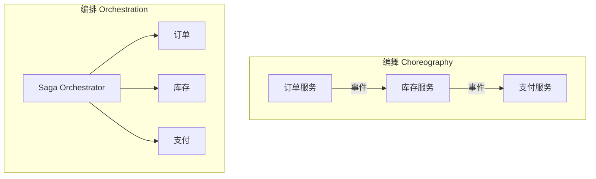
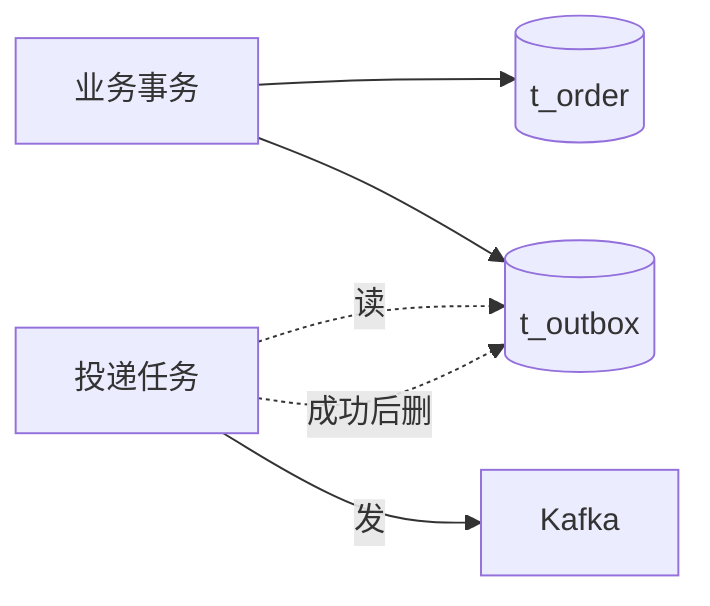

# DDD 资深面试题（20 题）

> 战略 / 战术 / 聚合 / 架构 / CQRS / Go 落地 / 反模式 / 大厂案例
>
> 格式：题目 / 标准答案 / 易错点 / 追问点 / 背诵版

## 目录

1. [DDD 是什么？解决什么问题？](#q1)
2. [什么是限界上下文？怎么划分？](#q2)
3. [通用语言为什么重要？](#q3)
4. [核心域 / 支撑域 / 通用域怎么区分？](#q4)
5. [实体 vs 值对象怎么区分？](#q5)
6. [聚合根的职责？为什么外部只能引用聚合根？](#q6)
7. [一个事务为什么只改一个聚合？](#q7)
8. [跨聚合怎么引用？](#q8)
9. [仓储 vs DAO 区别？](#q9)
10. [领域服务 vs 应用服务区别？](#q10)
11. [领域事件 vs 集成事件？](#q11)
12. [什么是防腐层？什么时候用？](#q12)
13. [六边形架构 vs 整洁架构 vs 洋葱？](#q13)
14. [CQRS 适合什么场景？一定要用 ES 吗？](#q14)
15. [事件溯源（ES）的优劣？](#q15)
16. [Saga 长事务怎么实现？编舞 vs 编排？](#q16)
17. [Outbox 模式解决什么？](#q17)
18. [DDD 和微服务什么关系？](#q18)
19. [贫血模型 vs 充血模型？](#q19)
20. [DDD 项目目录怎么组织？Repository 接口放哪？](#q20)

---

<a id="q1"></a>
## 1. DDD 是什么？解决什么问题？

### 标准答案
**DDD（领域驱动设计）= 让代码贴近业务，用通用语言对齐业务和开发**。它解决**业务复杂度**而非技术复杂度。

核心做法：
- 战略：用**事件风暴**找出**限界上下文**，区分**核心 / 支撑 / 通用**子域
- 战术：用**实体 / 值对象 / 聚合 / 领域服务 / 仓储 / 领域事件**建模

不解决：网络/并发/性能（那是框架/中间件的事）。

### 易错点
- 把 DDD 当万能药（简单 CRUD 用 DDD = 过度设计）
- 把 DDD 当技术问题（其实是业务问题，没有业务专家参与就废了）
- 只看战术不看战略（边界乱划，再好的聚合也救不回来）

### 追问点
- 什么时候不该用 DDD？→ 简单 CRUD / 数据迁移 / 团队没人懂
- DDD 学习曲线陡，怎么团队推广？→ 1-2 人吃透 + 试点 + 模板 + 持续 review

### 背诵版
DDD = 让代码贴近业务的方法论，**战略找边界、战术建模型**。适合**复杂业务核心域**，不适合简单 CRUD。核心是**通用语言**和**限界上下文**。

---

<a id="q2"></a>
## 2. 什么是限界上下文？怎么划分？

### 标准答案
**限界上下文（BC）= 明确边界，边界内通用语言一致；边界外可同名不同义**。

例：电商里"商品"，销售上下文关心名称/价格/描述，库存上下文关心 SKU/库存数/位置，物流上下文关心重量/体积/运费——**同名 Product，结构和职责完全不同**。

划分依据：
- **业务能力**（销售/库存/物流）
- **通用语言一致性**（边界内术语一致）
- **变化频率**（一起变的合一起）
- **团队边界**（康威定律）

### 易错点
- 误以为 BC = 微服务（不一定 1:1，1 个微服务可以含多个紧密 BC）
- 误以为 BC = 数据库表（按业务能力划，不按表）
- 边界形同虚设（包名上分了，代码里随便 import）

### 追问点
- BC = 微服务吗？→ 不一定，BC ≈ 微服务候选
- 怎么发现 BC？→ 事件风暴：领域事件 → 命令 → 聚合 → 上下文

### 背诵版
BC = 边界内通用语言一致的代码区域，按**业务能力 + 通用语言 + 变化频率 + 团队**划分。BC ≈ 微服务候选，**不强制 1:1**。

---

<a id="q3"></a>
## 3. 通用语言为什么重要？

### 标准答案
**通用语言（Ubiquitous Language）= 业务、产品、开发、测试都用同一套术语沟通**。

价值：
- 消除翻译损耗（业务说"客户下单"，代码不能叫 `UserOrderRecord.UpdateStatus(5)`）
- 代码即文档（看类型/方法名就知道业务）
- 跨角色对齐（避免"产品说一套、代码写另一套"）

实战：术语表（Glossary）→ 必须出现在**包名 / 类型名 / 方法名 / 字段名 / 数据库列名**。

### 易错点
- 通用语言只是文档（写了不用 = 没有）
- 同词不同义（不同 BC 都叫"订单"含义不同 → 用 BC 隔离）
- 用技术术语污染（`UserDTO` 暴露技术细节）

### 追问点
- 怎么强制通用语言落地？→ Code Review 把"未对齐术语"列必查
- 跨上下文术语冲突怎么办？→ BC 隔离 + 防腐层翻译

### 背诵版
通用语言 = **跨角色统一术语**，必须出现在代码命名里。是 DDD 的灵魂，**写文档不用等于没有**。

---

<a id="q4"></a>
## 4. 核心域 / 支撑域 / 通用域怎么区分？

### 标准答案

| | 核心域 | 支撑域 | 通用域 |
| --- | --- | --- | --- |
| 定义 | 业务竞争力 | 业务必需但非核心 | 通用功能 |
| 例子（电商） | 订单/推荐 | 库存/物流 | 支付/认证/通知 |
| 投入 | 最多（资深 + DDD 充血） | 中（简化 DDD / CRUD） | 最少（外购/开源） |

**识别标准**：这个能力做得更好能让公司赢吗？是 → 核心；否 → 支撑/通用。

### 易错点
- 所有子域投入相同资源（核心被支撑拖累）
- 通用域硬要自研（重复造轮子）
- 核心域用通用方案（失去竞争力）

### 追问点
- 怎么判断是不是核心？→ 业务专家说"这是我们赚钱的核心吗"
- 核心域随时间变化吗？→ 会，例如早期搜索是核心，成熟后变支撑

### 背诵版
**核心域 DDD 重投，通用域买现成，支撑域简化**。识别标准：**这个能力是不是公司竞争力**。

---

<a id="q5"></a>
## 5. 实体 vs 值对象怎么区分？

### 标准答案

| | 实体 | 值对象 |
| --- | --- | --- |
| 标识 | 有 ID（同 ID 即同实体） | 无 ID（属性相同即相等） |
| 可变 | 可变（带状态） | 不可变（修改 = 创建新值） |
| 生命周期 | 关注 | 不关注 |
| 例子 | Order / User / Customer | Money / Address / DateRange |

**判断口诀**：**两个对象属性都一样，是同一个吗？是 → 值对象，不是 → 实体**。

例：两个 100 元钞票完全等价（值对象）；两个同名同生日的"张三"是不同的人（实体）。

### 易错点
- 滥用实体（什么都加 ID → 值对象优势丧失）
- 值对象可变（`Money` 加 setter → 失去线程安全）
- 用基础类型（`int amount` 而非 `Money` → 失去类型语义）

### 追问点
- Go 怎么实现不可变值对象？→ 字段小写不暴露 + 工厂方法 + 修改返回新值
- Address 是实体还是值对象？→ 通常值对象，但跨上下文可能是实体（如物流系统中地址可独立管理）

### 背诵版
**实体看 ID，值对象看属性**。值对象**不可变 + 无副作用**，修改返回新值。优先用值对象封装基础类型。

---

<a id="q6"></a>
## 6. 聚合根的职责？为什么外部只能引用聚合根？

### 标准答案
聚合根 = 聚合的唯一对外入口，承担四件事：
1. **状态变更入口**（所有修改经过它）
2. **不变量校验**（变更前后保证业务规则成立）
3. **生命周期管理**（内部对象的创建/删除）
4. **发布领域事件**

**为什么外部只能引用聚合根**：保证**一致性边界**。如果外部能直接改 `OrderItem.Quantity`，订单总金额校验就被绕过 → 数据不一致。

### 易错点
- 贫血聚合根（只有字段没有方法 → 业务规则跑到 Service）
- 外部直接修改内部对象（`order.Items[0].Qty = 100` 没过聚合根）
- 聚合内不变量没校验

### 追问点
- 聚合根方法 vs 领域服务怎么分？→ 单聚合内逻辑放聚合根；跨聚合放领域服务
- 怎么防止外部修改内部？→ Go 字段小写 / 内部对象不暴露 / 提供行为方法

### 背诵版
聚合根 = **唯一入口 + 不变量守门员**。四职责：**入口 / 校验 / 生命周期 / 事件**。外部只能引用聚合根，否则一致性崩。

---

<a id="q7"></a>
## 7. 一个事务为什么只改一个聚合？

### 标准答案
**铁律：一个事务只修改一个聚合**。原因：
- 聚合是**一致性边界**（聚合内强一致，聚合间最终一致）
- 跨聚合事务在**分布式系统不可行**（CAP 限制）
- 跨聚合事务**锁竞争 + 死锁** 严重

跨聚合协作怎么办：
- **应用服务编排**（多次事务 + 错误补偿）
- **领域事件 + 事件总线**（解耦最终一致）
- **Saga**（跨服务长事务）

### 易错点
- 一个 DB 事务里 Save 多个聚合（看似方便，违反铁律）
- 跨聚合用强一致硬塞 2PC（性能炸 + 死锁）
- 跨聚合用同步 RPC 当事务用（A 改了 B 改失败 → 数据不一致）

### 追问点
- 跨聚合一致性怎么保？→ 事件 + 补偿 / Saga / Outbox
- 用户感知不一致怎么办？→ 关键场景查主聚合 + 前端乐观 UI

### 背诵版
**一事务一聚合是铁律**。聚合内强一致（事务），聚合间最终一致（事件 / Saga）。违反必有设计问题。

---

<a id="q8"></a>
## 8. 跨聚合怎么引用？

### 标准答案
**用 ID 引用，不用对象引用**。

```go
// ❌ 反例
type Order struct {
    Customer *Customer  // 直接持有 Customer 聚合
}

// ✅ 正例
type Order struct {
    CustomerID string  // 仅 ID
}
```

需要 Customer 详情时，由**应用服务**分别加载：
```go
order := orderRepo.Find(orderID)
customer := customerRepo.Find(order.CustomerID)
```

跨上下文引用：通过**防腐层 ACL** 翻译，不共享实体。

### 易错点
- 对象引用（加载 Order 把 Customer 全部 load 进来 → 性能爆）
- ORM 关联映射满天飞（join 链 5 层）
- 跨 BC 直接 import 别的 BC 的实体（边界破坏）

### 追问点
- 为什么对象引用糟糕？→ 加载性能 / 一致性边界模糊 / ORM 复杂
- 跨服务怎么拿 Customer？→ RPC + 防腐层

### 背诵版
**跨聚合用 ID 不用对象引用**。需要详情应用服务分别加载。跨 BC 用**防腐层翻译**，不共享实体。

---

<a id="q9"></a>
## 9. 仓储 vs DAO 区别？

### 标准答案

| | DAO | Repository |
| --- | --- | --- |
| 抽象层次 | 表级 | 聚合级 |
| 接口 | CRUD（save/update/delete/query） | 业务语义（FindByID / Save 整聚合） |
| 返回 | 表行（DO） | 聚合根（含内部实体） |
| 位置 | 基础设施层 | 接口在领域层，实现在基础设施 |
| 思维 | 数据库为中心 | 集合为中心（看作内存集合） |

例：
```go
// DAO 风格（错）
SaveOrder(o)
SaveOrderItem(item)
UpdateOrderStatus(id, status)
QueryOrdersByCustomer(custID)

// Repository 风格（对）
type OrderRepository interface {
    Save(ctx, order *OrderDO) error    // 整聚合
    FindByID(ctx, id string) (*OrderDO, error)
}
```

### 易错点
- Repository 退化成 DAO（细粒度暴露内部实体）
- Repository 含查询接口（应该走 CQRS 读侧）
- Repository 实现写在领域层

### 追问点
- 为什么 Repository 接口在领域层？→ 依赖反转（DIP），让领域不依赖 ORM
- 复杂查询放 Repository 还是单独 QueryService？→ 复杂查询走 CQRS 读侧

### 背诵版
DAO 是表级 CRUD，Repository 是**聚合级 + 业务语义**。接口在领域层（DIP），实现在基础设施。**整聚合保存**是关键。

---

<a id="q10"></a>
## 10. 领域服务 vs 应用服务区别？

### 标准答案

| | 领域服务 | 应用服务 |
| --- | --- | --- |
| 职责 | 跨实体的业务规则 | 用例编排 + 事务 + 跨聚合协作 |
| 业务规则 | 包含 | 不包含 |
| 依赖 | 领域对象 + Repository 接口 | 领域服务 + Repository + 外部接口 |
| 例子 | `TransferService.Transfer(from, to, amount)` | `OrderService.PayOrder(orderID)` 编排 5 步 |

**判断口诀**：
- 单聚合内行为 → 聚合根方法
- 跨聚合**业务规则** → 领域服务
- 跨聚合**流程编排** → 应用服务

### 易错点
- 把业务规则写在应用服务（应用服务变事务脚本）
- 把流程编排写在聚合根（聚合根膨胀）
- 没有领域服务（行为强行塞到聚合根）

### 追问点
- 应用服务能调下游 RPC 吗？→ 能，编排是它的职责
- 领域服务可以调外部 API 吗？→ 不能，要走防腐层接口

### 背诵版
领域服务**承载跨实体业务规则**，应用服务**只编排不写规则**。单聚合内行为放聚合根。

---

<a id="q11"></a>
## 11. 领域事件 vs 集成事件？

### 标准答案

| | 领域事件 | 集成事件 |
| --- | --- | --- |
| 范围 | 上下文内 | 上下文之间 / 跨服务 |
| 形式 | Go 类型 / 内存 | JSON / Protobuf |
| 传输 | 进程内 EventBus | Kafka / RabbitMQ |
| 命名 | OrderPaid | OrderPaidV1（带版本） |
| 演化 | 频繁，自由 | 必须向后兼容 |

**关键差异**：
- 领域事件**进程内**，跨聚合解耦
- 集成事件**跨进程 / 跨 BC**，必须 schema 稳定 + 版本化

### 易错点
- 拿领域事件直接跨 BC 用（紧耦合）
- 集成事件破坏性变更（删字段 / 改类型）
- 事件 schema 失控（无版本管理）

### 追问点
- 怎么演化集成事件？→ 加版本（V1/V2）+ 只加不删 + 容忍未知字段
- 进程内事件需要持久化吗？→ 通常不用（崩了重发即可），关键事件走 Outbox

### 背诵版
**领域事件进程内，集成事件跨服务**。集成事件必须**版本化 + 向后兼容**，否则下游全炸。

---

<a id="q12"></a>
## 12. 什么是防腐层？什么时候用？

### 标准答案
**防腐层 ACL（Anti-Corruption Layer）= 在边界放一层翻译器，把外部模型转成内部干净模型**。

典型场景：
- 对接遗留系统（数据结构混乱）
- 对接第三方（支付宝/微信支付/物流 SDK）
- 跨上下文集成（A BC 不想被 B BC 模型污染）

实现：
```go
type ProductServiceAdapter struct {
    sdk *AlipaySDK
}

func (a *ProductServiceAdapter) ValidateProduct(...) (*domain.Product, error) {
    resp, _ := a.sdk.QueryProduct(...)
    // 翻译外部模型 → 内部领域模型
    return &domain.Product{ID: resp.ProductID, ...}, nil
}
```

业务代码看到的永远是干净的 `Product`，**不感知第三方**。

### 易错点
- 没有防腐层，第三方模型直接渗透到领域
- 防腐层做太厚（业务规则跑到 ACL）
- 防腐层只翻译不校验（外部脏数据进入领域）

### 追问点
- ACL 放哪一层？→ 基础设施层
- 跨 BC 必须用 ACL 吗？→ 上游强势/不可控时必须，对等团队可商量共享 schema

### 背诵版
ACL = **边界翻译器**，把外部脏模型转内部干净模型。**对接第三方/遗留系统/跨上下文**必备。

---

<a id="q13"></a>
## 13. 六边形架构 vs 整洁架构 vs 洋葱？

### 标准答案
**核心思想完全一致**：领域独立 + 依赖反转 + 接口隔离。

| | 六边形（端口适配器） | 整洁架构 | 洋葱 |
| --- | --- | --- | --- |
| 视图 | 内核 + 端口/适配器 | 同心圆（Entity/UseCase/Adapter/Framework） | 同心圆（Domain/DomainSvc/AppSvc/Infra） |
| 强调 | 内外隔离 | 依赖法则（外向内） | 内核独立 |

**实质等价**，差别在术语和图示风格。**团队选一种统一即可**。

经典四层（接口/应用/领域/基础设施）也是一脉相承。

### 易错点
- 纠结哪种架构最好（其实差不多）
- 各种架构混用（团队混乱）
- 死守教条不务实（如领域层绝不能有 GORM 标签）

### 追问点
- 务实派 vs 严格派的取舍？→ 务实派允许领域层有 GORM 标签，但不依赖 *gorm.DB
- 没有 K8s/微服务能用六边形吗？→ 可以，单体也能用

### 背诵版
六边形 / 整洁 / 洋葱 **核心一致**：**领域独立 + 依赖反转**。差别在术语和图。**团队选一种统一**。

---

<a id="q14"></a>
## 14. CQRS 适合什么场景？一定要用 ES 吗？

### 标准答案
**CQRS（命令查询职责分离）= 写模型和读模型分开**。

适合：
- 读写比例悬殊（读 >> 写）
- 查询复杂多变（搜索、报表、统计）
- 领域模型不希望被查询拖累

不适合：
- 简单 CRUD
- 读写需求一致

**不强制用 ES**：
- 最简：写主库 + 读从库
- 中等：写关系库 + 读 ES（异构存储）
- 极致：写事件流 + 读投影（这才是 ES）

### 易错点
- 简单 CRUD 强上 CQRS（维护爆炸）
- CQRS = ES 等号思维（其实独立）
- 读写一致性期望太高（最终一致是常态）

### 追问点
- 读写延迟怎么办？→ 关键场景查主库 / 前端乐观 UI / 监控同步延迟
- 读模型怎么构建？→ 订阅写侧事件 → 投影服务更新

### 背诵版
CQRS = 读写分离的方法论，**不强制 ES**。轻量做法：**主库写 + 从库读**。复杂场景再用异构存储 + 投影。

---

<a id="q15"></a>
## 15. 事件溯源（ES）的优劣？

### 标准答案
**ES = 不存当前状态，存所有变更事件，状态从事件回放得来**。

```
传统: UPDATE order SET status='paid' WHERE id=1
ES:   APPEND OrderPaid{order_id:1, paid_at:...}
状态从事件流回放
```

**优势**：
- 完整审计 / 历史溯源
- 时间旅行（任意时刻状态可还原）
- 易于派生多读模型
- 与 CQRS 协同好

**劣势**：
- 实现复杂
- 查询慢（要回放，需快照优化）
- 事件 schema 演化难
- 学习曲线陡

适合：金融/合规/订单状态机复杂的业务。普通 CRUD 不要上。

### 易错点
- 把 ES 当万能（普通业务上 ES 杀鸡用牛刀）
- 不做快照（百万事件回放秒级 → 用户崩溃）
- 事件破坏性演化（升级器 Upcaster 是必备）

### 追问点
- ES 怎么做快照？→ 每 N 个事件存一次状态，加载时从最近快照 + 后续事件回放
- 事件 schema 改了怎么办？→ Upcaster 把旧事件升级为新格式

### 背诵版
ES = **事件作为唯一真源**。**优**：审计 / 时间旅行 / CQRS 协同；**劣**：复杂 / 查询慢 / schema 演化难。**金融、复杂状态机**才用。

---

<a id="q16"></a>
## 16. Saga 长事务怎么实现？编舞 vs 编排？

### 标准答案
**Saga = 一系列本地事务 + 补偿，实现跨服务最终一致**。

两种模式：



| | 编舞 | 编排 |
| --- | --- | --- |
| 协调 | 事件驱动 | 中心 Orchestrator |
| 耦合 | 低 | 中 |
| 流程可见 | 难 | 易 |
| 适合 | 简单流程 | 复杂流程 |

**关键实现**：
- 每步**幂等**（可重试）
- 每步**有补偿**（取消/退款/释放）
- Saga 状态**持久化**（崩了能恢复）

### 易错点
- 补偿不幂等（重试 → 库存释放两次）
- 没有状态持久化（崩了 Saga 卡死）
- Saga 步骤太多（10+ → 调试地狱）

### 追问点
- Saga vs TCC？→ TCC 有 Try 阶段预留资源，隔离性更好；Saga 中间状态可见
- 编排器怎么实现？→ 状态机持久化到 DB，定时器驱动 + 失败重试

### 背诵版
Saga = **本地事务 + 补偿**。**编舞**事件驱动简单流程，**编排**中心化复杂流程。**步骤幂等 + 补偿幂等 + 状态持久化** 三必要。

---

<a id="q17"></a>
## 17. Outbox 模式解决什么？

### 标准答案
**Outbox 解决"业务事务和事件发布的原子性"问题**。

反例：
```go
db.Save(&order)              // DB 成功
bus.Publish(OrderPaid)       // MQ 失败 → 数据/事件不一致
```

Outbox 做法：


**关键**：
- 业务表和 outbox 表**同一事务**写
- 独立 worker 读 outbox 发 MQ
- 发送成功后删 outbox 行（或标记 sent）
- worker 幂等 + 重试

### 易错点
- 不用 Outbox 直接发 MQ（事件可能丢）
- Outbox 没有幂等（重发导致下游收多次 → 用 event_id 去重）
- Outbox 表无限增长（要定期清理已发送行）

### 追问点
- 替代方案？→ CDC（监听 binlog 直接发 MQ）/ Saga
- Outbox 性能？→ 加 worker + 批量读取 + 定期清理

### 背诵版
Outbox = **业务表和事件表同事务写，worker 异步发 MQ**。保证**业务成功 ↔ 事件最终发出**。无 Outbox 必丢消息。

---

<a id="q18"></a>
## 18. DDD 和微服务什么关系？

### 标准答案
**互相需要但不绑定**：
- DDD 单体应用完全可以
- 微服务**没有 DDD** 几乎一定失败（边界乱）

对应关系：
- **限界上下文 → 微服务**（不是聚合 = 服务）
- **聚合 → 服务内核心模型**
- **领域事件 → 集成事件**
- **防腐层 → 调用适配器**

**典型反模式：分布式单体**——拆了多服务但必须按顺序部署 / 改一个连改 N 个 / 跨服务事务硬塞，根因是 DDD 边界没划清楚。

### 易错点
- 等号思维：DDD = 微服务（错）
- 服务粒度太细（每个聚合一个服务 → 跨服务调用爆炸）
- 没做 DDD 战略就拆服务（边界乱）

### 追问点
- 什么时候不上微服务？→ 团队 < 50 / 业务未验证 / 没基建
- 怎么从单体到微服务？→ Modular Monolith → DDD 划界 → 边缘服务 → 核心服务

### 背诵版
**BC ≈ 微服务（不是聚合）**。DDD 不强制微服务，但**微服务非常需要 DDD**。**分布式单体**是最常见反模式。

---

<a id="q19"></a>
## 19. 贫血模型 vs 充血模型？

### 标准答案

```go
// ❌ 贫血模型
type Order struct {
    ID, Status string  // 只有字段
}
// 业务规则在 Service
func (s *OrderService) Cancel(o *Order) {
    if o.Status != "Created" { return }
    o.Status = "Cancelled"
}
```

```go
// ✅ 充血模型
type Order struct {
    ID, Status string
}
func (o *Order) Cancel() error {
    if !o.CanBeCancelled() {
        return errors.New("不允许取消")
    }
    o.Status = OrderStatusCancelled
    o.UpdatedAt = time.Now()
    return nil
}
```

**充血优势**：
- 业务规则封装（外部无法绕过）
- 实体即文档（看方法知道能做什么）
- 易测试（无依赖）
- 易演化

**贫血危害**：
- 业务规则散落 Service
- 重复代码多
- 外部能直接改字段
- 实体退化为数据袋

### 易错点
- 把贫血当成"简单"（实际是把复杂度推到 Service）
- 充血过度（聚合根塞 1000 行 → 拆领域服务）
- 配合 ORM 时字段必须导出（与封装冲突）

### 追问点
- Go 怎么实现充血？→ 行为方法挂在聚合根，关键字段不暴露 setter
- 贫血适合什么？→ 真简单 CRUD / 数据迁移工具

### 背诵版
**贫血**只有字段业务在 Service，**充血**业务封装在实体内。DDD 必须充血。**判断**：实体方法少于 3 个八成是贫血。

---

<a id="q20"></a>
## 20. DDD 项目目录怎么组织？Repository 接口放哪？

### 标准答案
按四层 + BC 切分：

```
internal/
├── domain/                  # 领域层（接口在这里）
│   └── domain_<bc>_core/
│       ├── entity.go        # 聚合根 + 实体 + 值对象
│       ├── repository.go    # ★ 接口
│       └── service.go       # 领域服务
├── application/             # 应用层
│   └── service/
├── infrastructure/          # 基础设施
│   └── repository/          # ★ 实现
├── interface/               # 接口层（HTTP/gRPC）
│   ├── handler/
│   └── dto/
└── shared/                  # 共享内核
    └── event/
```

**Repository 接口在领域层定义，实现在基础设施层**。这是**依赖反转（DIP）**的关键，让领域不知道有 MySQL/MongoDB。

```go
// domain/domain_order_core/repository.go
type OrderRepository interface {
    Save(ctx, *OrderDO) error
    FindByID(ctx, id string) (*OrderDO, error)
}

// infrastructure/repository/order_repository.go
type OrderRepositoryMySQL struct { db *gorm.DB }
func NewOrderRepository(db *gorm.DB) domain.OrderRepository {
    return &OrderRepositoryMySQL{db: db}
}
```

### 易错点
- Repository 实现写在领域层（污染）
- 接口写在基础设施层（依赖方向反了）
- DTO 渗透到领域（接口层翻译没做）
- 领域层依赖 *gorm.DB（务实派可有 GORM 标签，但不能依赖类型）

### 追问点
- 多 BC 怎么组织？→ 每 BC 自带四层（`order/`、`payment/`），shared 放共享内核
- Wire DI 怎么用？→ 编译期生成依赖图，Provider 返回接口类型

### 背诵版
**领域层定义接口，基础设施层实现**（DIP）。目录按 BC 切分，每 BC 四层（domain/application/infrastructure/interface）。**接口位置反映依赖方向**。

---

## 复习建议

**面试前 1 天**：通读所有"背诵版"，30 分钟过完。

**面试前 1 周**：每天看 3-5 题，重点看"标准答案 + 追问点"。

**面试前 1 个月**：结合 09-ddd 各篇深度学习，用 ddd_order_example 项目跑一遍。

**实战检验**：
- 能不能用通用语言讲清楚业务边界？
- 能不能识别贫血/上帝聚合/分布式单体？
- 能不能解释为什么一事务一聚合？
- 能不能设计跨聚合的最终一致方案？
