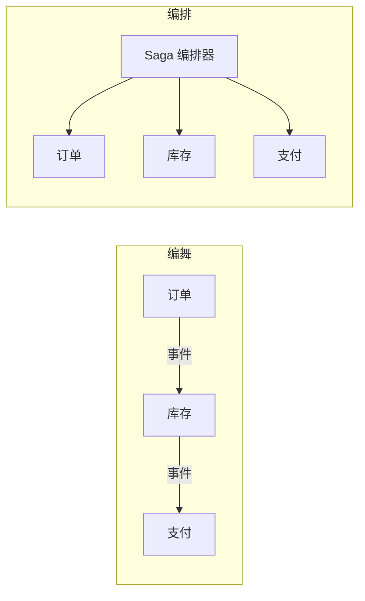
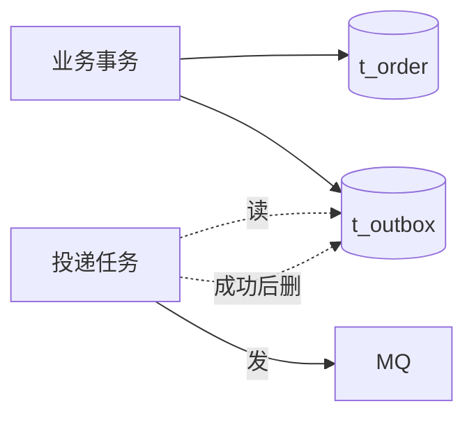
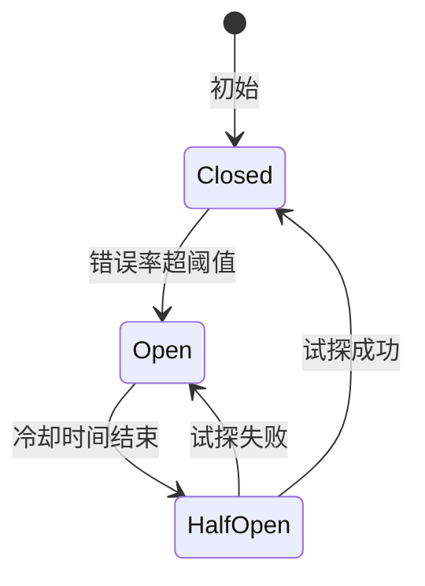
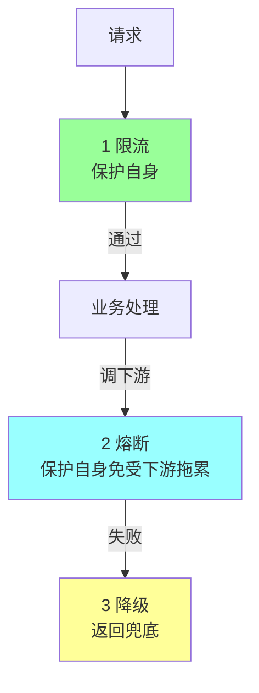

# 分布式资深面试题（20 题）

> CAP / BASE / 共识 / 事务 / 锁 / 限流熔断 / 服务发现 / 负载均衡 / 设计模式
>
> 格式：题目 / 标准答案 / 易错点 / 追问点 / 背诵版

## 目录

1. [CAP 怎么理解？为什么不能三选三？](#q1)
2. [BASE 是什么？](#q2)
3. [Paxos / Raft / ZAB / Gossip 区别？](#q3)
4. [Raft 怎么选举？怎么保一致性？](#q4)
5. [2PC / 3PC 区别？为什么 3PC 不靠谱？](#q5)
6. [TCC 是什么？什么时候用？](#q6)
7. [Saga 怎么实现？](#q7)
8. [本地消息表 / Outbox 模式？](#q8)
9. [分布式锁选型：Redis / ZK / etcd？](#q9)
10. [Redlock 真的安全吗？fencing token？](#q10)
11. [雪花算法 vs 号段 vs UUID？](#q11)
12. [限流算法：固定窗口 / 滑动窗口 / 令牌桶 / 漏桶？](#q12)
13. [熔断器状态机？](#q13)
14. [降级 / 限流 / 熔断怎么配合？](#q14)
15. [服务发现 CP 还是 AP？](#q15)
16. [负载均衡算法？P2C 是什么？](#q16)
17. [一致性 Hash 原理？虚拟节点？](#q17)
18. [幂等性怎么实现？](#q18)
19. [Snowflake 时钟回拨怎么处理？](#q19)
20. [分布式系统怎么保证一致性？](#q20)

---

## <a id="q1"></a>1. CAP 怎么理解？为什么不能三选三？

### 标准答案
**CAP**（Brewer 定理）：分布式系统在**网络分区**时只能在 C 和 A 之间取舍。

- **C（Consistency）**：所有节点同时看到相同数据
- **A（Availability）**：每次请求都有响应（不阻塞）
- **P（Partition Tolerance）**：网络分区下系统仍能工作

**关键认知**：
- **P 是必选**（分布式必有网络分区可能）
- 实际选择是 **CP** 或 **AP**

```
CP（强一致）: ZK / etcd / HBase
  分区时拒绝写（牺牲可用性）

AP（高可用）: Cassandra / DynamoDB / Eureka
  分区时仍可读写（牺牲一致性）
```

**常见误解**：CAP 不是说"任意时刻三选二"，而是**网络分区时**取舍。无分区时三者都满足。

### 易错点
- 误以为可以"三选三"
- 不区分 CP/AP 的实际表现
- 忘了 P 必选

### 追问点
- PACELC 是什么？→ CAP 扩展：分区时 P=A 或 P=C，无分区时 L=A 或 L=C（Latency 或 Consistency）
- CAP 太严格？→ 现实是动态权衡，最终一致是常态

### 背诵版
**CAP 网络分区时只能 CP 或 AP（P 必选）**。CP 强一致拒写，AP 高可用容忍不一致。**最终一致是常态**。

---

## <a id="q2"></a>2. BASE 是什么？

### 标准答案
**BASE = Basically Available（基本可用）+ Soft state（软状态）+ Eventually consistent（最终一致）**。

ACID 的反面，**互联网分布式系统主流**。

- **基本可用**：故障时降级提供核心功能（不强求 100%）
- **软状态**：允许中间状态（如订单"处理中"）
- **最终一致**：经过一段时间数据最终一致

**典型应用**：
- 缓存 vs DB（数秒延迟）
- 主从复制（毫秒级延迟）
- 跨服务事件（秒级延迟）
- 金融对账（T+1 一致）

### 易错点
- 把 BASE 当万能（金融账户级仍要强一致）
- 不监控最终一致延迟（数据丢了不知道）

### 追问点
- ACID vs BASE？→ ACID 强一致代价大，BASE 高可用最终一致代价小
- 怎么保最终一致？→ 重试 / 对账 / 补偿 / 死信

### 背诵版
BASE = **基本可用 + 软状态 + 最终一致**。ACID 反面，**互联网主流**。靠**重试 + 对账 + 补偿** 保最终一致。

---

## <a id="q3"></a>3. Paxos / Raft / ZAB / Gossip 区别？

### 标准答案

| | Paxos | Raft | ZAB | Gossip |
| --- | --- | --- | --- | --- |
| 类型 | 共识算法 | 共识算法 | 共识算法 | 弱一致 |
| 复杂度 | 极高（理论难懂） | 中（易懂易实现） | 中 | 简单 |
| 角色 | Proposer/Acceptor/Learner | Leader/Follower/Candidate | Leader/Follower | Peer |
| 用途 | Chubby / Spanner | etcd / Consul / TiKV | ZooKeeper | Cassandra / Redis Cluster |
| 一致性 | 强 | 强 | 强 | 最终 |

**Paxos 难懂**：作者 Lamport 后来出 Paxos Made Simple，仍很复杂，工业实现少（Google Chubby）。

**Raft 易懂**：把共识拆成 Leader Election + Log Replication + Safety，更简单。

**ZAB（ZooKeeper Atomic Broadcast）**：Raft 之前的工业方案，类似 Raft 但有差异。

**Gossip**：节点间随机扩散信息，**最终所有节点收到**。简单 + 容错 + 但延迟高。

### 易错点
- 误以为 Paxos = Raft（其实 Raft 是 Paxos 改良）
- 用 Gossip 当强一致（实际最终一致）
- 业务用 Paxos（自己实现风险高）

### 追问点
- Multi-Paxos vs Raft？→ Multi-Paxos 多 Leader 复杂，Raft 单 Leader 更简单
- Gossip 收敛时间？→ O(log N) 轮，N 个节点 ~10 秒级

### 背诵版
**Raft 简单实用（etcd 主流）/ Paxos 理论强但难（Chubby）/ ZAB ZK 用 / Gossip 最终一致（Cassandra/Redis）**。

---

## <a id="q4"></a>4. Raft 怎么选举？怎么保一致性？

### 标准答案

**Raft 三大模块**：
1. **Leader Election**（领导选举）
2. **Log Replication**（日志复制）
3. **Safety**（安全性）

**选举流程**：
```
1. 启动: 所有节点 Follower
2. Follower 超时（150-300ms 随机）→ Candidate
3. Candidate 自增 term + 给自己投票 + 请求其他节点投票
4. 收到多数票 → Leader
5. Leader 周期心跳（< 选举超时）保持 Leader 状态
```

**日志复制**：
```
1. Client 发请求到 Leader
2. Leader 写本地日志（未提交）
3. Leader 发 AppendEntries 到 Followers
4. 多数 Follower 写入 → Leader 提交（commit）
5. 通知 Followers 提交
6. Leader 返回 Client 成功
```

**Safety 保证**：
- 同 term 同 index 的日志相同
- Leader 完整性（已提交日志一定在新 Leader 上）
- 状态机安全（同 index 应用同样命令）

### 易错点
- 误以为 Raft 完全无 split brain（仍可能短暂出现，但不影响数据安全）
- 选举超时设太短（频繁选举）

### 追问点
- 怎么避免脑裂？→ 多数派（quorum）+ term 单调递增
- Raft 性能？→ 每写要多数确认，吞吐受限于多数派最慢

### 背诵版
**Raft 三模块：选举 + 复制 + 安全**。选举：超时 → Candidate → 多数票 → Leader。复制：Leader 多数确认 → commit。**term 单调防脑裂**。

---

## <a id="q5"></a>5. 2PC / 3PC 区别？为什么 3PC 不靠谱？

### 标准答案

**2PC（Two-Phase Commit）**：
```
Phase 1 Prepare: Coordinator 问所有 Participant "能 commit 吗"
Phase 2 Commit:  全 yes → 全 commit / 任一 no → 全 abort
```

**问题**：
- **同步阻塞**（Participant 等 Coordinator）
- **Coordinator 单点**
- **Phase 2 部分失败 → 数据不一致**

**3PC（Three-Phase Commit）**：在 2PC 上加了 CanCommit 阶段 + 超时机制。

**3PC 仍不靠谱**：
- 网络分区下仍可能不一致
- 实际工业不用（理论改进，工程意义不大）

**实战**：
- 2PC 在 DB 内部用（XA）
- 跨服务用 **Saga / TCC / 本地消息表**
- 强一致跨服务用 Paxos / Raft

### 易错点
- 误以为 3PC 比 2PC 强（理论改进但实战仍不靠谱）
- 跨服务用 2PC（性能差 + 不可靠）

### 追问点
- XA 协议是什么？→ 2PC 标准，DB 实现支持（MySQL XA）
- 为什么 Saga 替代了 2PC？→ 性能 + 可用性 + 现实需求是最终一致

### 背诵版
**2PC = Prepare + Commit，同步阻塞 + Coordinator 单点 + Phase2 不一致**。**3PC 仍不靠谱**。跨服务用 **Saga / TCC**。

---

## <a id="q6"></a>6. TCC 是什么？什么时候用？

### 标准答案

**TCC = Try / Confirm / Cancel**：

```
Try: 尝试，预留资源（冻结）
Confirm: 确认，正式执行（用预留资源）
Cancel: 取消，释放预留
```

**例**（转账）：
```
Try: 检查余额 + 冻结 100 元
Confirm: 把冻结的 100 转出 + 收方账户加 100
Cancel: 解冻 100
```

**vs Saga**：
| | TCC | Saga |
| --- | --- | --- |
| 资源预留 | Try 阶段预留 | 无 |
| 隔离性 | **较好**（预留期间其他事务不可见） | **差**（中间状态可见） |
| 实现 | 复杂（每接口三个） | 较简单 |
| 性能 | 中 | 好 |
| 适合 | 强隔离需求（金融） | 长事务（电商下单） |

**TCC 缺点**：
- 业务侵入大（每接口写 Try/Confirm/Cancel）
- 实现复杂（防悬挂 / 防空回滚 / 幂等）

### 易错点
- TCC 不做幂等（重试 / 网络异常导致 Confirm 多次）
- 没处理空回滚（Try 没执行就来 Cancel）
- 没处理悬挂（Cancel 先到，Try 后到 → 资源永久占用）

### 追问点
- 怎么防空回滚？→ Cancel 时检查 Try 是否执行过
- 怎么防悬挂？→ Cancel 后 Try 检查是否已 Cancel，若是则不执行

### 背诵版
**TCC = Try（预留）+ Confirm（正式）+ Cancel（释放）**。**隔离性比 Saga 强**，但**业务侵入大**。**金融场景**用。**幂等 + 空回滚 + 悬挂** 三防。

---

## <a id="q7"></a>7. Saga 怎么实现？

### 标准答案

**Saga = 一系列本地事务 + 补偿，实现跨服务最终一致**。

**两种模式**：
- **编舞（Choreography）**：事件驱动，无中心
- **编排（Orchestration）**：中心 Saga Orchestrator 控制流程



**关键实现**：
- 每步**幂等**（可重试）
- 每步**有补偿**（取消/退款/释放）
- Saga **状态持久化**（崩了能恢复）
- **超时处理**（重试 N 次后触发补偿）

```go
type Saga struct {
    ID    string
    Steps []SagaStep
    State State  // Running / Compensating / Done / Failed
}
type SagaStep struct {
    Name       string
    Execute    func(ctx) error
    Compensate func(ctx) error
}
```

### 易错点
- 补偿不幂等（重试 → 库存释放两次）
- 没有状态持久化（崩了 Saga 卡死）
- Saga 步骤太多（10+ → 调试地狱）

### 追问点
- 编舞 vs 编排怎么选？→ 简单流程编舞，复杂流程编排
- Seata 是什么？→ 阿里开源的分布式事务框架，支持 AT/TCC/Saga/XA

### 背诵版
Saga = **本地事务 + 补偿**。**编舞事件驱动 / 编排中心化**。**幂等 + 补偿 + 状态持久化 + 超时** 四必要。

---

## <a id="q8"></a>8. 本地消息表 / Outbox 模式？

### 标准答案

**Outbox 解决"业务事务和事件发布的原子性"问题**。



**关键**：
- 业务表和 outbox 表**同一事务**写
- 独立 worker 读 outbox 发 MQ
- 发送成功后删 outbox 行（或标记 sent）
- worker **幂等 + 重试**

**vs RocketMQ 事务消息**：
| | Outbox | 事务消息 |
| --- | --- | --- |
| 实现 | 业务自实现 + DB | MQ 内置 |
| 耦合 | 与 DB 耦合 | 与 MQ 耦合 |
| 通用性 | 强 | 仅 RocketMQ |

**替代方案**：CDC（监听 binlog 直接发 MQ）/ Debezium。

### 易错点
- 不用 Outbox 直接发 MQ（事件可能丢）
- Outbox 没有幂等（重发导致下游收多次）
- Outbox 表无限增长（要定期清理）

### 追问点
- 怎么保 worker 不重复发？→ event_id 唯一 + 已发送状态
- 高吞吐怎么办？→ worker 批量读取 + 多 worker 并发（按分片）

### 背诵版
Outbox = **业务表 + outbox 同事务，worker 异步发 MQ**。保证**业务成功 ↔ 事件最终发出**。**CDC 是替代方案**。

---

## <a id="q9"></a>9. 分布式锁选型：Redis / ZK / etcd？

### 标准答案

| | Redis | ZK | etcd |
| --- | --- | --- | --- |
| **协议** | 单实例 / Redlock | ZAB | Raft |
| **CAP** | AP（默认） | CP | CP |
| **性能** | 极高 | 中 | 高 |
| **可靠性** | Redlock 有理论缺陷 | 强 | 强 |
| **fencing token** | ❌ | ✅（zxid） | ✅（revision） |
| **适合** | 性能 + 偶发不一致可接受 | 强一致 | K8s 生态 |

**Redis 锁**：
```
SET key value NX PX 10000
释放: Lua（GET+DEL 原子）
```

**ZK 锁**：
- 临时顺序节点
- 监听前一节点
- 节点删除即释放

**etcd 锁**：
- key + lease（TTL）
- 自动续期
- key 删除释放

**实战推荐**：
- 普通业务 → Redis（性能好，接受偶发不一致）
- 强一致 → etcd（推荐，比 ZK 现代）
- K8s 内部 → etcd

### 易错点
- 普通业务用 ZK（性能浪费）
- 强一致用 Redis Redlock（理论缺陷）
- 不做 fencing（持锁超时被另一进程拿，两进程都觉得自己持锁）

### 追问点
- fencing token 怎么用？→ 持锁时获取单调递增 token，业务调用带 token，存储层校验
- 锁续约？→ Redisson 看门狗 / etcd lease keepalive

### 背诵版
**Redis 性能优偶发不一致 / ZK 强一致老牌 / etcd 强一致现代**。强一致用 **etcd 而非 Redlock**。**fencing token** 是终极保险。

---

## <a id="q10"></a>10. Redlock 真的安全吗？fencing token？

### 标准答案

**Redlock 设计**（Redis 作者）：5 个独立节点，多数派加锁。

**Martin Kleppmann 质疑**：
1. **时钟假设不可靠**：依赖各节点时钟同步，GC pause / VM 暂停 / NTP 跳变都会破坏
2. **缺 fencing token**：锁过期 + 业务慢 → 锁被另一进程拿到 → 两进程都觉得持锁

**fencing token**：
```
持锁时存储层返回单调递增 token (1, 2, 3, ...)
业务调用带 token
存储层校验：当前最大 token > 我的 token → 拒绝
```

```
T1 获取锁，token=1
T1 GC pause 30s（锁过期）
T2 获取锁，token=2
T2 写入数据，token=2 → 存储记最大 2
T1 醒来，写入数据，token=1 → 存储 max(2)>1 拒绝
```

**业界共识**：
- 普通业务 Redlock 够（接受偶发不一致）
- 强一致用 **etcd / ZK**（自带 fencing token）
- 关键交易加**业务幂等**双保险

### 易错点
- 误以为 Redlock 完美（有理论缺陷）
- 强一致场景用 Redlock（应该 etcd / ZK）
- 不做幂等（依赖锁绝对安全）

### 追问点
- ZK 怎么实现 fencing？→ zxid（事务 ID）单调递增
- 业务幂等替代 fencing 行吗？→ 行，所以普通业务 Redlock 够用

### 背诵版
**Redlock 理论缺陷：时钟假设 + 缺 fencing**。强一致用 **etcd（fencing token=revision）**。**业务幂等是终极保险**。

---

## <a id="q11"></a>11. 雪花算法 vs 号段 vs UUID？

### 标准答案

| | UUID | 雪花 Snowflake | 号段 Leaf | DB 自增 | Redis INCR |
| --- | --- | --- | --- | --- | --- |
| 长度 | 36 字符 | 64 位整数 | 64 位整数 | 64 位整数 | 64 位整数 |
| 趋势递增 | ❌ | ✅ | ✅ | ✅ | ✅ |
| 分布式 | ✅ | ✅ | ✅ | 需中心 | 需中心 |
| 性能 | 高 | **极高（本地生成）** | 高 | 中 | 高 |
| B+ 树插入友好 | ❌（随机） | ✅（趋势） | ✅ | ✅ | ✅ |
| 时钟问题 | 无 | **有** | 无 | 无 | 无 |
| 代表 | java UUID | 推特 | 美团 Leaf | - | - |

**雪花算法 64 位**：
```
1 bit 符号 + 41 bit 时间戳 + 10 bit 机器 ID + 12 bit 序列号
69 年 + 1024 机器 + 4096 ID/ms
```

**美团 Leaf**：
- 号段模式（DB 一次取一段，缓存本地）
- Snowflake 模式（基于 ZK 注册机器 ID 解决时钟问题）

### 易错点
- UUID 做主键（B+ 树分裂多，性能差）
- 雪花算法不处理时钟回拨（线上事故）
- DB 自增 + 分库（每库自增冲突）

### 追问点
- 时钟回拨？→ 拒绝服务 / 等待 / 用预留位 / Leaf 雪花用 ZK 持久化最大时间
- 机器 ID 怎么分配？→ ZK 注册 / 配置中心 / IP 取模

### 背诵版
**雪花主流（时间+机器+序列）/ 号段离散获取 / UUID 别做主键**。**时钟回拨**是雪花最大坑。美团 **Leaf** 双模式。

---

## <a id="q12"></a>12. 限流算法：固定窗口 / 滑动窗口 / 令牌桶 / 漏桶？

### 标准答案

| 算法 | 原理 | 优 | 缺 |
| --- | --- | --- | --- |
| **固定窗口** | 单位时间内计数 | 简单 | 边界突刺（窗口切换瞬间 2x 流量） |
| **滑动窗口** | 多个小窗口聚合 | 平滑 | 实现复杂 |
| **漏桶** | 固定速率出水 | 流量平滑（强制速率） | 突发流量被丢弃 |
| **令牌桶** | 固定速率生成令牌，请求消耗令牌 | 允许突发 | - |

**令牌桶最常用**：

```
桶容量 100，速率 10/s
- 平时累积令牌
- 突发流量来时可瞬间消耗（令牌够）
- 持续高流量时按 10/s 处理
```

**漏桶 vs 令牌桶**：
- 漏桶：**强制平滑**（适合速率限制）
- 令牌桶：**允许突发**（适合 QPS 限制）

**实战**：Sentinel / Guava RateLimiter 都是令牌桶。

### 易错点
- 用固定窗口忽视边界突刺（窗口结束+开始共 2x）
- 漏桶用作允许突发场景（实际限制了）
- 不区分单机 vs 分布式限流

### 追问点
- 分布式限流怎么做？→ Redis Lua（详见 [redis-20.md](redis-20.md)）
- 令牌桶 Java 实现？→ Guava RateLimiter

### 背诵版
**固定窗口简单有突刺 / 滑动窗口平滑复杂 / 漏桶强制平滑 / 令牌桶允许突发**。**令牌桶最常用**。分布式用 Redis Lua。

---

## <a id="q13"></a>13. 熔断器状态机？

### 标准答案



**三状态**：
- **Closed（关闭）**：正常放行，统计错误率
- **Open（开启）**：直接返回失败，不调下游
- **HalfOpen（半开）**：放少量请求试探下游

**关键参数**：
- 错误率阈值（如 50%）
- 最小请求数（避免少量请求误判，如 20）
- 熔断时长（如 30s）
- HalfOpen 试探请求数（如 5）

**典型实现**：Hystrix（停更）/ Sentinel / resilience4j / gobreaker。

```go
import "github.com/sony/gobreaker"

cb := gobreaker.NewCircuitBreaker(gobreaker.Settings{
    Name: "downstream",
    ReadyToTrip: func(counts gobreaker.Counts) bool {
        return counts.Requests >= 20 &&
               float64(counts.TotalFailures)/float64(counts.Requests) >= 0.5
    },
    Timeout: 30 * time.Second,
})
```

### 易错点
- 阈值死板（不分接口 / 时段）
- 没有 HalfOpen 试探（一直 Open 浪费）
- 误以为 Hystrix 还在维护（Netflix 已停更，迁 resilience4j）

### 追问点
- 熔断 vs 限流？→ 熔断保下游，限流保自身
- 熔断粒度？→ 通常服务 + 接口级，可下沉到实例级

### 背诵版
**Closed → Open → HalfOpen 状态机**。错误率超阈值开启，冷却后半开试探，成功关闭失败重开。**Hystrix 停更，用 Sentinel/resilience4j/gobreaker**。

---

## <a id="q14"></a>14. 降级 / 限流 / 熔断怎么配合？

### 标准答案



| | 对象 | 触发 | 行为 |
| --- | --- | --- | --- |
| **限流** | 自身入口 | QPS 超阈值 | 拒绝 / 排队 |
| **熔断** | 下游依赖 | 下游错误率高 | 不调下游 |
| **降级** | 自身功能 | 主动或被动 | 返回兜底 |

**典型链路**：
```
入口限流（保护自己）→ 业务执行 → 调下游 → 熔断（保护自己免受下游拖累）→ 失败 → 降级（返回兜底数据）
```

**降级三层**：
- 读降级（缓存 / 默认值）
- 写降级（异步化 / 丢弃非核心）
- 功能降级（关闭推荐 / 关闭非核心模块）

### 易错点
- 只做限流不做熔断（被下游拖死）
- 降级没预案（出事临场写）
- 三者顺序乱（应该入口限流 → 调下游熔断 → 降级兜底）

### 追问点
- Sentinel 怎么实现？→ 滑动窗口统计 + 规则引擎
- 降级开关谁触发？→ 自动（错误率阈值）+ 手动（运维一键）

### 背诵版
**限流保入口 / 熔断保下游传染 / 降级返回兜底**。链路：**入口限流 → 调下游熔断 → 降级兜底**。降级**预案化 + 一键开关 + 演练**。

---

## <a id="q15"></a>15. 服务发现 CP 还是 AP？

### 标准答案

**主流共识：AP**（高可用优先）。

理由：
- 短暂不一致**可接受**（客户端缓存 + 重试 + 熔断兜底）
- 不可用 = 整个系统不可用
- 微服务场景**可用性 > 一致性**

代表：Eureka / Nacos 临时实例（默认 AP）。

**例外**：配置中心建议 **CP**（配置应全网一致）。

**对比**：
| | CP | AP |
| --- | --- | --- |
| 代表 | ZK / etcd / Consul（默认） | Eureka / Nacos 临时 |
| 选举期间 | 不可用（30s+） | 仍可用 |
| 数据一致 | 强一致 | 短暂不一致 |
| 适合 | 强一致需求 | 可用性优先（微服务） |

### 易错点
- 服务发现用 ZK（CP，选举期间影响）
- 不做客户端缓存（注册中心挂全挂）

### 追问点
- AP 怎么处理调到死实例？→ 客户端重试 + 熔断剔除
- ZK 为什么不适合大规模注册？→ Leader 选举期间不可用 + 性能受 quorum 限制

### 背诵版
**服务发现 AP（可用 > 一致），配置中心 CP**。客户端缓存 + 重试 + 熔断兜底死实例。Eureka / Nacos 临时是 AP 代表。

---

## <a id="q16"></a>16. 负载均衡算法？P2C 是什么？

### 标准答案

| 算法 | 说明 | 适合 |
| --- | --- | --- |
| 轮询 | 依次选 | 实例同质 |
| 加权轮询 | 按权重 | 异构机器 |
| 随机 | 随机选 | 简单 |
| 最少连接 | 选活跃最少 | 长连接 |
| **P2C** | **随机两个选少的** | **现代主流** |
| 一致性 Hash | 同 key 同实例 | 缓存 / 状态依赖 |

**P2C（Power of Two Choices）**：
```go
i, j := rand.Intn(N), rand.Intn(N)
return Better(instances[i], instances[j])  // 选指标更好的
```

**P2C 优势**：
- 比"最少连接"快（不用全局排序）
- 比随机准（避免全局热点）
- 字节 Kitex / B 站 Kratos / go-zero 默认

**理论保证**：随机两选最差的概率从 1/N 降到 1/N²。

### 易错点
- 轮询面对异构机器（老机器扛不住）
- 一致性 Hash 用在无状态服务（多此一举）

### 追问点
- "指标"怎么定义？→ 活跃连接数 / 延迟 / 错误率综合
- P2C 怎么处理 cold start？→ 新实例先小权重，逐步增加

### 背诵版
**P2C 现代主流**：随机两个选少的，比最少连接快、比随机准。同质轮询 / 异构加权 / 缓存一致性 Hash。

---

## <a id="q17"></a>17. 一致性 Hash 原理？虚拟节点？

### 标准答案

**普通 Hash 加节点 → 全部 rehash → 缓存雪崩**。

**一致性 Hash**：节点和 key 都映射到 0-2³² 环上，key 顺时针找最近节点。

```
环: 0 ━━━ Node1 ━━━ Node2 ━━━ Node3 ━━━ 2^32
key 经 hash 落到环上某点，顺时针找最近 Node
```

**优势**：加/减节点只影响**相邻 1/N 数据**。

**虚拟节点**：每个物理节点映射多个虚拟节点（如 100-200 个），均匀分布在环上 → 解决数据倾斜。

```
Node1 → vNode1-1, vNode1-2, ..., vNode1-200
Node2 → vNode2-1, vNode2-2, ..., vNode2-200
```

**应用**：
- Redis Cluster slot（不是真一致性 Hash 但思想类似）
- Memcached 客户端 / Twemproxy
- CDN 调度
- 分库分表中间件

**改进**：加权一致性 Hash（节点能力不同）。

### 易错点
- 不加虚拟节点（数据倾斜严重）
- 误以为完美一致（仍有 1/N 影响）
- 数据量小时不必要

### 追问点
- 虚拟节点多少合适？→ 每物理节点 100-200 虚拟节点
- Redis Cluster 用一致性 Hash 吗？→ 不是，用 16384 slots，每 slot 映射节点

### 背诵版
**一致性 Hash = 节点和 key 上同一环，顺时针找节点**。加节点只影响 1/N。**虚拟节点解决倾斜**（每物理 100-200 虚拟）。

---

## <a id="q18"></a>18. 幂等性怎么实现？

### 标准答案

**幂等 = 同一操作执行多次结果相同**。

**6 种实现**：

1. **唯一索引**：DB 唯一约束，重复插入冲突
2. **乐观锁版本号**：UPDATE WHERE id = ? AND version = ?
3. **状态机**：UPDATE WHERE status = 'PENDING'（已迁移就不再执行）
4. **Token 机制**：请求带 token，处理后失效
5. **去重表**：业务 ID 主键，处理前 check
6. **分布式锁**：临时锁住业务 ID

**典型场景**：
- 订单创建：客户端 token + DB 唯一索引
- 订单支付：状态机（PENDING → PAID）
- 重复请求：Token 机制（支付前生成 token）
- MQ 重复消费：去重表 / 唯一索引

```sql
-- 订单创建幂等
INSERT INTO orders (request_id, ...) VALUES (?, ...)
-- request_id 唯一索引，重复返错
```

```sql
-- 订单支付幂等
UPDATE orders SET status = 'PAID' WHERE id = ? AND status = 'PENDING'
-- 多次执行结果一样
```

### 易错点
- 用时间戳去重（不可靠）
- 业务处理和标记不在同事务（崩溃可能不一致）
- 接口设计就不考虑幂等（事后改难）

### 追问点
- Token 机制怎么设计？→ 进入页面前服务端发 token，提交时验证 + 删除
- 高并发去重表性能？→ 分表 + Redis 二级缓存

### 背诵版
**幂等 6 种**：唯一索引 / 乐观锁 / 状态机 / Token / 去重表 / 分布式锁。**业务处理 + 标记同事务**。**接口设计就要考虑**。

---

## <a id="q19"></a>19. Snowflake 时钟回拨怎么处理？

### 标准答案

**问题**：服务器时钟倒退（NTP 跳变 / VM 时钟 / 维护重置）→ ID 可能重复。

**解决方案**：

1. **拒绝服务**：检测到回拨直接报错
   ```go
   if currentTime < lastTime {
       return errors.New("clock backward")
   }
   ```

2. **等待**（小于阈值时）：
   ```go
   if currentTime < lastTime {
       diff := lastTime - currentTime
       if diff < 5_000 {
           time.Sleep(diff)
       } else {
           return error
       }
   }
   ```

3. **预留位**：64 位中预留几位（如 2 位）作为回拨标记位，回拨时切换标记位避免冲突

4. **ZK 持久化最大时间**（美团 Leaf）：每秒把当前时间写 ZK，重启时检查 ZK 时间，回拨超阈值拒绝

**最佳实践**：
- 监控时钟同步（NTP）
- 检测回拨 + 拒绝服务（保数据正确）
- 业务侧加重试（短时回拨可恢复）

### 易错点
- 不处理回拨（线上事故）
- sleep 时间太长（阻塞业务）
- 预留位不够（高并发回拨耗尽）

### 追问点
- NTP 配置？→ ntpd / chronyd 持续校准
- VM 时钟漂移？→ 关 hwclock + 定期同步 + 监控告警

### 背诵版
**4 种处理：拒绝 / 等待 / 预留位 / ZK 持久化**。**Leaf** 用 ZK 持久化最大时间。**监控 NTP + 拒绝兜底**。

---

## <a id="q20"></a>20. 分布式系统怎么保证一致性？

### 标准答案

**分级保证**：

| 强度 | 实现 | 性能 | 适合 |
| --- | --- | --- | --- |
| **强一致** | Paxos / Raft / 2PC | 低 | 金融账本 |
| **顺序一致** | 单 master / 主从同步 | 中 | 重要业务 |
| **最终一致** | 异步复制 / 事件驱动 | 高 | 互联网通用 |
| **弱一致** | Gossip / 异步广播 | 极高 | 监控 / 计数 |

**典型方案**：

1. **数据层**：
   - 主从复制（最终一致）
   - 同步复制（强一致 + 性能差）
   - 多版本（MVCC）

2. **业务层**：
   - 分布式事务（2PC / TCC / Saga）
   - 本地事务 + 事件（Outbox）
   - 业务幂等 + 补偿

3. **运维层**：
   - 实时对账
   - 离线对账（T+1）
   - 抽样对账

**实战**：
- 金融关键路径：强一致（Paxos / 2PC）
- 普通业务：最终一致（事件 + 对账）
- 配置 / 监控：弱一致（Gossip / 异步）

### 易错点
- 所有场景都追强一致（性能崩）
- 普通业务用 2PC（性能差 + 可用性低）
- 不做对账（最终一致没保障）

### 追问点
- 怎么保证最终一致？→ 重试 + 对账 + 补偿 + 死信
- 强一致和高可用怎么平衡？→ CAP，必须取舍

### 背诵版
**分级保证：强一致（Paxos）/ 最终一致（事件+对账）/ 弱一致（Gossip）**。**业务层幂等 + 补偿，运维层对账**是最终一致的保障。

---

## 复习建议

**面试前 1 天**：通读"背诵版"。

**面试前 1 周**：每天 3-5 题，结合 06-distributed 各篇。

**实战检验**：
- 能不能讲清楚 CAP 在网络分区时的取舍？
- 能不能完整描述 Raft 的选举 + 复制 + 安全？
- 能不能给出强一致 vs 最终一致的实现差异？
- 能不能解释 Redlock 的理论缺陷 + fencing token？
