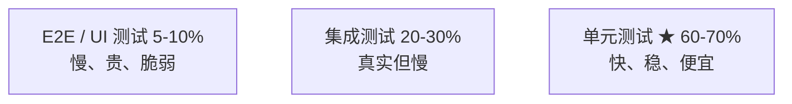
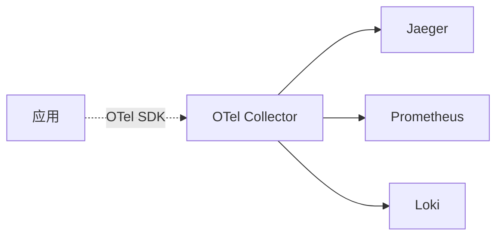
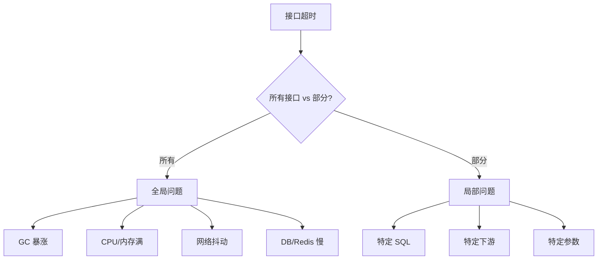

# 工程化资深面试题（20 题）

> Code Review / 规范 / 测试 / 可观测 / 排查 / 发布
>
> 格式：题目 / 标准答案 / 易错点 / 追问点 / 背诵版

## 目录

1. [Code Review 看什么？](#q1)
2. [CR 反馈怎么分级？](#q2)
3. [PR 应该多大？怎么写好 PR 描述？](#q3)
4. [Go 命名规范？](#q4)
5. [错误码怎么设计？](#q5)
6. [RESTful API 设计要点？](#q6)
7. [Protobuf 兼容性铁律？](#q7)
8. [测试金字塔是什么？](#q8)
9. [FIRST 原则？AAA 结构？](#q9)
10. [Mock vs Stub vs Fake？](#q10)
11. [Table-Driven Tests 优势？](#q11)
12. [覆盖率多少合理？](#q12)
13. [可观测性三支柱？](#q13)
14. [OpenTelemetry 是什么？](#q14)
15. [trace_id 怎么全链路透传？](#q15)
16. [Prometheus label 怎么设计？](#q16)
17. [/healthz vs /ready 区别？](#q17)
18. [怎么优雅关闭服务？](#q18)
19. [线上接口超时怎么排查？](#q19)
20. [发布质量怎么保证？](#q20)

---

## <a id="q1"></a>1. Code Review 看什么？

### 标准答案

按从大到小：

```
1. 总体设计：是否解决问题？方案最简单？过度设计？
2. 正确性：边界 / 异常 / 并发 / 幂等 / 时区
3. 性能：N+1 / 慢操作 / 锁粒度 / 内存泄漏
4. 安全：SQL 注入 / XSS / 敏感信息 / 鉴权
5. 可读性：命名 / 函数长度 / 注释
6. 测试：是否有？覆盖关键路径？
7. 可维护：依赖方向 / 配置分离
```

**自动 vs 人工**：
- 自动：编译 / Lint / 测试 / 格式 / 安全扫描
- 人工：架构 / 设计 / 逻辑 / 边界 / 可读性

**人工 CR 不要浪费在自动能发现的问题上**。

### 易错点
- 纠结风格（应该交给 linter）
- 不看架构（只看代码细节）
- 没看测试（实现写了，测试没写）

### 追问点
- 大改动怎么 CR？→ 拆 PR / 多人 review / 结对
- 怎么 review 自己代码？→ 提交前自看 diff，主要是 commit 拆分和命名

### 背诵版
**架构 → 正确性 → 性能 → 安全 → 可读 → 测试 → 维护**。**自动拦截基础，人工看机器看不出**。

---

## <a id="q2"></a>2. CR 反馈怎么分级？

### 标准答案

```
[Must Fix] 必改: 阻塞合并
  - Bug
  - 安全漏洞
  - 性能严重问题
  - 违反核心规范

[Should Fix] 建议改: 强烈建议
  - 设计可改进
  - 命名不清
  - 缺少测试

[Could Fix] 可选: 不阻塞
  - 风格偏好
  - 小优化

[Nit] 吹毛求疵: 不阻塞，作者决定
  - 空格/缩进
  - 个人喜好
```

**目的**：避免**为小事卡住合并**。

**实战**：
- Must / Should 必须解决
- Could / Nit 作者自由决定
- 实在卡住找第三人决断

### 易错点
- 不分级（都当 Must Fix → 拉锯）
- Nit 阻塞合并（小事卡死）
- 措辞强硬（变战场）

### 追问点
- 多个 reviewer 意见冲突？→ 找第三人 / TL 决断
- 怎么避免争吵？→ 用问句 + 给原因 + 必要时口头沟通

### 背诵版
**Must / Should / Could / Nit 四级**。Must Should 阻塞，Could Nit 作者决定。**避免为小事拉锯**。

---

## <a id="q3"></a>3. PR 应该多大？怎么写好 PR 描述？

### 标准答案

**PR 大小**：
- 最佳：< 200 行
- 可接受：< 500 行
- 太大：> 1000 行（应该拆）

**大 PR 问题**：
- 没法认真 review
- 容易藏 bug
- 修改成本高
- 拖慢合并

**PR 描述模板**：
```markdown
## 背景
为什么做？业务需求 / Bug / 重构？

## 方案
怎么做的？关键设计决策？

## 影响范围
- 哪些模块受影响？
- 是否破坏兼容性？
- DB schema 变更？

## 测试
- 单测覆盖？
- 集成测试？
- 手动验证步骤？

## 风险
- 上线风险？
- 回滚方案？

## Checklist
- [ ] 单测通过
- [ ] Lint 通过
- [ ] 文档更新
- [ ] 关联 Issue
```

**好的 PR 描述**：reviewer 30 秒进入状态。

### 易错点
- PR 标题草率（"fix"）
- 没有描述（reviewer 完全不懂）
- 重构 + 功能混在一起（应该拆）

### 追问点
- 怎么拆 PR？→ 按功能 / 按模块 / 重构和功能分开
- 大改动必须一次合？→ 用 feature flag 渐进合并

### 背诵版
**PR < 500 行**，**模板：背景 / 方案 / 影响 / 测试 / 风险 / Checklist**。**重构和功能分开 PR**。

---

## <a id="q4"></a>4. Go 命名规范？

### 标准答案

```go
// 包名: 小写、单数、有意义
package user        // ✅
package users       // ❌
package userService // ❌

// 变量: 驼峰
userID    // ✅（缩略词全大写）
user_id   // ❌（Go 不用下划线）

// 接收者: 1-2 字母
func (s *OrderService) ...  // ✅
func (orderService *OrderService) ... // ❌

// 接口: 行为命名 + er
Reader / Writer / Closer    // ✅

// 缩略词: 全大写或全小写
URLPath / urlPath          // ✅
UrlPath                    // ❌（混用）
```

**包结构**：
```go
// 接口在使用方定义
package order
type UserClient interface { GetUser(id) (*User, error) }

// 实现在独立包
package user
type Client struct{}
```

**接受接口，返回结构体**。

### 易错点
- 缩略词大小写混用（UrlPath）
- 用 utils / common 万能袋
- 接口在实现方定义（依赖反转错）

### 追问点
- 为什么 Go 不用下划线？→ Go 风格规定，golangci-lint 强制
- ID vs Id？→ ID 全大写（标准缩略词）

### 背诵版
**包小写单数 / 变量驼峰 / 缩略词全大写或全小写 / 接收者 1-2 字母 / 接口行为+er**。**接受接口返回结构体**。

---

## <a id="q5"></a>5. 错误码怎么设计？

### 标准答案

**层次**：
```
错误码 = 系统码 + 模块码 + 具体码

10001  通用-系统错误
20001  用户模块-用户不存在
30001  订单模块-订单不存在
30002  订单模块-订单状态异常
```

**设计原则**：
- 业务错误码 != HTTP 状态码（4xx/5xx 也要用）
- 内嵌业务语义
- **全公司唯一**（避免重复）
- 文档化（错误码表）
- 加 trace_id 便于排查
- 用户可见 vs 开发可见**分开**

**响应格式**：
```json
{
  "code": 40001,
  "message": "您输入的订单号不存在",  // 用户友好
  "trace_id": "abc",                   // 排查
  "details": { "field": "order_id" }   // 结构化
}
```

**Go 实现**：
```go
type BizError struct {
    Code    int
    Message string
    Cause   error
}
func (e *BizError) Error() string { return e.Message }
func (e *BizError) Unwrap() error { return e.Cause }

var ErrOrderNotFound = &BizError{Code: 30001, Message: "订单不存在"}
```

### 易错点
- 错误码和 HTTP 状态码混用（应该都有）
- 没有错误码表（一团乱）
- 全是 string error（无法分类处理）

### 追问点
- 为什么不直接用 HTTP 状态？→ 业务粒度需要更细（如 422 业务错有几十种）
- 怎么管理错误码？→ 公司级文档 + 段管理

### 背诵版
**错误码 = 系统+模块+具体（如 30001）**。**全公司唯一 + 文档化 + trace_id + 用户/开发分开**。

---

## <a id="q6"></a>6. RESTful API 设计要点？

### 标准答案

**URL**：
```
✅ /api/v1/orders               # 资源用复数
✅ /api/v1/orders/{id}           # 资源标识
✅ /api/v1/orders/{id}/items     # 嵌套资源
✅ /api/v1/orders?status=paid    # 过滤用 query

❌ /api/v1/getOrder              # 不要动词
❌ /api/v1/order_list            # 不要下划线
```

**HTTP 方法**：
| 方法 | 用途 | 幂等 |
| --- | --- | --- |
| GET | 查询 | ✅ |
| POST | 创建 / 非幂等动作 | ❌ |
| PUT | 全量更新 | ✅ |
| PATCH | 部分更新 | ✅ |
| DELETE | 删除 | ✅ |

**状态码**：
- 2xx 成功 / 3xx 重定向 / 4xx 客户端错 / 5xx 服务端错
- 200 / 201 / 204 / 400 / 401 / 403 / 404 / 409 / 422 / 429 / 500 / 502 / 503 / 504

**响应格式**（统一）：
```json
{ "code": 0, "message": "ok", "data": {...} }
```

**接口契约**：
- 一接口一职责
- 幂等性明确
- 分页标准化（page+size 或 cursor）
- 时间统一 UTC
- 金额统一分

### 易错点
- URL 用动词（getOrder）
- 状态码乱用（500 当业务错误）
- 时间不统一时区（混乱）

### 追问点
- 分页大数据量怎么办？→ cursor 翻页，避免 offset 大值慢
- API 版本怎么管？→ URL（/v1/）/ Header / 子域名

### 背诵版
**URL 资源用复数不用动词 / HTTP 方法语义 / 状态码语义 / 统一响应格式**。**金额分 / 时间 UTC / 一接口一职责**。

---

## <a id="q7"></a>7. Protobuf 兼容性铁律？

### 标准答案

**只加不删不改**：
- 字段编号一旦分配**不改不删**
- 删字段保留 `reserved`
- 加字段用**新编号**
- 不重用编号（兼容性灾难）
- 1-15 编号占 1 字节（高频字段）
- 加版本号（v1/v2）

```protobuf
message User {
    reserved 3;            // 删除字段保留编号
    reserved "old_name";   // 删除字段名
    string name = 1;
    int32 age = 2;
    string email = 4;      // 新加用新编号
}
```

**兼容性矩阵**：

| | 老 client + 新 server | 新 client + 老 server |
| --- | --- | --- |
| 加字段 | ✅（默认值） | ✅（忽略） |
| 删字段 | ❌（旧字段丢） | ✅ |
| 改类型 | ❌ | ❌ |
| 改编号 | ❌ | ❌ |

### 易错点
- 重用编号（最大灾难）
- 改类型（int → int64 也不行）
- 没加版本号

### 追问点
- 为什么 1-15 特殊？→ 占 1 字节
- proto3 vs proto2？→ proto3 默认值简化，主流

### 背诵版
**只加不删不改**：删字段 reserved / 加字段新编号 / 不重用 / 加版本（v1/v2）。**铁律**。

---

## <a id="q8"></a>8. 测试金字塔是什么？

### 标准答案



| 层级 | 占比 | 速度 | 代价 |
| --- | --- | --- | --- |
| 单元 | 60-70% | 毫秒 | 低 |
| 集成 | 20-30% | 秒 | 中 |
| E2E | 5-10% | 分钟 | 高 |

**倒金字塔（反模式）**：大量 E2E + 少单元 → 慢、脆、维护爆炸。

**钻石型**（微服务变体）：单元中量 + 集成多量 + E2E 少量。

### 易错点
- 倒金字塔（反模式）
- 全是单元测试不做集成（边界 bug 漏）
- 不做 E2E（关键路径无验证）

### 追问点
- 微服务怎么测？→ 每服务单元为主 + 关键链路 E2E
- 集成测试用什么？→ Testcontainers 真实 DB

### 背诵版
**单元 60-70% / 集成 20-30% / E2E 5-10%**。倒金字塔反模式。微服务可钻石型（集成多）。

---

## <a id="q9"></a>9. FIRST 原则？AAA 结构？

### 标准答案

**FIRST 原则**：
- **F**ast：毫秒级
- **I**ndependent：互不依赖，可任意顺序
- **R**epeatable：永远同结果，不依赖时间/随机
- **S**elf-Validating：pass/fail 明确
- **T**imely：及时（和实现同步写）

**AAA 结构**：
```go
func TestCreateOrder_Success(t *testing.T) {
    // Arrange 准备
    repo := mocks.NewMockRepo(ctrl)
    repo.EXPECT().Save(...).Return(nil)
    svc := NewService(repo)

    // Act 执行
    orderID, err := svc.CreateOrder(ctx, ...)

    // Assert 断言
    assert.NoError(t, err)
    assert.NotEmpty(t, orderID)
}
```

**命名规范**：场景_条件_预期
```
TestCreateOrder_Success
TestCreateOrder_InvalidItems_ReturnsError
TestPayOrder_AlreadyPaid_ReturnsError
```

### 易错点
- 测试连真实 DB（违反 Fast / Independent）
- 依赖时间（违反 Repeatable）
- 名字模糊（TestOrder1）

### 追问点
- 怎么做时间相关测试？→ 时钟抽象（type Clock interface { Now() time.Time }）
- 测试之间共享 setup？→ TestMain / setup helper

### 背诵版
**FIRST = Fast/Independent/Repeatable/Self-Validating/Timely**。**AAA = Arrange/Act/Assert**。命名 **场景_条件_预期**。

---

## <a id="q10"></a>10. Mock vs Stub vs Fake？

### 标准答案

| | 行为 | 用途 |
| --- | --- | --- |
| **Mock** | 断言调用方式（called N times, with args ...） | 验证交互 |
| **Stub** | 返回固定值（不关心调用） | 简单替代 |
| **Fake** | 内存简化实现（如 InMemoryDB） | 接近真实 |
| **Spy** | 记录调用 + 调用真实方法 | 局部观察 |

**实战**：
- 单测 Mock 居多（接口边界）
- Fake 适合写 InMemoryRepo 替代真实 DB
- Stub 简单场景

```go
// Mock
mockRepo.EXPECT().Save(gomock.Any(), gomock.Any()).Return(nil).Times(1)

// Stub（直接构造对象）
stubRepo := &StubRepo{ result: someValue }

// Fake
fakeRepo := &InMemoryRepo{ orders: map[string]*Order{} }
```

**最佳实践**：
- Mock 直接依赖
- Mock 接口而非具体类型
- 不要过度 Mock（链太深 = 设计有问题）

### 易错点
- Mock 链 5 层（设计问题）
- Mock 第三方库的内部（脆）
- 全用 Mock 不用 Fake（缺组合测试）

### 追问点
- gomock vs testify？→ gomock 严格断言，testify 灵活
- 怎么决定用 Mock 还是 Fake？→ 简单接口 Mock，复杂行为 Fake

### 背诵版
**Mock 断言交互 / Stub 返固定值 / Fake 内存实现 / Spy 真实+记录**。单测 **Mock 接口**，**Fake 替代 DB**。

---

## <a id="q11"></a>11. Table-Driven Tests 优势？

### 标准答案

```go
func TestValidate(t *testing.T) {
    tests := []struct {
        name    string
        input   *Order
        wantErr bool
    }{
        {"valid", &Order{...}, false},
        {"empty customer", &Order{CustomerID: ""}, true},
        {"empty items", &Order{Items: []Item{}}, true},
        {"nil order", nil, true},
    }
    for _, tt := range tests {
        t.Run(tt.name, func(t *testing.T) {
            err := tt.input.Validate()
            if (err != nil) != tt.wantErr {
                t.Errorf("Validate() error = %v, wantErr %v", err, tt.wantErr)
            }
        })
    }
}
```

**优点**：
- 一次定义多场景
- 易扩展（加 case 只需多一行）
- 失败定位精确（`go test -run TestValidate/valid`）
- 可读性好（测试场景一目了然）
- Go 标志性写法

**进阶**：
- 子测试 `t.Run` 独立运行 + 并行（`t.Parallel()`）
- 跳过 `t.Skip()`

### 易错点
- 测试场景重复（应该用 table-driven）
- 不写 case 名（失败定位难）

### 追问点
- 怎么测错误？→ 比较错误类型 / 用 errors.Is
- 表过大怎么管理？→ 拆多个测试文件 / 数据从 testdata 加载

### 背诵版
**Table-Driven = 一次定义多场景 + 易扩展 + 定位精确**。**子测试 t.Run + t.Parallel**。**Go 标志性写法**。

---

## <a id="q12"></a>12. 覆盖率多少合理？

### 标准答案

```
60% - 基础（核心功能覆盖）
70-80% - 良好（推荐）
90%+ - 优秀（核心服务）
100% - 反模式（追求测试覆盖率本身）
```

**警告**：
- 覆盖率不等于测试质量（覆盖了但断言不严无意义）
- 追求 100% 是反模式（最后 5% 成本极高）
- **关键路径必须 90%+**

**不需要测**：
- 自动生成代码（pb.go / mock）
- 简单 getter/setter
- main.go（用集成测试覆盖）
- 第三方库 thin wrapper

**Go 覆盖率工具**：
```bash
go test ./... -coverprofile=coverage.out
go tool cover -html=coverage.out -o coverage.html
go tool cover -func=coverage.out
```

**CI 性能门禁**：
```yaml
performance_gate:
  coverage_min: 70%
  # 不达标 → 阻塞发版
```

### 易错点
- 为覆盖率而测（无价值断言）
- 100% 强迫症（成本爆炸）
- 不看断言质量

### 追问点
- 怎么找未覆盖代码？→ go tool cover -html 看红色行
- 测试质量怎么评估？→ Mutation Testing（变异测试）

### 背诵版
**60% 基础 / 70-80% 良好 / 90% 核心 / 100% 反模式**。**覆盖率 ≠ 质量**，关键路径质量 > 数字。CI 门禁。

---

## <a id="q13"></a>13. 可观测性三支柱？

### 标准答案

| | Logs | Metrics | Traces |
| --- | --- | --- | --- |
| 用途 | 查单个事件 | 看统计趋势 | 看调用关系 |
| 数据 | 文本流 | 时序数值 | 树状链 |
| 存储 | 大量 | 适中 | 大量 |
| 查询 | grep / 全文 | PromQL | 按 trace_id |
| 工具 | ELK / Loki | Prometheus | Jaeger |

**互补使用**：
- Metrics 发现异常（错误率涨）
- Trace 定位服务（哪个调用慢）
- Logs 查具体错误（栈信息）

**四大黄金信号**（Google SRE）：Latency / Traffic / Errors / Saturation。

**RED**（面向服务）：Rate / Errors / Duration。
**USE**（面向资源）：Utilization / Saturation / Errors。

### 易错点
- 只看 Metrics 不看 Trace（不知是哪个服务）
- 日志没 trace_id（关联难）
- Metrics 高基数 label（时序爆炸）

### 追问点
- 怎么从 Metrics 跳 Trace？→ Grafana 集成 OTel 关联
- ELK vs Loki？→ Loki 不全文索引，便宜 10x，云原生主流

### 背诵版
**Logs 查事件、Metrics 看趋势、Traces 看链路**。互补：Metrics 发现 → Trace 定位 → Logs 查错。**四大黄金信号**。

---

## <a id="q14"></a>14. OpenTelemetry 是什么？

### 标准答案

**OTel = 可观测性的开放标准**：统一 logs/metrics/traces 的数据模型 + API + SDK + Collector。



**优势**：
- 统一标准（替换碎片化）
- 多语言 SDK（Go/Java/Python/Node）
- Collector 解耦后端（换后端不改代码）
- 自动 instrumentation（HTTP/gRPC/DB/Redis）
- CNCF 顶级项目（事实标准）

**Collector**：接收（OTLP/Jaeger/Zipkin）→ 处理（采样/批量）→ 导出（多后端）。

**自动 instrumentation**：
```go
http.Handle("/", otelhttp.NewHandler(myHandler, "my-handler"))
db, _ := otelsql.Open("mysql", dsn)
conn, _ := grpc.Dial(addr, grpc.WithUnaryInterceptor(otelgrpc.UnaryClientInterceptor()))
```

### 易错点
- 还在用单一厂商 SDK（应该迁 OTel）
- Collector 单点（应该多副本）
- 没用 Collector 直连后端（耦合）

### 追问点
- 采样率怎么设？→ 错误 100% + 关键路径全采 + 其他 1-10%
- 与 Jaeger 关系？→ Jaeger 后端，OTel SDK + Jaeger 后端是组合

### 背诵版
OTel = **可观测开放标准**，统一三支柱。**Collector 解耦后端**，多语言 SDK。**自动 instrumentation**。CNCF 事实标准。

---

## <a id="q15"></a>15. trace_id 怎么全链路透传？

### 标准答案

**HTTP**：用 W3C Trace Context header：
```
traceparent: 00-{trace_id}-{span_id}-{flags}
tracestate: key1=val1
```

**gRPC**：通过 metadata 透传。

**OTel 自动**：
```go
// 接收
ctx = otel.GetTextMapPropagator().Extract(ctx, propagation.HeaderCarrier(r.Header))

// 调下游（自动注入）
client.CreateOrder(ctx, req)  // ctx 里有 trace context，OTel 自动注入
```

**日志关联**：
```go
span := trace.SpanFromContext(ctx)
logger.Info("...", zap.String("trace_id", span.SpanContext().TraceID().String()))
```

**异步场景**：goroutine 启动必须传 ctx：
```go
// ❌ 链路断
go doSomething()

// ✅ 透传 ctx
go doSomething(ctx)
```

**MQ**：把 traceparent 写消息 header 发出去，消费端提取。

### 易错点
- 业务忘传 ctx（链路断）
- 日志没加 trace_id（无法关联）
- 异步丢 ctx（goroutine 启动忘了）

### 追问点
- B3 vs W3C？→ B3 是 Zipkin 老标准，W3C 是新标准
- 跨 MQ 怎么做？→ 消息 header 带 traceparent

### 背诵版
**W3C Trace Context（traceparent header）**，OTel SDK 自动透传 HTTP/gRPC。**日志加 trace_id 关联**。**异步必传 ctx**。

---

## <a id="q16"></a>16. Prometheus label 怎么设计？

### 标准答案

**核心原则**：**控制 label 基数**。

```
✅ 低基数: method / path / status_code / region
   有限取值，几十-几百

❌ 高基数: user_id / IP / order_id
   每个不同 → 时序爆炸 → Prometheus 内存爆
```

**典型反例**：
```go
// ❌ 用 user_id 做 label
RequestTotal.WithLabelValues(userID).Inc()
// 1 亿用户 → 1 亿时序 → 内存爆
```

**正确做法**：
```go
RequestTotal.WithLabelValues(method, path, status).Inc()
// method 5 个 × path 100 个 × status 10 个 = 5000 时序
```

**指标命名规范**：
```
http_requests_total                    # Counter
http_request_duration_seconds          # Histogram
db_connections_active                  # Gauge

后缀:
  _total: Counter
  _seconds: Histogram（时间）
  _bytes: 大小
```

**类型选择**：
- Counter：累加（QPS / 错误数）
- Gauge：瞬时值（连接数 / 内存）
- Histogram：分布（延迟分位）
- Summary：分布（客户端计算分位）

### 易错点
- 高基数 label（user_id / IP / 订单号）
- 命名不规范（缺单位 / _total）
- 用 Summary 做跨实例聚合（不能聚合）

### 追问点
- Histogram vs Summary？→ Histogram 服务端聚合，Summary 客户端聚合
- 怎么算分位？→ histogram_quantile(0.99, rate(metric_bucket[5m]))

### 背诵版
**控制 label 基数**：method/path/status 低基数 ✅，user_id/IP 高基数 ❌。**Counter/Gauge/Histogram/Summary** 类型选对。

---

## <a id="q17"></a>17. /healthz vs /ready 区别？

### 标准答案

| | /healthz（liveness） | /ready（readiness） |
| --- | --- | --- |
| 含义 | 进程活着吗 | 准备好接流量了吗 |
| 失败行为 | K8s 重启 pod | K8s 摘除流量（不重启） |
| 检查内容 | 最基础（进程响应） | 所有依赖（DB / Redis / 下游） |

```go
// 简单 healthz
func handleHealthz(w, r) {
    w.WriteHeader(200)
    w.Write([]byte("ok"))
}

// 完整 ready
func handleReady(w, r) {
    if err := db.Ping(); err != nil {
        w.WriteHeader(503); return
    }
    if _, err := redis.Ping(ctx).Result(); err != nil {
        w.WriteHeader(503); return
    }
    w.WriteHeader(200)
}
```

**K8s 配置**：
```yaml
livenessProbe:
  httpGet: { path: /healthz, port: 8080 }
  initialDelaySeconds: 10
  periodSeconds: 10
  failureThreshold: 3

readinessProbe:
  httpGet: { path: /ready, port: 8080 }
  initialDelaySeconds: 5
  periodSeconds: 5
```

**最佳实践**：
- liveness 检查最基础（防误重启）
- readiness 检查依赖（暂时摘流量）
- 启动时间长用 startupProbe

### 易错点
- 两个混用（healthz 检查所有依赖 → 依赖抖动重启）
- 没有 ready 探针（K8s 立即打流量到没准备好的 pod）

### 追问点
- startupProbe 是什么？→ K8s 启动期间用，比 liveness 更宽松
- 为什么 liveness 失败要重启？→ 进程已挂或卡死，重启恢复

### 背诵版
**healthz 进程活，liveness 失败重启 / ready 依赖好，readiness 失败摘流量**。**liveness 最基础，readiness 检查依赖**。

---

## <a id="q18"></a>18. 怎么优雅关闭服务？

### 标准答案

```go
func main() {
    // ...启动服务...

    sig := make(chan os.Signal, 1)
    signal.Notify(sig, syscall.SIGTERM, syscall.SIGINT)
    <-sig

    ctx, cancel := context.WithTimeout(context.Background(), 30*time.Second)
    defer cancel()

    // 1. 反注册（注册中心）
    registry.Deregister()

    // 2. ready 探针失败（K8s 摘流量）
    setReady(false)

    // 3. sleep 等流量切走
    time.Sleep(15 * time.Second)

    // 4. 停止接受新请求
    server.Shutdown(ctx)

    // 5. flush trace / metrics
    tp.Shutdown(ctx)
    logger.Sync()

    // 6. 关闭 DB / Redis
    db.Close()
    redis.Close()
}
```

**K8s 配置**：
```yaml
spec:
  terminationGracePeriodSeconds: 30  # 给应用 30s 优雅退出
  containers:
  - lifecycle:
      preStop:
        exec:
          command: ["sh", "-c", "sleep 15"]  # 等流量切走
```

**关键**：
- 处理 SIGTERM 信号
- 设置超时（30s 内必须退）
- 反注册 + 摘流量优先
- flush 数据

### 易错点
- kill -9 直接杀（数据丢）
- 不处理 SIGTERM（K8s 强杀）
- shutdown 不设超时（卡死）

### 追问点
- 长连接服务怎么优雅？→ 通知客户端切换 + 等迁移完
- 在途请求怎么处理？→ http.Server.Shutdown 等待（默认）

### 背诵版
**反注册 → 摘流量 → sleep → Shutdown → flush → 关连接**。处理 SIGTERM + 30s 超时。K8s **terminationGracePeriodSeconds**。

---

## <a id="q19"></a>19. 线上接口超时怎么排查？

### 标准答案

**排查路径**：



**工具**：
1. **Trace**：找慢链路 → 哪个服务 / 调用慢
2. **Metrics**：看 P99 / 错误率分布
3. **Logs**：错误栈
4. **pprof**：CPU / 内存 / goroutine
5. **DB**：slowlog
6. **Redis**：slowlog
7. **网络**：netstat / ss / tcpdump

**常见原因**：
- 下游慢（DB / 第三方 API）
- GC 暴涨（pprof heap）
- goroutine 泄漏（pprof goroutine）
- 锁竞争（pprof mutex/block）
- 突发流量（QPS 监控）
- 网络抖动（监控丢包率）

**实战流程**：
```
1. 先止血（限流 / 降级 / 重启）
2. 看 Trace + Metrics 定位
3. pprof 进一步分析
4. 修复 + 复盘
5. 防复发措施
```

### 易错点
- 直接看代码（应该先看监控）
- 不区分全局 vs 局部（方向错）
- 没有 trace_id（关联难）

### 追问点
- pprof 怎么用？→ go tool pprof http://server/debug/pprof/profile
- DB 慢 SQL 怎么找？→ slowlog + pt-query-digest

### 背诵版
**全局 vs 局部 → Trace 定位 → Metrics 看分布 → pprof 深入 → 慢日志看 SQL**。**先止血再定位**。

---

## <a id="q20"></a>20. 发布质量怎么保证？

### 标准答案

**多层防御**：

```
1. 提交前: 自我 review + 单测 + linter
2. CI: 自动化测试 + 安全扫描 + 性能门禁
3. 测试: QA + 集成测试 + E2E
4. 预发: 真实数据 + 压测 + 灰度
5. 生产: 灰度发布 + 自动回滚 + 监控
6. 事后: 复盘 + 沉淀
```

**灰度策略**：
- 1% → 5% → 20% → 50% → 100%
- 自动监控（错误率 / 延迟超阈值自动回滚）
- 按用户 / 地域 / 流量

**自动回滚条件**：
- 错误率 > 阈值（如 1%）
- P99 延迟 > 阈值
- 健康检查失败
- 业务 KPI 下降

**回滚演练**：
- 定期回滚演练（确保回滚流程能用）
- 数据库变更要可回滚（DDL）

**Checklist**：
```
□ 单测通过 + 覆盖率 70%+
□ Lint 通过
□ 性能门禁通过
□ 集成测试通过
□ 灰度方案 + 监控
□ 回滚方案
□ 文档更新
□ 风险评估
□ 通知相关方
```

### 易错点
- 没有灰度（一把全量发布）
- 不做自动回滚（人工反应慢）
- DB 变更不兼容（无法回滚）

### 追问点
- DB schema 变更怎么发？→ 兼容性变更（加字段）→ 应用 → 老字段废弃 → 删字段
- 出 bug 怎么处理？→ 立即回滚 → 复盘 → 改进

### 背诵版
**多层防御**：提交前 → CI → QA → 预发 → 灰度 → 监控 → 复盘。**灰度 1%→5%→20%→100% + 自动回滚**。DB **兼容性变更**。

---

## 复习建议

**面试前 1 天**：通读"背诵版"。

**面试前 1 周**：每天 3-5 题，结合 13-engineering 各篇。

**实战检验**：
- 能不能讲清楚 CR 看什么 + 反馈分级？
- 能不能完整描述测试金字塔 + FIRST + AAA？
- 能不能从 0 到 1 给项目接入可观测？
- 能不能给出线上接口超时的完整排查流程？
