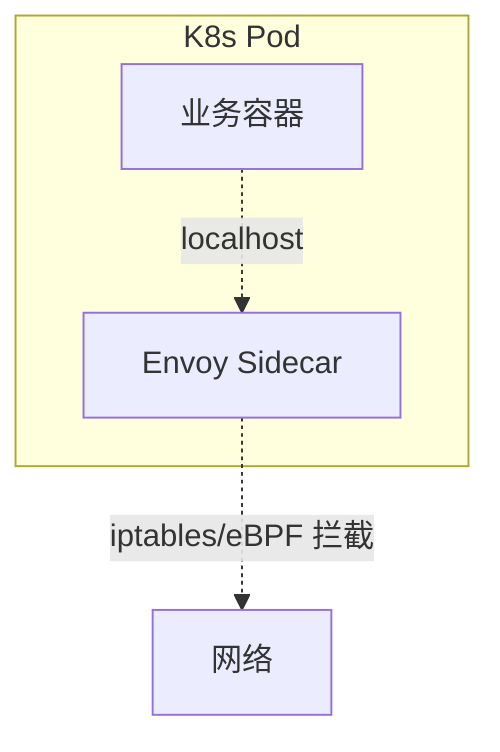
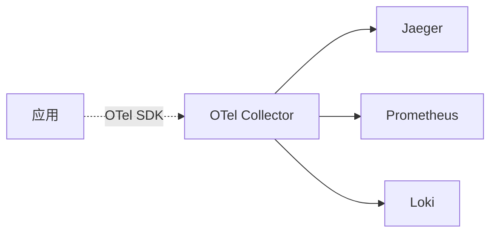

# 微服务资深面试题（20 题）

> 概述 / 注册 / 配置 / 网关 / RPC / Mesh / 观测治理
>
> 格式：题目 / 标准答案 / 易错点 / 追问点 / 背诵版

## 目录

1. [微服务 vs SOA 区别？](#q1)
2. [12-Factor 是什么？](#q2)
3. [什么时候该上微服务？真实代价？](#q3)
4. [注册中心怎么选？](#q4)
5. [服务发现该 CP 还是 AP？](#q5)
6. [客户端发现 vs 服务端发现？](#q6)
7. [优雅下线怎么做？](#q7)
8. [配置中心解决什么？长轮询原理？](#q8)
9. [灰度配置怎么做？](#q9)
10. [API 网关解决什么？BFF 是什么？](#q10)
11. [Kong vs APISIX vs Envoy？](#q11)
12. [网关怎么防绕过？](#q12)
13. [RPC vs HTTP？gRPC 比 JSON 快多少？](#q13)
14. [Protobuf 兼容性铁律？](#q14)
15. [客户端 LB 算法？P2C 是什么？](#q15)
16. [Service Mesh 解决什么？真实代价？](#q16)
17. [Sidecar 模式怎么工作？](#q17)
18. [可观测性三支柱？](#q18)
19. [OpenTelemetry 是什么？](#q19)
20. [trace_id 怎么全链路透传？](#q20)

---

<a id="q1"></a>
## 1. 微服务 vs SOA 区别？

### 标准答案

| | SOA | 微服务 |
| --- | --- | --- |
| 通信 | ESB 中心化 | 点对点（注册中心） |
| 协议 | SOAP / XML（重） | HTTP / gRPC（轻） |
| 数据 | 共享 DB 常见 | 一服务一库 |
| 治理 | 集中（ESB） | 分布式（SDK / Sidecar） |
| 粒度 | 粗（业务系统级） | 细（业务能力级） |
| 部署 | 经常协调发布 | 独立发布 |

本质：**微服务 = SOA 去 ESB + 细粒度 + 一服务一库 + DevOps**。

### 易错点
- 觉得 SOA = 微服务（差别本质大）
- 把 SOA 改个名字叫微服务（保留 ESB / 共享 DB → 假微服务）

### 追问点
- 为什么去 ESB？→ ESB 中心化是性能瓶颈和 SPOF
- 微服务必须一服务一库吗？→ 严格派必须，务实派可以共享 DB 但严格 schema 隔离

### 背诵版
微服务 = **去 ESB + 细粒度 + 一服务一库 + DevOps**。SOA 是中心化 ESB，微服务是点对点 + 注册中心。

---

<a id="q2"></a>
## 2. 12-Factor 是什么？

### 标准答案
Heroku 提出的 12 条云原生应用准则，**微服务事实标准**：

1. 一仓库一应用
2. 显式声明依赖
3. 配置走环境变量
4. 后端服务（DB/MQ）当附加资源
5. 严格分离构建/发布/运行
6. 进程无状态
7. 端口绑定（自包含）
8. 通过水平扩展支持并发
9. 易处理（快启动 / 优雅停止）
10. 开发-生产对等
11. 日志当事件流（stdout）
12. 管理任务作为一次性脚本

**核心**：无状态 / 可替换 / 可伸缩 / 可观测。

### 易错点
- 写文件日志（容器易丢，应该写 stdout）
- Session 内存里（违反无状态原则）
- 配置写死代码（违反原则 3）

### 追问点
- 为什么要 stdout？→ Docker / K8s 自动收集
- 怎么做"易处理"？→ < 10s 启动 + SIGTERM 优雅退出

### 背诵版
12-Factor = 云原生应用准则，**核心**：**无状态 + 可替换 + 可伸缩 + 可观测**。配置走环境变量 / 日志走 stdout / 进程无状态。

---

<a id="q3"></a>
## 3. 什么时候该上微服务？真实代价？

### 标准答案

**该上**：
- 团队 100+ 人
- 业务复杂需独立演化
- 不同模块需独立扩缩
- 已经有 DDD 边界
- 有 CI/CD / 监控 / 链路基建

**不该上**：
- 团队 < 50
- 业务未验证
- 没基建
- 追求"现代感"

**真实代价**（Sam Newman：微服务非免费午餐）：
- 运维复杂度（N x 服务）
- 分布式问题（CAP / 一致性）
- 性能开销（网络 / 序列化 +1-5ms/跳）
- 学习曲线陡

### 易错点
- 大厂都拆了我们也拆（忽略团队规模差异）
- 拆了发现是分布式单体（DDD 边界没划清楚）
- 没基建直接拆（出事完全摸黑）

### 追问点
- Shopify 单体撑超大规模怎么解释？→ Modular Monolith + 严格模块边界
- 字节从零微服务怎么做到？→ 长期投入基建 + 接受早期开发慢

### 背诵版
该上：**团队 100+ + 业务复杂 + DDD 边界 + 有基建**。代价：**运维 N 倍 + 分布式问题 + 性能开销**。**非免费午餐**。

---

<a id="q4"></a>
## 4. 注册中心怎么选？

### 标准答案

| | ZK | Eureka | Nacos | etcd | Consul |
| --- | --- | --- | --- | --- | --- |
| **CAP** | CP | AP | AP/CP 可切 | CP | CP（默认） |
| **多 DC** | 不支持 | 支持 | 支持 | 不友好 | **原生** |
| **配置中心** | ❌ | ❌ | ✅ | ✅ | ✅ |
| **K8s 友好** | 一般 | 一般 | 一般 | **原生** | 一般 |
| **代表用户** | 老 Dubbo | 已停更 | 阿里 | K8s | HashiCorp |

**实战推荐**：
- K8s 内部 → etcd（自带）
- 国内 Java → **Nacos**
- 多机房 → Consul
- 老 Dubbo → ZK（建议迁 Nacos）

Eureka 已停更，**新项目别选**。

### 易错点
- 选 Eureka（已停更）
- K8s 项目还自建注册中心（K8s Service 已经够）
- ZK 跨地域用（多 DC 不支持）

### 追问点
- Nacos vs etcd？→ Nacos 注册+配置一体国内主流；etcd K8s 原生 Go 友好
- Consul 怎么做多 DC？→ Server 集群 WAN Gossip 跨 DC 同步

### 背诵版
**国内 Java → Nacos / K8s → etcd / 多 DC → Consul / 老 Dubbo → ZK 迁 Nacos**。Eureka 已停更别选。

---

<a id="q5"></a>
## 5. 服务发现该 CP 还是 AP？

### 标准答案
**主流共识：AP**（高可用优先）。

理由：
- 短暂不一致**可接受**（客户端缓存 + 重试 + 熔断兜底）
- 不可用 = 整个系统不可用
- 微服务场景**可用性 > 一致性**

代表：Eureka / Nacos 临时实例（默认 AP）。

**例外**：配置中心建议 **CP**（配置应全网一致，短暂不可用用缓存兜底）。

### 易错点
- ZK 用作大规模注册中心（CP，Leader 选举期间不可用）
- 注册中心挂了业务全挂（没做客户端缓存）

### 追问点
- 客户端缓存怎么做？→ 本地缓存最近一份 IP 列表，注册中心挂时降级用
- AP 怎么处理调到死实例？→ 客户端重试 + 熔断剔除

### 背诵版
**服务发现 AP，配置中心 CP**。AP 理由：可用性 > 一致性，**客户端缓存 + 重试 + 熔断**兜底死实例。

---

<a id="q6"></a>
## 6. 客户端发现 vs 服务端发现？

### 标准答案

| | 客户端 | 服务端 |
| --- | --- | --- |
| LB 位置 | Client SDK | 中间 LB |
| 性能 | 直连快 | 多一跳 |
| SDK | 复杂（每语言一份） | 简单（只调一个 URL） |
| 单点 | 无 | 有（LB） |
| 适合 | RPC 同语言 | HTTP / 多语言 |

**代表**：
- 客户端：Dubbo / Kitex / gRPC 自带 LB / go-zero
- 服务端：K8s Service / AWS ALB / Nginx + Consul-Template

实战：**RPC 客户端发现 + HTTP 服务端发现**组合用。

### 易错点
- 多语言异构强行客户端发现（每语言写 SDK 累死）
- HTTP 用客户端发现（服务端 LB 更简单成熟）

### 追问点
- K8s Service 是哪种？→ 服务端发现（kube-dns + iptables/IPVS）
- 客户端发现 SDK 升级困难怎么办？→ 用 Service Mesh 治理下沉

### 背诵版
**客户端发现 RPC 同语言主流（直连快）**，**服务端发现 HTTP / 多语言主流（SDK 简单）**。K8s Service 是服务端发现。

---

<a id="q7"></a>
## 7. 优雅下线怎么做？

### 标准答案

```
1. 主动反注册到注册中心（不等心跳超时）
2. sleep 一段（等客户端缓存过期，5-30s）
3. 停止接受新请求（http.Server Shutdown）
4. 等在途请求处理完
5. 关闭 DB / Redis 连接
6. 退出
```

**关键**：处理 SIGTERM 信号 + 设置超时（30s 内必须退）。

```go
sig := make(chan os.Signal, 1)
signal.Notify(sig, syscall.SIGTERM)
<-sig
ctx, cancel := context.WithTimeout(context.Background(), 30*time.Second)
defer cancel()
registry.Deregister()
time.Sleep(15 * time.Second)
server.Shutdown(ctx)
```

### 易错点
- kill -9 直接杀（在途请求丢）
- 没主动反注册（流量打到死实例）
- Shutdown 不设超时（卡死）

### 追问点
- K8s 怎么做优雅停机？→ preStop hook + terminationGracePeriodSeconds
- 长连接服务怎么优雅？→ 通知客户端切换 + 等迁移完

### 背诵版
**反注册 → sleep → 停接新请求 → 等在途完 → 关连接 → 退出**。处理 SIGTERM + 30s 超时。

---

<a id="q8"></a>
## 8. 配置中心解决什么？长轮询原理？

### 标准答案

**配置中心**：集中管理 + 动态推送 + 环境隔离 + 灰度 + 审计 + 加密。

**长轮询**（Nacos/Apollo 主流）：

```
Client: 发请求带当前 MD5
Server: 没变化 → 挂住最多 30s → 期间变化立即响应 / 超时返回 304
Client: 收到响应继续下一轮
```

**优点**：
- 客户端几乎无请求（30s 挂住）
- 服务端变更立即推送（< 1s）
- 服务端连接数可控

**对比**：
- 短轮询：延迟高 + 浪费请求
- WebSocket：延迟低但服务端连接多
- 长轮询：折衷（主流）

### 易错点
- 客户端没有缓存（配置中心挂应用启动失败）
- 配置变更不灰度（错配置全网炸）
- 敏感配置明文（应该加密 / Vault）

### 追问点
- Nacos vs Apollo？→ Nacos 注册+配置一体国内主流；Apollo 灰度审计更强
- 怎么处理配置中心挂了？→ 客户端本地缓存文件 + 启动 fallback

### 背诵版
配置中心 = **集中管理 + 动态推送**。长轮询：客户端发请求挂 30s，变更立即响应或超时返回。**毫秒级生效**。

---

<a id="q9"></a>
## 9. 灰度配置怎么做？

### 标准答案

**灰度维度**：
- 按 IP（10.0.0.x 先收到）
- 按实例分组（A 机房先灰度）
- 按版本（v1.2 实例）
- 按标签（tag=canary）
- 按比例（随机 5%）

**Apollo 强项**：
```
主配置: rate_limit.qps = 1000
灰度: rate_limit.qps = 500，IP in [10.0.0.1, 10.0.0.2]
观察 → 合并到主配置 → 全量
```

**Nacos**：Beta 发布，指定灰度 IP 列表。

**失败立即回滚**（不影响存量）。

### 易错点
- 改了配置直接全量（错配置炸全网）
- 灰度时间太短（偶发问题没显现）
- 灰度后忘了合并到主（一直跑灰度）

### 追问点
- 灰度发现问题怎么办？→ 立即回滚（不影响存量）+ 修配置 + 重新灰度
- Apollo 怎么实现 IP 灰度？→ 客户端实例上报 IP 给 Apollo，Apollo 按规则下发

### 背诵版
**多维度（IP/版本/标签/比例）灰度** → 观察 → 合并主配置。**Apollo 灰度强项**，Nacos 有 Beta 发布。

---

<a id="q10"></a>
## 10. API 网关解决什么？BFF 是什么？

### 标准答案

**网关核心职责**：
- 路由 / 鉴权 / 限流 / 安全
- 协议转换（HTTP ↔ gRPC）
- 可观测（日志/监控/追踪）
- 灰度 / A-B / 跨域

**BFF（Backend for Frontend）**：每种客户端有专属网关：
- Web BFF：完整数据
- Mobile BFF：精简数据（节流量）
- Open BFF：开放协议（限速/审计）

避免一个网关应付所有客户端的妥协。

### 易错点
- 把网关当业务（业务逻辑塞进网关 → 难维护）
- 没有 BFF 一个网关吃天下（移动端体验差）
- 网关单点没高可用（全站挂）

### 追问点
- 网关 vs 反向代理？→ 网关 = 加强版反向代理 + 微服务治理
- 网关高可用？→ 多实例 + LB + 配置共享 etcd

### 背诵版
网关 = **路由 + 横切（鉴权/限流/安全）+ 协议转换 + 可观测**。**BFF**：每客户端专属网关聚合后端。

---

<a id="q11"></a>
## 11. Kong vs APISIX vs Envoy？

### 标准答案

| | Nginx | Kong | APISIX | SCGW | Envoy |
| --- | --- | --- | --- | --- | --- |
| 底层 | C | OpenResty | OpenResty + etcd | Java Reactor | C++ |
| 性能 | 极高 | 高 | 极高 | 中 | 极高 |
| 动态配置 | 弱（reload） | API | **etcd 实时** | API | xDS |
| 插件 | 弱 | 强 | 强 | 中 | 强 |
| 适合 | 简单反代 | 通用 | **国内/高性能** | Java 生态 | Service Mesh |

**APISIX 国内主流**：配置走 etcd 毫秒级生效，比 Kong 快 2-5 倍，Apache 顶级项目。

### 易错点
- 简单反代上 Envoy（学习曲线陡）
- 大规模 Mesh 不用 Envoy（错过事实标准）
- Kong 用 DB 存配置（DBless 模式更简单）

### 追问点
- xDS 是什么？→ Envoy 动态发现服务（LDS/RDS/CDS/EDS/SDS）
- Higress？→ 阿里基于 Envoy 增强

### 背诵版
**国内/高性能 → APISIX；Mesh → Envoy；通用 → Kong；Java → SCGW；简单反代 → Nginx**。

---

<a id="q12"></a>
## 12. 网关怎么防绕过？

### 标准答案
**问题**：攻击者直连后端服务 IP，伪造 X-User-ID 绕过网关鉴权。

**防护手段**：
- 后端服务**只在 VPC 内网**（不公网可达）
- 网关 → 后端 **mTLS**（双向 TLS 验证）
- header 加签名（HMAC + 网关密钥）
- 后端只接受网关 IP 段
- ServiceMesh 加 mTLS（Istio 自动）

**最佳实践**：网关传 X-User-ID 后端**不能盲信**，配合 mTLS / IP 白名单。

### 易错点
- 后端公网可达（最大漏洞）
- 盲信 X-User-ID（攻击者伪造）
- 没有 mTLS（任何能访问内网的都能伪造）

### 追问点
- mTLS 怎么实现？→ 双向证书验证 + 自动续签（Istio Citadel / cert-manager）
- 一定要 mTLS 吗？→ 内网安全好的可以省略，但金融级必须

### 背诵版
**后端 VPC 内网 + mTLS + IP 白名单 + header 签名**。**绝不盲信网关传的 user_id**。

---

<a id="q13"></a>
## 13. RPC vs HTTP？gRPC 比 JSON 快多少？

### 标准答案

| | RPC | HTTP API |
| --- | --- | --- |
| 协议 | 二进制（gRPC HTTP/2） | HTTP/1.1 文本 |
| 性能 | 高（5-10x） | 中 |
| 序列化 | Protobuf / Thrift | JSON |
| IDL | 必有 | OpenAPI（可选） |
| 浏览器友好 | ❌（gRPC-Web 例外） | ✅ |
| 适合 | 内部微服务 | 对外 API |

**gRPC 比 HTTP/JSON 快 5-10 倍**：
- HTTP/2 多路复用
- Protobuf 二进制（小 3-5x）
- 头部压缩（HPACK）
- 长连接

**实战**：对外 HTTP，对内 RPC，**网关协议转换**。

### 易错点
- 对外 API 也用 RPC（浏览器/第三方不友好）
- 内部用 HTTP/JSON（性能浪费）
- 不用 IDL（联调爆炸）

### 追问点
- gRPC 流式适合什么？→ 实时推送 / 大文件 / 双向交互
- HTTP/2 vs HTTP/3？→ HTTP/3 基于 QUIC（UDP），无 TCP 队头阻塞，弱网更友好

### 背诵版
RPC 内部用，HTTP 对外用。**gRPC 快 5-10x**：HTTP/2 + Protobuf + HPACK + 长连接。

---

<a id="q14"></a>
## 14. Protobuf 兼容性铁律？

### 标准答案
**只加不删不改**：
- 字段编号一旦分配**不改不删**
- 删字段保留 `reserved`
- 加字段用**新编号**
- 不重用编号（兼容性灾难）
- 1-15 编号占 1 字节（用于高频字段）
- 加版本号（v1/v2）

```protobuf
message User {
    reserved 3;            // 删除的字段保留编号
    reserved "old_name";   // 删除的字段名
    string name = 1;
    int32 age = 2;
    string email = 4;      // 新加用新编号
}
```

兼容性矩阵：

| | 老 client + 新 server | 新 client + 老 server |
| --- | --- | --- |
| 加字段 | ✅（默认值） | ✅（忽略） |
| 删字段 | ❌（旧字段丢） | ✅ |
| 改类型 | ❌ | ❌ |
| 改编号 | ❌ | ❌ |

### 易错点
- 重用编号（最大兼容性灾难）
- 改类型（int → int64 也不行）
- 没加版本号（v2 改动破坏 v1 客户端）

### 追问点
- 为什么 1-15 编号特殊？→ 占 1 字节，多用于高频字段
- proto3 vs proto2？→ proto3 默认值 + 简化，主流；proto2 有 required/optional

### 背诵版
**只加不删不改**：删字段 reserved / 加字段新编号 / 不重用 / 加版本（v1/v2）。**铁律**。

---

<a id="q15"></a>
## 15. 客户端 LB 算法？P2C 是什么？

### 标准答案

| 算法 | 说明 | 适合 |
| --- | --- | --- |
| 轮询 | 依次选 | 实例同质 |
| 加权轮询 | 按权重 | 异构机器 |
| 随机 | 随机选 | 简单 |
| 最少连接 | 选活跃最少 | 长连接 |
| **P2C** | **随机两个选少的** | **现代主流** |
| 一致性 Hash | 同 key 同实例 | 缓存 / 状态依赖 |

**P2C（Power of Two Choices）**：
```go
i, j := rand.Intn(N), rand.Intn(N)
return Better(instances[i], instances[j])  // 选指标更好的
```

**优势**：
- 比"最少连接"快（不用全局排序）
- 比随机准（避免全局热点）
- 字节 Kitex / B 站 Kratos / go-zero 默认

### 易错点
- 轮询面对异构机器（老机器扛不住）
- 一致性 Hash 用在无状态服务（多此一举）

### 追问点
- P2C 的"指标"是什么？→ 活跃连接数 / 延迟 / 错误率综合
- 为什么不直接最少连接？→ 全局排序成本高（万级实例）

### 背诵版
**P2C 现代主流**：随机两个选少的，比最少连接快、比随机准。同质轮询，异构加权，缓存一致性 Hash。

---

<a id="q16"></a>
## 16. Service Mesh 解决什么？真实代价？

### 标准答案
**Mesh = 把服务治理（限流/熔断/追踪/mTLS）从业务代码下沉到 Sidecar 代理**。

**解决**：
- 多语言无差别（Java/Go/Python 同一 Sidecar）
- SDK 升级解耦（不用业务跟升）
- 治理策略集中下发
- 业务代码极简

**真实代价**：
- 每 Pod 多 Sidecar（CPU +10-30%、内存 +50-200MB）
- 每跳延迟 +1-5ms
- 学习成本陡（Istio 几个月）
- 排查链路变长

**该上**：微服务 > 几百 + 多语言 + 有基建团队。
**不该上**：< 50 服务 + 单语言 + 团队 < 100。

### 易错点
- 小规模上 Mesh（杀鸡用牛刀）
- 极致低延迟服务上 Mesh（每跳 +5ms 接受不了）
- 没有基建团队硬上 Istio（运维灾难）

### 追问点
- 数据面控制面是什么？→ 数据面 Envoy 处理流量，控制面 Istiod 下发配置
- Linkerd vs Istio？→ Linkerd 用 Rust 轻量，Istio 功能全但重

### 背诵版
Mesh = **治理下沉到 Sidecar**，多语言透明 + 升级解耦。**代价：资源 +20-50% + 延迟 +1-5ms/跳**。**大规模才上**。

---

<a id="q17"></a>
## 17. Sidecar 模式怎么工作？

### 标准答案



核心：
- 业务容器和 Sidecar **同一 Pod**（共享网络命名空间）
- 业务通过 `localhost` 连 Sidecar
- iptables / eBPF **透明拦截** 流量
- 业务**完全无感**

**业务代码不变**：
```go
client := pb.NewOrderClient(conn)  // conn 实际连 localhost Envoy
client.CreateOrder(ctx, req)        // 限流/熔断/追踪/mTLS 都在 Envoy
```

### 易错点
- 业务自己处理治理（重复 Sidecar 工作）
- 部署没注入 Sidecar（治理失效）
- iptables 规则冲突（业务自己设的与 Sidecar 冲突）

### 追问点
- Sidecar 怎么注入？→ K8s admission webhook 自动注入
- 为什么不直接共享进程？→ 隔离 + 升级独立 + 多语言

### 背诵版
Sidecar = **业务和代理同 Pod，业务连 localhost，iptables 透明拦截**。**业务代码完全无感**。

---

<a id="q18"></a>
## 18. 可观测性三支柱？

### 标准答案

| | Logs 日志 | Metrics 指标 | Traces 链路 |
| --- | --- | --- | --- |
| 用途 | 查单个事件 | 看统计趋势 | 看调用关系 |
| 数据 | 文本流 | 时序数值 | 树状链 |
| 存储 | 大量 | 适中 | 大量 |
| 查询 | grep / 全文 | PromQL | 按 trace_id |
| 工具 | ELK / Loki | Prometheus | Jaeger |

**互补使用**：
- Metrics 发现异常（错误率涨了）
- Trace 定位服务（哪个调用慢）
- Logs 查具体错误（栈信息 / 业务参数）

**四大黄金信号**（Google SRE）：Latency / Traffic / Errors / Saturation。

### 易错点
- 只看 Metrics 不看 Trace（不知道是哪个服务）
- 日志没 trace_id（排查关联难）
- Metrics label 高基数（user_id 做 label → 时序爆炸）

### 追问点
- RED vs USE 方法？→ RED 看服务（Rate/Errors/Duration），USE 看资源（Util/Saturation/Errors）
- 怎么从 Metrics 跳 Trace？→ Grafana 集成 OTel，点 metric 关联 trace

### 背诵版
**Logs 查事件、Metrics 看趋势、Traces 看链路**。**互补使用**：Metrics 发现 → Trace 定位 → Logs 查错。

---

<a id="q19"></a>
## 19. OpenTelemetry 是什么？

### 标准答案
**OTel = 可观测性的开放标准**：统一 logs/metrics/traces 的数据模型 + API + SDK + Collector。



**优势**：
- 统一标准（替换碎片化）
- 多语言 SDK（Go/Java/Python/Node）
- Collector 解耦后端（换后端不改代码）
- 自动 instrumentation（HTTP/gRPC/DB/Redis）
- CNCF 顶级项目（事实标准）

**Collector**：接收（OTLP/Jaeger/Zipkin）→ 处理（采样/批量）→ 导出（多个后端）。

### 易错点
- 还在用单一厂商 SDK（应该迁 OTel）
- Collector 单点（应该多副本）
- 没用 Collector 直连后端（耦合）

### 追问点
- 自动 instrumentation 怎么做？→ 用 otelhttp / otelgrpc 包装，业务无侵入
- 采样率怎么设？→ 错误 100% + 关键路径全采 + 其他 1-10%

### 背诵版
OTel = **可观测开放标准**，统一 logs/metrics/traces。**Collector 解耦后端**，多语言 SDK，**CNCF 事实标准**。

---

<a id="q20"></a>
## 20. trace_id 怎么全链路透传？

### 标准答案

**跨 HTTP / gRPC**：用 W3C Trace Context 标准 header：
```
traceparent: 00-{trace_id}-{span_id}-{flags}
tracestate: key1=val1
```

OTel 自动透传：
- HTTP：通过 `otelhttp` 中间件提取/注入 header
- gRPC：通过 `otelgrpc` 拦截器提取/注入 metadata

**业务代码透传**：
```go
// 接收
ctx = otel.GetTextMapPropagator().Extract(ctx, propagation.HeaderCarrier(r.Header))

// 调下游（自动）
client.CreateOrder(ctx, req)  // ctx 里有 trace context，OTel 自动注入
```

**日志关联**：从 ctx 取 trace_id 加到日志字段：
```go
span := trace.SpanFromContext(ctx)
logger.Info("...", zap.String("trace_id", span.SpanContext().TraceID().String()))
```

### 易错点
- 业务忘了透传 ctx（链路断）
- 日志没加 trace_id（无法关联）
- 异步场景丢 ctx（goroutine 启动忘了带 ctx）

### 追问点
- B3 vs W3C Trace Context？→ B3 是 Zipkin 老标准，W3C 是新标准（OTel 推）
- 跨 MQ 怎么透传？→ 把 traceparent 写消息 header

### 背诵版
**用 W3C Trace Context（traceparent header）**，OTel SDK 自动透传 HTTP/gRPC。**日志加 trace_id 关联三支柱**。异步场景必须传 ctx。

---

## 复习建议

**面试前 1 天**：通读"背诵版"30 分钟。

**面试前 1 周**：每天 3-5 题深度看，结合 07-microservice 各篇。

**实战检验**：
- 能不能讲清楚 SOA → 微服务的演进？
- 能不能解释为什么注册中心要 AP？
- 能不能区分 Mesh / SDK 治理 / 网关治理的边界？
- 能不能完整描述 trace_id 全链路透传过程？
