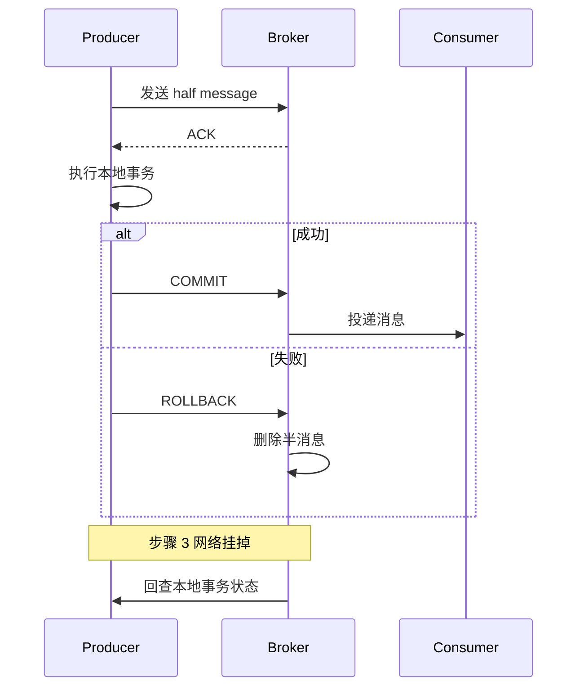
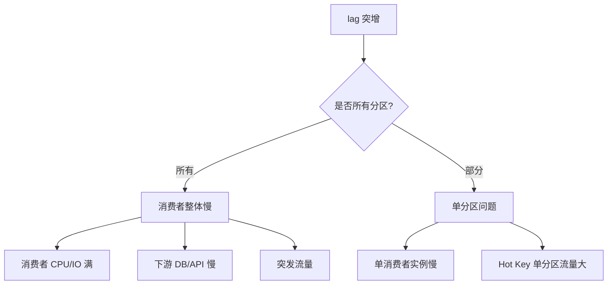

# 消息队列资深面试题（20 题）

> Kafka / RabbitMQ / RocketMQ 架构 / 可靠性 / 顺序 / 重复 / 高可用 / 场景
>
> 格式：题目 / 标准答案 / 易错点 / 追问点 / 背诵版

## 目录

1. [MQ 解决什么问题？](#1-mq-解决什么问题)
2. [Kafka / RabbitMQ / RocketMQ 怎么选？](#2-kafka--rabbitmq--rocketmq-怎么选)
3. [Kafka 为什么快？](#3-kafka-为什么快)
4. [Kafka 整体架构？](#4-kafka-整体架构)
5. [Kafka 怎么不丢消息？](#5-kafka-怎么不丢消息)
6. [Kafka 怎么不重复消费？](#6-kafka-怎么不重复消费)
7. [Kafka 怎么保证顺序？](#7-kafka-怎么保证顺序)
8. [ISR / OSR / HW / LEO 是什么？](#8-isr--osr--hw--leo-是什么)
9. [消费者 Rebalance 触发条件和影响？](#9-消费者-rebalance-触发条件和影响)
10. [Kafka Exactly Once 怎么实现？](#10-kafka-exactly-once-怎么实现)
11. [RocketMQ 事务消息原理？](#11-rocketmq-事务消息原理)
12. [RocketMQ 延迟消息原理？](#12-rocketmq-延迟消息原理)
13. [死信队列 DLQ 是什么？](#13-死信队列-dlq-是什么)
14. [消息积压怎么办？](#14-消息积压怎么办)
15. [消息丢失三大场景和方案？](#15-消息丢失三大场景和方案)
16. [Kafka 消费 lag 怎么排查？](#16-kafka-消费-lag-怎么排查)
17. [幂等消费怎么实现？](#17-幂等消费怎么实现)
18. [大消息怎么处理？](#18-大消息怎么处理)
19. [MQ 如何选择 Pull vs Push？](#19-mq-如何选择-pull-vs-push)
20. [典型场景：异步解耦 / 削峰 / 广播 / 事务怎么用？](#20-典型场景异步解耦--削峰--广播--事务怎么用)

---

## 1. MQ 解决什么问题？

### 标准答案
**三大核心价值**：

1. **异步解耦**：生产者不等消费者，独立演化
2. **削峰填谷**：MQ 缓冲流量峰值，下游按消费能力处理
3. **广播 / 发布订阅**：一份消息多消费者

**典型场景**：
- 订单创建 → 通知 / 营销 / 库存（异步）
- 秒杀下单 → MQ 缓冲（削峰）
- 用户行为 → 推荐 / 风控 / BI（广播）

**代价**：
- 一致性变弱（最终一致）
- 调试链路长
- 错误处理复杂（重试 / 死信）

### 易错点
- 所有操作都丢 MQ（用户体验差 + 调试地狱）
- 关键交易用 MQ（一致性弱 → 业务事故）

### 追问点
- 不该用 MQ 的场景？→ 强一致 / 实时返回 / 简单 CRUD
- MQ 替代 RPC 吗？→ 异步用 MQ，同步用 RPC

### 背诵版
MQ = **异步解耦 + 削峰 + 广播**。代价：**一致性弱 + 调试难 + 错误处理复杂**。**用在非核心路径**。

---

## 2. Kafka / RabbitMQ / RocketMQ 怎么选？

### 标准答案

| | Kafka | RabbitMQ | RocketMQ | Pulsar |
| --- | --- | --- | --- | --- |
| **吞吐** | 极高（百万 QPS） | 中（万级） | 高（10 万级） | 高 |
| **延迟** | ms | μs | ms | ms |
| **可靠性** | 高 | 高 | 高 | 高 |
| **顺序** | 分区级 | 队列级 | 分区级 | 分区级 |
| **事务** | 支持 | 弱 | **强（事务消息）** | 支持 |
| **延迟消息** | ❌（需扩展） | 插件 | **原生** | 原生 |
| **生态** | 大数据 / 日志 | 业务 | 阿里业务 | 后起新秀 |
| **代表用户** | LinkedIn / 字节 | 金融 / 老牌 | 阿里 | StreamNative |

**实战推荐**：
- **大数据 / 日志 / 高吞吐** → Kafka
- **业务可靠 + 复杂路由** → RabbitMQ
- **业务交易 + 事务消息 / 延迟消息** → RocketMQ
- **新建项目** → Pulsar 值得考虑

### 易错点
- 用 Kafka 做精细业务（缺事务 / 延迟消息）
- 用 RabbitMQ 做大数据（吞吐不够）
- 选了不熟的（团队没运维经验）

### 追问点
- Pulsar 比 Kafka 好在哪？→ 计算存储分离 / 多租户 / 跨地域
- RocketMQ 阿里背书优势？→ 双 11 验证 / 中文文档 / 国内活跃

### 背诵版
**Kafka 大数据高吞吐 / RabbitMQ 业务可靠 / RocketMQ 事务+延迟原生 / Pulsar 后起**。按业务特征选。

---

## 3. Kafka 为什么快？

### 标准答案

```
1. 顺序写磁盘（vs 随机写 100x）
2. PageCache（OS 文件缓存，读写都命中）
3. 零拷贝（sendfile，避免内核态↔用户态拷贝）
4. 批量（Producer 批量发，Broker 批量写）
5. 压缩（Snappy / LZ4 / zstd）
6. 分区并行（多分区 = 多并发）
```

**顺序写**：HDD 顺序写比内存随机写还快（磁头不寻道）。

**零拷贝（sendfile）**：
```
传统: disk → kernel → user → kernel → socket（4 次拷贝）
sendfile: disk → kernel → socket（2 次拷贝）
```

**PageCache**：写入先到 PageCache，OS 异步刷盘；读取也优先从 PageCache 命中。

### 易错点
- 误以为 SSD 比 HDD 快很多（顺序写差距没那么大）
- 误以为内存最快（其实顺序磁盘写也很快）
- 忘了批量和压缩的作用

### 追问点
- sendfile 怎么实现？→ Linux 系统调用，DMA 直接内核态拷贝到 socket buffer
- PageCache 失效场景？→ 进程频繁重启 / 内存不足 / 跨节点读

### 背诵版
**顺序写 + PageCache + 零拷贝 + 批量 + 压缩 + 分区并行**。**HDD 顺序比内存随机还快**。**sendfile** 是关键。

---

## 4. Kafka 整体架构？

### 标准答案

```
Producer → Topic → Partition → Broker（多副本）→ Consumer Group
              ↑                      ↑
          ZK / KRaft            Leader/Follower
```

**关键概念**：
- **Topic**：消息逻辑分组
- **Partition**：Topic 的物理分片，**顺序的最小单位**
- **Broker**：Kafka 服务节点
- **Replica**：分区副本（Leader 处理读写，Follower 同步）
- **Consumer Group**：一组消费者共同消费一个 Topic，**分区独占消费**

**ZK 作用（旧版）**：
- 元数据存储（Broker / Topic / Partition / 副本位置）
- Controller 选举
- ISR 维护

**KRaft（新版 Kafka 3.0+）**：去 ZK，用 Raft 内置共识，Kafka 4.0 完全去 ZK。

### 易错点
- 误以为 Broker = Topic（一 Broker 多 Topic）
- 同 Group 多消费者并发同分区（其实分区独占消费）
- 不知道 KRaft（新趋势）

### 追问点
- 分区数怎么定？→ 业务峰值 QPS / 单分区吞吐（约 1-10MB/s）
- 副本因子 RF 设多少？→ 至少 3（容忍 1 个故障）

### 背诵版
**Producer → Topic → Partition → Broker（多副本）→ Consumer Group**。**Topic 逻辑组，Partition 物理片**。Kafka 3+ KRaft 去 ZK。

---

## 5. Kafka 怎么不丢消息？

### 标准答案

**生产端**：
- `acks=all`（等所有 ISR 确认才返回）
- `retries > 0`（自动重试）
- `enable.idempotence=true`（幂等防重复）
- 写入失败业务捕获

**Broker**：
- `replication.factor >= 3`（至少 3 副本）
- `min.insync.replicas >= 2`（至少 2 个 ISR 才允许写）
- `unclean.leader.election.enable=false`（禁止非 ISR 当 Leader，避免数据丢）

**消费端**：
- `enable.auto.commit=false`（手动提交 offset）
- **业务处理成功后再提交 offset**
- 失败重试 / 死信队列

**完整保证**：`acks=all + min.insync.replicas=2 + 手动提交 offset + 业务幂等`。

### 易错点
- `acks=1` 以为没问题（Leader 挂未同步丢）
- 自动提交 offset（业务失败但 offset 提交了）
- 没开 unclean.leader.election.enable=false（数据丢失风险）

### 追问点
- min.insync.replicas vs replication.factor？→ RF=3 + min=2，能容忍 1 个挂 + 写仍可
- acks=all 性能？→ 比 acks=1 慢，但金融业务必须

### 背诵版
**生产 acks=all + 幂等；Broker RF=3 + min.insync=2 + unclean=false；消费手动 commit offset + 业务幂等**。

---

## 6. Kafka 怎么不重复消费？

### 标准答案

**重复来源**：
- 消费者拉取后处理成功，**未提交 offset 时挂掉** → 重启从老 offset 读
- Producer 重试 → 同消息发多次（开启幂等可解决）
- Rebalance 期间未提交的消息 → 重新分配后被另一消费者读

**解决思路**：**消费端幂等**。

**实现方式**：
1. **唯一业务 ID**（订单号 / 消息 ID）
2. **去重表**：消费前先 check 是否已处理
3. **DB 唯一索引**：插入冲突即重复
4. **Redis SETNX**：原子去重
5. **业务天然幂等**：UPDATE WHERE status='X'

**Kafka Exactly Once**（详见 Q10）：Producer 幂等 + 事务消息 + 消费端事务，但代价大。

### 易错点
- 依赖 MQ 不重复（不可能完全不重复）
- 不做消费端幂等（重复消费导致 bug）
- 用时间戳去重（不可靠）

### 追问点
- 去重表怎么设计？→ 业务 ID 主键 + status 字段，事务内插入 + 处理
- Redis SETNX 怎么用？→ `SETNX msg:ID 1 EX 86400` 处理过则跳过

### 背诵版
**消费端必须幂等**：去重表 / DB 唯一索引 / Redis SETNX / 业务天然幂等。**MQ 不能保证不重，业务必须幂等**。

---

## 7. Kafka 怎么保证顺序？

### 标准答案

**Kafka 顺序保证**：**单分区顺序**，跨分区不保证。

**实现**：
- 把需要顺序的消息发到**同一个分区**
- 使用**业务 Key**作 Partition 路由（如 orderID）

```java
producer.send(new ProducerRecord<>("topic", orderID, message));
// 同 orderID 的消息一定在同一分区，顺序保证
```

**消费者**：
- 同分区只一个消费者（同 Group）→ 顺序消费
- 单线程消费保顺序（多线程并发会乱序）
- 多线程内部按 Key Hash 路由到 worker

**生产端坑**：
- `max.in.flight.requests.per.connection > 1` + 重试 → 顺序乱（消息 1 失败重传时消息 2 已写入）
- 解决：开启幂等（自动限制 in-flight = 5 且保序）/ 设 in-flight = 1

### 易错点
- 多分区想保全局顺序（不行，单分区才保）
- 消费多线程并发同分区（顺序乱）
- 生产 in-flight > 1 + 重试不开幂等（乱序）

### 追问点
- 全局顺序怎么保？→ 单分区（牺牲并行）/ 业务层按 Key 顺序
- Rebalance 期间顺序还保吗？→ 同分区切到新消费者，顺序保但有重复风险

### 背诵版
**单分区顺序，跨分区不保**。**用业务 Key 路由同分区**。生产开**幂等**防 in-flight 乱序。消费**单线程或按 Key 路由**。

---

## 8. ISR / OSR / HW / LEO 是什么？

### 标准答案

**ISR（In-Sync Replicas）**：和 Leader 保持同步的 Follower 集合。
**OSR（Out-of-Sync Replicas）**：落后太多被踢出 ISR 的副本。

**LEO（Log End Offset）**：副本日志末尾的下一个 offset。
**HW（High Watermark）**：所有 ISR 副本都已同步的最小 LEO（**消费者只能读 < HW 的消息**）。

```
Leader   LEO=10
ISR-1    LEO=10  → 都同步到 10
ISR-2    LEO=8   → 只同步到 8
HW = min(LEO) = 8

消费者最多读到 offset 7（< HW）
```

**作用**：HW 保证副本切换时数据一致性 → Leader 挂了，新 Leader 从 ISR 选，HW 之前的数据都有。

**Leader 选举**：
- 默认从 **ISR 选举**（数据安全）
- `unclean.leader.election.enable=true` 允许从 OSR 选（可能丢数据）

### 易错点
- 误以为消费者能读所有副本中的最新数据（其实只能读 < HW）
- 不知道 unclean 选举的风险

### 追问点
- 副本怎么进入 OSR？→ 落后 Leader 超过 `replica.lag.time.max.ms`（默认 30s）
- HW 怎么更新？→ Leader 收到所有 ISR 同步 ACK 后推进

### 背诵版
**ISR 同步副本、OSR 落后副本、LEO 末尾 offset、HW 所有 ISR 都有的最小 LEO**。**消费者只读 < HW**，HW 保切换一致性。

---

## 9. 消费者 Rebalance 触发条件和影响？

### 标准答案

**触发**：
- 消费者加入 / 退出（包括崩溃 / 网络断开）
- Topic 分区数变更
- 订阅 Topic 列表变更
- 消费者会话超时（`session.timeout.ms`）

**影响**：
- **Stop The World**：Rebalance 期间所有消费者**停止消费**
- 重新分配分区
- 已拉取未处理的消息可能被重复消费
- 整个 Group 几秒-几十秒不可用

**优化**：
- **增量 Rebalance（Kafka 2.4+）**：仅迁移变化的分区，不全停
- **Static Membership（2.3+）**：消费者重启不触发 Rebalance（用 group.instance.id）
- 调大 session.timeout.ms 防止误判
- 消费者优雅退出（主动通知 Coordinator）

### 易错点
- 频繁 Rebalance（消费者实例不稳）
- 处理慢导致心跳超时被踢（`max.poll.interval.ms` 配大）
- 不开 Static Membership（重启都 Rebalance）

### 追问点
- 怎么避免？→ Static Membership + 调心跳 + 增量 Rebalance
- Coordinator 在哪？→ Kafka Broker 上某个分区的 Leader

### 背诵版
**触发**：消费者加退 / 分区变 / 订阅变 / 心跳超时。**STW 期间停消费**。**增量 Rebalance 2.4+** 减少影响，**Static Membership** 重启不触发。

---

## 10. Kafka Exactly Once 怎么实现？

### 标准答案

**EOS（Exactly Once Semantics）三层**：

1. **生产端幂等（idempotent producer）**：
   - 开启 `enable.idempotence=true`
   - Producer 发消息带 `<PID, SeqNum>`
   - Broker 去重，单分区内不重复

2. **生产端事务（transactional producer）**：
   - 跨分区原子写入（写 A 和 B 要么都成要么都失败）
   - `transactional.id` 标识事务
   - `initTransactions / beginTransaction / commitTransaction`

3. **消费端事务（read-process-write）**：
   - 消费 + 处理 + 生产 在同一事务
   - `isolation.level=read_committed` 只读已提交事务

**经典场景**：流处理 Kafka Streams（消费 → 处理 → 写入新 topic 全程 EOS）。

**代价**：
- 性能下降 3-7%
- 复杂度增加

### 易错点
- 误以为开启 idempotence 就 EOS（仅单分区，跨分区要事务）
- 普通业务上 EOS（杀鸡用牛刀）
- 不开 read_committed 仍可能读未提交

### 追问点
- 性能损失多少？→ 3-7%，可接受
- 怎么选？→ 大多数场景 idempotence + 业务幂等够；流处理用完整 EOS

### 背诵版
**EOS = 幂等 Producer + 跨分区事务 + 消费端事务**。**性能损失 3-7%**。普通场景 idempotence + 业务幂等就够。

---

## 11. RocketMQ 事务消息原理？

### 标准答案

**两阶段提交**：

```
1. 发送 half message（半消息，对消费者不可见）
2. 执行本地事务
3. 提交事务消息（COMMIT 或 ROLLBACK）
   - COMMIT: 半消息变可见
   - ROLLBACK: 半消息删除
4. 如果 3 失败：
   Broker 定期回查 Producer 本地事务状态
```



**用途**：保证**业务执行 ↔ 消息发送的原子性**（替代 Outbox）。

**与 Kafka 事务区别**：
- Kafka 事务：跨分区原子写入（生产端事务）
- RocketMQ 事务消息：业务和消息的原子性（含本地事务回查）

### 易错点
- 混淆两种事务（解决问题不同）
- 不实现回查接口（事务卡死）
- 半消息超时设太短（业务事务还没结束就回查）

### 追问点
- 回查间隔？→ 默认 1 分钟
- 业务事务多次回查仍未确定？→ 默认 ROLLBACK，业务可干预

### 背诵版
RocketMQ 事务消息 = **half message + 本地事务 + 提交/回滚 + 回查**。保证**业务 ↔ 消息**原子性。**替代 Outbox 模式**。

---

## 12. RocketMQ 延迟消息原理？

### 标准答案

**延迟消息 = 消息发送后延迟 N 秒才被消费者收到**。

**RocketMQ 实现**：
- 内置 18 个延迟级别（1s / 5s / 10s / 30s / 1m / ... / 2h）
- 设置 `msg.setDelayTimeLevel(level)`
- 实际机制：**发送时进入特殊 Topic SCHEDULE_TOPIC_XXXX**
- 后台定时任务按级别分发到真实 Topic

**RocketMQ 5.x**：支持任意精确延迟时间（基于时间轮）。

**Kafka 没有原生延迟消息**：
- 自实现：发送到延迟 Topic + 消费者 sleep
- 自实现：时间轮 + 重定向到正常 Topic

**RabbitMQ**：插件 `rabbitmq_delayed_message_exchange` 或 TTL + DLX。

**典型场景**：
- 订单 30 分钟未支付自动取消
- 重试退避（5s / 30s / 5min）
- 定时任务

### 易错点
- 用 Kafka 强行做延迟（不原生）
- 延迟级别误用（RocketMQ 4.x 只能选预设级别）
- 大量延迟消息（占用 broker 内存）

### 追问点
- 时间轮怎么实现？→ 多级时间轮，O(1) 添加 + tick 推进
- 高精度延迟实现？→ Pulsar 用 LedgerID + EntryID

### 背诵版
**RocketMQ 4.x 18 级别 / 5.x 任意精确**。原理：**进 SCHEDULE Topic + 后台分发**。Kafka 无原生需自实现。

---

## 13. 死信队列 DLQ 是什么？

### 标准答案

**DLQ（Dead Letter Queue）**：消息处理失败 N 次后转移到的队列。

**用途**：
- 业务 bug 导致消息无法处理（不能死循环重试）
- 隔离失败消息不影响主流程
- 人工介入排查

**常见配置**：
- 重试 3-5 次失败 → 转 DLQ
- DLQ 消息保留 N 天
- DLQ 监控告警

**RocketMQ DLQ**：
- `%DLQ%consumer_group_name`
- 重试 16 次后进 DLQ

**Kafka 没有原生 DLQ**：
- 自实现：失败重发到 `topic.dlq`
- Confluent 提供 dead letter queue 配置

**RabbitMQ DLQ**：通过 dead-letter-exchange + TTL 实现。

### 易错点
- 不设 DLQ（坏消息死循环阻塞队列）
- DLQ 消息没人看（堆积无监控）
- 重试次数过多（资源浪费）

### 追问点
- DLQ 消息怎么处理？→ 监控告警 → 人工排查 → 修代码 → 重新投递
- 怎么避免大量进 DLQ？→ 监控失败率，超阈值告警

### 背诵版
DLQ = **重试 N 次失败的消息隔离队列**。RocketMQ 16 次进 DLQ。**必须监控告警 + 人工排查 + 重新投递**。

---

## 14. 消息积压怎么办？

### 标准答案

**临时方案**（立即止损）：
1. **临时扩容消费者**：增加消费者实例（受分区数限制）
2. **临时增加分区数**：`kafka-topics.sh --alter --partitions N`
3. **新建临时 Topic + 多消费者**：
   - 写一个简单消费者把消息**搬运**到新临时 Topic
   - 临时 Topic 多分区，多消费者并行消费
4. **跳过非关键消息**（紧急情况，业务可接受时）

**根因分析**：
- 消费者太少 → 增加并发
- 单消息处理慢 → 优化代码 / 异步处理
- 下游慢（DB / 外部 API）→ 缓存 / 批量
- 突发流量 → 限流 / 削峰

**预防**：
- 监控 lag（每分区）
- 自动扩容消费者
- 消费者性能压测

### 易错点
- 只看总 lag 不看分区分布（某分区单点积压）
- 加消费者超过分区数（多余的没事干）
- 不分析根因只扩容（治标不治本）

### 追问点
- 怎么监控 lag？→ Kafka Manager / Burrow / Prometheus + kafka_exporter
- 分区数能减吗？→ 不能，只能增

### 背诵版
**临时**：扩消费者 / 增分区 / 临时 Topic 搬运。**根因**：消费慢 / 下游慢 / 突发流量。**lag 监控 + 自动扩容** 预防。

---

## 15. 消息丢失三大场景和方案？

### 标准答案

**场景 1：生产端丢**
- 网络抖动 / Broker 挂
- 解决：`acks=all` + retries + 幂等

**场景 2：Broker 丢**
- 单副本宕机 / 异步刷盘 power off
- 解决：副本因子 ≥ 3 + min.insync.replicas ≥ 2 + 同步刷盘（高安全场景）

**场景 3：消费端丢**
- 自动提交 offset 但业务失败
- 解决：手动 commit offset + 业务处理成功后再提交

**完整防丢方案**：
```
生产: acks=all + retries + 幂等
Broker: RF=3 + min.insync=2 + unclean=false
消费: 手动 commit offset + 业务幂等
```

**金融级**：还要 + 消息持久化（RocketMQ 同步刷盘）+ 多机房副本。

### 易错点
- 只看一端（生产 / Broker / 消费）
- acks=1 觉得够（Leader 挂未同步丢）
- 自动提交以为没事（业务失败 offset 提交了）

### 追问点
- 异步刷盘 vs 同步刷盘？→ 同步慢 + 安全，异步快 + power off 风险
- 怎么验证不丢？→ 注入故障 + 对账

### 背诵版
**三场景：生产 / Broker / 消费**。**生产 acks=all+幂等 / Broker RF=3+min=2 / 消费手动 commit+幂等**。金融级 + 同步刷盘 + 多机房。

---

## 16. Kafka 消费 lag 怎么排查？

### 标准答案

**lag 监控**：
- `kafka-consumer-groups.sh --describe --group X`
- Burrow / Prometheus + kafka_exporter
- 关注**每分区**的 lag（不只总 lag）

**lag 突增排查**：



**典型原因**：
- 消费者代码慢（GC / 锁 / 慢 SQL）
- 下游依赖慢
- Rebalance 频繁
- 消费者数 < 分区数（资源不足）
- 突发流量

**解决**：
- 优化消费代码（pprof）
- 增加消费者
- 优化下游
- 增加分区数

### 易错点
- 看总 lag（掩盖单分区问题）
- 误以为多消费者就快（受分区数限制）
- 不分析下游（瓶颈在 DB）

### 追问点
- 怎么定位是消费者慢还是下游慢？→ 看消费者 thread profile + 下游 RT
- 一直 lag 怎么救？→ 临时新 Topic 搬运（Q14）

### 背诵版
**看每分区 lag**。突增三看：**所有分区 vs 部分**、**消费者瓶颈 vs 下游慢**、**突发流量 vs 单点 hot**。**pprof + 下游 RT** 定位。

---

## 17. 幂等消费怎么实现？

### 标准答案

**核心**：消费端用业务 ID 去重。

**实现方式**：

1. **DB 唯一索引**：
   ```sql
   INSERT INTO orders (order_id, ...) VALUES (?)
   -- 唯一索引冲突 → 重复消息，跳过
   ```

2. **Redis SETNX**：
   ```
   SETNX msg:{message_id} 1 EX 86400
   -- 返回 0 → 已处理过
   ```

3. **去重表**：
   ```sql
   -- 消费前 check
   SELECT 1 FROM consumed_msgs WHERE msg_id = ?
   -- 处理 + 插入去重表（同事务）
   ```

4. **业务天然幂等**：
   ```sql
   -- 状态机迁移
   UPDATE orders SET status = 'PAID' WHERE id = ? AND status = 'CREATED'
   -- 多次执行结果一样
   ```

5. **乐观锁版本号**：
   ```sql
   UPDATE t SET v = v + 1 WHERE id = ? AND v = ?
   ```

**一定要在事务内**：业务处理 + 标记已处理在同一事务，否则崩溃可能导致状态不一致。

### 易错点
- 不做幂等（重复消费导致重复扣款 / 库存）
- 用时间戳去重（精度不够 / 时钟问题）
- 业务处理和标记不在同事务

### 追问点
- 大量去重数据怎么处理？→ TTL / 分表 / 历史归档
- 高并发去重表性能？→ 分表 + Redis 二级缓存

### 背诵版
**幂等 = 业务 ID 去重**：DB 唯一索引 / Redis SETNX / 去重表 / 业务天然幂等 / 乐观锁。**业务处理 + 标记同事务**。

---

## 18. 大消息怎么处理？

### 标准答案

**大消息问题**：
- 内存压力（Producer / Consumer 缓冲）
- 网络带宽爆
- Broker 磁盘和网络压力
- 影响其他消息延迟

**默认限制**：
- Kafka：`max.message.bytes` 1MB
- RocketMQ：4MB
- RabbitMQ：默认无限制（实际看内存）

**解决方案**：

1. **拆分**：把大消息拆成多条，消费时拼接
2. **压缩**：Snappy / LZ4 / zstd（CPU 换带宽）
3. **存外部 + 引用**：消息内容存 OSS / S3，MQ 只发引用 ID
4. **专用大消息 Topic**：和小消息隔离

**典型场景**：
- 视频元数据 + 引用（视频文件存 OSS）
- 大日志切分 + 多消息
- 业务事件压缩（JSON → Protobuf）

### 易错点
- 调大 max.message.bytes 强发（性能炸）
- 不压缩（带宽浪费）
- 大小消息混 Topic（互相影响）

### 追问点
- 压缩比？→ JSON gzip ~70%，Protobuf 比 JSON 还小 5-10x
- 引用方式失败怎么办？→ 业务重试 + 兜底

### 背诵版
**拆分 / 压缩 / 引用 OSS / 专用 Topic**。Kafka 默认 1MB，调大不如拆分压缩。**大消息存 OSS 引用最佳**。

---

## 19. MQ 如何选择 Pull vs Push？

### 标准答案

| | Pull | Push |
| --- | --- | --- |
| 主动方 | 消费者 | Broker |
| 速率控制 | 消费者按能力拉 | Broker 按速度推 |
| 实时性 | 较差（轮询间隔） | 高 |
| Broker 压力 | 小（消费者主动） | 大（要维护推送状态） |
| 消费者状态 | 简单 | 复杂（要拒绝过载） |

**Kafka 用 Pull**：
- 消费者按自己能力拉
- 简单（Broker 不需要管推送状态）
- 长轮询（fetch 阻塞直到有数据，模拟 Push 实时性）

**RabbitMQ 用 Push**：
- Broker 主动推到消费者
- prefetch_count 限制未确认消息数（防压垮消费者）

**RocketMQ 默认 Push（实际仍是长轮询）**：底层是 Pull 模式包装。

### 易错点
- 误以为 Pull 一定慢（长轮询消除差距）
- Push 不限速（消费者被压垮）

### 追问点
- 长轮询怎么实现？→ Broker 收到 fetch 没数据时挂住，新消息到立即返回
- 反压（Backpressure）怎么做？→ Push 模式 prefetch / Pull 模式自然控制

### 背诵版
**Kafka Pull（长轮询消除延迟），RabbitMQ Push，RocketMQ 包装 Pull**。Pull 简单消费者控速，Push 实时但需反压。

---

## 20. 典型场景：异步解耦 / 削峰 / 广播 / 事务怎么用？

### 标准答案

**异步解耦**：
```
订单创建 → 发 OrderCreated 事件 → 短信 / 邮件 / 营销 / 推荐 各自订阅
响应时间从 500ms → 50ms
```

**削峰**：
```
秒杀: 10 万用户 / 1 秒
→ MQ 缓冲
→ 后端按 1000 QPS 处理 → 100 秒平稳消化
```

**广播**：
```
配置变更 → 广播到所有应用实例
价格调整 → 广播到所有缓存节点
```

**事务消息**：
```
RocketMQ:
  half message → 本地事务 → COMMIT / ROLLBACK → 回查
  保证业务 ↔ 消息原子性
```

**最佳实践**：
- 关键路径同步，非核心路径异步
- 业务幂等
- 监控 lag + 死信
- 消息压缩
- 灰度发布（Kafka topic 版本化）

### 易错点
- 所有操作都丢 MQ（用户体验差）
- 不做幂等（重复消费坑）
- 关键交易用 MQ（一致性弱）

### 追问点
- Saga vs 事务消息？→ Saga 跨服务长事务，事务消息单服务的业务+消息原子
- 怎么保证不丢？→ 三端防丢（生产/Broker/消费）

### 背诵版
**异步解耦响应快，削峰填谷扛突发，广播一对多，事务消息原子性**。**关键同步，非核心异步**。

---

## 复习建议

**面试前 1 天**：通读"背诵版"。

**面试前 1 周**：每天 3-5 题，结合 05-message-queue 各篇。

**实战检验**：
- 能不能讲清楚 Kafka 为什么快（6 个原因）？
- 能不能完整描述消息不丢的三端方案？
- 能不能解释 ISR / HW / LEO 的关系？
- 能不能给出消息积压的应急 + 根因方案？
