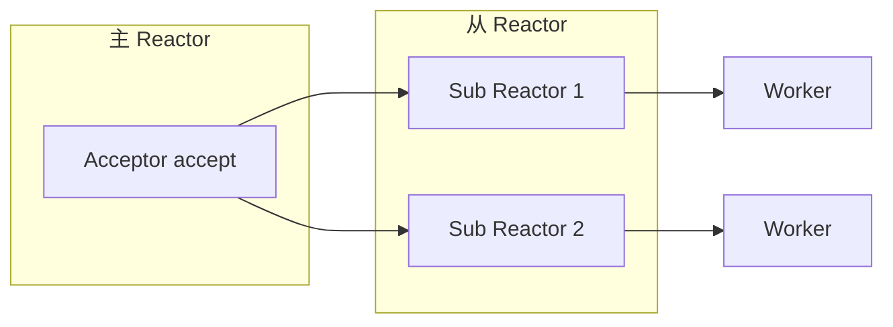

# 操作系统资深面试题（20 题）

> 进程/线程/IO/调度/内存/网络/文件系统 + 排查
>
> 格式：题目 / 标准答案 / 易错点 / 追问点 / 背诵版

## 目录

1. [进程 vs 线程？协程？](#q1)
2. [虚拟内存原理？](#q2)
3. [page fault 类型和处理？](#q3)
4. [select / poll / epoll 区别？](#q4)
5. [Reactor / Proactor 模型？](#q5)
6. [零拷贝原理？sendfile / mmap / splice？](#q6)
7. [线程同步原语？](#q7)
8. [死锁四个必要条件？怎么避免？](#q8)
9. [CPU 调度策略？CFS 是什么？](#q9)
10. [上下文切换开销和优化？](#q10)
11. [TCP 三次握手 + 四次挥手？](#q11)
12. [TIME_WAIT 大量怎么办？](#q12)
13. [TCP 拥塞控制？BBR 是什么？](#q13)
14. [文件系统 inode / dentry / page cache？](#q14)
15. [线上 CPU 100% 怎么排查？](#q15)
16. [线上内存暴涨 / OOM 怎么排查？](#q16)
17. [load average 高怎么排查？](#q17)
18. [磁盘 IO 高怎么排查？](#q18)
19. [网络抖动 / 丢包怎么排查？](#q19)
20. [Linux 性能工具速查？](#q20)

---

<a id="q1"></a>
## 1. 进程 vs 线程？协程？

### 标准答案

| | 进程 | 线程 | 协程 |
| --- | --- | --- | --- |
| 资源 | 独立地址空间 | 共享进程地址空间 | 用户态调度 |
| 切换成本 | 高（页表 / TLB） | 中（寄存器） | 极低（函数调用级） |
| 通信 | IPC（管道/共享内存） | 共享变量 + 锁 | channel / 共享 |
| 并发数 | 千级 | 万级 | 百万级（Go goroutine） |
| 调度 | 内核 | 内核 | 用户态 |

**关键区别**：
- 进程：资源隔离单位
- 线程：调度单位
- 协程：用户态轻量并发

**Go goroutine**：
- 用户态调度（GMP 模型）
- 初始栈 2KB，动态增长
- 切换成本 ns 级（vs 线程 μs 级）

### 易错点
- 误以为协程 = 线程（其实是用户态）
- 误以为线程切换便宜（其实涉及内核）
- 不知道 Linux 中线程也是 task_struct（轻量进程）

### 追问点
- Linux clone 系统调用？→ 线程和进程都用 clone，区别在标志位
- 为什么 Go 用 goroutine 不用线程？→ 切换便宜 + 数量多 + 用户态调度灵活

### 背诵版
**进程隔离 / 线程共享 / 协程用户态**。Go goroutine **2KB 栈 + GMP**，**百万级并发**。线程切换 μs，协程切换 ns。

---

<a id="q2"></a>
## 2. 虚拟内存原理？

### 标准答案

**虚拟内存 = 每个进程有独立的虚拟地址空间，由 OS 映射到物理内存**。

```
进程虚拟地址 → 页表 → 物理地址
```

**作用**：
- 进程隔离（每个进程独立地址空间）
- 内存抽象（进程不用关心物理内存）
- 按需分配（页面调度）
- 大内存支持（虚拟可远大于物理）

**地址空间布局（Linux 64 位）**：
```
0xFFFFFFFFFFFFFFFF (内核空间)
...
栈（向下增长）
共享库
堆（向上增长）
BSS / DATA
代码段 (Text)
0x0000000000000000
```

**页表**：4 级页表（PGD/PUD/PMD/PTE），TLB 缓存加速。

**Demand Paging**：访问时才分配物理页（page fault）。

### 易错点
- 误以为 malloc 立即分配物理内存（实际是虚拟，访问时才分配）
- 不知道 mmap 共享库映射

### 追问点
- TLB 命中率影响？→ TLB miss 多次访问内存慢
- huge page 优势？→ 减少 TLB miss，但 fork COW 单元变大

### 背诵版
**进程独立虚拟地址空间 → 页表 → 物理内存**。**4 级页表 + TLB 缓存**。**Demand Paging 按需分配**。

---

<a id="q3"></a>
## 3. page fault 类型和处理？

### 标准答案

**Page Fault 三种**：

1. **Major Page Fault**（重大）：
   - 页不在物理内存（已换出到磁盘）
   - 需要从磁盘读 → 慢（ms 级）

2. **Minor Page Fault**（轻微）：
   - 页在物理内存但未映射到当前进程
   - 仅修改页表 → 快（μs 级）

3. **Invalid Page Fault**：
   - 访问非法地址 → SIGSEGV

**触发场景**：
- 第一次访问 mmap 区域（minor）
- 共享库加载（minor）
- 内存被换出后访问（major）
- 写时复制 COW（minor）

**性能影响**：
- 大量 major fault → IO 瓶颈
- 大量 minor fault → CPU 浪费

**监控**：
```bash
ps -o pid,minflt,majflt,cmd
sar -B 1   # 系统级
```

### 易错点
- 不区分 major / minor（影响差几个数量级）
- 不知道 fork COW 也触发 fault

### 追问点
- 怎么减少 major fault？→ 内存够用 + 关闭 swap / 调整 swappiness
- huge page 的 fault？→ 一次映射 2MB 减少 fault 次数

### 背诵版
**Major（磁盘读）/ Minor（修改页表）/ Invalid（非法）**。Major 慢 ms 级，Minor 快 μs。**关 swap 减 major**。

---

<a id="q4"></a>
## 4. select / poll / epoll 区别？

### 标准答案

| | select | poll | epoll |
| --- | --- | --- | --- |
| 数据结构 | 数组 + bitmap | 链表 | 红黑树 + 就绪链表 |
| 最大连接 | FD_SETSIZE（1024） | 无限制 | 无限制 |
| 触发 | 水平触发 LT | 水平触发 LT | LT 或 ET |
| 时间复杂度 | O(N) | O(N) | O(1) |
| 适合 | 老系统 | 不多 | 高并发 |
| 内存拷贝 | 每次 | 每次 | mmap 共享 |

**epoll 三个 API**：
```c
epoll_create()  // 创建 epoll 实例
epoll_ctl()     // 添加/删除/修改 fd
epoll_wait()    // 等待事件
```

**为什么 epoll 快**：
- 不用每次传 fd 列表
- 内核维护红黑树 + 就绪链表
- 只返回就绪的 fd（不用遍历）
- LT/ET 灵活

**LT vs ET**：
- LT（Level Triggered，水平）：只要可读就触发
- ET（Edge Triggered，边沿）：状态变化才触发，**必须一次读完**

### 易错点
- select 用在高并发（1024 限制）
- ET 模式不一次读完（丢事件）

### 追问点
- ET 怎么用？→ 循环读直到 EAGAIN
- kqueue 和 epoll？→ kqueue 是 BSD 的等价物（macOS）

### 背诵版
**select 1024 上限 O(N) / poll 无限 O(N) / epoll 红黑树 + 就绪链 O(1)**。**LT 默认，ET 一次读完**。

---

<a id="q5"></a>
## 5. Reactor / Proactor 模型？

### 标准答案

**Reactor**（同步非阻塞）：
- IO 多路复用（select/epoll）
- 收到事件后**应用主动读/写**
- 代表：Redis / Nginx / Netty

**Proactor**（异步）：
- 应用发起 IO，OS 完成后**通知应用**
- 不需要应用读
- 代表：Windows IOCP

**Reactor 三种**：
- 单 Reactor 单线程（Redis < 6.0）
- 单 Reactor 多线程
- 主从 Reactor 多线程（Netty 主流）



**主从 Reactor**：
- 主 Reactor 接受连接
- 分发到从 Reactor 处理读写
- Worker 线程池处理业务

### 易错点
- 误以为 Linux 有 Proactor（Linux 没有原生支持，io_uring 算半个）
- 单 Reactor 单线程做 CPU 密集（业务慢则全停）

### 追问点
- io_uring 是什么？→ Linux 5.1+ 真异步 IO，性能高
- Netty 怎么实现？→ NioEventLoopGroup（boss + worker）

### 背诵版
**Reactor 同步非阻塞（应用主动读）/ Proactor 异步（OS 完成通知）**。**主从 Reactor** 主流（主接 accept，从处理读写）。

---

<a id="q6"></a>
## 6. 零拷贝原理？sendfile / mmap / splice？

### 标准答案

**传统读文件 + 发送**（4 次拷贝）：
```
disk → kernel buffer → user buffer → socket buffer → NIC
```

**零拷贝**：减少内核态↔用户态的拷贝。

**主要技术**：

| | 拷贝次数 | 上下文切换 | 适合 |
| --- | --- | --- | --- |
| read + write | 4 | 4 | 通用 |
| **mmap + write** | 3 | 4 | 需要修改内容 |
| **sendfile** | 2 | 2 | 只发不改 |
| **sendfile + DMA gather** | **2 + 0 CPU** | 2 | 网卡支持 |
| **splice** | 2 | 2 | 任意 fd 之间 |

**sendfile 原理**：
```
disk → kernel buffer → socket buffer → NIC
仅 DMA 拷贝，CPU 不参与
```

**典型应用**：
- Kafka：sendfile（log 文件 → socket）
- Nginx：sendfile（静态文件）
- 视频流服务

### 易错点
- 误以为零拷贝完全无拷贝（其实是减少 CPU 参与）
- mmap 当通用零拷贝（适合修改场景）

### 追问点
- io_uring 怎么做零拷贝？→ 提交 IO 请求，内核完成后通知，无拷贝
- DMA 是什么？→ 设备直接访问内存，不占 CPU

### 背诵版
**零拷贝 = 减少 CPU 拷贝**。**sendfile（disk→socket，2 拷贝）/ mmap（共享映射）/ splice（fd 间）**。Kafka/Nginx 用 sendfile。

---

<a id="q7"></a>
## 7. 线程同步原语？

### 标准答案

**经典原语**：

| | 用法 | 性能 |
| --- | --- | --- |
| **Mutex** | 互斥锁，临界区 | 中（陷入内核可能） |
| **Spinlock** | 自旋锁，短临界区 | 高（不睡眠） |
| **RWLock** | 读写锁 | 读并发好 |
| **Semaphore** | 信号量，资源计数 | - |
| **Condition Variable** | 条件变量，配合 Mutex | - |
| **Atomic** | 原子操作 | 极高（无锁） |
| **Channel**（Go） | 通信 + 同步 | 中 |

**自旋 vs 互斥**：
- Spinlock：忙等（CPU 转圈），适合**短临界区**
- Mutex：睡眠，适合**长临界区**

**Linux Futex**：用户态原子操作 + 内核态等待，混合式实现 Mutex。

**RW vs M**：
- 读多写少：RWLock
- 普通：Mutex

**信号量 vs 互斥**：
- Semaphore：可计数（多资源）
- Mutex：二值（独占）

### 易错点
- 短临界区用 Mutex（开销大）
- 长临界区用 Spinlock（CPU 浪费）
- RWLock 在写多场景（性能差）

### 追问点
- Go Mutex 实现？→ Futex + 自适应自旋
- atomic CAS 怎么用？→ Compare-And-Swap，无锁基础

### 背诵版
**Mutex 长临界 / Spinlock 短临界 / RWLock 读多写少 / Atomic CAS 极致性能 / Channel 通信**。

---

<a id="q8"></a>
## 8. 死锁四个必要条件？怎么避免？

### 标准答案

**四个必要条件**（Coffman 条件）：
1. **互斥**：资源不能共享
2. **持有并等待**：持锁的同时等其他锁
3. **非抢占**：锁不能被强制释放
4. **循环等待**：T1→T2→T3→T1

**破坏任一条件**就能避免死锁：

1. 不互斥（不可能，资源本身需要互斥）
2. 一次申请所有锁（破坏持有等待）
3. 超时释放（破坏非抢占）
4. **统一加锁顺序**（破坏循环等待）← **最常用**

**实战策略**：
- **统一加锁顺序**（按资源 ID 排序加锁）
- **缩小事务 / 锁粒度**
- **超时机制**（trylock + 超时）
- **避免嵌套锁**

**检测**：
- DB 层：MySQL 自动检测 + 回滚
- 应用层：trylock + 超时
- 工具：go race / lockcheck

### 易错点
- 不统一加锁顺序（最常见死锁原因）
- 长事务持锁不放（容易死锁）
- 不做超时（卡死）

### 追问点
- DB 死锁怎么排查？→ SHOW ENGINE INNODB STATUS
- Go 死锁怎么测？→ 单测 + go vet

### 背诵版
**四条件：互斥 + 持有等待 + 非抢占 + 循环等待**。**破坏循环等待最常用**：**统一加锁顺序**。短事务 + 超时 + trylock。

---

<a id="q9"></a>
## 9. CPU 调度策略？CFS 是什么？

### 标准答案

**Linux 调度类**：
- **CFS（Completely Fair Scheduler）**：默认，普通进程
- **Realtime**：实时进程（FIFO / RR）
- **Idle**：空闲

**CFS 核心思想**：**完全公平**——每个进程按权重获得 CPU 时间。

**实现**：
- **vruntime**（虚拟运行时间）：进程实际运行时间 / 权重
- **红黑树排序**：vruntime 最小的优先调度
- **nice 值**：影响权重（-20 到 19，nice 越小权重越大）

```
vruntime = real_time × NICE_0_LOAD / weight
```

**抢占**：当前进程的 vruntime > 红黑树最左节点 + 阈值 → 抢占。

**实时调度**：
- SCHED_FIFO：先进先出
- SCHED_RR：轮转（时间片到换下一个）
- 比 CFS 优先

### 易错点
- 误以为 CFS 是时间片轮转（其实是 vruntime 排序）
- 实时进程乱用（占满 CPU）

### 追问点
- CFS 时间片怎么算？→ 调度周期 / 进程数（动态）
- 怎么提升进程优先级？→ nice -n -10（普通用户只能调正值）

### 背诵版
**CFS 完全公平**：**vruntime + 红黑树排序**。nice 影响权重。**实时调度（FIFO/RR）优先于 CFS**。

---

<a id="q10"></a>
## 10. 上下文切换开销和优化？

### 标准答案

**上下文切换分类**：
- **进程切换**：页表切换 + TLB 失效（重）
- **线程切换**（同进程）：仅寄存器（轻）
- **协程切换**：用户态函数调用（极轻）

**开销来源**：
- 保存/恢复寄存器
- 页表切换（进程间）
- TLB / cache 失效
- 内核态系统调用

**典型耗时**：
```
进程切换:    1-10 μs
线程切换:    1-2 μs
协程切换:    100 ns（Go goroutine）
```

**监控**：
```bash
vmstat 1   # cs 列
pidstat -w 1   # 进程级
```

**优化**：
- 减少线程数（线程池）
- 用协程替代线程（Go）
- CPU 亲和性（taskset / sched_setaffinity）
- 减少阻塞 IO
- 避免锁竞争（无锁 / 减小临界区）

### 易错点
- 创建大量线程（切换爆炸）
- 误以为 CPU 100% = CPU 真在工作（可能在切换）

### 追问点
- 怎么测切换开销？→ ftrace / perf sched
- 高并发下怎么减少切换？→ 协程 / epoll / 减线程数

### 背诵版
**进程切换重（页表 TLB）/ 线程轻 / 协程极轻（100ns）**。**vmstat 看 cs**。优化：**协程 / 线程池 / CPU 亲和**。

---

<a id="q11"></a>
## 11. TCP 三次握手 + 四次挥手？

### 标准答案

**三次握手**：
```
Client                Server
  SYN  →
                      ← SYN+ACK
  ACK  →
建立连接
```

**为什么三次不二次**：
- 防止历史连接（旧 SYN 到达，二次握手就建立了不该建立的连接）
- 双方确认对方收发能力

**四次挥手**：
```
Client                  Server
  FIN  →
                        ← ACK
                        （Server 处理）
                        ← FIN
  ACK  →
TIME_WAIT 2MSL
关闭
```

**为什么四次**：
- TCP 全双工，关闭要双方分别 FIN
- 中间 ACK 和 FIN 可能合并（实际可能 3 次）

**TIME_WAIT 2MSL 原因**：
1. 让最后的 ACK 能到对方（万一丢了对方重传 FIN）
2. 让旧连接的报文都消失（避免影响新连接）

### 易错点
- 误以为是 TCP 强制 4 次（实际可合并为 3 次）
- 不理解 TIME_WAIT 必要性

### 追问点
- SYN Flood 攻击？→ 大量 SYN 不回 ACK → 半连接队列堆积 → SYN Cookie 解决
- 半连接队列 vs 全连接队列？→ 半连接 SYN+ACK 等 ACK，全连接已建立等 accept

### 背诵版
**三次握手防历史连接 + 互相确认**。**四次挥手全双工分别关**。**TIME_WAIT 2MSL** 防 ACK 丢失 + 旧报文清理。

---

<a id="q12"></a>
## 12. TIME_WAIT 大量怎么办？

### 标准答案

**TIME_WAIT 多的危害**：
- 端口耗尽（55-65535 共 1 万端口）
- 连接无法复用
- 内存消耗

**原因**：主动关闭方进入 TIME_WAIT，HTTP 1.0 / 短连接服务常见。

**解决方案**：

1. **长连接**（首选）：
   - HTTP Keep-Alive
   - 连接池（DB / Redis / RPC）
   - HTTP/2（单连接多路复用）

2. **内核参数**：
   ```
   net.ipv4.tcp_tw_reuse = 1     # TIME_WAIT 状态可被新连接复用
   net.ipv4.tcp_max_tw_buckets = 5000  # 限制总数
   ```
   注意：`tcp_tw_recycle` 已废弃（Linux 4.12+ 删除），有 NAT 风险。

3. **调小 MSL**（不推荐，影响通用性）

4. **应用层**：
   - 反向 close（让 client 主动关）
   - 优化业务（减少短连接）

### 易错点
- 还在用 tcp_tw_recycle（已废弃 + NAT 问题）
- 强行调 MSL（可能引发其他问题）

### 追问点
- tcp_tw_reuse vs tcp_tw_recycle？→ reuse 安全，recycle 已废弃
- 怎么看 TIME_WAIT 数？→ ss -tan | grep TIME-WAIT | wc -l

### 背诵版
**长连接 + 连接池**首选。内核 `tcp_tw_reuse=1` + 限 buckets。**别用 tcp_tw_recycle（废弃）**。

---

<a id="q13"></a>
## 13. TCP 拥塞控制？BBR 是什么？

### 标准答案

**经典 TCP 拥塞控制**（基于丢包）：
- 慢启动（cwnd 指数增长）
- 拥塞避免（线性增长）
- 拥塞发生（超时 / 三个重复 ACK）→ cwnd 减半
- 快重传 + 快恢复

**算法**：Reno / NewReno / Cubic（Linux 默认）/ BBR

**Cubic**：
- 三次曲线增长 cwnd
- 适合长肥管道（带宽大延迟高）

**BBR（Google 2016）**：
- **基于带宽和延迟探测**（不是丢包）
- 主动测量带宽 + RTT
- 不会因为偶发丢包减半
- 高延迟链路性能更好（跨地域）

**对比**：
| | Cubic | BBR |
| --- | --- | --- |
| 触发 | 丢包减速 | 主动探测 |
| 弱网 | 性能差（频繁丢包减速） | 性能好 |
| 适合 | 普通网络 | 跨国/弱网/CDN |

**启用 BBR**：
```
net.core.default_qdisc = fq
net.ipv4.tcp_congestion_control = bbr
```

### 易错点
- 不理解为什么 BBR 比 Cubic 快（不丢包减速）
- 误以为换 BBR 一定快（局域网差距小）

### 追问点
- BBRv2 改进？→ 公平性更好（与 Cubic 共存）
- QUIC 用什么？→ QUIC 内置拥塞控制（可选 BBR）

### 背诵版
**Cubic 基于丢包 / BBR 基于带宽延迟探测**。BBR **跨国/弱网/CDN 大幅提升**。Linux 默认 Cubic。

---

<a id="q14"></a>
## 14. 文件系统 inode / dentry / page cache？

### 标准答案

**inode**：
- 文件元数据（大小 / 权限 / 时间戳 / 数据块指针）
- 不存文件名
- 一个文件一个 inode

**dentry（目录项）**：
- 文件名 → inode 映射
- 路径解析用

**file（打开的文件）**：
- 进程打开文件的状态（offset / mode）

**关系**：
```
路径 /home/user/a.txt
  → dentry "/" → "home" → "user" → "a.txt"
  → 找到 inode
  → 通过 inode 找数据块
```

**Page Cache**：
- 文件数据在内存中的缓存
- 读时先查 cache，miss 才读磁盘
- 写时先到 cache（write-back），异步刷盘
- `sync` / `fsync` 强制刷盘

**系统调用**：
```bash
ls -i    # 显示 inode
df -i    # inode 使用情况（耗尽也会写入失败！）
```

### 易错点
- 误以为 inode 存文件名（其实存元数据）
- 磁盘还有空间但写入失败（inode 耗尽）
- 误以为 write 立即落盘（实际 page cache）

### 追问点
- 怎么强制写盘？→ fsync(fd) / O_DIRECT
- 怎么跳过 page cache？→ O_DIRECT / posix_fadvise

### 背诵版
**inode 元数据 / dentry 名→inode / file 进程视图 / page cache 数据缓存**。`df -i` 看 inode，**写默认走 cache，fsync 落盘**。

---

<a id="q15"></a>
## 15. 线上 CPU 100% 怎么排查？

### 标准答案

**排查路径**：

```bash
# 1. 找进程
top -c
htop

# 2. 找线程（哪个线程吃 CPU）
top -Hp <pid>
ps -eLf | grep <pid>

# 3. Go 应用
go tool pprof http://server/debug/pprof/profile?seconds=30
top10
list funcName
web   # 火焰图

# 4. Java 应用
jstack <pid> > stack.txt
# 找出 CPU 高的线程 ID（top -Hp 看到的 LWP），转 16 进制
# stack.txt 中找 nid=0x... 对应的栈

# 5. 看是 sys 还是 user
top → us / sy
us 高: 用户代码
sy 高: 系统调用 / 上下文切换

# 6. 系统级
mpstat -P ALL 1   # 每 CPU
sar -u 1
perf top
```

**常见原因**：
- 死循环（业务 bug）
- GC 频繁（堆压力）
- 锁竞争 spin（spinlock）
- 加密 / 压缩
- 全表扫 SQL
- goroutine 泄漏

**先止血**：
- 限流 / 降级
- 重启 pod（K8s）
- 临时扩容

### 易错点
- 看进程不看线程（不知道哪个代码）
- 不看 us/sy（不知是用户代码还是内核）
- 直接重启不留现场（pprof 抓一份再重启）

### 追问点
- 怎么找 CPU 高的 goroutine？→ pprof goroutine + 排序
- top us 高怎么深入？→ pprof CPU profile

### 背诵版
**进程 → 线程 → 代码栈**。Go 用 **pprof CPU**，Java 用 **jstack**。看 **us vs sy**。**先止血再分析**。

---

<a id="q16"></a>
## 16. 线上内存暴涨 / OOM 怎么排查？

### 标准答案

**症状**：
- RSS 持续涨
- OOM Killer 杀进程（dmesg）
- swap 使用上涨

**排查**：

```bash
# 1. 整体内存
free -m
top → RES / VIRT
sar -r 1

# 2. 进程级
top → 排序 RES
pidstat -r 1

# 3. Go 应用
go tool pprof http://server/debug/pprof/heap
top10  # 内存大户
list funcName
go tool pprof -inuse_space  # 当前占用
go tool pprof -alloc_space  # 历史分配

# 4. Java 应用
jmap -dump:format=b,file=heap.hprof <pid>
# 用 MAT / VisualVM 分析

# 5. OOM 现场
dmesg | grep -i oom
# 看 OOM Killer 杀了哪个进程
```

**常见原因**：
- **goroutine 泄漏**（持续创建不退出）
- 大对象未释放（缓存无 TTL / 上限）
- 内存碎片
- 流量突增

**Go 内存特点**：
- runtime 不立即归还 OS（延迟归还）
- RSS 看起来高但实际可用
- 用 `runtime.ReadMemStats` 看真实分配

**预防**：
- 缓存有 TTL 和上限
- goroutine 生命周期受 ctx 控制
- 定期 pprof 监控
- K8s 设 limit + requests

### 易错点
- 看 RSS 不看真实分配（Go 假高）
- 不抓 heap dump 直接重启（事后无数据）
- goroutine 泄漏不发现（持续涨）

### 追问点
- goroutine 泄漏怎么找？→ pprof goroutine 看 stack 重复模式
- Go 怎么强制归还内存？→ runtime/debug.FreeOSMemory()

### 背诵版
**整体 free → 进程 top → Go pprof heap / Java jmap**。`dmesg` 看 OOM Killer。**goroutine 泄漏 + 缓存无上限**是高频。

---

<a id="q17"></a>
## 17. load average 高怎么排查？

### 标准答案

**load average**：1/5/15 分钟内**运行 + 不可中断状态（D 状态）**进程数。

**判断标准**：
- load < CPU 核数 × 0.7：正常
- load = CPU 核数：满载
- load > CPU 核数 × 1.5：过载

**high load 但 CPU 不高**：
- D 状态进程（IO 等待 / 锁等待）
- 大量 page fault
- 内存不足触发 swap

**排查**：
```bash
uptime    # 看 load
top       # 看 D 状态（state 列）
ps aux | awk '$8 ~ /D/'   # D 状态进程列表
iostat -x 1   # IO
vmstat 1   # cs / si / so / wa
```

**典型场景**：
- 磁盘 IO 慢（wa 高）
- swap 频繁（si/so 高）
- NFS 卡（D 状态）
- DB 锁竞争

### 易错点
- 误以为 load = CPU 使用率（实际包含 IO 等待）
- 看 load 不看 D 状态进程（找错方向）

### 追问点
- iowait 高怎么办？→ iostat 看哪个磁盘 / iotop 看哪个进程
- swap 怎么禁？→ swapoff -a + sysctl vm.swappiness=0

### 背诵版
**load = 运行 + D 状态进程数**。**load 高 CPU 不高 → IO 等待**。`iostat`/`iotop` + `ps D 状态` 排查。

---

<a id="q18"></a>
## 18. 磁盘 IO 高怎么排查？

### 标准答案

```bash
# 1. 整体 IO
iostat -x 1
# %util > 80% → 磁盘忙
# await > 10ms → 慢

# 2. 进程级
iotop -o
pidstat -d 1

# 3. 找具体文件 / 操作
strace -p <pid> -e trace=read,write -e raw=read,write

# 4. Block 层
blktrace / blkparse
```

**关键指标（iostat）**：
- `r/s w/s`：每秒读写次数
- `rkB/s wkB/s`：吞吐
- `await`：平均等待时间（越小越好）
- `%util`：设备使用率
- `aqu-sz`：队列长度

**常见原因**：
- DB 慢 SQL（全表扫）
- 大量小文件读写
- 日志疯狂写
- swap 抖动
- 系统 sync 集中

**优化**：
- 减少 IO（缓存）
- 顺序写代替随机写
- 批量化（避免大量小 IO）
- 使用 SSD
- 调度算法（noop / deadline / cfq）
- IO 隔离（cgroup）

### 易错点
- 只看 %util 不看 await（队列长但不忙）
- 不看进程（不知道谁在搞事）

### 追问点
- iotop 看不到原因？→ strace 看具体系统调用
- HDD vs SSD？→ HDD 顺序快随机慢，SSD 都快

### 背诵版
`iostat -x` 看 **await / %util**，`iotop` 找进程。**慢 SQL / 日志疯狂 / 小文件**是高频。**缓存 + 批量 + 顺序**优化。

---

<a id="q19"></a>
## 19. 网络抖动 / 丢包怎么排查？

### 标准答案

```bash
# 1. 整体网络
sar -n DEV 1
ifconfig / ip -s link

# 2. 重传率
ss -i
netstat -s | grep -i retrans
# 重传率 > 1% 异常

# 3. 连接状态
ss -ant | awk '{print $1}' | sort | uniq -c
# 看 ESTABLISHED / TIME_WAIT / SYN-SENT / CLOSE-WAIT 数

# 4. 抓包
tcpdump -i eth0 -w trace.pcap
# 用 Wireshark 分析

# 5. 丢包
ping -c 100 target
mtr target   # 看每跳丢包

# 6. 队列溢出
nstat -z | grep -i drop
# Linux 内核网络队列 drop 计数
```

**常见原因**：
- 带宽打满
- 网卡队列满（ring buffer）
- iptables 规则慢
- 跨网（电信→联通）
- 路由器问题
- DNS 解析慢

**应用层排查**：
- 慢 RPC（链路追踪）
- 连接池耗尽（连接重建）
- DNS 缓存（避免每次解析）

### 易错点
- 只看应用日志不看网络层
- 不看重传率（隐藏问题）
- 不抓包就猜

### 追问点
- DNS 慢怎么办？→ HTTP DNS / 本地缓存 / 减少域名解析
- 跨地域慢？→ CDN / 多活 / QUIC

### 背诵版
`sar -n` / `ss -i 重传率` / `netstat 队列` / `tcpdump 抓包` / `mtr 每跳`。重传率 > 1% 异常，**带宽 / 队列 / DNS** 是高频。

---

<a id="q20"></a>
## 20. Linux 性能工具速查？

### 标准答案

**CPU**：
```bash
top / htop          # 整体
mpstat -P ALL 1     # 每核
pidstat -u 1        # 进程
perf top            # 函数级热点
```

**内存**：
```bash
free -m             # 整体
vmstat 1            # 内存 + 切换 + IO
sar -r 1            # 历史
pmap <pid>          # 进程内存映射
```

**磁盘**：
```bash
df -h               # 文件系统
df -i               # inode
iostat -x 1         # IO 统计
iotop -o            # 进程级
fio                 # 压测
```

**网络**：
```bash
ss -tan             # 连接状态
ss -i               # 重传率等
sar -n DEV 1        # 流量
tcpdump             # 抓包
mtr / ping          # 链路
nstat               # 内核网络计数
```

**系统调用**：
```bash
strace -p <pid>     # 跟踪系统调用
ltrace -p <pid>     # 跟踪库调用
```

**通用**：
```bash
dstat               # 综合
sar                 # 历史数据（持续记录）
perf                # 性能事件分析
```

**Go 专用**：
```bash
go tool pprof <url>/debug/pprof/{profile,heap,goroutine,mutex,block}
go tool trace
```

**Java 专用**：
```bash
jstack / jmap / jstat / jcmd
```

**eBPF（现代）**：
```bash
bcc-tools / bpftrace
```

### 易错点
- 一上来 top（其实应该看具体维度）
- 只看实时不看历史（sar 持续记录）
- 不会用 perf / strace（高级排查必备）

### 追问点
- USE 方法是什么？→ Utilization / Saturation / Errors，Brendan Gregg 推
- eBPF 优势？→ 内核动态追踪，无需重编译

### 背诵版
**CPU top/perf / 内存 free/vmstat / 磁盘 iostat/iotop / 网络 ss/tcpdump / 系统调用 strace**。**Go pprof / Java jstack** 应用级。**sar 历史**。

---

## 复习建议

**面试前 1 天**：通读"背诵版"。

**面试前 1 周**：每天 3-5 题，结合 02-os 各篇 + 自己跑命令。

**实战检验**：
- 能不能讲清楚 epoll 为什么比 select 快？
- 能不能完整描述 TCP 三次握手 + 为什么不二次？
- 能不能给出 CPU 100% 的完整排查流程？
- 能不能解释 BBR 比 Cubic 好在哪？
